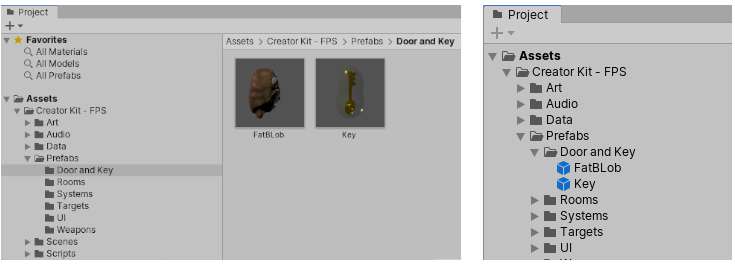
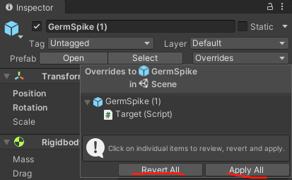
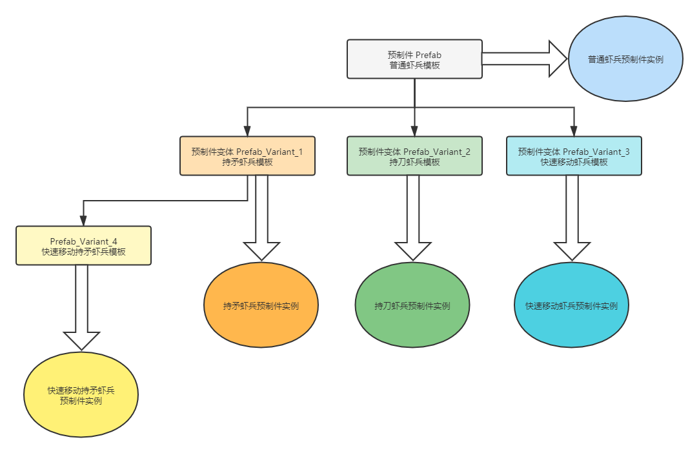
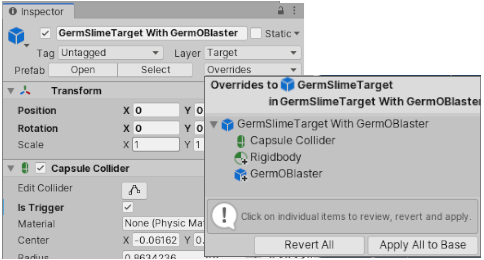

# Prefab 预制件

[官方教程地址 - 基本概念 - 预制件](https://learn.unity.com/tutorial/essential-unity-concepts?language=en&courseId=5d532306edbc2a1334dd9aa8#5c7f8528edbc2a002053b6c6)

[官方文档地址 - 预制件](https://docs.unity.cn/cn/2021.1/Manual/Prefabs.html)

## 1. 预制件概念

说白了，就是 “**可重用资源模板**”

在游戏制作过程中，需要重复使用的东西，都可以做成 prefab

Unity 的预制件系统允许创建、配置和存储游戏对象及其所有组件、属性值和子游戏对象作为可重用资源。预制件资源充当模板，在此模板的基础之上可以在场景中创建新的预制件实例。

如果要在场景中的多个位置或项目中的多个场景之间重用以特定方式配置的游戏对象，比如非玩家角色 (NPC)、道具或景物，则应将此游戏对象转换为预制件。这种方式比简单复制和粘贴游戏对象更好，因为预制件系统可以自动保持所有副本同步，还可以批量生成、管理一种或多种游戏对象，相较于简单的复制粘贴游戏对象有诸多好处。

**预制件原件**：预制件本身，再 project 窗口的 Assets 中  
**预制件对象**：用预制件原件创建的实例对象，在 scene 里

特点：

- 模板，一次制作，多次使用
- 便于同步和管理，更改 prefab 原件，所有 prefab 对象会跟着改变
- 更改 prefab 对象，覆盖原件属性，保持最大统一性同时保留特性
- 可以创建预制件的变体，从而将一系列覆盖组合在一起成为有意义的预制件变化
- 支持嵌套——一个预制件中包含其他预制件

通常使用场景：

- 环境资源 - 例如，在一个关卡附近多次使用的某种树（如上面的截屏所示）。
- 非玩家角色 (NPC) - 例如，某种类型的机器人可能会在游戏的多个关卡之间多次出现。它们的移动速度或声音可能不同（使用覆盖）。
- 飞弹 - 例如，海盗的大炮可能会在每次射击时实例化炮弹预制件。
- 玩家主角 - 玩家预制件可能被放置在游戏每个关卡（不同场景）的起点。

## 2. 操作预制件

### 2.1 创建预制件

将一个游戏对象从 Hierarchy 窗口拖入 Project 窗口。该游戏对象及其所有组件和子游戏对象在 Project 窗口中成为新的预制件资源

> 建议：  
> 最好在 Project Assets 下，单独新建一个 Prefabs 文件夹，来存放预制件，如果预制件有很多，也可以再新建子文件夹，分门别类存储

创建预制件资源的这一过程也会将原始游戏对象转换为预制件实例。该对象现在将成为新创建的预制件资源的实例。预制件实例以蓝色文本显示在 Hierarchy 窗口中，预制件的根游戏对象显示为蓝色立方体预制件图标

### 2.2 创建预制件实例

可通过将预制件资源从 Project 视图拖动到 Hierarchy 或 Scene 视图，来创建该预制件的实例对象，为了便于后期维护，建议分门别类放置

### 2.3 编辑预制件

回忆下前面在我们的Creator kit FPS项目中为GermSpikeModel预制件添加刚体和碰撞体以及Target 组件来实现npc的功能。我们双击预制件（或者，在 Inspector 窗口中单击 Open Prefab 按钮），可以进入预制件的编辑模式，该模式下除了预制件本身场景中的其他对象都不可见，在预制件模式下所做的更改（除了 Transform 属性外）会影响该预制件的所有实例。

预制件模式在 Scene 视图的右上角有一个 Auto Save 设置。启用此设置后，Unity 会将对预制件进行的任何更改自动保存到预制件资源。默认情况下会启用 Auto Save。
  
如果需要退出预制件编辑模式，请点击Hierarchy 上方的箭头。

### 2.4 编辑预制件实例对象

直接更改预制件实例的属性，只会更改这一个实例的值，并不会影响预制件原件或其他实例。

除非，使用 overrides 下的两个按钮：

- Reveret all : 还原所有更改的属性值，与预制件原件相同
- Apply All ：将在此实例中更改的任意属性值，写入预制件原件，同时也会应用到所有实例

也可以在这个 Overrides 菜单中，选择单项，进行逐项操作

### 2.5 实例覆盖

预制件实例中，不同于预制件原件的属性，称为“实例覆盖”

有四种不同的**实例覆盖**类型：

- 覆盖属性的值
- 添加组件
- 删除组件
- 添加子游戏对象

在 Inspector 窗口中，实例覆盖的名称标签以粗体显示，左边距使用蓝线显示。向预制件实例添加新组件时，边距位置的蓝线将涵盖整个组件。

添加和删除的组件在 Inspector 中的相应图标上也有加减符号标示，而添加的游戏对象在 Hierarchy 窗口中的相应图标上有一个加号标示。

> 注意：
>
> - 预制件实例上覆盖的属性值始终优先于预制件资源的值。这意味着，如果更改预制件资源的属性，对覆盖该属性的实例没有任何影响。
> - 对齐**值绝不会从预制件资源传递到预制件实例。这意味着对齐值始终可与预制件资源的对齐不同，而不是作为显式实例覆盖。具体而言，对齐表示预制件实例的根变换的 Position** 和 Rotation 属性，对于矩形变换，还包括 Width、Height、Margins、Anchors 和 Pivot 属性。  
>   这是因为要求预制件的多个实例采用相同的位置和旋转是极其罕见的情况。更常见的情况是希望预制件实例具有不同的位置和旋转，因此 Unity 不会将它们视为预制件覆盖。

## 3 预制件变体(Prefab Variant)

预制件是基类，预制件变体就是各个不同的派生类，用来派生出多个组别的预制件实例对象，简单的来说就是用旧的预制件来创建新的预制件，保留原预制件属性的同时，还能为其添加新的特性。

预制件变体继承另一个称为基础预制件的预制件的属性。对预制件变体进行的覆盖优先于基础预制件的值。预制件变体可以使用任何其他预制件作为其基础预制件（包括模型预制件或其他预制件变体），简单的来说就是就是共性和特性的关系，原件是共性，变体是特性。

### 3.1 创建预制件变体

- 方式 1：
  在 Project 视图中的预制件上右键单击，然后选择 Create > Prefab Variant。这样将创建所选预制件的变体，该变体最初没有任何覆盖。可以在预制件模式下打开预制件变体，然后开始为其添加覆盖（Override，更改预制件属性）。

- 方式 2：  
  还可以将预制件实例从 Hierarchy 窗口中拖动到 Project 窗口中。执行此操作时会出现一个对话框，询问是要创建新的原始预制件还是预制件变体。如果选择预制件变体，则会根据拖动的预制件实例创建新的预制件变体。先前位于该实例上的所有覆盖现在都位于新的预制件变体中。可以在预制件模式下打开该变体以添加更多覆盖或者是编辑或删除覆盖。

### 3.2 编辑预制件变体

与任何预制件实例一样，可以在预制件变体中使用预制件覆盖，例如修改的属性值、添加的组件、删除的组件以及添加的子游戏对象。也存在相同的限制：无法更改预制件变体中来自基础预制件的游戏对象的父级。也无法从预制件变体中删除存在于基础预制件中的游戏对象。但是，可以停用游戏对象（作为属性覆盖）来达到与删除游戏对象相同的效果。

## 4. 解压缩预制件实例

简单来说就是将预制件对象还原成普通的游戏对象，与生成预制件为互逆作用，如果我不希望某个游戏对象与预制件关联可执行该操作。
要将预制件实例的内容恢复到常规游戏对象，请解压缩预制件实例。此操作正是创建（打包）预制件的相反操作，不同之处在于此操作不会破坏预制件资源，而是仅影响预制件实例。

可通过在 Hierarchy 窗口中右键单击预制件实例并选择 Unpack Prefab 来解压缩预制件实例。场景中生成的游戏对象不再与其以前的预制件资源有任何关联。预制件资源本身不受此操作的影响。这个操作不会影响到嵌套的预制件

Unpack Prefab Completely，会影响到子层嵌套预制件，对子层也会进行 unpack ，但如果还有孙子层，或者更多级的嵌套，则不会影响到

> 注意：  
> 只能解压缩实例，而不能解压缩原件。  
> 可以解压缩场景中存在的预制件实例，或者存在于其他预制件中的预制件实例。

 

 

配套视频教程：
[https://space.bilibili.com/43644141/channel/seriesdetail?sid=299912](https://space.bilibili.com/43644141/channel/seriesdetail?sid=299912)

文章也同时同步微信公众号，喜欢使用手机观看文章的可以关注

