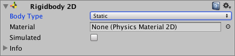

# 2D 物理系统入门
  
背景：通过前面几章对瓦片地图 Tilemap 系统的介绍，相信大家已经能熟练的使用素材以及各项工具绘制我们场景中的地图了，但是如果我们仔细试玩的时候会发现一个问题，角色可以在地图中任何位置移动，比如我们的Ruby可以浮在水池上面，直接穿过树木，箱子，甚至地面，这显然是不符合逻辑的，我们希望玩家不能通过某些特殊的区域或者物体，其实思路很简单：如果我们不希望玩家通过一些地方，就让玩家身上的刚体和发生碰撞，阻挡玩家通过这些区域即可，为此，你将使用 Unity 提供的另一大系统：物理系统 (Physics System)。
  
目标：我们的目标是解决玩家与物体正确碰撞并在TileMap上设置特殊区域处理玩家与瓦片地图之间的碰撞。
  
> [2D 物理系统官方手册](https://docs.unity3d.com/cn/2021.2/Manual/Physics2DReference.html)

本节主要讲 2D 物理系统中的碰撞体和刚体，2D 关节和效应器会在后面的课程中讲解
  
## 1. 开始之前：什么是物理系统？
  
学习物理时，你会发现所有的对象移动都是作用力组合的结果。例如，如果你尝试推动箱子，作用在箱子上的力包括：
  
· 重力（将箱子往下拉）
· 作用力（你施加来推动箱子的力）
· 地面摩擦力（阻碍推动）
  
在游戏开发的各项需求中，我们常常会用到一些模拟现实世界物理现象的操作，如果你要模拟移动和碰撞，需要使用所有数学公式来计算对象上的接触和力。但这需要编写很多复杂的代码。由于物理定律是相同的，因此可以抽象出此代码并在所有游戏中进行共享：这就是物理系统的功能。Unity 有一个内置的物理系统，可以为你计算对象的移动和碰撞。为避免对我们游戏中的每个对象进行成本高昂的数学运算，Unity 仅对附有 Rigidbody 2D 组件的游戏对象执行这些计算。
  
如果不使用游戏引擎自带的物理引擎实现就会很麻烦，而这样底层的轮子unity已经帮我们造好了，我们直接添加各种组件，配置参数就可以实现各种复杂的物理效果，而模拟刚体间碰撞是物理引擎最基础的一个部分，我们可以用它模拟2D/3D游戏阻挡玩家穿过某些地方或者让玩家站在一个物体上，这也是使用游戏引擎开发效率高的主要原因之一。
  
### 1.1 向玩家添加2D 刚体 Rigidbody 2D
  
我们在项目中演示下如何实现这样的碰撞。要实现碰撞，至少需要两个物体，这里我们选取Ruby和MetalCube两个对象。
  
1. 在 Hierarchy 中，选择 Ruby 游戏对象。
2. 将 Ruby 游戏对象从 Hierarchy 拖入 Project 窗口中的 Prefab 文件夹，生成预制件，这是一个好习惯，方便后期重复使用对象。
3. Asset中双击 Ruby 预制件以打开预制件模式。在 Inspector 中，单击 Add Component 按钮。
4. 搜索“Rigidbody 2D”，然后选择该组件。找到Gravity Scale（重力大小） 属性并将其设置为 0，不让物体下落，这节先不考虑玩家与TileMap的碰撞。
5. 使用 Save 按钮或者Ctrl+S快捷键来保存预制件，然后返回到场景。
  
### 1.2 向游戏对象添加碰撞体
  
在我们讲解添加碰撞体（Collider）之前，我们先来了解什么是碰撞体？当我们添加完Rigidbody之后，物理系统已经识别你的游戏对象（由于刚体），接下来你需要告诉物理系统，该游戏对象的哪一部分是“实心的”。此操作是通过碰撞体完成的。
  
碰撞体是简单的形状（例如正方形或圆形），物理系统将这样的形状作为游戏对象的近似形状来进行碰撞计算。尽管碰撞体在运行时可能不会显示，但是这个碰撞体积是实实在在存在于我们世界空间中的。
  
我们先试着为Ruby添加2D碰撞体：
  
1. 在预制件模式下打开 Ruby 预制件。
2. 在 Inspector 中，单击 Add Component。
3. 搜索“Box Collider 2D”，然后添加此组件。
4. 现在，你会在 Scene 视图中看到 Ruby 周围有绿色的轮廓线：
5. 这就是碰撞体的形状，现在物理系统会将这个形状作为 Ruby 的形状。
  
由于碰撞是相互的，所以我们同样还要给 MetalCube 添加一个Collider
  
1. 将 MetalCube 游戏对象从 Hierarchy 拖入 Project 窗口中的 Prefab 文件夹，生成预制件，双击打开这个进入预制件编辑模式。
2. 在 Inspector 中，单击 Add Component，搜索“Box Collider 2D”，然后添加此组件。
3. 保存预制件并退出预制件编辑模式。
  
问题：为什么不需要为MetalCube添加Rigidbody？这是因为不需要通过物理来移动箱子，只需要一个碰撞体即可，无论有没有刚体，游戏对象都将与箱子交互。
  
完成以上步骤之后，点击Play运行游戏，然后尝试让 Ruby 穿过箱子以及在箱子周围移动，可以发现两个很大的问题：当Ruby碰到我们的箱子移动的时候会不断抖动并旋转，以及Ruby还没碰到箱子的时候就发生碰撞了。我们先来解决第二个问题。
  
三：疑难解答  
由于碰撞的检测是由碰撞体的位置和形状（边缘）决定的造成碰撞效果的，不真实接触效果的原因是碰撞体积设置的太大了。解决方法如下：
  
1. 在预制件模式下打开 Ruby 预制件，找到Box Collider 2D组件并选中，点击Edit Collider可以编辑碰撞区域，绿框显示的是碰撞体的形状
2. 在我们的2D游戏中，为了让角色适应透视视角的需求，我们的碰撞体也要按照相应的需求进行设置。可以拖动四周的绿点或者修改Box Collider 2D组件的偏移、大小，让碰撞体的位置在角色的下半身即可，这样就让碰撞符合透视的效果。
3. 保存预制件并退出预制件编辑模式。
4. MetalCube的Collider修改方式也是与之类似的，我们就直接在预制件里面找到选中Box Collider 2D组件，点击Edit Collider，考虑到符合透视的视角效果，我们要将碰撞区域的长和宽缩小到这个箱子一个面边长所在的区域即可。
5. 保存预制件并退出预制件编辑模式。
  
我们再来解决第二个问题：Ruby的旋转问题。
  
首先，让我们处理旋转问题。为此，你需要告知 物理系统不要旋转游戏对象。这在“真实”的物理中也许是可行的，但在此 2D 游戏中不起作用。
  
幸好，Rigidbody 2D 组件具有与此相关的设置：
  
1. 确认 Ruby 已在预制件模式下打开。
  
2. 在 Inspector 中，找到 Rigidbody 2D 组件。
  
3. 单击 Constraints 旁边的小箭头以展开该部分。
  
4. 启用 Freeze Rotation 复选框以确保刚体不会向 Ruby 添加任何旋转。
  
提示：如果你在场景中（而不是在预制件上）对 Ruby 实例进行此更改，请使用 Overrides 下拉菜单将更改应用于你的预制件。
  
保存并再次运行游戏，这次Ruby和箱子的遮挡以及碰撞都是符合透视效果的，并且绕箱子移动时候再也没有出现旋转的情况了。
  
## 【百日挑战56】unity教程之2D游戏开发初步（二十）
  
前言：在上期教程中，我们通过官方一个新的2D的RPG游戏教程系列《RubyAdventure2DRpg》，系统性的学习了unity的2D游戏开发中的物理系统。了解了其作用和重要概念，然后带大家在编辑器里面实现了让箱子挡住玩家Ruby，掌握了如何通过unity引擎在2D游戏中使用物理系统解决游戏对象之间的碰撞，今天我们继续解决上期遗留的问题：角色于碰撞体交互抖动。
  
上期我们解决了两个问题：1、当Ruby碰到我们的箱子移动的时候会不断抖动并旋转 2、Ruby没碰到箱子的时候发生碰撞了。这期我们继续解决Ruby发生碰撞时抖动的问题。
  
### 2.1 解决问题

首先我们分析下抖动是如何产生的？我们回到角色控制移动的代码，我们角色位置的改变是通过Transform变换（transform.position）实现的，但是Transform组件本身并不会考虑物理碰撞，只会根据键盘输入将对象移动到某个位置(Position)，他不会考虑我们的位置是在碰撞范围内，所以每次执行Update的时候，Ruby都会先移动，移动到箱子的碰撞体内，然后物理引擎的刚体再将玩家挤出去，即物理引擎先检测位置，物理引擎再将物体挤出碰撞体外，然后Transform组件又将玩家移动到碰撞体范围内，然后刚体又将玩家挤出碰撞体外，循环往复，导致Ruby在不断的抖动，说明通过Transform组件控制玩家移动已经不适合当前有碰撞体的情景了。
  
我们要使用刚体的移动位置的方法取代我们现有的角色移动方式：即通过刚体获取当前对象的position，然后处理完物理部分之后给它赋值一个新的位置，这样就能通过应用刚体的Transform完全阻挡玩家穿过Collider的碰撞区域了。
  
1. 要解决 Ruby 的抖动问题，你需要移动刚体本身而不是游戏对象变换组件，并让物理系统将游戏对象位置同步到刚体位置。这样，物理系统就可以在进入箱子之前停止移动，而不必在 Ruby 已经进入箱子之后再移动 Ruby。
2. 双击 RubyController 脚本以将其打开。你的脚本应如下所示：
  
如下所示调整 RubyController 脚本（注意阅读注释）：  

```C#
using System.Collections;
using System.Collections.Generic;
using UnityEngine;

public class RubyController03 : MonoBehaviour
{
    //声明刚体对象
    Rigidbody2D rigidbody2d;
    //获取用户输入
    float horizontal;
    float vertical;
    //注意：如果要在多个方法里面调用相同的变量，则变量需要在方法外声明

    // 将速度暴露出来，使其可调
    public float speed = 0.1f;

    //只需在游戏开始之前获取当前游戏对象的刚体组件，不需要一直获取
    private void Start()
    {
        rigidbody2d = GetComponent<Rigidbody2D>();
    }
    // 每帧调用一次 Update
    void Update()
    {
        horizontal = Input.GetAxis("Horizontal");
        vertical = Input.GetAxis("Vertical");

    }
    //Update()方法在不同帧率下执行次数不一样，我们希望以固定的频率执行某些代码需要用到FixedUpdate()方法，使物理计算保持稳定
    //固定时间间隔执行的更新方法
    private void FixedUpdate()
    {
        Vector2 position = transform.position;
        position.x = position.x + speed * horizontal * Time.deltaTime;
        position.y = position.y + speed * vertical * Time.deltaTime;
        rigidbody2d.position = position;
    }
}

```
  
注意：  
1. 默认情况下，所有游戏对象都具有一个 Transform 组件，所以 Unity 使 transform 变量在所有脚本中都可用。但是，必须将 Rigidbody 组件手动添加到游戏对象，因此 Unity 并没有将这个变量作为内置变量。
2. 除此之外，物理系统的更新速度与游戏不同。每次游戏计算新图像时都会调用 Update，问题是调用速度不确定。在一台速度较慢的计算机上，调用速度可能是每秒 20 张图像，而在一台非常快的计算机上，调用速度可能是每秒 3000 张图像。
  
为了使物理计算保持稳定，需要定期进行更新（例如，每隔 16ms）。Unity 还有另一个名为 FixedUpdate 的函数，只要你想直接影响物理组件或对象（例如刚体），就需要使用该函数。
但是，你不应该读取 Fixedupdate 函数中的输入。FixedUpdate 不会持续运行，因此有可能会错过用户输入。你需要在类中添加两个浮点变量，以便在 Update 函数内存储当前的水平和垂直输入数据。
  
总之，只要是涉及到需要固定时间间隔或者的频率的逻辑都需要写在FixedUpdate()方法内保证不同平台执行频率相同。
  
### 2.2 审查更改

让我们来看看新的和调整的每行代码：
  
· Rigidbody2D rigidbody2d; 
  
此行代码将创建一个新变量（名为 rigidbody2d）来存储刚体并从脚本中的任何位置访问刚体。
  
· float horizontal;
float vertical;
  
这两行代码将创建两个新变量来存储输入数据。这些变量曾在 Update 函数中声明过，但是由于你现在需要从另一个函数 (FixedUpdate) 访问这些变量，因此在此处又声明了这些变量。
  
· rigidbody2d = GetComponent<Rigidbody2D>(); 
  
此代码位于 Start 函数内，因此在游戏开始时仅执行一次。此代码要求 Unity 向你提供与脚本附加到同一游戏对象（即你的角色）上的 Rigidbody2D。
  
· 在 Update 函数中，你删除了与移动相关的所有代码。你保留了用于读取输入的代码，这次是位于先前声明的两个变量中。
  
· Vector2 position = rigidbody2d.position; 
  
在 FixedUpdate 函数中，你添加了曾位于 Update 函数中的代码行，并调整了此代码以使用刚体位置。
  
· rigidbody2d.MovePosition(position); 
  
同样，你现在使用刚体位置，而不是使用 transform.position = position; 来设置新位置。这行代码会将刚体移动到你想要的位置，但是如果刚体在移动中与另一个碰撞体碰撞，则会中途停止刚体。
  
### 2.3 运行查看效果

保存，再次运行可以看到你的角色已停止抖动！
  
### 【百日挑战57】unity教程之2D游戏开发初步（二十一）
  
前言：在上期教程中，我们通过官方一个新的2D的RPG游戏教程系列《RubyAdventure2DRpg》，继续学习了unity的2D游戏开发中的物理系统。了解了如何在代码中使用刚体组件控制玩家移动，以及FixedUpdate方法作用和使用情景，最后带大家改进了玩家Ruby的控制器，解决了传统Transform组件移动造成刚体与碰撞体接触发生抖动的问题，今天我们继续实现玩家与TileMap的碰撞
  
一、在开始之前，我们先讲下上期用到的各种概念：
  
1. 关于MonoBehaviour.FixedUpdate ()方法：  
用于物理计算的帧速率独立的MonoBehaviour.FixedUpdate消息。
MonoBehaviour.FixedUpdate具有物理系统的频率；它被称为每个固定帧速率帧。在FixedUpdate之后计算物理系统计算。0.02 秒（每秒 50 次调用）是调用之间的默认时间。使用Time.fixedDeltaTime来访问该值。通过在脚本中将其设置为您的首选值来更改它，或者导航到此处并将其设置。FixUpdate频率或多或少于Update 。如果应用程序以每秒 25 帧 (fps) 的速度运行，Unity 每帧大约调用两次，或者，100 fps 会导致大约两个渲染帧带有一个固定更新。从设置中控制所需的帧速率和速率。使用Application.targetFrameRate设置帧速率。使用Rigidbody时使用FixUpdate。为Rigidbody设置一个力，它会应用每个固定框架。FixUpdate发生在通常与MonoBehaviour.Update不一致的测量时间步长，你也可以手动设置更新间隔：Edit > Settings > Time > Fixed TimestepFixed TimestepTime（固定时间步进）。
  
不建议将获取用户输入的代码放到该方法下，由于更新频率较慢会造成输入的延迟，影响流畅性。
  
### 3.1 添加瓦片地图碰撞

现在，你的角色会与我们具有碰撞体的所有游戏对象碰撞。但是她仍然可以在水上行走，因此你应该让她与水面瓦片碰撞，使她不能在水上行走。但如何才能做到呢？
  
你可以在空游戏对象上添加一个碰撞体，然后调整碰撞体大小以涵盖水面。但这个过程容易出错，如果你想将水面重新绘制得更大、更小或绘成其他形状，则必须手动更改碰撞体。请注意，这种情况下通过瓦片地图可以轻松快速地更改世界。
  
幸好，瓦片地图也可以具有碰撞体。无论是否应该碰撞，每个瓦片都可以存储起来，并且瓦片地图碰撞体将为所有要设置以进行碰撞的瓦片创建碰撞体。
  
要设置瓦片地图碰撞体，请执行以下操作：
  
1. 在 Hierarchy 中，选择 Tilemap 游戏对象。

2. 在 Inspector 中，单击 Add Component 按钮。
  
3. 搜索“Tilemap Collider 2D”，然后选择此组件。你会看到在 Scene 视图中为所有瓦片添加绿色碰撞体方块（绿色方格是每个碰撞体的碰撞区域）：
4. 运行游戏，我们的Ruby只能在当前的方格移动，这是因为现在所有的瓦片都已设置为进行碰撞。
5. 我们希望只有一部分TileMap可以发生碰撞，我们可以直接设置Tile的属性，为每个Tile配置碰撞
6. 在 Project 窗口中，找到 Tile 文件夹，里面存放了我们分割的瓦片，选中待修改的瓦片（希望玩家能穿过的瓦片），在 Inspector 中，找到 Collider Type 属性，然后将该属性从 Sprite（目前值）更改为 None。默认情况下碰撞体积是根据Sprite的体积自动划分。
7. 保存，单击 Play 以进入运行模式，并尝试让 Ruby 在水上行走。她现在应该会与边界发生碰撞。
8. 以上就是在TileMap中设置碰撞基本方式，如果我们希望修改Rule Tile中每个小Tile的规则，可以在Tiling Rules中配置每个Tile的Collider规则。
9. 如果是Rule Override Tile（规则覆盖瓦片）则不能这样处理了，它的规则是继承Tile的，没法直接修改，如果你不希望修改父级的Tile你可以创建Advanced Rule Override Tile先继承Tile之后再微调规则里的Collider。
  
· Rule Override Tile无法直接修改当前瓦片的规则  
· Advanced Rule Override Tile可以选择性继承规则并配置每个瓦片的属性
  
### 3.2 优化瓦片地图碰撞体

最后一小步是设置瓦片地图碰撞体。目前，正如在 Scene 视图中看到的，每个瓦片都是一个单独的碰撞体。
  
这种方法效果良好，但会产生两个问题：
  
· 物理系统的计算量更大；如果碰撞区域比较大，可能会减慢你的游戏速度。
· 在瓦片之间的边界上会产生小问题。由于瓦片是两个并排的碰撞体，并且两者之间存在微小间隙，因此有时计算上的微小误差也可能导致仍会发生碰撞的罕见情况。
  
为了解决这些问题，Unity 提供了一个名为 Composite Collider 2D 的组件。此组件可以获取对象（或对象的子对象）上的所有碰撞体，并由此创建一个大碰撞体。
  
让我们来添加并配置此组件：
  
1. 在 Hierarchy 中，选择 Tilemap 游戏对象。
  
2. 在 Inspector 中，单击 Add Component 按钮。
  
3. 搜索“Composite Collider 2D”，然后选择此组件。
你会看到自动添加 Rigidbody 2D 组件，因为复合碰撞体需要 Rigidbody 2D 才能正常运行。
  
4. 在 Tilemap Collider 2D 组件中，启用 Used By Composite（由复合使用） 复选框。
  
5. 在 Rigidbody 2D 组件中，将 Rigidbody Body Type 属性设置为 Static，由于瓦片地图是固定的，不需要考虑移动，此做法可以进一步减少性能开销。
  
将此属性设置为 Static 将阻止你的世界移动。此外还有助于物理系统优化计算，因为它现在知道刚体不能移动。
  
至此，我们就学习了如何在多种规则瓦片地图中添加瓦片地图碰撞并优化瓦片地图碰撞体性能。
  
### 【百日挑战58】unity教程之2D游戏开发初步（二十二）
  
前言：在上期教程中，我们通过官方一个新的2D的RPG游戏教程系列《RubyAdventure2DRpg》，继续学习了unity的2D游戏开发中的物理系统。了解了TileMap Collider组件的用法，实现了在多种规则瓦片地图中添加瓦片地图碰撞并通过Composite Collider 2D 组件合并瓦片地图优化碰撞体性能，今天我们继续学习2D伪透视下碰撞和遮罩关系
  
1. 我们先重新根据之前配置的素材美化了下我们的瓦片地图，对于一些形状复杂的物体，Box Collider就不适用了，而且碰撞区域设置起来也很麻烦，我们可以直接为该物体添加Polygon Collider 2D（多边形碰撞器），无需编辑开箱即用，尽管使用起来很方便，但性能消耗稍大，而且无法直接编辑碰撞区域，请大家根据需求酌情使用。
  
2. 对于需要处理透视的物体，我们仍然要使用可编辑形状的碰撞体手动编辑碰撞区域让透视更符合逻辑。
  
注意：在Box Collider 2D组件中，Offset（偏移）和Size（大小）的X，Y坐标都是相对于中心点（枢轴）的（蓝色的圈）计算的相对位置，如果需要修改枢轴的位置需要在Assets里面选中Sprite然后使用Sprite Editor编辑其位置，这样碰撞体的位置都会相对这个枢轴确定，可以更方便我们设置碰撞体，由于枢轴位置的改变也会影响碰撞区域的位置，建议在设置Collider之前先确定好轴心，再来设置碰撞区域，避免返工影响效率。
  
比如下面这个house，我们希望碰撞体的范围是相对于这个枢轴确定，一个是方便设置碰撞区域，其次是让图层排序符合透视规律，这样一旦检测到玩家Ruby脚底的碰撞范围与这个门的Collider接触就会触发一系列事件，比如对话，切换场景等。
  
修改枢轴位置之后，我们还要在 House 和 Ruby 的Prefab中将Sprite Render中的Sprite Sort Point（Sprite 排序点）属性改为Pivot（轴心），该选项作用是计算 Sprite 和 Sprite 之间的距离时，选择 Sprite 的中心或其枢轴点相机。该选项会影响图层的排序的位置。
  
注：关于Sprite Sort Point（Sprite 排序点）：
  
仅当 Sprite Renderer 的绘制模式设置为Simple时，此属性才可用。
  
在 2D 项目中，主摄像机默认设置为正交投影模式。在此模式下，Unity 按照距相机的距离顺序沿着相机视图的方向渲染精灵。
  
· 正交相机：侧视图（顶部）和游戏视图（底部）
  
默认情况下，Sprite 的排序点设置为其Center，Unity 会测量相机的变换位置与 Sprite 中心之间的距离来确定它们的渲染顺序。
  
要设置与中心不同的排序点，请选择“枢轴”选项。在Sprite Editor中编辑 Sprite 的枢轴位置。
  
作业：将其他的树也按照上述方法设置俯视角透视的图层排序方式以及为他们设置碰撞体。
  
### 【百日挑战59】unity教程之2D游戏开发初步（二十三）
  
前言：在上期教程中，我们通过官方一个新的2D的RPG游戏教程系列《RubyAdventure2DRpg》，继续学习了unity的2D游戏开发中的物理系统和Sprite Renderer排序的相关内容。学习了Polygon Collider 2D组件的使用，了解了Sprite Sort Point的作用以及如何在Sprite Editor中调整轴心，今天我们继续学习使用触发器实现可收集对象以及通过代码为角色设计生命系统。
  
背景：在游戏开发中，我们经常会出现玩家触发npc对话，触发任务，拾取物等需要交互的情况，这种操作同样可以通过碰撞体检测，与常规的Collider不同，它需要充当Trigger（触发器）的角色。
  
一、通过C#脚本实现可收集对象
  
4.1 向 Ruby 添加生命值统计功能
  
目标：我们要向 Ruby 添加生命值的属性，并通过拾取相应的道具回复生命值，当生命值耗尽需要执行相应的行为。
  
提示：可补充角色生命值的生命值包是演示可收集对象的一个良好示例。但是你需要首先向 Ruby 提供一些生命值，然后才可以补充 Ruby 的生命值。
  
众所周知，如果我们需要设计一套生命值系统，我们需要两个值，一个用于记录当前的生命值，该值只由运行逻辑修改，为了保证安全性不允许被随意修改，另一个用于存储玩家最大生命值（生命上限），可根据策划要求随时进行修改，并在角色获得经验等级上升的同时相应提升，我们先不设计的那么复杂，我们的目前的规则当前等级的玩家最大生命值不能超过生命上限。

操作具体步骤如下：

1. 首先打开之前创建的 RubyMoveController 脚本。这是我们要修改的脚本。
2. 然后对RubyMoveController 脚本添加命名空间：Player.Ruby，将整个类都用大括号括起来，用于隔离类名避免冲突。
3. 我们希望生命值要能在游戏的流程中被更改，我们首先要在Assets/Scripts路径下创建一个名为RubyHealthSystem的C#脚本，并在其中书写关于Ruby伤害的方法。创建完之后打开脚本进行编辑。
4. 同样是添加命名空间：Player.Ruby，将整个类都用大括号括起来。
5. 在RubyHealthSystem脚本，先定义两个变量：float类型的公有变量maxHealth（最大生命值），初始值为5，以及int类型的私有变量amount（当前生命值），这些是待会计算生命值需要使用到的变量，我们使用currentHealth = maxHealth; 语句在 Start 函数中将maxHealth赋值给当前生命值，即可将当前生命值初始化为最大生命值，因此在游戏开始时，角色处于满血生命值状态，至此，我们就完成了游戏数值上的设定。
6. 我们再定义一个新的函数封装我们关于伤害计算的类，无返回值用void类型，名字取为ChangeHealth，小括号里面填上要传入的参数类型和名称：int amount，然后添加以下代码：
7. 我们还没有调用我们写的新方法，为了方便测试，我们回到RubyMoveController 脚本，开头一定要先声明我们的方法类类名 RubyHealthSystem 和字段，字段名称可以随意，我这里以healthSystem为例，接着复习下如何调用对象的方法成员（函数）：对象名.成员方法(实参列表)，直接调用方法名会提示：当前上下文中不存在名称“xxx”，最后在FixedUpdate方法调用RubyHealthSystem方法，小括号里面是传入的是要增加的生命值，这样每调用一次FixedUpdate就会让生命值+1，最后将healthSystem组件挂载到玩家对象即可。
8. 在 Console 窗口中显示生命值：最后，你通过添加相关代码，借助 Debug.Log 在 Console 窗口中显示当前生命值。每次生命值变化时，此脚本都会更新控制台。
在我们的游戏中没有任何图形或文本可以显示 Ruby 的生命值，因此你可以检查控制台来查看一切是否正常。
为了更容易在控制台中读取生命值，你使用了 + 将字符串合并为一个方便阅读的短语。在此示例中，你在 currentHealth 和 maxHealth 之间插入了一个斜杠 (/)。
9. 运行，可以看到控制台报错：NullReferenceException: Object reference not set to an instance of an object，这是因为在对象被引用前没有实例化。
10. 回到RubyHealthSystem脚本，添加一行 healthSystem = GetComponent<RubyHealthSystem>(); 这也是新手常犯的错误，在跨组件类调用对象内方法时候一定要先在Start方法内用GetComponent<>方法实例化对象，不然就会出现丢失引用的问题。
  
11. maxHealth输入最大值，保存再次运行观察我们Ruby的生命值是不是增长到我们设置的maxHealth之后便不再增长了。
  
注：通过这次教程我们学习了很多知识点，吸取了很多经验教训。
  
1. 为了方便后期维护，我并不建议将伤害的类与控制角色的类都写入同一个脚本中，相反，我们应该为代码加上命名空间，将与Ruby伤害有关的类与控制Ruby移动的类写在同一命名空间下，这里取名叫Ruby，这个命名空间专门用来存放和玩家Ruby有关的逻辑，关于使用命名空间的优势前面已经介绍过了，其一是起到隔离作用避免命名冲突，不同的命名空间中可以有相同的类名（虽然不建议这样做），因为它们彼此独立。其二是命名空间将相关的代码组织在一起，使得代码结构更清晰和易于理解。我们可以根据功能或模块将相关的代码放在同一个命名空间中，以便更好地组织和管理代码，总之，这是有效提高代码的可读性和可维护性的好习惯。
2. 关于封装：可以看到，我们在一个新的RubyHealthSystem脚本内将currentHealth方法封装成了一个新的名为ChangeHealth类并在原先的RubyMoveController脚本中调用它，函数封装可以能够使代码更具可重用性，因为该函数可以在程序的多个地方调用，同时也可以提高数据安全性，即隐藏对象的属性和实现细节，仅对外公开接口，比如在设计多线程异步驱动时，内部的类也不能让外界访问，更不能轻易给修改权限，此外，函数封装还可以降低程序耦合度，让其他人更容易读懂。
3. 关于函数声明：在我们开始写一个函数的时候，第一行被称为函数声明，看起来很像 Start 和 Update 函数（函数声明告诉编译器如何编译该函数）：
  
void ChangeHealth(int amount);
  
让我们对其进行分解说明：
· 首先是 void，这是函数的返回类型。此处的 void 表示“无”，因为该函数不会返回任何值，只更改生命值。  
· 然后，你将函数命名为 ChangeHealth。  
· 与 Start 和 Update 函数不同，此函数的括号内有一个变量，这是一个参数。该参数是对生命值的更改量，因此你可以向函数赋值 2 或 -1（或任何其他整数）。
  
注意：你已经在 rigidbody.MovePosition 中使用过参数（在 4 -“世界交互 - 阻止移动”中），当时将新位置放在括号中。之所以使用括号是因为要调用 Unity 提供的 MovePosition 函数。完整的 MovePosition 函数声明是 void MovePosition (Vector2 newPosition)。
4. 关于Mathf.Clamp()方法：我们来看看 ChangeHealth 函数的主体，即花括号内的代码：
  
这里使用了另一个名为 Mathf.Clamp 的内置函数来设置当前生命值。这是因为，在 Ruby 处于生命值满血状态时，如果你尝试将生命值增大 2，生命值便会超过最大值。同样，如果 Ruby 剩下的生命值为 1，而你尝试减少 2，则 Ruby 的生命值将为负，这显然是不符合要求的。
我们希望Ruby的生命有一个限度，最低只能是0，最高可以是maxHealth，不能超过生命上限。
  
比如说Ruby的生命上限为5，下限为0，就算再拾取血包，当前的生命值到了5之后便不会再增长了，那么生命值所处的范围就是0~5，我们就需要一个可以设置取值范围的函数确定生命值的上限和下限，不管超出最大值还是小于最小值，我们的currentHealth值还是会在这个范围内，即超出最大值就为maxHealth的值，超出最小值就为最小值0，这就叫钳制。
  
钳制功能 (Clamping) 可确保第一个参数（此处为 currentHealth + amount）绝不会小于第二个参数（此处为 0），也绝不会大于第三个参数 (maxHealth)。因此，Ruby 的生命值将始终保持在 0 与 maxHealth 之间。
  
5. 关于NullReferenceException错误：错误的意思翻译过来是“未将对象引用到对象的实例”，意思就是声明了对象，却没有给它赋值，导致运行的时候依旧是null值。这是新手常犯的一个错误，比较常见的原因是就是在对象被引用前没有实例化，除了要注意用GetComponent<>方法实例化对象，还需要注意如果脚本存在上下调用关系最好不要在相同的生命周期中使用。比如两个都在Start中的对象引用，被一引用的那个对象的实例化最好放在Awake中。如果一定要在相同的生命周期中调用，比如都在start，那你就要计算好他们的顺序，当然，这种做法是不建议的。
  
以下是unity的MonoBehaviour生命周期，大家有兴趣可以自行了解。
  
## 1. 2D 刚体 Rigidbody 2D

2D 刚体组件将对象置于物理引擎的控制之下，和 3D 标准刚体不同，刚体在 2D 中，对象只能在 XY 平面中移动，并且只能在垂直于该平面的轴上旋转。

### 1.1 工作原理

发生碰撞时， 2D 刚体组件可以将碰撞将要导致的效果（如位移、旋转等），传达回 Transform 组件，Transform 组件就按照接收到的这些信息进行位移和旋转，表现出应用的碰撞效果

碰撞过程：

- collider 碰撞体 ---- 负责监测是否能够发生碰撞
- rigidbody 刚体 ---- 根据物理引擎设计的规则，产生碰撞后的效果数据
- Transform 变换 ---- 接收刚体传递过来的效果数据，将这些数据对应的效果表现出来，根据数据移动位置，发生旋转

> 注意:  
> 连接到同一 2D 刚体的多个 2D 碰撞体不会相互碰撞。这意味着可以创建一组碰撞体来有效充当单一复合碰撞体，使所有碰撞体都与 2D 刚体同步移动和旋转。

### 1.2 组件属性


Simulated

使用 Simulated 属性可停止（取消选中）和启动（检查）2D 刚体以及任何附加的 2D 碰撞体和 2D 关节与 2D 物理模拟系统之间的交互。与启用或禁用单个 2D 碰撞体和 2D 关节组件相比，对此属性进行更改将在内存和处理器方面具有更高的效率。

Use Full Kinematic Contacts

如果希望 Kinematic 2D 刚体与所有 2D 刚体类型碰撞，请启用此设置（选中复选框）。这种情况下类似于 Dynamic 2D 刚体，不同之处在于 Kinematic 2D 刚体在接触另一 2D 刚体时不会被物理引擎移动，而会充当一个具有无限质量的不可移动对象。

### 1.3 Body Type 属性

Body Type 有三个选项；每个选项定义一种常见和固定的行为。附加到 2D 刚体的 2D 碰撞体将继承 2D 刚体的 Body Type。这三个选项是：

- Dynamic
- Kinematic
- Static

所选的选项将定义：

- 移动（位置和旋转）行为
- 碰撞体相互作用

Body Type 发生变化时，各种与质量相关的内部属性都将立即重新计算，并且在游戏对象的下一个 FixedUpdate 期间需要重新估算连接到 2D 刚体的 2D 碰撞体的所有现有触点。根据触点数量以及连接到刚体的 2D 碰撞体数量，更改 Body Type 可能会导致性能变化。

#### 1.3.1 Body Type：Dynamic 动态


Dynamic 类型的 2D 刚体设计为在模拟条件下移动。这种刚体类型具有可用的全套属性（例如有限质量和阻力），并受重力和作用力的影响。Dynamic 刚体类型将与每个其他刚体类型碰撞，是最具互动性的刚体类型。这是需要移动的对象的最常见刚体类型，因此是 2D 刚体的默认刚体类型。此外，由于具有动态性并与周围所有对象互动，因此也是性能成本最高的刚体类型。选择此刚体类型时，所有 2D 刚体属性均可用。

> 注意：  
> 请勿使用变换组件来设置 Dynamic 类型的 2D 刚体的位置或旋转(不要直接通过编码来进行位置更改/移动)。模拟系统会根据 Dynamic 2D 刚体的速度对该刚体重新定位；可以通过脚本施加于刚体的力来直接更改此值，也可以通过碰撞和重力来间接更改此值。  
> 说白了，就是控制 Dynamic 类型的 2D 刚体移动或旋转时，不要直接更改值（会跟物理系统相互影响，导致移动效果很诡异），而要通过力来间接更改，才能保证较为拟真的效果

#### 1.3.2 Body Type：Kinematic 力学、运动学


Kinematic 类型的 2D 刚体设计为在模拟条件下移动，但是仅在非常明确的用户控制下进行。虽然 Dynamic 2D 刚体受重力和作用力的影响，但 Kinematic 2D 刚体并不会受此影响。因此，Kinematic 2D 刚体的速度很快，与 Dynamic 2D 刚体相比，对系统资源的需求更低。Kinematic 2D 刚体按设计应通过 Rigidbody2D.MovePosition 或 Rigidbody2D.MoveRotation 进行显式重定位。应使用物理查询来检测碰撞，并通过脚本确定 2D 刚体应该移动的位置和方式。

Kinematic 2D 刚体仍然通过速度移动，但是此速度不受作用力和重力的影响。Kinematic 2D 刚体不会与其他 Kinematic 2D 刚体和 Static 2D 刚体碰撞，只会与 Dynamic 2D 刚体碰撞。与 Static 2D 刚体（见下文）相似，**Kinematic** 2D 刚体在碰撞期间的行为类似于不可移动的对象（就像具有无限质量）。选择此刚体类型时，与质量相关的属性将不可用。

#### 1.3.3 Body Type：Static 静态



Static 2D 刚体设计为在模拟条件下完全不动；如果任何对象与 Static 2D 刚体碰撞，此类型刚体的行为类似于不可移动的对象（就像具有无限质量）。此刚体类型也是使用资源最少的刚体类型。Static 刚体只能与 Dynamic 2D 刚体碰撞。不支持两个 Static 2D 刚体进行碰撞，因为这种刚体不是为了移动而设计的。

适合加到不会移动的固定物体上，比如 墙、树 等

可通过两种方法将 2D 刚体标记为 **Static**：

1.对于具有 2D 碰撞体组件的游戏对象，不附加任何 2D 刚体组件。所有此类 2D 碰撞体在内部均视为已附加到单个隐藏的 Static 2D 刚体组件。

2.对于需要附加 2D 刚体的游戏对象，将此 2D 刚体设置为 Static。

方法 1 是创建 Static 2D 碰撞体的快速方法。创建大量 Static 2D 碰撞体时，不为具有 2D 碰撞体的每个游戏对象添加 2D 刚体是比较容易实现的。

方法 2 用于提高性能。如果需要在运行时移动或重新配置 Static 2D 碰撞体，该碰撞体具有自己的 2D 刚体时完成这些操作会更快。如果需要在运行时移动或重新配置一组 2D 碰撞体，则将这些碰撞体全部设为一个标记为 Static 的父 2D 刚体的子代会比单独移动每个游戏对象更快。

注意：如上所述，**Static** 2D 刚体设计为不移动，因此不会考虑相交的两个 Static 2D 刚体对象之间的碰撞。然而，如果 Static 2D 刚体和 Kinematic 2D 刚体的其中一个 2D 碰撞体设置为触发器，两者就会交互作用。此外，还有一个功能可改变 Kinematic 刚体的交互对象（请参阅下文的 Use Full Kinematic Contacts）。

## 2. 2D 碰撞体

**2D 碰撞体**组件可定义用于物理碰撞的 2D 游戏对象的形状。碰撞体是不可见的，其形状不需要与游戏对象的网格完全相同；事实上，粗略近似方法通常更有效，在游戏运行过程中难以察觉。

可用于 2D 刚体的 2D 碰撞体类型为：

- 用于圆形碰撞区域的 2D 圆形碰撞体。
- 用于正方形和矩形碰撞区域的 2D 盒型碰撞体。
- 用于自由形状碰撞区域的 2D 多边形碰撞体。
- 用于自由形状碰撞区域和非全封闭区域（例如圆凸角）的 2D 边界碰撞体。
- 用于圆形或菱形碰撞区域的 2D 胶囊碰撞体。
- 用于合并 2D 盒型碰撞体与 2D 多边形碰撞体的 2D 复合碰撞体。

通用属性：


> 注意：  
> 2D 游戏对象的所有碰撞体的名称都以“2D”结尾。名称中没有“2D”的碰撞体将用于 3D 游戏对象。请注意，不能混用 3D 游戏对象和 2D 碰撞体，也不能混用 2D 游戏对象和 3D 碰撞体。

### 2.1 CompositeCollider2D 复合碰撞体

可合并其他碰撞体的碰撞体。

与大多数碰撞体不同，此碰撞体没有定义固有的形状。相反，此碰撞体将合并所设置的 2D 盒型碰撞体 (Box Collider 2D) 或 2D 多边形碰撞体 (Polygon Collider 2D) 的形状。2D 复合碰撞体使用所有此类碰撞体的顶点（几何体），并将这些顶点合并为由 2D 复合碰撞体本身控制的新几何体。

2D 盒型碰撞体和 2D 多边形碰撞体组件具有 Used By Composite 复选框。勾选此复选框即可将这些碰撞体附加到 2D 复合碰撞体。这些碰撞体还与 2D 复合碰撞体附加到同一 2D 刚体。启用 Used by Composite 时，其他属性会从该组件中消失，因为这些属性现在由附加的 2D 复合碰撞体控制。


当其他碰撞体的 Collider2D.usedByComposite 设置为 true 时，CompositeCollider2D 将其合并。

当复合碰撞体使用碰撞体时，Editor 将忽略并且不显示 Collider2D.sharedMaterial、Collider2D.isTrigger 和 Collider2D.usedByComposite 属性。而是使用 CompositeCollider2D 上的相同属性。应将复合碰撞体的这些属性设置为将所有碰撞体均合并到复合碰撞体中。

复合碰撞体只能合并 BoxCollider2D 和 PolygonCollider2D。

### 2.2 触发器

触发器（触发碰撞器）是一种特殊类型的碰撞体。触发器不会阻止移动，但是物理系统仍会检查角色是否会与触发器碰撞。当你的角色进入触发器时，你将收到一条消息，以便你可以处理该事件。

一句话总结：触发器碰撞体只监测碰撞，不阻止移动；碰撞时，可接收到消息，根据需求添加相关处理代码

使用步骤：

1. 为碰撞体组件选中 “Is Trigger” 复选框，再测试游戏，会发现碰撞体不再阻止移动了；但实际上，Unity 还是会通过碰撞体记录碰撞；

   

2. 在使用触发器的游戏对象上添加脚本组件，在其中添加事件  
   void OnTriggerEnter2D(Collider2D other)  
   此事件会在每次被碰撞时执行，将你需要的逻辑代码写入事件方法中即可。

## 3. Collision2D 2D 碰撞细节类

[Collision2D API 文档](https://docs.unity3d.com/2021.2/Documentation/ScriptReference/Collision2D.html)

该类对象是回调函数返回的碰撞细节。用来描述碰撞过程本身

碰撞细节由 MonoBehaviour.OnCollisionEnter2D、MonoBehaviour.OnCollisionStay2D 和 MonoBehaviour.OnCollisionExit2D 回调返回。它详细说明了碰撞中涉及哪些 Collider2D 和 Rigidbody2D 对象，以及 Collider2D 相遇的接触点。

可以通过碰撞细节事件函数（回调函数）来编写两个刚体碰撞后的游戏逻辑

## 4. 2D 物理材质

2D 物理材质 (Physics Material 2D) 用于调整 2D 物理对象碰撞时这些对象之间的摩擦和弹性。可通过 Assets 菜单 (Assets > Create > Physics Material 2D) 创建 2D 物理材质。


使用方式：

要使用 2D 物理材质，只需将其拖动到已附加 2D 碰撞体的对象上，或将其拖动到 Inspector 中的碰撞体组件。

> 注意：  
> 在 3D 物理中，等效资源称为 Physic Material（物理材质）_（即 physic_ 末尾没有 S）。在脚本中不要混淆这两种拼写，这很重要。

<br>

<hr>
<br>

配套视频教程：
[https://space.bilibili.com/43644141/channel/seriesdetail?sid=299912](https://space.bilibili.com/43644141/channel/seriesdetail?sid=299912)

文章也同时同步微信公众号，喜欢使用手机观看文章的可以关注


