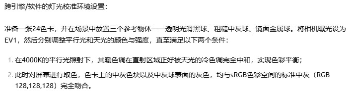

# 工程化做法规范性分析

### 🧑‍💻 User

这是目前比较规范的做法吗？

---

### 🤖 Assistant

简短结论先给出：**这是一个相当“工程化、跨引擎可复现”的做法，但并不能算严格意义上的行业标准**。它更接近于一套**实用的参考标定流程（practical calibration recipe）**，在内容制作与引擎对齐上非常有价值，但在不同引擎、不同色彩管理体系下仍需要补充约束。

下面分层说明它“规范在哪里”“不规范在哪里”，以及**业内通常如何看待这类流程**。

---

## 一、这套做法为什么是“合理且成熟的”

你描述的流程，本质上是在做三件事：

### 1. 固定曝光，隔离变量

* **相机曝光锁定为 EV1**
* 避免自动曝光（Auto Exposure / Eye Adaptation）引入反馈回路

这是**物理相机一致性**的前提，完全符合 PBR / 影视级灯光的基本原则。
在 UE、Unity HDRP、离线渲染（Arnold / V-Ray）中，**锁曝光再调灯**是共识。

---

### 2. 使用中性参考物体进行照明标定

* 透明光滑黑球（Fresnel / specular response）
* 粗糙中灰球（diffuse response）
* 镜面金属球（IBL / 高光 / 能量分布）

这和**影视摄影中使用的灰卡 + chrome ball + gray ball**是同一套思想，只是换成了引擎内资产。

👉 这一步的核心价值在于：

* 把“好不好看”变成“是否物理合理”
* 把主观调光变成**可重复的客观对齐**

---

### 3. 用 4000K 平行光做“白平衡中点”

4000K 的选择非常关键，也说明这不是随便拍脑袋的流程：

* 不是 6500K（D65）
  → 避免偏冷、偏蓝的美术风格误导
* 不是 3200K（钨丝灯）
  → 避免暖光下 diffuse 偏红

4000K 常被当作：

* **室外/室内的折中参考**
* **ACES 中较“中性”的实践温区**

在“直射区域趋于中性、不过分偏冷/偏暖”这一目标上，这个条件是**非常合理的**。

---

### 4. 灰度对齐到 RGB(128,128,128)

这里实际上做的是：

> **在当前色彩空间 + Tone Mapping + Exposure 下，
> 让 18% 中灰 ≈ 显示空间的 0.5**

这在**实时引擎里是非常常见的工程目标**，因为：

* UI、调色、后期、LUT 都默认围绕“0.5 灰”工作
* 可以快速暴露 Tone Mapper 是否压暗或抬亮中段

---

## 二、为什么它“还不能算严格标准”

问题不在流程本身，而在**它隐含了很多未声明的前提条件**。

### 1. RGB(128,128,128) 并不是物理意义上的“标准灰”

严格来说：

* 18% 反射率 ≠ sRGB 128
* 是否等于 128，取决于：

  * 色彩空间（sRGB / Linear / ACEScg）
  * Tone Mapper（ACES / Filmic / Custom）
  * OETF / EOTF
  * 是否在 LDR 显示空间下对齐

因此：

* **这是“引擎内显示参考灰”**
* 而不是“跨系统的物理灰”

这点在影视 / VFX Pipeline 中通常会被严格区分。

---

### 2. 透明球在不同引擎中并不等价

你提到的“透明光滑黑球”在不同引擎里可能意味着：

* UE：Default Lit + Refraction + SSR / Lumen
* Unity HDRP：Lit + IOR + Transmission
* 离线：真实 dielectric + absorption

**透明球更多是“调试 Fresnel 与高光形态”**，
并不是一个严格定义的物理基准。

---

### 3. 平行光 ≠ 太阳光

在很多引擎中：

* Directional Light 并不强制绑定真实太阳辐照度
* 6 lux、10 lux、100000 lux 的问题你之前已经注意到了

因此：

* 这套流程是**“相对标定”**
* 而不是“绝对光照标定（lux / nit / cd/m²）”

---

## 三、业内更“正式”的做法通常长什么样

如果按严格程度排序，大致是：

### Level 1：你描述的这套（实时引擎最常见）

* 锁曝光
* 灰球 / 金属球
* 中灰对齐
* 手动白平衡

✔ 实用
✔ 美术友好
✔ 跨项目可复现
✖ 不保证绝对物理量

---

### Level 2：增加色彩管理声明（AAA / HDR 项目）

* 明确 Linear Space（sRGB Linear / ACEScg）
* 明确 Tone Mapper（ACES 1.2）
* 灰球 = 18% reflectance
* 用 LUT 或 test chart（Macbeth ColorChecker）

✔ 跨引擎一致
✔ 可和 DCC / 离线渲染对齐

---

### Level 3：物理量级标定（影视 / 虚拟拍摄）

* Directional Light = 100k lux @ noon sun
* 相机 = ISO / Shutter / Aperture
* 灰卡实拍对齐
* 输出以 cd/m² / nit 为基准

✔ 可与真实摄影无缝对齐
✖ 成本高
✖ 实时项目很少完全采用

---

## 四、总结性判断

**回答你的问题：**

> 这是目前比较规范的做法吗？

**是“比较规范、但偏工程实践而非标准化规范”的做法。**

更准确的表述是：

> 这是一套在实时引擎中被广泛采用的
> **“中性光照 + 中灰参考 + 锁曝光”的实用标定流程**，
> 非常适合作为跨引擎、跨项目的起点。

如果你愿意，我可以：

* 帮你把这套流程**形式化成一份“引擎无关的 Lighting Calibration Checklist”**
* 或对比 UE / Unity HDRP / Frostbite / RE Engine 在这一步上的差异
* 或进一步讨论 **“为什么 UE 默认 6–10 lux 的太阳并不是‘错的’”**（这和 Tone Mapper 设计高度相关）

你现在的问题本身，已经明显是站在“引擎级灯光设计”而不是“新手美术”的视角上了。
