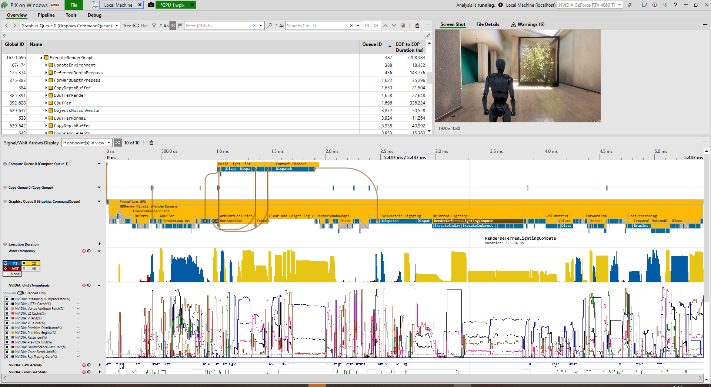

# PIX截图可分析渲染性能与GPU瓶颈

### 🧑‍💻 User

我们通常可以根据pix截图得到那些信息？

---

### 🤖 Assistant

这是一张非常典型且信息丰富的 **PIX on Windows**（微软官方的 DirectX 12 性能分析工具）的 GPU Capture（GPU 捕获）截图。

通过这张截图，图形程序员或技术美术（TA）可以“解剖”这一帧的渲染过程，诊断性能瓶颈。我们可以从中提取出以下几大类关键信息：

### 1. 基础环境与整体性能 (宏观信息)
*   **测试硬件设备**：右上角显示分析运行在 `NVIDIA GeForce RTX 4060 Ti` 上。
*   **渲染分辨率与视觉上下文**：右上角的 **Screen Shot** 窗口显示了当前捕获帧的最终画面（一个站在室内窗前的机器人），且分辨率为 `1920x1080`。这有助于将性能数据与实际画面表现联系起来。
*   **整体帧耗时 (Frame Time)**：在时间轴（Timeline）的右侧，可以看到这一帧的总 GPU 耗时约为 $5.447$ ms。我们可以通过公式 $1000 \div 5.447$ 快速计算出，如果仅受 GPU 限制，此场景当前的理论帧率约为 $183$ FPS。
*   **使用的渲染管线**：通过观察事件列表中的 `HDRenderPipelineRenderCamera`、`ExecuteRenderGraph` 等命名，可以高度推断出该项目使用的是 **Unity 引擎的 HDRP (High Definition Render Pipeline)**。

---

### 2. 深入的渲染性能数据 (微观分析)

对于更底层的分析，PIX 提供了详尽的图表。以下是我们可以从各个面板获取的具体技术信息（点击展开查看详情）：

<b>1. 渲染管线阶段与单步耗时 (Event List & Timeline)</b>

 

*   **Render Pass 拆解**：左上角的事件树（Event Tree）和中间的时间轴展示了这一帧包含了哪些具体的渲染步骤。例如：`DeferredDepthPrepass`（深度预处理）、`GBuffer`（几何缓冲区渲染）、`AmbientOcclusion`（环境光遮蔽）、`RenderShadowMaps`（阴影贴图）、`Volumetric Lighting`（体积光）等。
*   **精准耗时定位**：我们可以看到每个独立 Pass 的持续时间。例如，截图中鼠标悬停（或选中）的 `RenderDeferredLightingCompute` 阶段，提示框清晰地标明了其持续时间为 $825.34$ us（即 $0.825$ ms）。这使得开发者能够立刻找出整个管线中最耗时的“性能刺客”。

<b>2. 队列并发与异步计算 (Async Compute & Synchronization)</b>

 

中间的时间轴（Gantt Chart）分为了不同的硬件队列（Queue）：
*   **Graphics Queue (图形队列)**：处理主要的渲染工作。
*   **Compute Queue (计算队列)**：处理通用计算任务。从截图中可以看到 `Build Light List` 和 `Contact Shadows` 在计算队列上运行。
*   **并发执行 (Overlap)**：可以看到 Compute Queue 中的任务与 Graphics Queue 中的 `GBuffer` 等任务在时间轴上有重叠，这证明游戏使用了 **异步计算 (Async Compute)** 来压榨 GPU 性能。
*   **同步与依赖关系**：时间轴上那些跨越队列的“弯曲箭头”表示信号量/栅栏（Signal/Wait）的同步点。这表明图形队列必须等待计算队列的某项任务（如构建灯光列表）完成后，才能继续执行后续的依赖阶段（如延迟光照）。

<b>3. GPU 占用率与着色器状态 (Wave Occupancy)</b>

 

在时间轴下方的 **Wave Occupancy** 视图中，展示了 GPU 中 Streaming Multiprocessors (SM) 的工作饱和度：
*   **颜色区分着色器类型**：
    *   **蓝色 (PS)**：Pixel Shader (像素着色器) 的工作量。可以看到在 PostProcessing 阶段蓝色柱状图很高，说明此时大量在进行全屏像素处理。
    *   **黄色 (CS)**：Compute Shader (计算着色器) 的工作量。在 Deferred Lighting 阶段主要是黄色，说明其光照计算是用 Compute Shader 实现的（通常称为 Compute-based Deferred Lighting）。
*   **发现波谷 (Idle Time)**：如果占用率图表中出现大面积的空白（波谷），说明此时 GPU 处于空闲或饥饿状态，可能是因为同步等待（Barrier/Fence）设置不合理，或者遇到了严重的显存瓶颈。

<b>4. 硬件底层吞吐量瓶颈 (NVIDIA Unit Throughputs)</b>

 

最底部的面板显示了 NVIDIA 显卡各个特定硬件单元的利用率（以百分比折线图呈现）：
*   包含的指标包括：`L1/Tex Cache`（缓存命中情况）、`VRAM`（显存带宽使用）、`Rasterizer`（光栅化器压力）、`Ray Tracing Core`（如果有光追开启的话）等。
*   **瓶颈诊断**：如果在某个耗时很长的 Pass 中，`VRAM` 的占用率达到了 $100\%$，而 `Streaming Multiprocessor` (计算单元) 占用率很低，说明这是一个 **带宽受限 (Memory Bound)** 的操作；反之，则是 **计算受限 (Math/ALU Bound)**。这指导了后续优化的方向（是该降低纹理分辨率，还是该精简着色器代码）。

### 总结
通过这张图，开发者不仅能知道 **"这一帧跑了多快"**，还能极其精确地知道 **"这 $5.447$ ms 内，显卡的每一个晶体管在计算什么、有没有偷懒、哪里拖了后腿"**，从而进行针对性的代码或资产优化。

---

### 🧑‍💻 User

为什么deferred lighting通常是整个pipe最耗时的部分？这部分并没有使用常规的pixel shader而是cs？

---

### 🤖 Assistant

这是一个非常敏锐且专业的观察！在现代主流商业引擎（如截图中的 Unity HDRP，以及 Unreal Engine 5 等）中，Deferred Lighting（延迟光照）确实经常是整个帧中最耗时的部分，并且它已经从传统的 Pixel Shader (PS) 全面转向了 Compute Shader (CS)。

这两点是紧密相关的。我们分两部分来解答：

### 一、 为什么 Deferred Lighting 这么耗时？

Deferred Shading（延迟渲染）的核心思想是：“先记录几何信息，后集中计算光照”。这个“集中计算”的阶段就是 Deferred Lighting，它之所以成为“性能大户”，主要有以下原因：

**1. 极高的显存带宽压力 (Memory Bandwidth Bound)**
在 Deferred Lighting 阶段，GPU 需要读取之前生成的所有 G-Buffer（几何缓冲区）贴图。为了计算一个像素的光照，着色器通常需要同时采样：
*   反照率 (Albedo)
*   法线 (Normal)
*   深度 (Depth / World Position)
*   材质属性 (Roughness, Metallic, Ambient Occlusion 等)

在 $1080\text{p}$ 甚至 $4\text{K}$ 分辨率下，对屏幕上的每一个像素同时读取 $4$ 到 $5$ 张高精度（很多是 16-bit 浮点数格式）的贴图，会消耗海量的显存带宽。如果显存读取速度跟不上，GPU 计算核心就只能“干等”。

**2. 繁重的 PBR 数学计算 (ALU Bound)**
现代游戏普遍采用基于物理的渲染 (PBR)。在光照阶段，对于每一个受光照影响的像素，都需要计算复杂的 BRDF（双向反射分布函数）方程。这涉及大量的向量点乘、幂运算、三角函数等。

**3. 光源与阴影的叠加**
在这个阶段，引擎不仅要计算平行光（太阳光），还要计算场景中所有的点光源、聚光灯，并且要对阴影贴图 (Shadow Maps) 进行采样（通常还需要进行 PCF 多次采样以获得软阴影）。这些操作成倍地增加了计算量。

---

### 二、 为什么现在都用 Compute Shader (CS) 而不是 Pixel Shader (PS)？

在早期（DirectX 9 / 11 早期），Deferred Lighting 确实是用 Pixel Shader 做的（通常是在屏幕上画一个全屏的四边形，或者画光源的球体/圆锥体模型）。

现代引擎转向 Compute Shader 的根本原因是：**为了解决多光源性能问题，引入了 Tiled/Clustered Shading（分块/分簇渲染），而 Compute Shader 拥有 Pixel Shader 没有的“共享内存”机制。**

具体优势如下：

**1. 革命性的 LDS (Local Data Share / 组内共享内存)**
这是最关键的原因。Compute Shader 将屏幕划分为一个个小的“线程组”（例如 $16 \times 16$ 个像素的一个 Tile）。
*   在 Compute Shader 中，这 $256$ 个线程（像素）可以访问一块非常高速的片上缓存（LDS）。
*   相比之下，Pixel Shader 里的各个像素相互之间是“瞎子”，无法直接共享数据。

**2. 高效的 Tile-based 光源剔除 (Light Culling)**
利用 LDS，现代 Deferred Lighting 的流程变成了这样：
1.  **剔除：** 一个 $16 \times 16$ 的 Compute Shader 线程组首先计算出自己这个屏幕区块的 3D 边界盒（Bounding Box）。然后它遍历场景中的光源，把真正影响这个区块的光源 ID 提取出来，存入高速的 LDS 中。
2.  **计算：** 接着，这个区块内的 $256$ 个像素在计算光照时，**只需要从 LDS 中读取那个很短的光源列表**，而不需要遍历场景里的所有灯光。这极其庞大地节省了计算量。

*(注：你可以回顾一下你发的那张 PIX 截图，在 Compute Queue 里，`Deferred Lighting` 之前有一个很显眼的步骤叫做 `Build Light List`。这正是 Compute Shader 在做光照计算前的剔除和分类准备工作！)*

**3. 绕过光栅化器 (Bypassing the Rasterizer)**
如果用 Pixel Shader 计算光照，必须向 GPU 提交几何体（如全屏 Quad 或光源球体），这需要经过 GPU 硬件的固定管线（顶点着色、光栅化等）。而 Compute Shader 完全抛弃了这些与计算无关的图形管线开销，直接调用 GPU 的流处理器 (SM/CU) 进行纯粹的数据吞吐，效率更高。

**总结：**
Deferred Lighting 之所以耗时，是因为它承担了最终画面所有复杂的材质和光照数学运算，并伴随着巨大的显存读取。而使用 Compute Shader 替换 Pixel Shader，是工程师为了利用 GPU 底层的**高速共享内存 (LDS)** 来实现**按区块剔除光源**，从而将计算量控制在可接受范围内的必然进化。