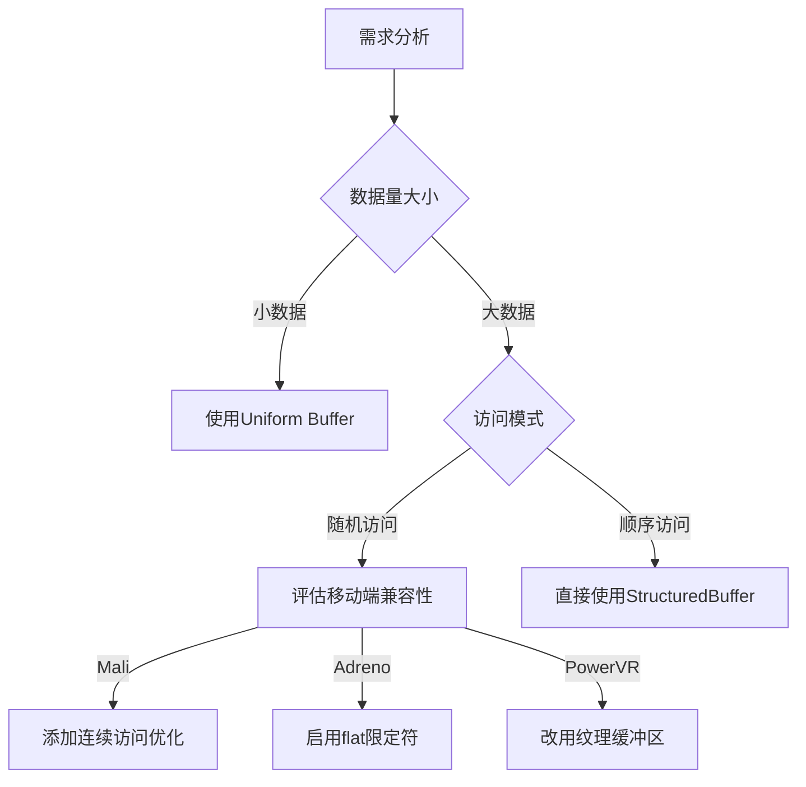

# HLSL函数参数限制与动态数组问题

### 🧑‍💻 User

为什么hlsl里面，函数不能传动态数组，只能定长？例如：character GetCharFromMemory(int ints[], int index)会报错

---

### 🤖 Assistant

在HLSL（High-Level Shading Language）中，函数参数不支持动态数组（即长度不确定的数组），这一限制源于GPU编程的底层设计原则和性能优化需求。以下是具体原因和解决方案：

---

### **原因分析**
1. **内存确定性要求**：
   GPU的并行架构要求代码在编译时尽可能确定内存使用（如寄存器、共享内存等）。动态数组的长度在运行时才能确定，这会破坏编译时的资源分配优化，影响着色器性能。

2. **硬件限制**：
   GPU线程（如像素着色器、计算着色器）通常以大规模并行的方式执行，动态内存分配（如堆内存）会导致不可预测的延迟和资源争用，因此HLSL直接禁止此类操作。

3. **函数参数传递机制**：
   HLSL函数参数传递本质上是值传递或引用传递的静态绑定。动态数组无法在编译时确定内存布局，导致编译器无法生成有效的GPU指令。

4. **历史设计选择**：
   HLSL的语法和语义设计更接近C语言的传统静态数组，而非现代C++的动态容器（如`std::vector`）。这是为了简化编译器实现并保持与硬件特性的直接对应。

---

### **解决方案**
#### 1. **使用固定长度数组**
   ```hlsl
   // 明确指定数组长度（例如长度为1024）
   character GetCharFromMemory(int ints[1024], int index) {
       return ints[index];
   }
   ```
   - **优点**：完全兼容HLSL规范，编译时内存分配明确。
   - **缺点**：数组长度需预先硬编码，灵活性受限。

#### 2. **通过缓冲区对象传递数据**
   使用HLSL提供的缓冲区类型（如`Buffer`、`StructuredBuffer`、`ByteAddressBuffer`）替代数组参数：
   ```hlsl
   // 定义缓冲区
   StructuredBuffer<int> g_ints : register(t0);

   character GetCharFromMemory(int index) {
       return g_ints.Load(index);
   }
   ```
   - **优点**：支持动态索引和大规模数据，符合GPU内存访问最佳实践。
   - **缺点**：需通过外部API（如DirectX）绑定缓冲区，函数签名不再直接包含数据源。

#### 3. **使用模板元编程（高级技巧）**
   通过模板模拟“动态”行为（需HLSL 2018+）：
   ```hlsl
   template <uint N>
   character GetCharFromMemory(int ints[N], int index) {
       return ints[index];
   }
   ```
   - **优点**：保留函数参数中的数组语义。
   - **缺点**：实际仍需在调用时明确数组长度，并非真正的动态。

---

### **底层原理补充**
GPU的着色器程序在编译时会为每个线程分配固定资源（如寄存器、本地内存）。动态数组可能导致：
- 寄存器溢出（Register Spilling）：编译器无法为可变长度的数组预留寄存器，转而使用更慢的全局内存。
- 线程分歧（Divergence）：动态索引可能导致线程间执行路径不一致，显著降低并行效率。

因此，HLSL通过限制动态数组，强制开发者使用显式的缓冲区或固定内存布局，确保着色器的确定性和高效性。

---

### **总结**
HLSL不支持函数参数传递动态数组，因其违背GPU编程的确定性原则。解决方法是：
1. **固定长度数组**：适用于小规模数据。
2. **缓冲区对象**：推荐方式，适合大规模动态数据。
3. **模板技巧**：语法糖，本质仍是静态数组。

若需进一步优化性能，建议直接操作缓冲区（如`StructuredBuffer`），这是现代GPU编程的标准做法。

---

### 🧑‍💻 User

一般会用固定长度的StructuredBuffer，当作动态内存来用，实现动态索引，这是怎么实现的？

---

### 🤖 Assistant

在 HLSL 中，**固定长度的 `StructuredBuffer`** 可以通过**动态索引（Dynamic Indexing）**实现类似“动态内存”的效果。这种做法的核心是 **GPU 缓冲区的灵活访问机制**，结合编译时确定的缓冲区长度和运行时的动态索引。以下是实现原理和关键步骤：

---

### **1. StructuredBuffer 的基本原理**
`StructuredBuffer<T>` 是 HLSL 中用于存储结构化数据的缓冲区对象，其特点如下：
- **固定长度**：在创建时由 CPU 端（如 DirectX API）定义缓冲区大小。
- **动态索引支持**：允许在着色器中通过任意整数索引（如变量、计算结果）访问数据。
- **内存连续性**：数据在 GPU 内存中连续存储，支持高效的随机访问。

```hlsl
// HLSL 中定义 StructuredBuffer
StructuredBuffer<int> g_ints : register(t0);  // 绑定到寄存器 t0
```

---

### **2. 实现动态索引的关键机制**
#### **(1) 通过 `Load` 方法访问数据**
`StructuredBuffer` 的 `Load` 方法接受一个动态的整数索引，返回对应位置的数据：
```hlsl
int value = g_ints.Load(index);  // index 可以是变量或表达式
```
- **动态性**：`index` 可以是任意运行时计算的整数值（如循环变量、数学运算结果）。
- **越界处理**：若 `index` 超出缓冲区长度，默认行为是未定义的（可能返回垃圾数据或崩溃），需手动检查边界。

#### **(2) 缓冲区长度管理**
虽然缓冲区长度在 GPU 端是固定的，但可以通过以下方式实现“动态”效果：
- **CPU 端动态更新**：在 CPU 端（如 C++ 代码）根据需求动态调整缓冲区内容，甚至重新创建不同大小的缓冲区。
- **Shader 内逻辑控制**：在 Shader 中通过代码限制索引范围，模拟动态行为：
  ```hlsl
  // 示例：限制索引不超过缓冲区长度
  int max_index = g_ints.Length - 1;
  int safe_index = clamp(index, 0, max_index);
  int value = g_ints.Load(safe_index);
  ```

---

### **3. 完整实现示例**
#### **(1) HLSL 代码**
```hlsl
// 定义 StructuredBuffer
StructuredBuffer<int> g_ints : register(t0);

// 动态索引访问函数
int GetIntFromBuffer(int index) {
    if (index < 0 || index >= g_ints.Length) {
        return -1; // 自定义越界处理
    }
    return g_ints.Load(index);
}
```

#### **(2) CPU 端（C++/DirectX）**
```cpp
// 创建 StructuredBuffer（假设长度为 1024）
ID3D11Buffer* pBuffer;
D3D11_BUFFER_DESC desc = {
    .ByteWidth = 1024 * sizeof(int),  // 固定长度
    .Usage = D3D11_USAGE_DYNAMIC,     // 允许 CPU 动态更新
    .BindFlags = D3D11_BIND_SHADER_RESOURCE,
    .CPUAccessFlags = D3D11_CPU_ACCESS_WRITE
};
pDevice->CreateBuffer(&desc, nullptr, &pBuffer);

// 更新缓冲区数据（例如每帧更新）
D3D11_MAPPED_SUBRESOURCE mapped;
pContext->Map(pBuffer, 0, D3D11_MAP_WRITE_DISCARD, 0, &mapped);
memcpy(mapped.pData, cpu_data, data_size); // 填充数据
pContext->Unmap(pBuffer, 0);

// 绑定到 Shader 的 t0 寄存器
pContext->PSSetShaderResources(0, 1, &pBufferView);
```

---

### **4. 动态性的本质**
虽然 `StructuredBuffer` 的长度在 GPU 端是固定的，但通过以下组合可实现“动态内存”的假象：
- **CPU 端动态更新**：通过 `D3D11_USAGE_DYNAMIC` 标志，允许 CPU 每帧更新缓冲区内容。
- **Shader 逻辑控制**：在 Shader 中通过动态计算的索引访问数据，而非硬编码的固定索引。
- **缓冲区复用**：同一缓冲区可存储不同类型的数据（需通过字节偏移计算访问）。

---

### **5. 性能优化注意事项**
1. **内存对齐**：
   - 确保 `StructuredBuffer` 的元素按 16 字节对齐（例如 `float4` 结构），避免性能下降。
   - 对于非对齐数据类型（如 `int`），使用 `ByteAddressBuffer` 并手动计算偏移量。

2. **访问连续性**：
   - 尽量让相邻线程访问连续的缓冲区位置，以利用 GPU 的内存合并（Coalescing）特性。

3. **越界检查代价**：
   - 频繁的 `if (index < length)` 检查可能导致线程分歧（Thread Divergence），影响性能。
   - 可在 CPU 端确保索引范围有效，避免 Shader 中的边界检查。

---

### **6. 对比传统动态数组**
| 特性                | `StructuredBuffer` + 动态索引      | 传统动态数组（如 C++ `vector`） |
|---------------------|-----------------------------------|-------------------------------|
| **内存分配时机**     | 编译时固定长度，CPU 端可动态更新   | 运行时动态分配                |
| **索引灵活性**       | 支持任意动态索引                  | 支持动态索引                  |
| **越界风险**         | 需手动检查                        | 自动检查（如 `at()` 方法）     |
| **GPU 兼容性**       | 完全兼容                          | 不支持（HLSL 无堆内存）        |

---

### **总结**
通过 `StructuredBuffer` 实现“动态内存”的核心是：
1. **固定长度的缓冲区** + **动态索引** 的硬件支持。
2. **CPU 端动态更新数据**，GPU 端通过 `Load` 方法随机访问。
3. 手动管理越界和内存对齐，确保性能最优。

这种设计既符合 GPU 的内存确定性要求，又提供了足够的灵活性，是现代图形编程中处理动态数据的标准方案。

---

### 🧑‍💻 User

移动端gpu对StructuredBuffer和ssbo兼容性怎么样？

---

### 🤖 Assistant

在移动端GPU开发中，**StructuredBuffer（DirectX HLSL）**和**SSBO（OpenGL/Vulkan Shader Storage Buffer Object）**的兼容性与性能表现因硬件架构和图形API的不同而有所差异。以下是详细分析：

---

### **1. 核心概念对比**
| 特性                  | StructuredBuffer (DirectX HLSL)         | SSBO (OpenGL ES/Vulkan)               |
|-----------------------|----------------------------------------|---------------------------------------|
| **所属API**           | DirectX 11/12, HLSL                    | OpenGL ES 3.1+, Vulkan, GLSL/SPIR-V   |
| **数据访问方式**       | 结构化数据，类型安全                   | 原始字节或结构化数据，需手动对齐      |
| **动态索引支持**       | 完全支持（通过`Load`或下标）           | 支持，但需注意硬件对齐限制            |
| **移动端兼容性**       | 仅支持DirectX移动平台（如Xbox/UWP）    | 广泛支持（Android/iOS Vulkan/OpenGL） |
| **内存模型**           | 显式绑定到寄存器（如`t0`）             | 通过描述符集（Vulkan）或绑定点（GL）  |

---

### **2. 移动端GPU厂商支持情况**
#### **(1) ARM Mali GPU**
- **SSBO (OpenGL ES/Vulkan)**：
  - OpenGL ES 3.1+ 完全支持，但需注意驱动实现差异。
  - Vulkan中通过`VK_BUFFER_USAGE_STORAGE_BUFFER_BIT`使用，性能优化关键点：
    - 确保缓冲区按16字节对齐（避免Mali的缓存行分裂）。
    - 避免随机访问（优先连续访问以利用缓存）。
- **StructuredBuffer**：
  - 仅适用于DirectX移动端（如Windows on ARM），在Android/iOS需通过转换（如MoltenVK将HLSL转Metal）。

#### **(2) Qualcomm Adreno GPU**
- **SSBO**：
  - OpenGL ES中性能较好，但动态索引可能导致UBO（Uniform Buffer）更优。
  - Vulkan中推荐使用`storageBuffer`，支持`std430`布局，需注意：
    - 避免使用`vec3`（对齐问题，改用`vec4`）。
    - 优先使用`flat`修饰符减少寄存器压力。
- **StructuredBuffer**：
  - 需通过跨API工具链（如HLSL→SPIR-V）适配，可能引入额外开销。

#### **(3) PowerVR/Apple GPU**
- **Metal 的等效实现**：
  - iOS/macOS使用Metal API，对应概念为`MTLBuffer`（通过`device_buffer`访问）。
  - 在Metal Shading Language中，使用`buffer<T>`声明：
    ```metal
    buffer<int> myBuffer [[buffer(0)]];
    int value = myBuffer[index];
    ```
- **SSBO 兼容性**：
  - Vulkan通过MoltenVK映射到Metal，但需注意描述符集限制。

---

### **3. 兼容性解决方案**
#### **(1) 跨API统一方案**
- **Vulkan为核心**：
  - 使用Vulkan的`VK_BUFFER_USAGE_STORAGE_BUFFER_BIT`，在SPIR-V中定义存储缓冲：
    ```glsl
    // GLSL
    layout(std430, binding = 0) buffer MyBuffer { int data[]; };
    ```
  - 通过工具链（如glslang/HLSL→SPIR-V）将HLSL的`StructuredBuffer`转换为SPIR-V存储缓冲。

- **DirectX到移动端的适配**：
  - 使用ANGLE（将OpenGL ES转DirectX）或MoltenVK（Vulkan转Metal）实现跨平台支持。

#### **(2) 功能降级策略**
- **不支持SSBO的旧设备**：
  - OpenGL ES 3.0及以下：使用`Uniform Buffer` + 动态索引模拟，但受限于大小（通常最大64KB）。
  - 纹理缓冲区（`TBO`）替代方案：
    ```glsl
    uniform samplerBuffer myTBO;
    int value = texelFetch(myTBO, index).x;
    ```

---

### **4. 性能优化注意事项**
- **内存对齐**：
  - **Mali**：16字节对齐，避免结构体内部填充。
  - **Adreno**：`std430`布局，显式指定偏移量。
  - **PowerVR**：避免非2的幂次方访问。

- **访问模式**：
  - 连续访问优先于随机访问（减少缓存未命中）。
  - 使用`restrict`关键字（Vulkan/GLSL）或避免别名。

- **移动端带宽敏感**：
  - 合并多次访问（如预加载数据到局部变量）。
  - 避免在循环内频繁访问SSBO/StructuredBuffer。

---

### **5. 实际代码示例**
#### **(1) Vulkan (SSBO)**
```glsl
// GLSL
#version 310 es
layout(std430, binding = 0) buffer StorageBuffer {
    int data[];
} ssbo;

int value = ssbo.data[index];
```

#### **(2) Metal (等效实现)**
```metal
// Metal Shading Language
#include <metal_stdlib>
using namespace metal;

kernel void myKernel(device int* data [[buffer(0)]],
                    uint index [[thread_position_in_grid]]) {
    int value = data[index];
}
```

#### **(3) HLSL转Vulkan（通过SPIR-V）**
```hlsl
// HLSL
StructuredBuffer<int> g_buffer : register(t0);
int value = g_buffer[index];
```
转换后的SPIR-V通过工具链绑定到`VK_DESCRIPTOR_TYPE_STORAGE_BUFFER`。

---

### **6. 兼容性总结**
| 平台/API          | StructuredBuffer       | SSBO                     |
|-------------------|------------------------|--------------------------|
| **Android OpenGL**| 不支持（需转SSBO/TBO） | OpenGL ES 3.1+ 支持      |
| **Android Vulkan**| 通过SPIR-V映射          | 原生支持                 |
| **iOS Metal**     | 不支持（需转MTLBuffer） | 通过MoltenVK间接支持     |
| **Windows ARM**   | 原生支持（DirectX）     | 需Vulkan转换             |

---

### **7. 开发者建议**
1. **优先使用Vulkan/SPIR-V**：
   - 统一移动端和桌面端代码，通过描述符管理存储缓冲。
2. **特性检测**：
   - 在运行时检查`GL_MAX_SHADER_STORAGE_BLOCK_SIZE`（OpenGL ES）或`VkPhysicalDeviceLimits`（Vulkan）。
3. **性能分析工具**：
   - Mali：使用Arm Mobile Studio的Streamline。
   - Adreno：Snapdragon Profiler。
   - iOS：Xcode GPU Frame Capture。

通过合理选择API和优化策略，可以在移动端高效利用类动态内存的缓冲区技术，同时兼顾兼容性。

---

### 🧑‍💻 User

顶点和像素着色器中是否可以使用StructuredBuffer？

---

### 🤖 Assistant

是的，**顶点着色器(Vertex Shader)和像素着色器(Pixel Shader)都可以使用StructuredBuffer**，但在不同API和硬件平台上有兼容性和性能差异。以下是详细分析：

---

### **1. 顶点着色器(Vertex Shader)中使用StructuredBuffer**
#### **支持情况**
| API/平台          | 支持情况                                                                 |
|-------------------|-------------------------------------------------------------------------|
| **DirectX 11**    | ✅ 需要Shader Model 5.0+ (`d3d11_1`功能级别)                            |
| **DirectX 12**    | ✅ 完全支持                                                            |
| **Vulkan**        | ✅ 通过存储缓冲区(SSBO)支持                                             |
| **OpenGL ES 3.1+**| ✅ 通过SSBO支持                                                         |
| **Metal (iOS)**   | ✅ 通过`device`/`constant`缓冲区支持                                    |
| **OpenGL ES 3.0-**| ❌ 不支持（需使用Uniform Buffer或纹理替代）                              |

#### **典型应用场景**
1. **GPU驱动的渲染**
   ```hlsl
   // HLSL: 从StructuredBuffer读取顶点数据
   StructuredBuffer<float3> g_vertices : register(t0);
   
   VS_OUT VS(uint vertexID : SV_VertexID) {
       VS_OUT output;
       float3 pos = g_vertices[vertexID];  // 动态索引
       output.pos = mul(float4(pos, 1.0), g_mvp);
       return output;
   }
   ```

2. **骨骼动画**
   ```hlsl
   // 直接从缓冲区读取骨骼矩阵
   StructuredBuffer<float4x4> g_boneMatrices : register(t1);
   ```

#### **性能注意事项**
- **移动端风险**：顶点着色器随机访问可能导致线程串行化（尤其Mali GPU）
- **优化方案**：
  - 确保连续线程访问连续内存地址
  - Adreno GPU：使用`flat`修饰符减少寄存器压力
  - Mali GPU：限制同时访问的缓冲区数量

---

### **2. 像素着色器(Pixel Shader)中使用StructuredBuffer**
#### **支持情况**
| API/平台          | 支持情况                                                                 |
|-------------------|-------------------------------------------------------------------------|
| **DirectX 11/12** | ✅ 完全支持                                                            |
| **Vulkan**        | ✅ 通过SSBO支持                                                         |
| **OpenGL ES 3.1+**| ✅ 通过SSBO支持                                                         |
| **Metal (iOS)**   | ✅ 完全支持                                                            |
| **OpenGL ES 3.0-**| ⚠️ 部分支持（需扩展`GL_EXT_shader_storage_buffer_object`)              |

#### **典型应用场景**
1. **复杂光照计算**
   ```hlsl
   // HLSL: 读取光源数据
   StructuredBuffer<Light> g_lights : register(t2);
   
   float4 PS(VS_OUT input) : SV_Target {
       float3 color = 0;
       for(uint i=0; i<g_lightCount; i++) {
           color += CalculateLight(g_lights[i], input.normal);
       }
       return float4(color, 1.0);
   }
   ```

2. **材质系统**
   ```hlsl
   // 动态获取材质属性
   StructuredBuffer<Material> g_materials : register(t3);
   ```

#### **性能注意事项**
- **带宽敏感**：像素着色器调用频率极高，需严格控制访问次数
- **移动端优化**：
  - **Adreno**：使用`precise`修饰符避免冗余计算
  - **Mali**：将小尺寸数据转为Uniform Buffer
  - **PowerVR**：使用`coherent`限定符优化缓存

---

### **3. 跨平台兼容性解决方案**
#### **方案1：条件编译（推荐）**
```glsl
// 统一着色器代码（HLSL/GLSL兼容）
#if defined(VULKAN) || defined(GL_ES)
  layout(std430, binding=0) buffer Vertices { vec3 positions[]; };
#elif defined(HLSL)
  StructuredBuffer<float3> g_vertices : register(t0);
#endif
```

#### **方案2：API抽象层**
```cpp
// 引擎层统一封装
class GraphicsBuffer {
public:
  void BindToShader(ShaderStage stage, int slot);
  // D3D: ID3D11ShaderResourceView*, Vulkan: VkBuffer, etc
};
```

#### **方案3：功能降级（旧设备）**
```glsl
// OpenGL ES 3.0回退方案
#if __VERSION__ < 310
  uniform samplerBuffer s_vertexData; // 用纹理缓冲区模拟
  vec3 GetVertex(int idx) {
      return texelFetch(s_vertexData, idx).xyz;
  }
#endif
```

---

### **4. 移动端性能关键指标**
| GPU架构       | 顶点着色器访问代价       | 像素着色器访问代价       |
|--------------|-------------------------|-------------------------|
| **Mali (Arm)** | 高（需连续访问优化）     | 中（避免分支+连续访问）  |
| **Adreno (高通)**| 低（硬件优化良好）      | 中（注意带宽限制）       |
| **PowerVR (Imagination)**| 高（严格对齐要求）   | 高（慎用随机访问）       |
| **Apple Silicon** | 极低（统一内存架构）   | 低（优化最佳）          |

---

### **5. 最佳实践**
#### **顶点着色器优化**
1. **索引预计算**（CPU/Compute Shader）
   ```cpp
   // 在Compute Shader中预排序索引
   RWStructuredBuffer<uint> g_sortedIndices;
   ```
   
2. **数据分块**
   ```hlsl
   // 按区块加载数据（减少随机访问）
   float3 LoadVertexBlock(uint blockID, uint localID) {
       return g_vertexBlocks[blockID].data[localID];
   }
   ```

#### **像素着色器优化**
1. **数据烘焙**
   ```hlsl
   // 将频繁访问数据烘焙到本地
   groupshared Light s_lightGroup[4];
   ```
   
2. **带宽控制**
   ```glsl
   // GLSL：使用中精度减少带宽
   layout(std430, binding=0) buffer Lights {
       mediump vec4 lightData[];
   };
   ```

#### **跨平台安全访问**
```hlsl
// 安全加载函数（兼容所有平台）
float3 SafeLoadVertex(uint index) {
#if defined(MOBILE_OPTIMIZED)
    index = min(index, g_vertexCount - 1); // 避免越界
#endif
    return g_vertices.Load(index);
}
```

---

### **总结**
1. **顶点着色器**：
   - ✅ 现代API完全支持
   - ⚠️ 移动端需优化访问模式
   - 💡 适用场景：GPU驱动渲染、骨骼动画

2. **像素着色器**：
   - ✅ 广泛支持
   - ⚠️ 严格控制访问频率
   - 💡 适用场景：动态光照、材质系统

3. **移动端关键策略**：
   - 优先使用Vulkan/Metal原生API
   - Mali GPU：确保16字节对齐+连续访问
   - Adreno：使用`flat`修饰符+数据分块
   - 旧设备：纹理缓冲区(TBO)回退方案

实际开发中，建议：
