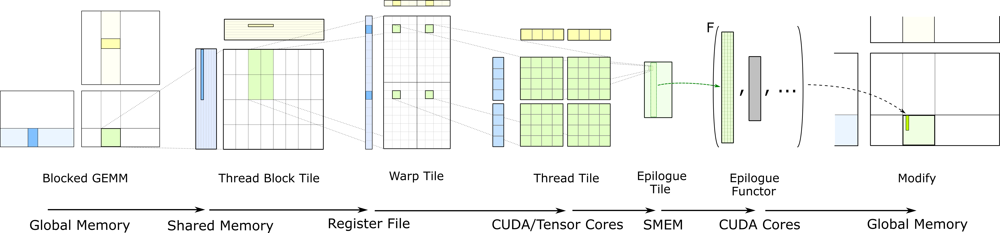
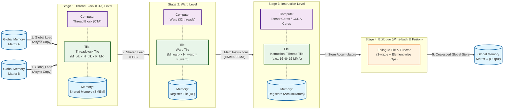

# 矩阵乘法分块数据流

### 🧑‍💻 User

基本的矩阵乘法三重循环嵌套计算可以分块和分块执行，以匹配硬件并发性、内存局部性和并行编程模型。如何理解该结构中的数据流？
注：这是 CUTLASS 所实现的层级式 GEMM 计算。每个阶段都描绘了一个嵌套的平铺层级，对应于 CUDA 执行模型中的一个并发层级以及内存层次结构中的一个层级，从左到右层级越来越精细。

---

### 🤖 Assistant

这张图展示了 NVIDIA CUTLASS 库（CUDA Templates for Linear Algebra Subroutines）中用于实现高性能矩阵乘法（GEMM）的**分层切片（Hierarchical Tiling）**架构。

要理解这个结构中的数据流，核心在于把握两个映射关系：
1.  **并行计算层级映射：** 矩阵的逻辑切块如何映射到 CUDA 的执行模型（Grid $\rightarrow$ Thread Block $\rightarrow$ Warp $\rightarrow$ Thread）。
2.  **内存层次映射：** 数据如何从慢速大容量存储逐步搬运到快速小容量存储（Global Memory $\rightarrow$ Shared Memory $\rightarrow$ Register File）。

整个过程可以分为两大阶段：**主循环（Mainloop）**和**尾声（Epilogue）**。以下是详细的数据流解析：

### 一、 主循环（Mainloop）：数据的加载与计算

主循环的目的是将大矩阵分块，并尽可能在靠近计算单元（如 Tensor Cores）的高速缓存中重复使用数据，以克服全局内存带宽的瓶颈。

<b>点击展开：主循环各层级数据流详解</b>

1.  **Blocked GEMM (Global Memory $\rightarrow$ Shared Memory)**
    *   **概念：** 这是最外层的循环。整个大矩阵 $A$ 和 $B$ 存储在**全局内存（Global Memory）**中。
    *   **数据流：** 一个 CUDA 线程块（Thread Block / CTA）负责计算输出矩阵 $C$ 的一个特定的二维块（Tile）。为了计算这个块，线程块需要沿着 $K$ 维度（内积维度）遍历矩阵 $A$ 和 $B$。在每一步中，线程块协同地从全局内存加载一个 $M_{block} \times K_{block}$ 的 $A$ 矩阵块和一个 $K_{block} \times N_{block}$ 的 $B$ 矩阵块到**共享内存（Shared Memory）**中。
    *   **目的：** 共享内存的延迟远低于全局内存。将数据放入共享内存后，线程块内的所有 Warp 可以共享这些数据，实现极高的数据重用率。

2.  **Thread Block Tile $\rightarrow$ Warp Tile (Shared Memory $\rightarrow$ Register File)**
    *   **概念：** 进入线程块内部。一个线程块由多个 Warp（每 32 个线程为一个 Warp）组成。
    *   **数据流：** 刚才加载到共享内存中的大 Tile 被进一步划分为更小的 Warp Tile。每个 Warp 负责计算其专属的输出子块。Warp 会从共享内存中读取其所需的 $A$ 和 $B$ 的子块，并将其加载到每个线程的**寄存器堆（Register File）**中。
    *   **目的：** 寄存器是 GPU 上最快的存储器。数据到达寄存器后，就准备好直接喂给计算单元了。

3.  **Warp Tile $\rightarrow$ Thread Tile (Register File $\rightarrow$ CUDA/Tensor Cores)**
    *   **概念：** 到了指令级别。Warp 将寄存器中的数据组织成适合底层硬件指令（如 MMA - Matrix Multiply-Accumulate）的格式。
    *   **数据流：** 线程（Thread）或 Tensor Cores 直接从寄存器中读取微小的矩阵片段（例如 $16 \times 16 \times 16$），执行乘加运算：$$ D = A \times B + C $$。计算出的部分和（Partial Accumulators）直接保存在寄存器中。
    *   **目的：** 实现最高吞吐量的数学运算。

---

### 二、 尾声（Epilogue）：后处理与写回

当沿着 $K$ 维度的循环结束时，寄存器中保存了输出矩阵 $C$ 的最终点积结果。在将其写回全局内存之前，需要进行一系列的“尾声”操作。

<b>点击展开：尾声阶段数据流详解</b>

1.  **Epilogue Tile (Registers $\rightarrow$ SMEM)**
    *   **数据流：** 由于 Tensor Core 的输出结果在各个线程的寄存器中呈特定的交错分布，直接写回全局内存会导致非合并的内存访问（Uncoalesced Memory Access），极大地降低带宽。因此，CUTLASS 通常会先将寄存器中的结果写回到**共享内存（SMEM）**中，进行数据重排（Swizzling）。

2.  **Epilogue Functor (SMEM $\rightarrow$ CUDA Cores)**
    *   **数据流：** 重新排列后的数据从共享内存加载到寄存器中。此时，可以在 CUDA Cores 上执行标量操作（Functor）。
    *   **目的：** 计算完整的 GEMM 公式 $$ C_{out} = \alpha (A \times B) + \beta C_{in} $$。这里也可以执行额外的逐元素操作（Element-wise Operations），例如激活函数（ReLU、GELU 等）。这种设计称为**算子融合（Operator Fusion）**，避免了将结果写回全局内存再读出来做激活操作的开销。

3.  **Modify (Global Memory)**
    *   **数据流：** 经过处理和格式化后的最终数据，通过合并访问的方式（Coalesced Access），高效地写回**全局内存（Global Memory）**。

---

### 总结：如何理解这种设计？

可以将这个过程理解为一条**“数据漏斗”**。

最上层的全局内存很大但很慢，最底层的寄存器极快但容量极小。通过**三重嵌套的 Tile 结构**，CUTLASS 确保了：
*   **块越大，停留的时间越长：** 在靠近底层的快速内存中，较小的数据块被极其频繁地重复使用（计算乘加）。
*   **隐藏延迟：** 当 Tensor Cores 正在计算当前的寄存器块时，GPU 会并行地将下一个块从全局内存加载到共享内存中（Software Pipelining / Asynchronous Copy）。

在数学上，传统的按行按列遍历的朴素循环：
$$ C_{m,n} = \sum_{k=0}^{K-1} A_{m,k} B_{k,n} $$
被转化为了分块的形式：
$$ C_{M_{tile}, N_{tile}} += \sum_{K_{step}} A_{M_{tile}, K_{step}} \times B_{K_{step}, N_{tile}} $$
图中的从左到右，正是这个分块公式在 GPU 硬件架构上完美的具象化体现。

---

### 🧑‍💻 User

用mermaid画出cutlass gemm 分层数据流图，分析pipeline各个stage的 `计算层级 - 分块操作 - 内存层次`结构图，这可以帮助我们理解每一层分块的动机。

---

### 🤖 Assistant

下面我使用 Mermaid 绘制了 CUTLASS GEMM 的分层数据流图。该图展示了数据从全局内存到计算核心的“漏斗”过程，并严格对应了**计算层级 (Compute Level)**、**分块操作 (Tiling Operation)** 和 **内存层次 (Memory Hierarchy)**。

---

### 分阶段 `计算-分块-内存` 动机分析

理解 CUTLASS 的核心在于理解**“为什么要在这个硬件层级切这么大的块？”**。以下是各个 Pipeline 阶段的设计动机分析：

<b>1. Thread Block (CTA) 层级：突破显存带宽瓶颈</b>

*   **计算层级：** `Thread Block` (CUDA 线程块)
*   **分块操作：** `Threadblock Tile` (通常大小如 $128 \times 128 \times 32$)
*   **内存层次：** `Global Memory` $\rightarrow$ `Shared Memory`
*   **分块动机：** 
    全局内存 (Global Memory) 容量大但带宽极低、延迟极高。如果每个线程直接从全局内存读取数据进行计算，计算单元（如 Tensor Cores）将长期处于“饥饿”状态等待数据。
    通过将矩阵划分为较大的 `Threadblock Tile`，一个线程块将数据协同加载到延迟极低的**共享内存**中。在共享内存中，这块数据会被成百上千次乘加运算重复使用（Data Reuse）。**这一层的动机是将计算受到内存带宽限制 (Memory-bound) 转化为受到计算能力限制 (Compute-bound)。**

<b>2. Warp 层级：消除共享内存访存冲突</b>

*   **计算层级：** `Warp` (32 个同步执行的线程)
*   **分块操作：** `Warp Tile` (通常大小如 $64 \times 64 \times 32$)
*   **内存层次：** `Shared Memory` $\rightarrow$ `Register File`
*   **分块动机：** 
    共享内存虽然快，但它是由多个 Bank 组成的。如果一个线程块内的所有 Warp 无序地同时访问共享内存，会导致严重的 Bank Conflict，极大地降低读取速度。
    将 `Threadblock Tile` 进一步划分为 `Warp Tile`，使得每个 Warp 负责一块独立的数据区域。Warp 将自己的子块从共享内存加载到**寄存器 (Registers)** 中。**这一层的动机是组织有序的共享内存访问，并为最底层的硬件指令准备好数据上下文。**

<b>3. Instruction (Thread) 层级：榨干硬件算力极限</b>

*   **计算层级：** `Tensor Cores` 或 `CUDA Cores` (硬件执行单元)
*   **分块操作：** `Instruction Tile` / `Thread Tile` (如 MMA 指令的 $16 \times 8 \times 16$)
*   **内存层次：** `Register File` $\rightarrow$ 算术逻辑单元 (ALU)
*   **分块动机：** 
    这是最微观的层级。现代 GPU 提供了极其强大的矩阵乘加指令（如 `mma.sync`）。这些指令对输入数据的格式、寄存器的排布有严格的要求。
    在这一层，数据完全存在于**寄存器**中，指令以最高的吞吐量吞吐数据进行计算，并将部分和（Accumulators）累加在另一组寄存器中。**这一层的动机是迎合底层硬件指令架构，实现理论峰值算力 (TFLOPS)。**

<b>4. Epilogue 层级：高效写回与算子融合</b>

*   **计算/内存层级：** `Registers` $\rightarrow$ `Shared Memory` (可选) $\rightarrow$ `Global Memory`
*   **分块操作：** `Epilogue Tile`
*   **分块动机：** 
    计算完成后，结果 $C$ 散落在各个线程的寄存器中，且排布非常破碎（由于底层 MMA 指令的要求）。如果直接写回全局内存，将产生大量非合并访存 (Uncoalesced Memory Access)，导致写回速度极慢。
    Epilogue 阶段通常会先将寄存器中的结果写回到共享内存进行**重排 (Swizzle)**，然后再以整齐的块合并写回全局内存。此外，这也是执行 $\alpha X + \beta Y$、ReLU、Bias 加法等**算子融合 (Operator Fusion)** 的最佳时机，避免了数据“写回再读出”的巨大开销。

