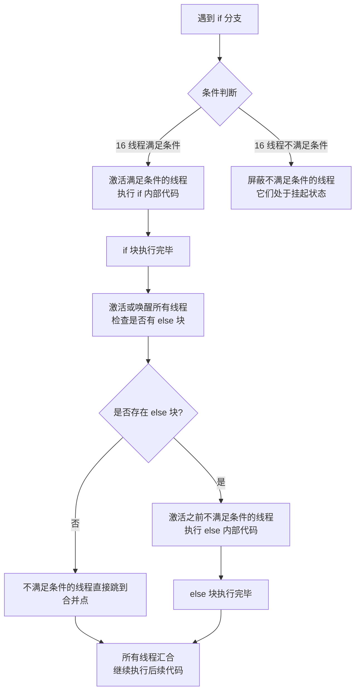

# 线程束分支执行机制

### 🧑‍💻 User

gpu编程模型中，一半进if一半不进时是一半等一半，还是warp拆散，重新按跳转的不同，和其它被拆的warp中相同跳转的线程全组成新的warp呢？

---

### 🤖 Assistant

# GPU Warp 分支处理机制详解

**答案是：不是一半等一半，也不会重新组 warp。而是 SIMT 模型下的分支。**

在 NVIDIA GPU 的 SIMT (Single Instruction, Multiple Threads) 编程模型中，**同一个 Warp 内的 32 个线程必须在同一时钟周期执行相同的指令**。当遇到分支（如 `if` 语句）时， Warp 不会拆散重组，进入和不进入 `if` 的线程会在各自的执行路径上串行执行，产生所谓的 **线程束分化**。

## 分支执行过程

假设 Warp 中有 16 个线程满足 `if` 条件，16 个不满足：



具体而言：

1. **所有 32 个线程** 对 `if` 条件进行求值。
2. 硬件检测到 Warp 内存在分化，为不同的执行路径设置 **执行掩码**。
3. **满足条件的 16 个线程** 保持活跃，继续执行 `if` 内部的指令；不满足条件的 16 个线程被屏蔽（处于 NOP 空转状态）。
4. 当 `if` 内部的指令执行完毕后，**满足条件的 16 个线程**被挂起。
5. **不满足条件的 16 个线程** 被唤醒，如果存在 `else` 分支，则执行 `else` 内部的代码；如果没有 `else`，它们直接跳转到汇合点。
6. 所有 32 个线程重新汇合，继续执行 `if/else` 之后的代码。

## 性能影响

Warp 分化会导致性能损失，相当于把原本并行的线程**串行化**了。最坏情况下，如果一个 Warp 内有 32 个不同的分支路径，执行时间会变为原来的 32 倍。

## 优化建议

为了避免或减少 Warp 分化，可以采用以下策略：

1. **尽量让 Warp 内的线程走相同的分支路径**。在 CUDA 编程时，调整数据布局或线程映射方式，让访问相同分支的线程集中在同一个 Warp 内。
2. **使用谓词执行**。对于非常短的分支（1-2 条指令），编译器会自动使用谓词寄存器，虽然有分支无分化（所有线程都执行所有路径），它虽然避免了跳转，但同样会执行两条路径的指令。
3. **使用条件赋值代替分支**。例如用 `ternary` 操作符 `c = a > b ? a : b;` 或者数学函数替代 `if-else`。这样所有线程都执行相同的指令序列，只是数据不同，虽然两路计算都做了，但不会产生分化导致串行等待。
4. **使用 Warp 原语**：如 `__shfl_sync()`，可以在不产生分化的情况下进行线程间数据交换。
5. **Predication（谓词执行）**：对非常短小的分支，编译器会自动将代码转为谓词执行。
6. **Warp Vote 函数**：用于条件判断时，如 `__ballot_sync()`, `__any_sync()`, `__all_sync()`。

## 代码示例对比

<details>
<summary>点击查看易产生分化的代码示例</summary>

```cuda
// ❌ 不好的写法：容易产生 Warp 分化
__global__ void badBranchKernel(float* data, int* flags) {
    int idx = blockIdx.x * blockDim.x + threadIdx.x;
    if (flags[idx] == 1) {      // 如果 Warp 内 flags 不同，产生分化
        data[idx] = data[idx] * 2.0f;
    } else {
        data[idx] = data[idx] + 1.0f;
    }
}
// 当 Warp 中一半线程走 true 分支，一半走 false 分支时
// 执行时间将翻倍，因为两个分支会被串行执行
```

</details>

<details>
<summary>点击查看优化后的无分化代码示例</summary>

```cuda
// ✅ 好的写法：避免 Warp 分化，使用条件表达式
__global__ void goodBranchKernel(float* data, int* flags) {
    int idx = blockIdx.x * blockDim.x + threadIdx.x;
  
    // 使用三元运算符，所有线程都执行相同的指令，无分支
    float factor = (flags[idx] == 1) ? 2.0f : 1.0f;
    float add_val = (flags[idx] == 1) ? 0.0f : 1.0f;
    data[idx] = data[idx] * factor + add_val;
}
```

</details>

## 进阶：Volta 架构后的改进

<details>
<summary>点击展开 Volta 及之后架构的改进机制</summary>

从 NVIDIA Volta 架构（V100）开始，引入了 **Independent Thread Scheduling (独立线程调度)**，允许同一 Warp 内的不同线程处于不同的执行状态，但执行完毕后仍需同步。

Volta 架构为每个线程维护独立的程序计数器 (PC) 和调用栈，理论上支持更灵活的细粒度同步。但即使如此，SIMT 的本质未变——硬件仍然以 Warp 为单位发射指令：

- 对于统一的分支，性能与之前相同
- 对于分化的分支，Volta 可以让不同分支的线程交错执行，而不是严格按顺序等待
- 自计算能力 7.0 后，硬件支持更细的同步粒度，让分支间的线程等待时间减少

</details>

## 总结对照表

| 问题 | 实际情况 |
|------|---------|
| 一半等一半？ | ✅ 是的，硬件通过执行掩码屏蔽不活跃的线程，它们处于 NOP 空转状态 |
| Warp 拆散重组？ | ❌ **绝对不会**。Warp 是硬件调度的基本单位，Once 32 threads are bound to a warp, they remain bound until kernel terminates. 线程与 Warp 的绑定是静态的、永久的。 |
| 重组跨 Warp 线程？ | ❌ **绝对不会**。不同 Warp 之间的线程在硬件物理上就是隔离的，无法跨 Warp 重组。 |
| 性能损失？ | 存在分化时，分化分支的执行时间相加（串行执行），最坏情况退化为 $N$ 分支的时间总和。 |

**核心理解**：Warp 是 SIMT 执行的物理实体，是硬件调度的最小粒度单元。"分化"本质上是**同一个 Warp 执行同一段代码两遍**，而非拆分。想象一个 Warp 由 32 把锁绑在一起组成，分化时这一束锁先开部分人的锁走一段路，再回去开剩下人的锁走另外一段路，而不是把这束锁解开重新组队。