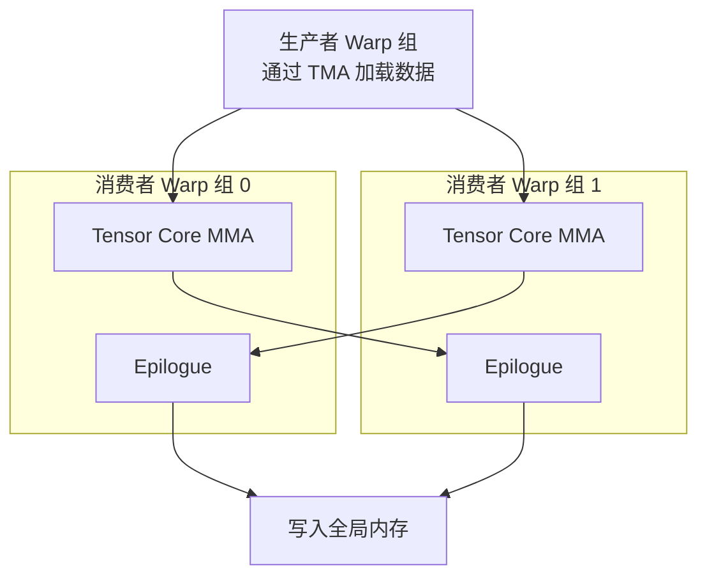

# Cutlass优化Hopper架构GPU性能策略

### 🧑‍💻 User

随着GPU引入越来越多DSA的特性，为了达到最佳的SOL性能，需要引入更复杂的pipeline来尽可能隐藏延迟和打满计算单元的吞吐。基于WASP的异步编程与pipeline通信是未来GPU获得最优性能的必要手段。目前针对hopper架构的gpu，cutlass都采取了哪些方式来实现以上的point？

---

### 🤖 Assistant

理解你希望深入了解 Cutlass 如何为 Hopper 架构构建高效计算管道（pipeline）。Hopper 架构的计算能力，特别是 Tensor Core 的吞吐量非常高，这使得**传统的延迟隐藏技术面临挑战**，必须采用更精细化的异步流水线和 warp 专门化（Warp Specialization）策略来打满计算单元。

Cutlass 针对 Hopper 架构的实现，可以概括为以下几个方面。

### 🔄 一、Warp 专门化与角色划分

Cutlass 3.x 为 Hopper 引入了 **Warp Group Specialized Persistent Kernels**。这种内核将线程块中的 warp 组划分为不同的专门角色，通常包含生产者（Producer）和消费者（Consumer），类似于你说的 WASP 模式。

-   **生产者 Warp 组**：专门负责数据移动。它们利用 Hopper 的**张量内存加速器（TMA）**，异步地将数据从全局内存（Global Memory）加载到共享内存（Shared Memory）。为了尽可能提高占用率（Occupancy），生产者 warp 会**刻意减少寄存器使用量**（例如减少40个），将更多资源让给消费者。
-   **消费者 Warp 组**：专门负责计算。它们从共享内存中读取数据，使用 **Tensor Core 执行矩阵乘加（MMA）运算**，并处理结果（Epilogue）。消费者 warp 因此需要更多的寄存器（例如增加232个）来保存中间计算结果和优化指令调度。

这种明确的角色分工允许数据移动和计算计算高度重叠。

### 📤 二、张量内存加速器的运用

**TMA 是 Hopper 架构中一个至关重要的硬件特性**。它可以被看作一个专门处理块数据搬运的DSA单元：

-   **高效大块数据传输**：TMA 允许生产者 warp 仅用**一条指令**就能描述和启动一个多维张量（可达5D）从全局内存到共享内存的异步拷贝。这避免了 Ampere 架构中 `cp.async` 指令需要多次发射的问题，极大减少了指令开销和发射压力。
-   **智能内存访问**：TMA 硬件不仅负责拷贝数据，还能自动处理**目标地址计算、数据布局转换（如避免Bank Conflict）、甚至将数据多播到同一线程簇（Cluster）内其他SM的共享内存中**。这使得程序员无需手动处理复杂的内存地址计算和优化。
-   **异步执行**：TMA 操作是硬件加速且异步的。生产者 warp 在提交了 TMA 拷贝指令后，就可以继续准备下一个数据搬运任务，而不需要等待本次数据传输完成。

### ⚙️ 三、异步流水线与同步机制

要实现精细化的管道控制，离不开高效的同步机制。Cutlass 利用了 Hopper 的 **`mbarrier`（内存屏障）** 来实现生产者和消费者之间的同步。

1.  **异步流水线类**：Cutlass 定义了 `Pipeline Async Class` 来管理这个复杂的、基于多屏障的同步过程。它维护了一个管道状态机，自动处理获取（acquire）、提交（commit）、等待（wait）和释放（release）等操作，简化了程序员的负担。
2.  **工作流程**：
    *   生产者 warp 使用 `producer_acquire` 获取一个空的共享内存缓冲区槽位和对应的 `mbarrier`。
    *   发起 TMA 异步拷贝，将数据传输到该缓冲区。
    *   TMA 完成数据传输后，会自动通知与该缓冲区关联的 `mbarrier`。
    *   消费者 warp 使用 `consumer_wait` 在 `mbarrier` 上等待，直到数据就绪。
    *   消费者处理完缓冲区中的数据后，使用 `consumer_release` 释放该缓冲区，通知生产者它可以被再次填充。

这个过程在多个缓冲区上循环往复，形成了一个高效的**生产者-消费者流水线**，最大限度地重叠了计算和访存。

### 🧩 四、线程块簇与分布式共享内存

Hopper 引入了 **线程块簇（Thread Block Cluster）** 的概念。允许一个线程块在执行时可以访问同簇内其他线程块的共享内存。Cutlass 利用了这一特性：

-   **扩大有效共享内存窗口**：通过集群共享内存（Distributed Shared Memory），一个线程块可以访问的数据量远远超过其私有的共享内存大小，这增加了数据的局部性和复用性。
-   **配合 TMA 多播**：TMA 可以将数据多播到簇内所有SM的共享内存中，实现了**一次加载，多个线程块共享**，减少了重复的数据传输，提升了整体效率。

### ⏩ 五、Ping-Pong 与 Cooperative 内核设计

Cutlass 提供了两种先进的内核设计来利用上述特性，其中 **Ping-Pong** 设计尤为突出。

-   **Ping-Pong 设计**：
    *   在这种模式下，**两个消费者 warp 组分别处理两个不同的输出块（Tile）**。
    *   当一个消费者组（Consumer0）正在使用 Tensor Core 计算矩阵乘（MMA）时，另一个消费者组（Consumer1）可以同时执行之前已计算完成的那个块的后续操作（Epilogue），比如写入全局内存或应用激活函数。
    *   接下来，它们的角色交换：Consumer1 为下一个计算执行 MMA，而 Consumer0 处理 Consumer1 刚完成计算的块的 Epilogue。
    *   这种“乒乓”交替的方式，使得 **MMA计算和Epilogue操作得以完全重叠**，确保了Tensor Core几乎时刻处于忙碌状态。

下面的流程图简化了Ping-Pong模式下的流水线执行过程：

-   **Cooperative 设计**：与 Ping-Pong 不同，Cooperative 模式下的两个消费者 warp 组会**共同协作处理同一个输出块**。这通常用于单个输出块的计算量非常大，需要更多线程并行处理的情况。

### 💎 六、针对特定计算模式的优化

Cutlass 的这些优化技术在复杂计算模式中能有效提升性能。
*   **分组 GEMM**：对于处理多个不同尺寸矩阵乘法的分组GEMM，当参数β≠0（需累加）且k维度较小时，性能易受内存访问瓶颈限制。Cutlass 计划引入**支持 TMA 的 Epilogue** 来优化这类场景的访存效率。
*   **FlashAttention**：第三代 FlashAttention 同样为 Hopper 进行了优化，其思路与 Cutlass 异曲同工：利用 TMA 和 warp 专门化，**异步并行地执行矩阵乘法与 softmax 操作**，以应对两者巨大的吞吐量差异，显著提升注意力机制的计算效率。

### 📊 总结与对比

Hopper 架构通过 TMA、线程块簇等特性，为异步编程模型提供了硬件基础。Cutlass 则通过软件库充分释放了这些硬件的潜力。

下面的表格对比了 Cutlass 在 Hopper 上的一些核心优化手段及其带来的好处：

| 优化手段                     | 核心技术                                                                 | 带来的优势                                               |
| :--------------------------- | :----------------------------------------------------------------------- | :------------------------------------------------------- |
| **Warp专门化 (Warp Specialization)** | 划分生产者/消费者角色                                                        | 计算与访存深度重叠，资源精细化分配                                     |
| **张量内存加速器 (TMA)**        | 一条指令描述大块数据拷贝，支持多维张量、布局转换、多播                         | 极大减少指令开销，简化编程，高效利用内存带宽                             |
| **异步流水线与`mbarrier`**    | 硬件加速的异步拷贝，配合内存屏障进行轻量级同步                               | 精细化的流水线控制，极低的同步开销                               |
| **线程块簇 (Cluster)**        | 线程块可访问簇内其他SM的共享内存                                              | 扩大数据共享范围，增加数据复用，减少重复传输                             |
| **Ping-Pong内核设计**        | 消费者组交替执行不同Tile的MMA和Epilogue                                      | 使计算（MMA）和后续操作（Epilogue）完全重叠，最大化Tensor Core利用率 |

### 🔮 趋势与展望

为了达到最佳的SOL（Speed-of-Light）性能，基于WASP的异步编程与pipeline通信确实是未来GPU获得最优性能的必要手段。从Ampere的`cp.async`到Hopper的TMA和专用流水线同步原语，再到Cutlass等库提供的高级抽象，我们可以看到一条清晰的**软硬件协同演进路径**：硬件提供更强大、更灵活的专用单元（DSA），而软件则发展出更复杂、更精细的编程模型来调度和协同这些单元。

希望以上信息能帮助你更深入地理解 Cutlass 在 Hopper 架构上的优化实践。如果你对特定细节或场景有进一步的问题，我很乐意继续探讨。