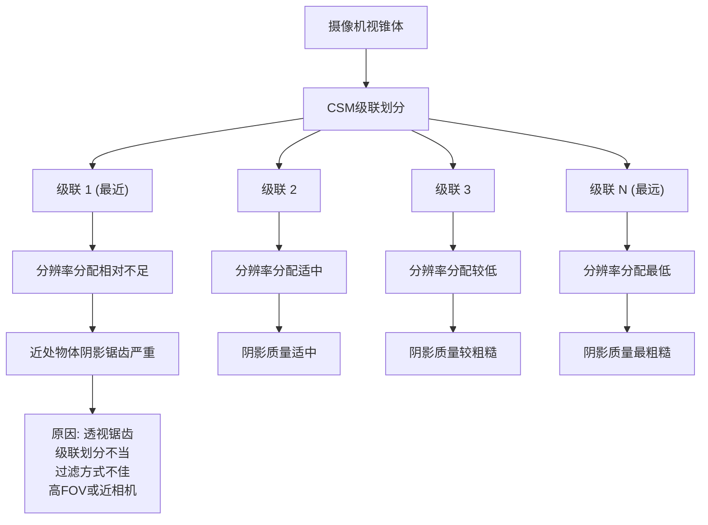

# 优化CSM近处阴影质量方法

### 🧑‍💻 User

如何使csm的近处的角色阴影质量更高呢，现在发现近处物体的阴影锯齿严重，这个是不是和摄像机的距离与相机fov有关系呢，还是可以调整其他的阴影参数？

---

### 🤖 Assistant

你提到的CSM（级联阴影贴图）近处角色阴影锯齿严重的问题，这在使用实时阴影时确实是一个常见的挑战。这通常与**阴影贴图的分辨率分配**、**摄像机参数**以及**阴影本身的设置**密切相关。下面我来帮你分析原因并提供一些解决方案。

### 🔍 锯齿问题的常见原因

CSM技术的核心是将摄像机的视锥体按照距离分割成多个层级（Cascade），每个层级使用独立的阴影贴图。离摄像机近的层级使用较高的分辨率，远的则使用较低的分分辨率，以优化资源的使用。近处阴影出现锯齿， primarily 是由于以下几个原因：

1.  **透视锯齿（Perspective Aliasing）**：这是最常见的原因。离摄像机越近的物体，在屏幕上的像素密度越高，意味着同一块阴影贴图需要覆盖更多的屏幕像素。当阴影贴图像素（texel）与屏幕像素（pixel）的比例过低时，每个阴影texel就会被拉伸覆盖多个屏幕像素，从而产生明显的块状锯齿。
2.  **级联划分不当**：如果第一个级联（最近处）覆盖的范围过大，那么分配到的阴影贴图分辨率可能不足以清晰地渲染近处物体的细节。
3.  **阴影过滤方式**：简单的硬阴影（Hard Shadows）或滤波方式不当会放大锯齿感。
4.  **摄像机参数**：更高的相机FOV（更宽的视野）意味着近处物体占据的屏幕空间更大，可能会加剧透视锯齿。同时，相机离物体越近，对近处阴影的精度要求也越高。

为了更直观地了解CSM的层级划分以及可能导致锯齿的原因，可以参考下面的图示：

上图简化展示了CSM的基本原理及近处锯齿的成因。要实现更高质量的近处阴影，核心思路是**优化阴影贴图分辨率的分配**，可以参考以下调整方向。

### 🛠 提升近处阴影质量的调整方向

针对上述原因，你可以尝试从以下几个方面进行调整：

1.  **增加近层级的分辨率或调整级联分布**：
    *   这是最直接有效的方法。许多引擎允许你**单独为每个级联设置分辨率**（如Unreal Engine的 `Cascade Resolution`），可以尝试提高第一级（最近处）级联的分辨率。
    *   调整**级联分割距离（Cascade Split Distances）**。缩小第一个级联的覆盖范围，让它更集中地处理摄像机非常近处的区域，从而在不显著增加总纹理尺寸的情况下提高近处的有效分辨率。分割方式通常有均匀（Uniform）、对数（Logarithmic）和混合（PSSM）等，根据场景选择。

2.  **优化阴影滤波（Filtering）**：
    *   **PCF（Percentage-Closer Filtering）**：这是最常见的软阴影技术，能通过多次采样平均来平滑阴影边缘，有效减少锯齿。**增加PCF的采样次数**可以提升平滑度，但会增加性能开销。
    *   **VSM（Variance Shadow Map） / ESM（Exponential Shadow Map）**：这些是基于更高级滤波技术的阴影映射方法，它们能天然地产生较软的阴影，并且在某些情况下对锯齿的抑制效果更好，但实现更复杂，可能有其他 artifact（如漏光）。

3.  **精细调整阴影参数**：
    *   **阴影偏移（Shadow Bias）**：不正确的Bias设置会导致“Peter-panning”（阴影分离）或“Acne”（自阴影瑕疵），但它们本身不解决锯齿问题。需在解决这些问题的同时优化锯齿。有时微调Bias可以改善边缘观感。
    *   **阴影贴图大小（Shadow Map Size）**：如果性能允许，**全面提高阴影贴图的总大小**（如从2048x2048提升到4096x4096）是最简单粗暴的方法，这会为所有级联提供更多像素，近处自然受益。

4.  **考虑使用虚拟阴影贴图（Virtual Shadow Maps, VSM）**（如果引擎支持）：
    *   像Unreal Engine 5的**Virtual Shadow Maps**技术旨在解决传统阴影贴图的分辨率和内存限制。它使用稀疏虚拟纹理按需流送阴影细节，可以**提供极高的分辨率**（例如16k及以上），从而极大地减少包括近处在内的所有区域的锯齿。如果你的项目使用的是UE5，这是首选的高质量解决方案。

5.  **摄像机FOV和位置**：
    *   虽然为了构图不能随意更改，但意识到**更窄的FOV或让相机离主体稍远一些**，可以立竿见影地降低近处对阴影精度的要求。这在拍摄特定镜头时可以作为临时手段。

### ⚙️ 引擎中的具体参数（以Unity URP为例）

不同的引擎和渲染管线，调整的参数名称和路径会有所不同。以Unity的通用渲染管线（URP）为例，你可以在URP Asset或Light组件上寻找这些设置：

*   **Cascade Count**：增加级联数量（如4个）可以让过渡更平滑，但需确保近处级联分辨率不下降。
*   **Cascade Splits**：通常有一个滑块可以调节第一个级联的结束距离，将其调小。
*   **Main Light > Shadow Resolution**：提高总体阴影贴图大小。
*   **Shadow Filtering**：在`Hard Shadows`, `PCF Low`, `PCF Medium`, `PCF High`之间选择，选择`PCF High`以获得更柔和的边缘。

### 💎 性能与质量的平衡

提高阴影质量通常意味着增加性能开销（GPU填充率、内存、带宽）。你需要根据目标平台和性能预算进行权衡：

*   **优先优化第一个级联**：因为它对视觉质量影响最大。
*   **谨慎增加总分辨率**：4096x4096相比2048x2048，像素量是4倍，开销显著增加。
*   **选择高效的滤波方式**：`PCF Medium` 可能在质量和性能上取得较好的平衡。

> 总之，解决近处阴影锯齿的关键在于**确保近处阴影贴图有足够的有效分辨率**。你可以从**调整级联分布、增加近处分辨率、使用更好的滤波技术**入手。如果条件允许，采用像**Virtual Shadow Maps**这样的新一代技术是终极解决方案。

希望这些信息能帮助你解决问题。如果你的项目使用的是特定的引擎（如Unity URP/HDRP或Unreal Engine），并且有更具体的参数找不到，可以提供更多细节，或许我能给出更精准的建议。

---

### 🧑‍💻 User

为什么per object shadow或vsm可以解决上述问题？

---

### 🤖 Assistant

说得好！这是一个非常核心的图形学问题。Per-Object Shadow（针对物体的阴影，或称细节阴影）和 VSM（Variance Shadow Maps）从两个完全不同的技术路径来解决传统阴影贴图（特别是CSM）的固有缺陷。

下面我们来深入剖析它们的工作原理和为何能有效改善近处阴影质量。

### 1. Per-Object Shadow (细节阴影)

#### 核心思想：打破“一视同仁”的分辨率分配
传统的CSM是为整个场景的**所有物体**统一生成一张巨大的阴影贴图。这就导致了一个根本性问题：**有限的阴影贴图像素（Texel）必须在整个摄像机视锥体范围内进行分配**。

离摄像机近的物体在屏幕上占据很多像素，但分到的阴影texel可能很少，导致每个阴影texel被拉伸覆盖多个屏幕像素，形成锯齿。而离得远的物体虽然只分到很少的阴影texel，但在屏幕上也只占据很少像素，所以看起来反而没问题。

**Per-Object Shadow 的解决方案是：**
它为那些**重要的、近处的物体（如主角、身边的道具）单独再渲染一张专属的、高分辨率的阴影贴图**。这张贴图只为了这一个或一小簇物体服务。

#### 为什么它能解决锯齿问题？
1.  **极致的分辨率聚焦**：由于这张阴影贴图的全部分辨率都用于渲染一个近处物体，其**有效texel密度（每个屏幕像素能分到的阴影texel数）急剧升高**。这直接从根源上解决了透视锯齿问题。原本在CSM中可能只有512x512的一部分用于你的角色，现在你可以直接用一个1024x1024或更高的贴图只为你的角色服务。
2.  **与CSM互补**：通常引擎会混合使用CSM和Per-Object Shadow。
    *   CSM负责渲染场景的**远景、大范围**的阴影，提供背景和环境遮挡。
    *   Per-Object Shadow负责渲染**近处关键物体**的高质量阴影，覆盖在CSM阴影之上。
3.  **减少对CSM级联的依赖**：因为近处物体的阴影由独立的超高分辨率贴图负责，你甚至可以**缩小CSM第一级级联的范围**，让CSM更专注于中远距离，从而间接提升了整个CSM系统的效率和质量。

**代价：**
性能开销与物体数量成正比。每个启用Per-Object Shadow的物体都需要一次额外的阴影贴图渲染（一次Draw Call和一次光照计算），如果滥用，Draw Call会暴涨。因此它通常只用于主角、NPC、重要交互物体等少数关键对象。

---

### 2. Variance Shadow Maps (VSM) - 方差阴影贴图

#### 核心思想：改变阴影过滤的方式，让边缘平滑变得“廉价且高效”
传统阴影贴图使用**PCF（Percentage-Closer Filtering）** 进行软阴影过滤。PCF的工作原理是：在 shading point，对阴影贴图进行**多次采样**，比较深度，然后计算有多少比例的采样点处于阴影中。

*   **问题**：为了获得柔和的边缘，需要**很高的采样次数**（例如5x5=25次采样），性能开销大。
*   **另一个问题**：PCF滤波**无法避免锯齿**。它只是在锯齿状的边缘进行了一个模糊处理，当分辨率不足时，模糊后的边缘依然能看到质量不佳。

**VSM 的解决方案是：**
它完全改变了信息的存储和过滤方式。

1.  **存储的内容不同**：
    *   传统阴影贴图只存储一个值：**深度（Depth）**。
    *   VSM存储**两个值**：**深度（Depth）** 和**深度的平方（Depth²）**。通常用一张RG32F纹理的R通道存深度，G通道存深度平方。

2.  **工作原理基于数学（切比雪夫不等式）**：
    有了一个区域内的深度平均值(`E(depth)`)和深度平方的平均值(`E(depth²)`)，我们就可以计算出这个区域的**方差（Variance）**：
    `方差 σ² = E(depth²) - E(depth)²`
    方差代表了深度的分布情况，方差越大，说明深度值变化越大，越不确定。

    在着色时，VSM使用**切比雪夫不等式**来估计当前片元被遮挡的**概率**（而不是像PCF那样做二元的“是/否”比较）。这个概率值本身就是一个0到1之间的平滑过渡值。

#### 为什么它能解决锯齿和边缘质量问题？

1.  **先过滤，后比较**：
    *   这是VSM最革命性的优势。因为VSM存储的是深度和深度的平方，这些是**连续的数据**，可以被**预先进行模糊/过滤**（比如用高斯模糊），而不会破坏信息。你可以提前对VSM贴图做一次 blur，开销是固定的，非常小。
    *   相比之下，PCF是“先比较，后过滤”，它过滤的是二元的（0或1）比较结果，过滤效果差且采样次数多。
    *   **这个“先过滤”的特性，极大地消除了阴影贴图本身的texel锯齿**。模糊后的VSM贴图提供了非常平滑的深度分布信息。

2.  **天然产生平滑的软阴影**：
    切比雪夫估计给出的本身就是概率值，因此阴影边缘天然就是平滑过渡的，不需要高昂的采样成本。一次纹理采样（实际上需要采样一次VSM贴图获取深度和深度平方两个值）就能计算出平滑的阴影值。

3.  **对分辨率提升的“放大”效应**：
    即使VSM贴图的分辨率与传统阴影贴图相同，其经过预过滤后提供的视觉质量也远高于传统PCF硬过滤的阴影。换句话说，**同一分辨率的VSM贴图，其视觉观感更好，锯齿更少**。

**代价：**
*   **漏光（Light Bleeding）**：这是VSM最著名的缺陷。当阴影接收面与阴影投射面靠得非常近，且深度差距很大时（比如地板和紧贴地面的箱子），切比雪夫估计会不准确，导致本应是全黑阴影的地方出现漏光现象。通常需要通过一些Bias技巧或设置概率上界来减轻。
*   **内存翻倍**：需要存储两个值，纹理内存占用更大。
*   **带宽翻倍**：着色时需要读取的数据量翻倍。

### 总结对比

| 特性 | 传统CSM+PCF | Per-Object Shadow | VSM |
| :--- | :--- | :--- | :--- |
| **解决思路** | 宏观优化（分级分配分辨率） | **微观优化**（为特定物体单独分配分辨率） | **数学优化**（改变信息存储和过滤方式） |
| **抗锯齿原理** | 依赖更高的texel密度和多次采样滤波 | **极致提升单物体texel密度** | **预过滤 + 概率估计**，天生平滑 |
| **效果** | 近处分辨率不足时锯齿严重 | **近处物体阴影极其清晰** | **阴影边缘天生柔和**，视觉锯齿少 |
| **性能开销** | 适中 | **与物体数量成正比**（Draw Call问题） | **固定开销**（模糊处理），单次采样 |
| **主要缺点** | 近处锯齿 | 不能滥用，只能用于少数物体 | **漏光（Light Bleeding）** |

在实际的现代游戏引擎（如UE5，Unity HDRP）中，这些技术常常是**结合使用**的：
*   使用**CSM**作为基础的全局阴影解决方案。
*   使用**Per-Object Shadow**为关键角色和物体提供超高质量的接触阴影。
*   使用**VSM/ESM**等更先进的滤波技术来提升CSM本身边缘的质量和过滤效率。

而UE5的**Virtual Shadow Maps（虚拟阴影贴图）** 则可以看作是Per-Object Shadow思想的终极进化版，它通过虚拟纹理技术动态地为所有需要的地方（而不仅仅是预设的物体）分配极高的分辨率，从而一劳永逸地解决了阴影分辨率和锯齿的问题。