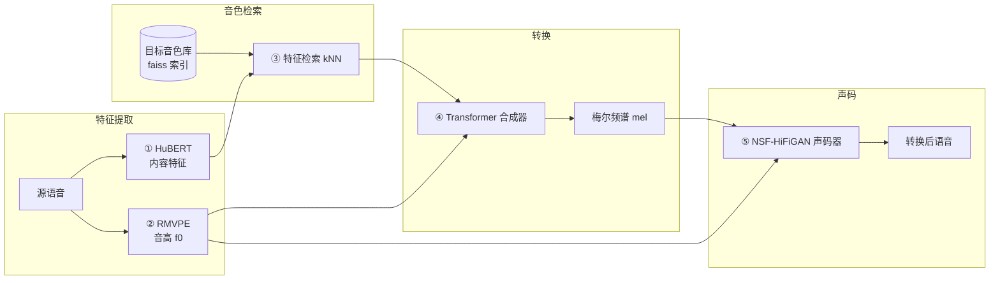

# RVC抽卡不存在

### 🧑‍💻 User

rvc是transformer+wavenet+hifigan，每个部分都有什么用途？画出示意图

---

### 🤖 Assistant

# RVC 各模块用途 + 示意图

先澄清一点：你说的"Transformer + WaveNet + HiFiGAN"**大方向对，但有一处需要修正**——RVC 里其实没有独立的 WaveNet 模块。标准的 RVC 管线是：

> **HuBERT（特征提取）+ RMVPE（音高）+ 特征检索（faiss/kNN）+ Transformer（合成器）+ NSF-HiFiGAN（声码器）**

其中"Transformer"出现两次（HuBERT 本身就是 Transformer 结构，合成器也是 Transformer）；你记忆里的 "WaveNet" 大概率对应的是 **NSF（神经源滤波器）**——它和 WaveNet 同属"用神经网络做波形/滤波建模"的思路，但 RVC 用的是 **NSF + HiFiGAN 结合的 NSF-HiFiGAN 声码器**，不是原版 WaveNet。

---

## 一、各模块用途

| 模块 | 是什么 | 输入 → 输出 | 核心用途 |
|---|---|---|---|
| **① HuBERT** | Transformer 结构的自监督预训练模型 | 音频 → 内容特征（768/256 维） | 提取"**说了什么**"（音素/语义内容），特征基本与说话人无关 |
| **② RMVPE** | 音高（基频）提取器 | 音频 → 基频 f0 | 提取"**怎么说的**"（语调、音高曲线），支持整体升降调 |
| **③ 特征检索** | faiss 索引 + kNN（不是神经网络） | 内容特征 + 目标音色库 → 目标音色特征 | 把**目标说话人的音色信息**注入进来，这是 RVC 的 "R"（Retrieval-based），让少样本换音色成为可能 |
| **④ Transformer 合成器** | RVC 的核心可训练网络 | 内容特征 + 检索特征 + f0 + 说话人嵌入 → 梅尔频谱 | 完成**核心转换**：保留内容、替换音色 |
| **⑤ NSF-HiFiGAN** | GAN 声码器（源-滤波器结构） | 梅尔频谱 + f0 → 波形 | 把频谱**还原成高保真音频**，NSF 部分用 f0 生成正弦激励源 |

---

## 二、示意图

### Mermaid 图（在支持 Mermaid 的界面会渲染成图片）



### ASCII 图（任何地方都能看）

```text
源语音 Source Audio
        │
        ├─ ① HuBERT ─────────► 内容特征（"说了什么"）
        │
        └─ ② RMVPE ──────────► 音高 f0（语调 / 音高）
                                   │
                                   ▼
③ 特征检索 faiss/kNN  ◄──────── 目标说话人音色库
        │                        （检索出"带目标音色"的特征）
        ▼
④ Transformer 合成器  ◄──────── f0
        │
        ▼  梅尔频谱 mel
⑤ NSF-HiFiGAN 声码器 ◄──────── f0（生成正弦源激励）
        │
        ▼
转换后的目标语音
```

---

## 三、数据是怎么流动的（一句话串起来）

1. 源语音进来后，**HuBERT** 抽"内容"、**RMVPE** 抽"音高"，把"说的内容"和"怎么唱/说"分开。
2. 内容特征去**目标音色库做 kNN 检索**，把目标说话人的音色信息"贴"上去。
3. **Transformer 合成器**把这三样（内容 + 检索到的目标音色特征 + f0）融合，映射成**梅尔频谱**——这一步完成了"内容不变、音色变目标"的核心魔法。
4. **NSF-HiFiGAN 声码器**拿梅尔频谱和 f0，把频谱变回**能听的波形**。

> 补充：检索步骤在推理时是可选的（不加索引也能跑，只是纯靠 Transformer 换音色，效果和稳定性会弱一些）；而 `index rate` 参数就是控制"检索特征"和"源特征"按多大比例混合。

---

### 🧑‍💻 User

为什么flowmatching based generationmodel通常有有随机性但是没听说rvc抽卡的？

---

### 🤖 Assistant

# 核心一句话

**Flow Matching 的随机性来自"从高斯噪声里采样一个起点"，而 RVC 从头到尾是一个确定性函数——没有采样步骤，所以抽不了卡。**

下面拆开讲为什么。

---

## 一、随机性到底从哪来？

Flow Matching（及扩散模型）的推理可以拆成两步：

1. **采样初始噪声**：$x_1 \sim \mathcal{N}(0, I)$  ← **随机性全部在这**
2. **解 ODE**：从 $t=1$ 到 $t=0$ 求解 $\frac{dx}{dt} = v_\theta(x_t, t)$  ← 这一步给定初值后是**完全确定的**

所以严格说，flow matching 的"抽卡"就等价于"**换一个随机种子**"。你固定种子，它就也变成确定的了。

而 RVC 的推理链是：

$$y = \text{HiFiGAN}\Big(\text{Transformer}\big(\underbrace{\text{HuBERT}(x)}_{\text{内容}},\ \underbrace{\text{retrieve}(x)}_{\text{目标音色}},\ \underbrace{f_0(x)}_{\text{音高}}\big)\Big)$$

HuBERT、RMVPE、kNN 检索、Transformer、HiFiGAN **全部是前馈确定性算子**，输入 $x$ 相同 → 输出 $y$ 相同。整个链路上没有一个"从分布里采样"的环节，自然没有随机性。

---

## 二、根本原因：任务本质不同（信息缺口）

这才是最关键的一点——**不是 RVC "故意不做随机"，而是它的任务压根不需要。**

| | Flow Matching 生成模型（如 F5-TTS / CosyVoice） | RVC 语音转换 |
|---|---|---|
| 输入信息量 | **低**（只有文本） | **高**（完整音频，内容/语调/节奏/情绪都在里面） |
| 要补的信息 | **大**——音高、时长、停顿、语气、音色全要"发明" | **小**——只需把音色"重涂"一遍 |
| 映射关系 | **一对多**（同一句话有无数种合法读法） | **一对一**（源音频已经把"该怎么唱/说"规定死了） |
| 需要的模型 | 学整个分布 $p(\text{语音}|\text{文本})$ | 学一个函数 $f(\text{源音频}) \to \text{目标音色音频}$ |

**一句话概括：**

- TTS 是从"低信息文本"**生成**"高信息语音"，中间有巨大的信息空白，必须靠采样分布去"脑补"，所以每次不同 → 抽卡。
- RVC 是从"高信息源音频"做一次**保真转换**，唯一要改的是音色，几乎没有空白需要脑补，所以确定性映射就够用，而且**更合适**——你希望忠实保留源音频的唱法/情绪，而不是让模型自由发挥。

---

## 三、对应到模型设计上

```text
Flow Matching（生成式）：
   z ~ N(0, I)  ──► ODE 求解器 ──► 语音
        ▲
   随机性注入点（这就是"抽卡"）

RVC（确定式转换）：
   源音频 ──► 特征 ──► 检索 ──► Transformer ──► HiFiGAN ──► 语音
   （全程无采样、无隐变量，给什么进什么出）
```

- 生成模型的"先验"是**高斯噪声**，它承载了所有多样性。
- RVC 的"先验"就是**源音频本身**，多样性由你喂不同的源音频提供，而不是靠模型随机。

---

## 四、两个补充（容易混淆的点）

1. **想给 RVC"抽卡"怎么办？**
   实际上你有三个"人工随机"的旋钮：
   - 换**不同的源音频**（最本质，因为 RVC 的多样性来自输入）；
   - 调 **f0 升降调**（整体变调）；
   - 调 **index rate**（检索特征与源特征混合比例，会改变音色倾向）。
   但这些都不是模型内部随机，而是"改输入/改参数"。

2. **存在带随机性的语音转换吗？存在。**
   比如 **DiffSVC、扩散/flow-based VC**，它们确实会抽卡——因为它们在"目标语音"上也学了分布并采样。RVC 选择确定式回归，是用"多样性"换来了"**稳定、可控、忠实还原源表现、训练快**"。这是**设计取舍，不是技术做不到**。

> 顺带一提：RVC 的"检索"虽然也像是"从库里挑东西"，但 kNN 检索是确定性的（给定源特征和索引，最近邻是唯一的），所以它也不带来随机性。