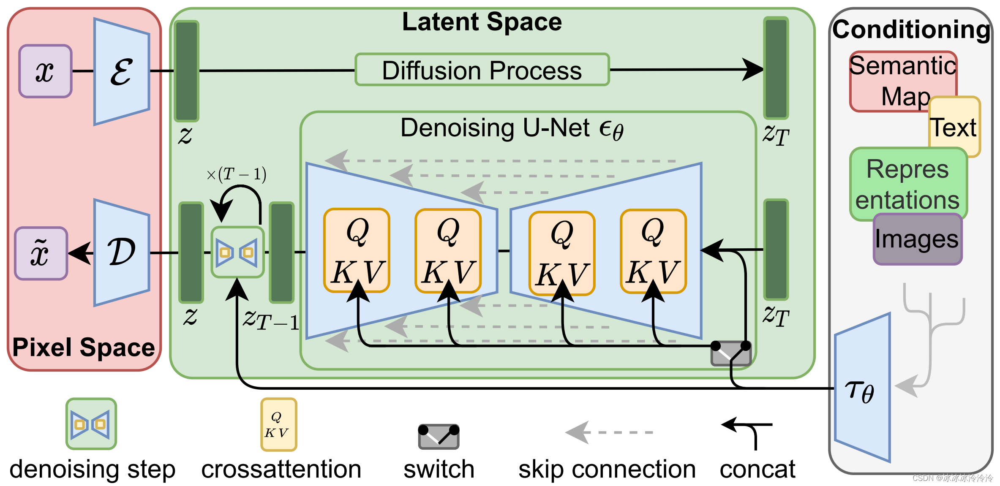
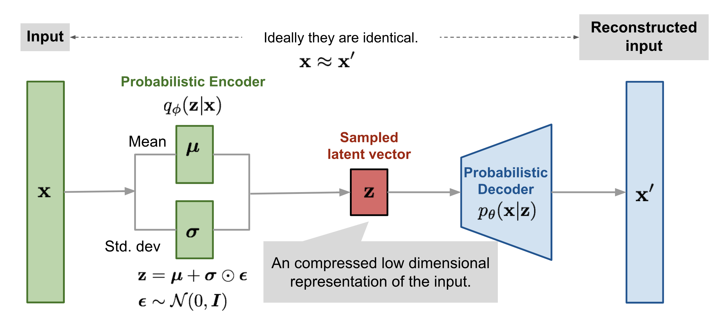
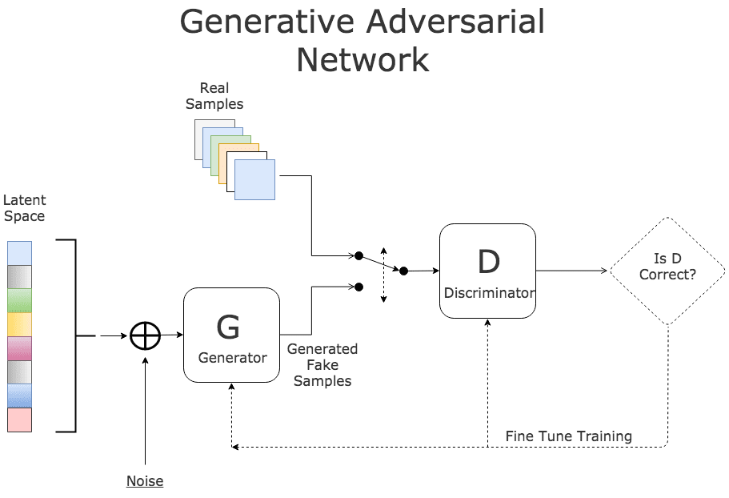

# 在一张4060ti上从0训练SD VAE

## 1. 背景

事情的起因是笔者最近在学习关于generative model中变分自编码器（VAE）和生成对抗网络 (GAN) 相关的内容，再加上正好学校也放寒假了，本着学习PyTorch/PyTorch Lightning和VAE训练流程（瞎折腾）的想法，打算自己手搓完整的training pipeline从零训练一个Autoencoderkl with Discriminator，相关的代码已开源在[GitHub](https://github.com/Gaolingx/Glx.MLExamples/tree/main/project/03/sd_vae_lightning)上。

## 2. 开始之前...

在Stable Diffusion 1.5的论文[《High-Resolution Image Synthesis with Latent Diffusion Models》](https://arxiv.org/abs/2112.10752)中，由于直接在pixel space上扩散效率较低，因此原始图像被编码到一个更低维度的潜空间表示。扩散过程（加噪和去噪）都发生在这个压缩后的潜空间，而非原始像素空间，因此，在 Latent Diffusion Model (LDM) 的架构中，VAE是整个信息传递过程的bottleneck，它的性能会对 U-Net 去噪网络的最终生成/重建质量产生决定性的影响。



关于VAE和GAN模型结构和训练目标就不过多赘述，简单来说，变分自编码器（VAE）基于概率图模型和变分推断的原理，encoder（识别模型）将输入数据压缩进潜空间（latent space），decoder（解码器）负责采样latent space并映射回数据空间，VAE 的训练目标是通过最大化数据对数似然$log(x)$的证据下界（ELBO）来确定的。



生成对抗网络 (GAN)采用一种基于博弈论的不同方法。它们包含两个通过竞争方式训练的神经网络 (neural network)：生成器（generator）、判别器（discriminator），判别器被训练以最大化其正确分类真实和虚假样本的能力，生成器被训练以最小化判别器检测其虚假样本的能力，目标是使生成器产生的样本分布与真实数据分布完全一致。



硬件部分，考虑到我们只有一张8G VRAM的4060ti，为了不因为爆显存导致训练速度大打折扣，我们需要严格控制训练过程的显存占用，因此我们选择了bf16-mixed+batch size=1配合gradient accumulate=8在极低的显存下预训练。

## 3. 模型选型

### 3.1 VAE

关于VAE部分，我们选择了[huggingface/diffusers](https://github.com/huggingface/diffusers/blob/main/src/diffusers/models/autoencoders/autoencoder_kl.py)的AutoencoderKL，该架构也是stable diffusion 1.5所使用的VAE。

#### 架构参数 (Architecture)

*   **下采样因子 (Downsampling Factor, $f$)**:
    *   这是最重要的参数。它定义了 Latent Map 的分辨率相对于原图的比例。
    *   **常见值：** $f=4, f=8, f=16$。
    *   **权衡：**
        *   $f$ 较小（如 4）：保留更多空间细节，重建质量极高，但 Latent 尺寸大，导致后续 U-Net 计算量激增（显存爆炸）。
        *   $f$ 较大（如 16/32）：Latent 极小，U-Net 跑得飞快，但解码时极易丢失小物体、人脸和文字细节。
    *   **SD 标准：** Stable Diffusion 使用 **$f=8$** (即 $512 \times 512 \to 64 \times 64$)。

*   **潜空间通道数 (Latent Channels, $z_{dim}$)**:
    *   Latent 特征图的深度。
    *   **常见值：** 3, 4, 8。
    *   **SD 标准：** 4 通道。这意味着 Latent Tensor 形状为 $[B, 4, H/8, W/8]$。通道越多，信息容量越大，但 U-Net 输入维度增加。

*   **Attention 层的应用**:
    *   通常在 Encoder 和 Decoder 的最低分辨率层（Bottleneck）加入 Self-Attention 模块。
    *   **作用：** 捕捉全局上下文，有助于减少大面积色块的重建错误，但会增加显存消耗。

最终我们确定使用f8c4参数，与标准的sd vae参数一致，压缩率为48x。

> 所谓的“压缩率”是如何计算的？
>
> 当我们说 `f8c4` 时，我们可以算一下数据维度的变化：
>
> *   **原始数据量 (Pixel Space):** $H \times W \times 3$
> *   **潜在数据量 (Latent Space):** $\frac{H}{8} \times \frac{W}{8} \times 4$
>
> **压缩比计算：**
$$
\text{空间压缩} = 8 \times 8 = 64 \text{倍（面积减少）}
$$
$$
\text{整体维度减少} = \frac{H \times W \times 3}{\frac{H}{8} \times \frac{W}{8} \times 4} = \frac{3}{\frac{4}{64}} = \frac{3 \times 64}{4} = 48 \text{倍}
$$
>
> 虽然通道数从 3 增加到了 4（略微增加了数据量），但因为空间分辨率除以了 8（面积除以了 64），所以整体的数据维度减少了 **48倍**。
> 
> 总结：
> *   **f8:** 空间分辨率除以 8（主要负责大幅减少计算量）。
> *   **c4:** 特征通道数为 4。


模型基本信息如下：

```python
class AutoencoderKL(
    ModelMixin, AttentionMixin, AutoencoderMixin, ConfigMixin, FromOriginalModelMixin, PeftAdapterMixin
):
    r"""
    A VAE model with KL loss for encoding images into latents and decoding latent representations into images.

    This model inherits from [`ModelMixin`]. Check the superclass documentation for it's generic methods implemented
    for all models (such as downloading or saving).

    Parameters:
        in_channels (int, *optional*, defaults to 3): Number of channels in the input image.
        out_channels (int,  *optional*, defaults to 3): Number of channels in the output.
        down_block_types (`Tuple[str]`, *optional*, defaults to `("DownEncoderBlock2D",)`):
            Tuple of downsample block types.
        up_block_types (`Tuple[str]`, *optional*, defaults to `("UpDecoderBlock2D",)`):
            Tuple of upsample block types.
        block_out_channels (`Tuple[int]`, *optional*, defaults to `(64,)`):
            Tuple of block output channels.
        act_fn (`str`, *optional*, defaults to `"silu"`): The activation function to use.
        latent_channels (`int`, *optional*, defaults to 4): Number of channels in the latent space.
        sample_size (`int`, *optional*, defaults to `32`): Sample input size.
        scaling_factor (`float`, *optional*, defaults to 0.18215):
            The component-wise standard deviation of the trained latent space computed using the first batch of the
            training set. This is used to scale the latent space to have unit variance when training the diffusion
            model. The latents are scaled with the formula `z = z * scaling_factor` before being passed to the
            diffusion model. When decoding, the latents are scaled back to the original scale with the formula: `z = 1
            / scaling_factor * z`. For more details, refer to sections 4.3.2 and D.1 of the [High-Resolution Image
            Synthesis with Latent Diffusion Models](https://huggingface.co/papers/2112.10752) paper.
        force_upcast (`bool`, *optional*, default to `True`):
            If enabled it will force the VAE to run in float32 for high image resolution pipelines, such as SD-XL. VAE
            can be fine-tuned / trained to a lower range without losing too much precision in which case `force_upcast`
            can be set to `False` - see: https://huggingface.co/madebyollin/sdxl-vae-fp16-fix
        mid_block_add_attention (`bool`, *optional*, default to `True`):
            If enabled, the mid_block of the Encoder and Decoder will have attention blocks. If set to false, the
            mid_block will only have resnet blocks
    """

    def __init__(
        self,
        in_channels: int = 3,
        out_channels: int = 3,
        down_block_types: Tuple[str, ...] = ("DownEncoderBlock2D",),
        up_block_types: Tuple[str, ...] = ("UpDecoderBlock2D",),
        block_out_channels: Tuple[int, ...] = (64,),
        layers_per_block: int = 1,
        act_fn: str = "silu",
        latent_channels: int = 4,
        norm_num_groups: int = 32,
        sample_size: int = 32,
        scaling_factor: float = 0.18215,
        shift_factor: Optional[float] = None,
        latents_mean: Optional[Tuple[float]] = None,
        latents_std: Optional[Tuple[float]] = None,
        force_upcast: bool = True,
        use_quant_conv: bool = True,
        use_post_quant_conv: bool = True,
        mid_block_add_attention: bool = True,
    ):
        super().__init__()
        # ...
        # see [huggingface/diffusers](https://github.com/huggingface/diffusers/blob/main/src/diffusers/models/autoencoders/autoencoder_kl.py)
```

预训练模型：[stabilityai/sd-vae-ft-mse](https://huggingface.co/stabilityai/sd-vae-ft-mse)
model config：[config.json](https://huggingface.co/stabilityai/sd-vae-ft-mse/raw/main/config.json)

### 3.2 GAN

在 VAE 训练中，Discriminator 通常采用 PatchGAN 结构（类似于 VQGAN 或 Stable Diffusion 的设置），它的任务不是判断整张图是真是假（这需要庞大的参数量来理解语义），而是判断一个个小的 Patch（如 16x16 或 32x32 的区域）纹理是否自然。因此我们最初设计的GAN结构如下：

```python
class NLayerDiscriminator(nn.Module):
    """
    PatchGAN discriminator for adversarial training.

    Args:
        input_nc: Number of input channels.
        ndf: Base number of discriminator filters.
        n_layers: Number of layers in discriminator.
    """

    def __init__(
        self,
        input_nc: int = 3,
        ndf: int = 64,
        n_layers: int = 3,
    ):
        super().__init__()

        layers = [
            nn.Conv2d(input_nc, ndf, kernel_size=4, stride=2, padding=1),
            nn.LeakyReLU(0.2, True),
        ]

        nf_mult = 1
        for n in range(1, n_layers):
            nf_mult_prev = nf_mult
            nf_mult = min(2**n, 8)
            layers += [
                nn.Conv2d(
                    ndf * nf_mult_prev,
                    ndf * nf_mult,
                    kernel_size=4,
                    stride=2,
                    padding=1,
                    bias=False,
                ),
                nn.BatchNorm2d(ndf * nf_mult),
                nn.LeakyReLU(0.2, True),
            ]

        nf_mult_prev = nf_mult
        nf_mult = min(2**n_layers, 8)

        layers += [
            nn.Conv2d(
                ndf * nf_mult_prev,
                ndf * nf_mult,
                kernel_size=4,
                stride=1,
                padding=1,
                bias=False,
            ),
            nn.BatchNorm2d(ndf * nf_mult),
            nn.LeakyReLU(0.2, True),
            nn.Conv2d(ndf * nf_mult, 1, kernel_size=4, stride=1, padding=1),
        ]

        self.model = nn.Sequential(*layers)

        # Initialize weights
        self.apply(self._init_weights)

    def _init_weights(self, m):
        """Initialize weights with normal distribution."""
        classname = m.__class__.__name__
        if classname.find("Conv") != -1:
            nn.init.normal_(m.weight.data, 0.0, 0.02)
        elif classname.find("BatchNorm") != -1:
            nn.init.normal_(m.weight.data, 1.0, 0.02)
            nn.init.constant_(m.bias.data, 0)

    def forward(self, x: torch.Tensor) -> torch.Tensor:
        """Forward pass through discriminator."""
        return self.model(x)

```

问题来了，该nn使用了多个 `nn.BatchNorm2d` 层，前面我们提到过由于显存限制只能使用有限的batchsize，而 Batch Normalization 在训练过程中依赖于当前 mini-batch 的均值（mean）和方差（variance）来对特征进行归一化，当 BS 很小时，mini-batch 的统计量（样本均值和方差）不能很好地代表整个数据集的总体分布。这引入了巨大的噪声。最终统计估计不准确导致训练不稳定。因此，我们需要不依赖 Batch Size 的 Normalization。

> BatchNorm 的计算方式：
>
> $$\hat{x} = \frac{x - \mu_{\mathcal{B}}}{\sqrt{\sigma_{\mathcal{B}}^2 + \epsilon}}$$
>
> 其中 $\mu_{\mathcal{B}}$ 和 $\sigma_{\mathcal{B}}^2$ 是**当前 mini-batch** 的均值和方差：
>
> $$\mu_{\mathcal{B}} = \frac{1}{N} \sum_{i=1}^{N} x_i, \quad \sigma_{\mathcal{B}}^2 = \frac{1}{N} \sum_{i=1}^{N}(x_i - \mu_{\mathcal{B}})^2$$

与 Batch Normalization 不同，GroupNorm 的计算完全独立于 Batch 维度。它是在单个样本的通道（Channel）维度上进行分组归一化。这里我们选择用 GroupNorm 替换 BatchNorm2d，并在卷积层上使用 Spectral Normalization 限制判别器的 Lipschitz 常数作为正则化手段，最终改进后的结构如下：

```python
class NLayerDiscriminator(nn.Module):
    """
    PatchGAN discriminator for adversarial training.

    Args:
        input_nc: Number of input channels.
        ndf: Base number of discriminator filters.
        n_layers: Number of layers in discriminator.
        norm_type: Normalization type. 'spectral', 'spectral_group', 'batch', or 'none'.
        num_groups: Number of groups for GroupNorm (default: 32).
    """

    def __init__(
            self,
            input_nc: int = 3,
            ndf: int = 64,
            n_layers: int = 3,
            norm_type: str = "spectral_group",
            num_groups: int = 32,
    ):
        super().__init__()
        self.norm_type = norm_type
        self.num_groups = num_groups

        use_spectral = norm_type in ("spectral", "spectral_group")
        use_group = norm_type == "spectral_group"
        use_batch = norm_type == "batch"

        def maybe_spectral(layer):
            return nn.utils.spectral_norm(layer) if use_spectral else layer

        def get_norm_layer(num_features):
            if use_group:
                # Ensure num_groups doesn't exceed num_features
                groups = min(num_groups, num_features)
                return nn.GroupNorm(groups, num_features)
            elif use_batch:
                return nn.BatchNorm2d(num_features)
            else:
                # 'spectral' alone or 'none' — no extra normalization
                return nn.Identity()

        # --- First layer: no normalization, just conv + activation ---
        layers = [
            maybe_spectral(
                nn.Conv2d(input_nc, ndf, kernel_size=4, stride=2, padding=1)
            ),
            nn.LeakyReLU(0.2, True),
        ]

        # --- Intermediate layers ---
        nf_mult = 1
        for n in range(1, n_layers):
            nf_mult_prev = nf_mult
            nf_mult = min(2 ** n, 8)
            layers += [
                maybe_spectral(
                    nn.Conv2d(
                        ndf * nf_mult_prev,
                        ndf * nf_mult,
                        kernel_size=4,
                        stride=2,
                        padding=1,
                        bias=False,
                    )
                ),
                get_norm_layer(ndf * nf_mult),
                nn.LeakyReLU(0.2, True),
            ]

        # --- Penultimate layer (stride=1) ---
        nf_mult_prev = nf_mult
        nf_mult = min(2 ** n_layers, 8)
        layers += [
            maybe_spectral(
                nn.Conv2d(
                    ndf * nf_mult_prev,
                    ndf * nf_mult,
                    kernel_size=4,
                    stride=1,
                    padding=1,
                    bias=False,
                )
            ),
            get_norm_layer(ndf * nf_mult),
            nn.LeakyReLU(0.2, True),
        ]

        # --- Final layer: 1-channel output (patch map) ---
        layers += [
            maybe_spectral(
                nn.Conv2d(ndf * nf_mult, 1, kernel_size=4, stride=1, padding=1)
            ),
        ]

        self.model = nn.Sequential(*layers)

        # Initialize weights (skip spectral-normed layers — they self-regulate)
        if not use_spectral:
            self.apply(self._init_weights)

    @staticmethod
    def _init_weights(m):
        classname = m.__class__.__name__
        if classname.find("Conv") != -1:
            nn.init.normal_(m.weight.data, 0.0, 0.02)
        elif classname.find("BatchNorm") != -1:
            nn.init.normal_(m.weight.data, 1.0, 0.02)
            nn.init.constant_(m.bias.data, 0)
        elif classname.find("GroupNorm") != -1:
            nn.init.normal_(m.weight.data, 1.0, 0.02)
            nn.init.constant_(m.bias.data, 0)

    def forward(self, x: torch.Tensor) -> torch.Tensor:
        return self.model(x)
```

## 4. 数据集

### 核心要点

1. **尺寸能被下采样因子整除**（最常见的报错原因）
2. **归一化到 $[-1, 1]$**
3. **RGB 3通道**
4. **高质量、多样性、足够数量**
5. **不需要标签**

### 4.1 基本要求

AutoencoderKL 是自监督/无监督的重建任务，不需要任何标注，hf常见的image dataset即可（通常需要在data pipeline进行尺寸、通道预处理以防万一）导入时可做适当的数据增强处理。

| 要求项 | 说明 |
|--------|------|
| **图像尺寸** | 通常要求统一尺寸，常见为 $256 \times 256$ 或 $512 \times 512$（需要能被下采样倍数整除） |
| **通道数** | 标准 RGB 3通道（如需透明通道需要改模型结构） |
| **像素值范围** | 归一化到 $[-1, 1]$ 或 $[0, 1]$，取决于实现 |
| **格式** | 常见 PNG / JPG / WebP 等 |

### 4.2 数据集规模

| 维度 | 建议 |
|------|------|
| **数量** | 至少 **数万张**，推荐 **10万+**；从头训练建议百万级 |
| **多样性** | 场景、纹理、颜色分布尽量丰富 |
| **质量** | 高清无水印优先，避免大量低质量/模糊图 |
| **分辨率** | 原始分辨率 ≥ 训练分辨率，避免上采样（引入模糊） |

虽然从头训练vae推荐百万级的数量，考虑到单卡算力限制，我们最初是在 `huggan/flowers-102-categories` (7,879 train+3,000 validation) 上测试，正式训练我们选择了 ImageNet-1k 的一个子集：`clane9/imagenet-100` (12,6689 train+5,000 validation, containing 100 randomly selected classes)

## 5. 模型训练

### VAE-GAN：将VAE结构与GAN的真实感相结合

有人也许想问：在SD VAE或AE（自编码器）的训练中为什么要引入GAN呢？

传统的VAE/AE通常使用均方误差（MSE）或L1 Loss作为重构损失。这些损失计算的是生成图像与真实图像在像素数值上的差异。

问题在于：对于一个给定的潜变量 $z$，可能对应着现实中多种合理的像素图像（多模态）。例如，一个模糊的边缘在现实中可能对应向左偏一点的头发，也可能对应向右偏一点的头发。

当我们使用MSE Loss时，模型为了最小化误差，倾向于生成所有可能解的**平均值**（Mean）。
$$ L_{MSE} = \mathbb{E}_{x, \hat{x}} [||x - \hat{x}||^2] $$

**结果**：这种“平均值”在图像上表现为模糊、缺乏纹理。因为两张锐利但位置稍有不同的图取平均，得到的图就是模糊的。

总之，由于压缩率很高（例如8倍或16倍），如果只用MSE，解码出来的图像会非常糊，因为高频细节（纹理、发丝）在压缩中丢失，且MSE无法强迫模型“脑补”出锐利的细节。

LDM论文的做法是引入了基于Patch的判别器，使用 GAN Loss（通常是Hinge Loss或Non-saturating Logistic Loss）配合 Perceptual Loss（感知损失，基于VGG特征）和 KL Loss。其核心思想是，用判别器网络提供的学到的特征级损失，替换或增强VAE的像素级重建损失（如均方误差或二元交叉熵），既保证了内容的整体结构，又能重建出锐利、真实的纹理。

VAE-GAN本质上将VAE的解码器 $p(x∣z)$ 视为GAN设置中的生成器。随后引入判别器网络 $D(x)$，并训练它以区分训练集中的真实数据样本 $x$ 和由VAE解码器生成的样本 $x ′ =p(x∣z)$。

整体架构包括：

1. 一个**编码器** $q(z∣x)$：将输入数据 $x$映射到潜在分布（通常是均值为 $μ(x)$、方差为 $σ 2 (x)$ 的高斯分布）。
2. 一个**解码器（生成器）** $p(x∣z)$：将潜在样本 $z$ 映射回数据空间，生成 $x ′$ 。
3. 一个**判别器** $D(x)$：一个二元分类器，输出样本 $x$ 是真实样本而非解码器生成的样本的概率。

整个VAE-GAN训练流程如下：


<center>*VAE-GAN架构图。VAE的编码器和解码器构成基础，解码器也充当GAN组件的生成器。判别器旨在区分真实数据和解码器生成的数据。*</center>

### 5.1 框架概述

我们使用 PyTorch Lightning (PL) 构建 Training Pipeline，目的是将 "学术研究代码"（模型与算法） 与 "工程代码"（硬件管理、训练循环、日志记录） 解耦，同时框架支持完善的Callback允许你在训练生命周期的任何节点（如 train epoch start、train batch end）插入自定义逻辑，而无需污染核心训练代码。

简单来说，PyTorch Lightning 就像是 PyTorch 的一个标准化接口或框架，它不会限制你的灵活性，但会帮你处理掉繁琐的样板代码（Boilerplate）。

### 5.2 Training Loop

由于VAE-GAN整个training step涉及Generator和Discriminator混合优化，因此我们同样参考了Diffuser的training example—— `disc_start_step` 之后根据累积步数偶数步训练 VAE(Generator)，奇数步训练 Disc，实现每个 `training_step` 只调用一个优化器的 `step()`，lightning实现如下：

```python
# vae_module.py
def training_step(self, batch, batch_idx):
    accumulated_step_idx = batch_idx // self.accumulate_grad_batches

    # 偶数步训练 VAE，奇数步训练 Disc (disc_start 之后)
    # See: https://github.com/huggingface/diffusers/blob/bcbbded7c3fc873343a7c8f8a63d91d5c727a4a3/examples/research_projects/autoencoderkl/train_autoencoderkl.py#L899
    train_generator = (
        (accumulated_step_idx % 2 == 0) or 
        (self.global_step < self.disc_start_step) or  # 使用 global_step 判断
        (self.discriminator is None)
    )
    
    if train_generator:
        # 训练 VAE
        if is_last_accumulation_step:
            opt_vae.step()  # global_step += 1
    else:
        # 训练 Discriminator  
        if is_last_accumulation_step:
            opt_disc.step()  # global_step += 1

```

Training loop示意图如下：

```
disc_start_step = 50001 时的执行流程：

步数 (global_step)  |  训练对象
==================|============
0                 |  VAE only
1                 |  VAE only
...               |  VAE only
50000             |  VAE only
------- disc_start_step 阈值 -------
50001             |  VAE (偶数 accumulated_step_idx)
50002             |  Disc (奇数 accumulated_step_idx)
50003             |  VAE
50004             |  Disc
...               |  交替进行
```

### 5.3 loss组合

根据我们的Discriminator Warm-up策略，在disc_start_step之前只有VAE被训练，目标函数为：$Loss = L_{rec} + \lambda_{KL} \cdot L_{KL}$
disc_start_step之后由于discriminator介入，目标函数变为：$Loss = L_{rec} + \lambda_{KL} \cdot L_{KL} + \lambda_{GAN} \cdot L_{GAN}$

#### 关于自适应权重
在 VQGAN/SD-VAE 的论文（*Taming Transformers*）中，总 Loss 的公式通常是：
$$ L_{total} = L_{rec} + \lambda \cdot L_{GAN} $$
其中 $\lambda$ 就是那个自适应权重（`disc_weight`）。它的计算公式并不是固定的，而是每一层动态计算的：
$$ \lambda = \frac{\| \nabla_{G_L} (L_{rec}) \|}{\| \nabla_{G_L} (L_{GAN}) \| + \delta} $$
*   **分子**：重建 Loss（L1/L2/Perceptual）对最后一层卷积层的梯度大小（Gradient Norm）。
*   **分母**：GAN Loss 对最后一层卷积层的梯度大小。

**简单来说：** 系统会计算“重建 Loss 想怎么改参数”和“GAN Loss 想怎么改参数”。如果 GAN 想改动的幅度（梯度）太大，系统就会自动把 $\lambda$ 调小，强制让 GAN 的更新力度**不超过**重建 Loss 的更新力度。

代码实现如下：

```python

def _calculate_adaptive_weight(
        self,
        nll_loss: torch.Tensor,
        g_loss: torch.Tensor,
        last_layer: nn.Parameter,
) -> torch.Tensor:
    try:
        nll_grads = torch.autograd.grad(
            nll_loss, last_layer, retain_graph=True
        )[0]
        g_grads = torch.autograd.grad(
            g_loss, last_layer, retain_graph=True
        )[0]
    except RuntimeError:
        # Fallback if gradient computation fails
        return torch.tensor(0.0, device=nll_loss.device)

    nll_grad_norm = torch.norm(nll_grads)
    g_grad_norm = torch.norm(g_grads)

    if g_grad_norm < 1e-6:
        d_weight = torch.tensor(1.0, device=nll_loss.device)
    else:
        d_weight = nll_grad_norm / (g_grad_norm + 1e-4)

    d_weight = torch.clamp(d_weight, 0.0, self.adaptive_weight_max).detach()

    return d_weight * self.disc_weight

```

### 5.4 LR Scheduler and optimizer

解决了框架、数据、模型问题，接下来就是解决模型“怎么学”这个问题，

LR Scheduler 部分，由于diffuser的utils中已经提供了现成的轮子，包括常见的`constant`, `constant_with_warmup`, `linear`, `cosine`, `cosine_with_restarts`, `polynomial` 等scheduler type，因此我们直接 `from diffusers.optimization import get_scheduler` 进来再简单封装下就能拿给optimizers使用了。

由于存在多个优化器，我们无法使用pytorch lightning的自动优化，我们需要给被训练的 `pl.LightningModule` 设置 `self.automatic_optimization = False`，在创建 `pl.Trainer` 传参时必须设置 `accumulate_grad_batches=1`（否则会影响 batch_idx 破坏 g/d alternating training流程），不要设置 `gradient_clip_val`，最后在training loop中使用 PL 的 `manual_optimization` 方法，在 training_step 内部手动控制backward、gradient clip、gradient accumulate等等。

```python
class VAELightningModule(pl.LightningModule):
    def __init__(self, config: Dict[str, Any]):
        # Disable automatic optimization for GAN training with manual gradient accumulation
        self.automatic_optimization = False
```

```python
def main():
    # ...
    # Create trainer
    # NOTE: accumulate_grad_batches is set to 1 because we handle gradient accumulation
    # manually in VAELightningModule.training_step() for proper alternating training
    # between VAE and Discriminator (following official diffusers implementation)
    trainer = pl.Trainer(
        accelerator=accelerator,
        devices=devices,
        max_epochs=train_config_section.get("num_epochs", 100),
        max_steps=train_config_section.get("max_train_steps", -1),
        precision=train_config_section.get("precision", "16-mixed"),
        accumulate_grad_batches=1,  # Manual accumulation in training_step
        # gradient_clip_val handled manually in training_step
        log_every_n_steps=logging_config.get("log_every_n_steps", 50),
        val_check_interval=logging_config.get("val_check_interval", 500),
        logger=logger,
        callbacks=callbacks,
        enable_checkpointing=True,
        deterministic=True,
    )
```

#### Gradient Checkpointing

Gradient Checkpointing是个在深度学习领域流传已久的trick，在训练像LLM这样参数量很大的参数时特别好用，这里参考[Github资料](https://github.com/cybertronai/gradient-checkpointing)，简单理解就是不保留所有层的激活值，只保留一部分关键节点的激活值（Checkpoints），但由于在反向传播时需要重新计算前向传播的部分逻辑，被 Checkpoint 标记的部分实际上执行了两次前向传播（一次是真正的 Forward，一次是 Backward 时的 Re-forward），会导致计算开销增加（实测训练速度降低20~30%样子），总之这确实是一种Memory Efficiency的Backward方法。

diffuser的AutoencoderKL class中已经帮我们实现了Gradient Checkpointing，我们只需在create vae model时候开启它即可：

```python
class VAELightningModule(pl.LightningModule):

    def __init__(self, config: Dict[str, Any]):
        super().__init__()

        # ...
        # Enable gradient checkpointing for memory savings
        if model_config.get("gradient_checkpointing", False):
            self.vae.enable_gradient_checkpointing()
```

### 5.5 validation and metrics

VAE-GAN优化的是感知质量和分布一致性，光看loss远远不够，尤其是后期引入adversarial loss之后，此时我们需要重点关注val的各项图像质量指标。

#### 1. 重建质量指标 (Reconstruction Fidelity)

这些指标衡量 $x$ 和 $\text{Dec}(\text{Enc}(x))$ 的相似度。

| 指标 | 全称 | 说明 | 重要性 |
| :--- | :--- | :--- | :--- |
| **rFID** | Reconstruction FID | 计算原图集和重建图集的分布距离。数值越低越好。 | ⭐⭐⭐⭐⭐ (金标准) |
| **LPIPS** | Learned Perceptual Image Patch Similarity | 衡量人眼感知的相似度。数值越低越好。相比 PSNR，它更能反映纹理和清晰度。 | ⭐⭐⭐⭐⭐ (核心) |
| **PSNR** | Peak Signal-to-Noise Ratio | 峰值信噪比。数值越高越好。偏向于像素级对齐，对模糊不敏感。 | ⭐⭐ (参考) |
| **SSIM** | Structural Similarity | 结构相似性。数值越接近 1 越好。比 PSNR 稍微好点，但仍不如 LPIPS。 | ⭐⭐⭐ (参考) |

*   **注意：** 在 LDM 语境下，**rFID 和 LPIPS 是最重要的**。因为我们不仅希望像素对齐，更希望“看着真实”。一个模糊的图可能有很高的 PSNR，但 LPIPS 会很差。

### 6. Callback


参考资料：
1. [What is a variational autoencoder?](https://www.ibm.com/think/topics/variational-autoencoder)
2. [What are generative adversarial networks (GANs)?](https://www.ibm.com/think/topics/generative-adversarial-networks)
3. [生成模型概述](https://apxml.com/zh/courses/intro-diffusion-models/chapter-1-generative-modeling-fundamentals/overview-generative-models)
4. [GANs 与 VAEs 比较](https://apxml.com/zh/courses/vae-representation-learning/chapter-7-advanced-vae-topics-extensions/gans-vs-vaes-comparison)
5. [混合模型：VAE-GANs, AAEs](https://apxml.com/zh/courses/vae-representation-learning/chapter-7-advanced-vae-topics-extensions/hybrid-models-vae-gans-aaes)
6. [From Autoencoder to Beta-VAE | Lil'Log](https://lilianweng.github.io/posts/2018-08-12-vae/)
7. [From GAN to WGAN | Lil'Log](https://lilianweng.github.io/posts/2017-08-20-gan/)
8. [AutoencoderKL training example - Github](https://github.com/huggingface/diffusers/tree/main/examples/research_projects/autoencoderkl)