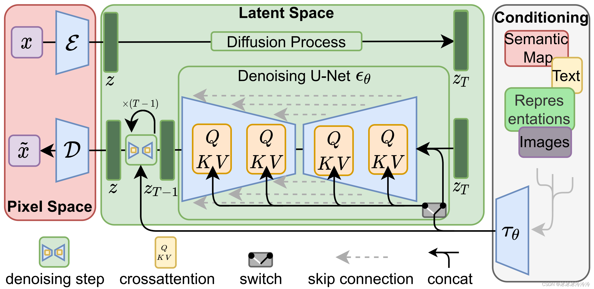
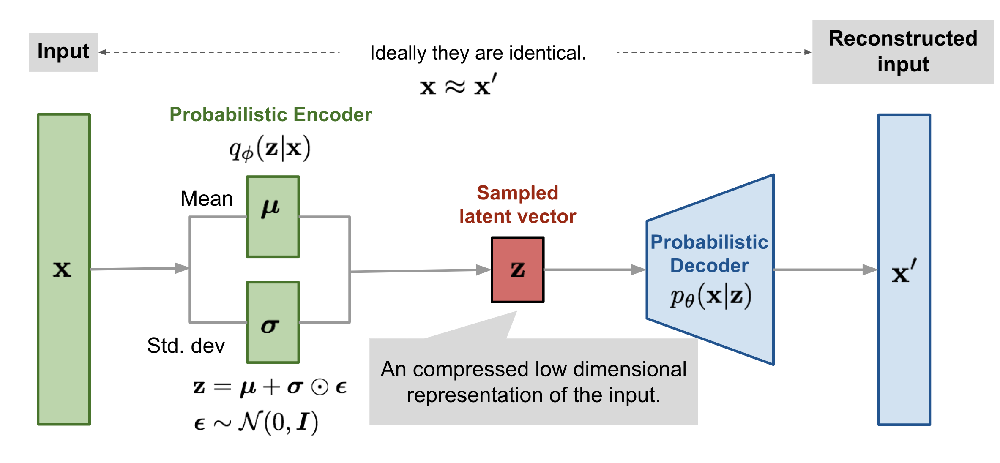
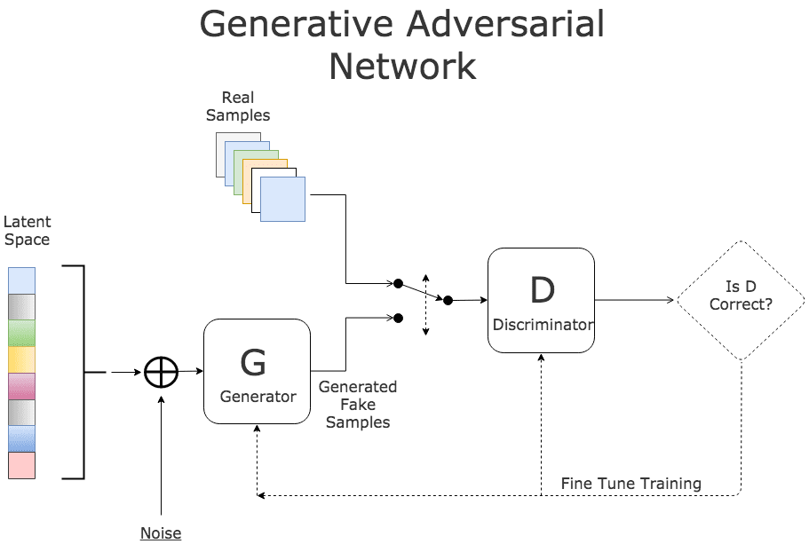

# 在一张4060ti上从0训练SD VAE

## 1. 背景

事情的起因是笔者最近在学习关于generative model中变分自编码器（VAE）和生成对抗网络 (GAN) 相关的内容，再加上正好学校也放寒假了，本着学习PyTorch/PyTorch Lightning和VAE训练流程（瞎折腾）的想法，打算自己手搓完整的training pipeline从零训练一个Autoencoderkl with Discriminator，相关的代码已开源在[GitHub](https://github.com/Gaolingx/Glx.MLExamples/tree/main/project/03/sd_vae_lightning)上。

## 2. 开始之前...

在Stable Diffusion 1.5的论文[《High-Resolution Image Synthesis with Latent Diffusion Models》](https://arxiv.org/abs/2112.10752)中，由于直接在pixel space上扩散效率较低，因此原始图像被编码到一个更低维度的潜空间表示。扩散过程（加噪和去噪）都发生在这个压缩后的潜空间，而非原始像素空间，因此，在 Latent Diffusion Model (LDM) 的架构中，VAE是整个信息传递过程的bottleneck，它的性能会对 U-Net 去噪网络的最终生成/重建质量产生决定性的影响。

---



关于VAE和GAN模型结构和训练目标就不过多赘述，简单来说，变分自编码器（VAE）基于概率图模型和变分推断的原理，encoder（识别模型）将输入数据压缩进潜空间（latent space），decoder（解码器）负责采样latent space并映射回数据空间，VAE 的训练目标是通过最大化数据对数似然$log(x)$的证据下界（ELBO）来确定的。



---

生成对抗网络 (GAN)采用一种基于博弈论的不同方法。它们包含两个通过竞争方式训练的神经网络 (neural network)：生成器（generator）、判别器（discriminator），判别器被训练以最大化其正确分类真实和虚假样本的能力，生成器被训练以最小化判别器检测其虚假样本的能力，目标是使生成器产生的样本分布与真实数据分布完全一致。



---

### hardware

硬件部分，考虑到我们只有一张8G VRAM的4060ti，为了不因为爆显存导致训练速度大打折扣，我们需要严格控制训练过程的显存占用，因此我们选择了bf16-mixed+batch size=1配合gradient accumulate=8在极低的显存下预训练。

## 3. 模型选型

### 3.1 VAE

关于VAE部分，我们选择了[huggingface/diffusers](https://github.com/huggingface/diffusers/blob/main/src/diffusers/models/autoencoders/autoencoder_kl.py)的AutoencoderKL，该架构也是stable diffusion 1.5所使用的VAE。

#### 架构参数 (Architecture)

*   **下采样因子 (Downsampling Factor, $f$)**:
    *   这是最重要的参数。它定义了 Latent Map 的分辨率相对于原图的比例。
    *   **常见值：** $f=4, f=8, f=16$。
    *   **权衡：**
        *   $f$ 较小（如 4）：保留更多空间细节，重建质量极高，但 Latent 尺寸大，导致后续 U-Net 计算量激增（显存爆炸）。
        *   $f$ 较大（如 16/32）：Latent 极小，U-Net 跑得飞快，但解码时极易丢失小物体、人脸和文字细节。
    *   **SD 标准：** Stable Diffusion 使用 **$f=8$** (即 $512 \times 512 \to 64 \times 64$)。

*   **潜空间通道数 (Latent Channels, $z_{dim}$)**:
    *   Latent 特征图的深度。
    *   **常见值：** 3, 4, 8。
    *   **SD 标准：** 4 通道。这意味着 Latent Tensor 形状为 $[B, 4, H/8, W/8]$。通道越多，信息容量越大，但 U-Net 输入维度增加。

*   **Attention 层的应用**:
    *   通常在 Encoder 和 Decoder 的最低分辨率层（Bottleneck）加入 Self-Attention 模块。
    *   **作用：** 捕捉全局上下文，有助于减少大面积色块的重建错误，但会增加显存消耗。

最终我们确定使用f8c4参数，与标准的sd vae参数一致，压缩率为48x。

> 所谓的“压缩率”是如何计算的？
>
> 当我们说 `f8c4` 时，我们可以算一下数据维度的变化：
>
> *   **原始数据量 (Pixel Space):** $H \times W \times 3$
> *   **潜在数据量 (Latent Space):** $\frac{H}{8} \times \frac{W}{8} \times 4$
>
> **压缩比计算：**
$$
\text{空间压缩} = 8 \times 8 = 64 \text{倍（面积减少）}
$$
$$
\text{整体维度减少} = \frac{H \times W \times 3}{\frac{H}{8} \times \frac{W}{8} \times 4} = \frac{3}{\frac{4}{64}} = \frac{3 \times 64}{4} = 48 \text{倍}
$$
>
> 虽然通道数从 3 增加到了 4（略微增加了数据量），但因为空间分辨率除以了 8（面积除以了 64），所以整体的数据维度减少了 **48倍**。
> 
> 总结：
> *   **f8:** 空间分辨率除以 8（主要负责大幅减少计算量）。
> *   **c4:** 特征通道数为 4。


diffuser autoencoderkl 模型核心可以概括为：Encoder 将图像压缩到 latent distribution，采样（或取 mode）后再由 Decoder 重建图像；训练时再配合 KL loss 约束潜空间分布。

`diffusers` 中的 [`AutoencoderKL`](https://github.com/huggingface/diffusers/blob/main/src/diffusers/models/autoencoders/autoencoder_kl.py) 参数很多，但对我们这次训练最关键的其实只有下面几项：

- **`latent_channels=4`**：潜空间通道数，对应 SD 经典的 `f8c4` 中的 `c4`。
- **`block_out_channels`**：决定各层通道宽度，影响模型容量和显存占用。
- **`layers_per_block`**：每个 stage 的残差层数，影响表达能力和计算量。
- **`scaling_factor=0.18215`**：供后续扩散模型使用的 latent 缩放系数，是 SD 生态里的关键约定。
- **`mid_block_add_attention=True`**：是否在 bottleneck 处加入 attention，用于增强全局建模能力。
- **`force_upcast`**：高分辨率或数值敏感场景下是否强制某些计算回到 float32。

因此，从训练视角看，[`AutoencoderKL`](https://github.com/huggingface/diffusers/blob/main/src/diffusers/models/autoencoders/autoencoder_kl.py) 本质上就是一个“带 KL 正则的编码器-解码器”，而我们真正需要关注的是**latent 维度、网络宽度/深度、attention 配置，以及 latent scaling 约定**，而不是它完整的继承链和全部构造参数。

预训练模型：[stabilityai/sd-vae-ft-mse](https://huggingface.co/stabilityai/sd-vae-ft-mse)
model config：[config.json](https://huggingface.co/stabilityai/sd-vae-ft-mse/raw/main/config.json)

### 3.2 GAN

在 VAE 训练中，Discriminator 通常采用 PatchGAN 结构（类似于 VQGAN 或 Stable Diffusion 的设置），它的任务不是判断整张图是真是假（这需要庞大的参数量来理解语义），而是判断一个个小的 Patch（如 16x16 或 32x32 的区域）纹理是否自然。

标准的 Patch Discriminator 结构如下：

```python
class NLayerDiscriminator(nn.Module):
    """
    PatchGAN discriminator for adversarial training.

    Args:
        input_nc: Number of input channels.
        ndf: Base number of discriminator filters.
        n_layers: Number of layers in discriminator.
    """

    def __init__(
        self,
        input_nc: int = 3,
        ndf: int = 64,
        n_layers: int = 3,
    ):
        super().__init__()

        layers = [
            nn.Conv2d(input_nc, ndf, kernel_size=4, stride=2, padding=1),
            nn.LeakyReLU(0.2, True),
        ]

        nf_mult = 1
        for n in range(1, n_layers):
            nf_mult_prev = nf_mult
            nf_mult = min(2**n, 8)
            layers += [
                nn.Conv2d(
                    ndf * nf_mult_prev,
                    ndf * nf_mult,
                    kernel_size=4,
                    stride=2,
                    padding=1,
                    bias=False,
                ),
                nn.BatchNorm2d(ndf * nf_mult),
                nn.LeakyReLU(0.2, True),
            ]

        nf_mult_prev = nf_mult
        nf_mult = min(2**n_layers, 8)

        layers += [
            nn.Conv2d(
                ndf * nf_mult_prev,
                ndf * nf_mult,
                kernel_size=4,
                stride=1,
                padding=1,
                bias=False,
            ),
            nn.BatchNorm2d(ndf * nf_mult),
            nn.LeakyReLU(0.2, True),
            nn.Conv2d(ndf * nf_mult, 1, kernel_size=4, stride=1, padding=1),
        ]

        self.model = nn.Sequential(*layers)

        # Initialize weights
        self.apply(self._init_weights)

    def _init_weights(self, m):
        """Initialize weights with normal distribution."""
        classname = m.__class__.__name__
        if classname.find("Conv") != -1:
            nn.init.normal_(m.weight.data, 0.0, 0.02)
        elif classname.find("BatchNorm") != -1:
            nn.init.normal_(m.weight.data, 1.0, 0.02)
            nn.init.constant_(m.bias.data, 0)

    def forward(self, x: torch.Tensor) -> torch.Tensor:
        """Forward pass through discriminator."""
        return self.model(x)

```

问题来了，该nn使用了多个 `nn.BatchNorm2d` 层，由于显存限制，我们只能使用有限的 batchsize，而 Batch Normalization 在训练过程中依赖于当前 mini-batch 的均值（mean）和方差（variance）来对特征进行归一化，当 BS 很小时，mini-batch 的统计量（样本均值和方差）不能很好地代表整个数据集的总体分布。

这引入了巨大的噪声。最终统计估计不准确导致训练不稳定。因此，我们需要不依赖 Batch Size 的 Normalization。

> BatchNorm 的计算方式：
>
> $$\hat{x} = \frac{x - \mu_{\mathcal{B}}}{\sqrt{\sigma_{\mathcal{B}}^2 + \epsilon}}$$
>
> 其中 $\mu_{\mathcal{B}}$ 和 $\sigma_{\mathcal{B}}^2$ 是**当前 mini-batch** 的均值和方差：
>
> $$\mu_{\mathcal{B}} = \frac{1}{N} \sum_{i=1}^{N} x_i, \quad \sigma_{\mathcal{B}}^2 = \frac{1}{N} \sum_{i=1}^{N}(x_i - \mu_{\mathcal{B}})^2$$

与 Batch Normalization 不同，GroupNorm 的计算完全独立于 Batch 维度。它是在单个样本的通道（Channel）维度上进行分组归一化。

这里我们选择用 GroupNorm 替换 BatchNorm2d，并在卷积层上使用 Spectral Normalization 限制判别器的 Lipschitz 常数作为正则化手段，最终改进后的结构如下：

```python
class NLayerDiscriminator(nn.Module):
    """
    PatchGAN discriminator for adversarial training.

    Args:
        input_nc: Number of input channels.
        ndf: Base number of discriminator filters.
        n_layers: Number of layers in discriminator.
        norm_type: Normalization type. 'spectral', 'spectral_group', 'batch', or 'none'.
        num_groups: Number of groups for GroupNorm (default: 32).
    """

    def __init__(
            self,
            input_nc: int = 3,
            ndf: int = 64,
            n_layers: int = 3,
            norm_type: str = "spectral_group",
            num_groups: int = 32,
    ):
        super().__init__()
        self.norm_type = norm_type
        self.num_groups = num_groups

        use_spectral = norm_type in ("spectral", "spectral_group")
        use_group = norm_type == "spectral_group"
        use_batch = norm_type == "batch"

        def maybe_spectral(layer):
            return nn.utils.spectral_norm(layer) if use_spectral else layer

        def get_norm_layer(num_features):
            if use_group:
                # Ensure num_groups doesn't exceed num_features
                groups = min(num_groups, num_features)
                return nn.GroupNorm(groups, num_features)
            elif use_batch:
                return nn.BatchNorm2d(num_features)
            else:
                # 'spectral' alone or 'none' — no extra normalization
                return nn.Identity()

        # --- First layer: no normalization, just conv + activation ---
        layers = [
            maybe_spectral(
                nn.Conv2d(input_nc, ndf, kernel_size=4, stride=2, padding=1)
            ),
            nn.LeakyReLU(0.2, True),
        ]

        # --- Intermediate layers ---
        nf_mult = 1
        for n in range(1, n_layers):
            nf_mult_prev = nf_mult
            nf_mult = min(2 ** n, 8)
            layers += [
                maybe_spectral(
                    nn.Conv2d(
                        ndf * nf_mult_prev,
                        ndf * nf_mult,
                        kernel_size=4,
                        stride=2,
                        padding=1,
                        bias=False,
                    )
                ),
                get_norm_layer(ndf * nf_mult),
                nn.LeakyReLU(0.2, True),
            ]

        # --- Penultimate layer (stride=1) ---
        nf_mult_prev = nf_mult
        nf_mult = min(2 ** n_layers, 8)
        layers += [
            maybe_spectral(
                nn.Conv2d(
                    ndf * nf_mult_prev,
                    ndf * nf_mult,
                    kernel_size=4,
                    stride=1,
                    padding=1,
                    bias=False,
                )
            ),
            get_norm_layer(ndf * nf_mult),
            nn.LeakyReLU(0.2, True),
        ]

        # --- Final layer: 1-channel output (patch map) ---
        layers += [
            maybe_spectral(
                nn.Conv2d(ndf * nf_mult, 1, kernel_size=4, stride=1, padding=1)
            ),
        ]

        self.model = nn.Sequential(*layers)

        # Initialize weights (skip spectral-normed layers — they self-regulate)
        if not use_spectral:
            self.apply(self._init_weights)

    @staticmethod
    def _init_weights(m):
        classname = m.__class__.__name__
        if classname.find("Conv") != -1:
            nn.init.normal_(m.weight.data, 0.0, 0.02)
        elif classname.find("BatchNorm") != -1:
            nn.init.normal_(m.weight.data, 1.0, 0.02)
            nn.init.constant_(m.bias.data, 0)
        elif classname.find("GroupNorm") != -1:
            nn.init.normal_(m.weight.data, 1.0, 0.02)
            nn.init.constant_(m.bias.data, 0)

    def forward(self, x: torch.Tensor) -> torch.Tensor:
        return self.model(x)
```

## 4. 数据集

### 4.1 基本要求

AutoencoderKL 是自监督/无监督的重建任务，不需要任何标注，使用hf常见的image dataset即可，导入时可做适当的数据增强处理。

| 要求项 | 说明 |
| :--- | :--- |
| **图像尺寸** | 通常要求统一尺寸，常见为 $256 \times 256$ 或 $512 \times 512$（需要能被下采样倍数整除） |
| **通道数** | 标准 RGB 3通道（如需透明通道需要改模型结构） |
| **像素值范围** | 归一化到 $[-1, 1]$ 或 $[0, 1]$，取决于实现 |
| **格式** | 常见 PNG / JPG / WebP 等 |

### 4.2 数据集规模

| 维度 | 建议 |
| :--- | :--- |
| **数量** | 至少 **数万张**，推荐 **10万+**；从头训练建议百万级 |
| **多样性** | 场景、纹理、颜色分布尽量丰富 |
| **质量** | 高清无水印优先，避免大量低质量/模糊图 |
| **分辨率** | 原始分辨率 ≥ 训练分辨率，避免上采样（引入模糊） |

总之，dataset核心要求如下：

1. **尺寸能被下采样因子整除**（最常见的报错原因）
2. **归一化到 $[-1, 1]$**
3. **RGB 3通道**
4. **高质量、多样性、足够数量**
5. **不需要标签**

注：由于dataset内图片来源多样，通常需要对 dataset 进行尺寸、通道后处理以防出现通道不匹配的错误。

虽然从头训练vae推荐百万级的数量，考虑到单卡算力限制，我们最初是在 `huggan/flowers-102-categories` (7,879 train+3,000 validation) 上测试，正式训练我们选择了 ImageNet-1k 的一个子集：`clane9/imagenet-100` (12,6689 train+5,000 validation, containing 100 randomly selected classes)

## 5. 模型训练

### VAE-GAN：将VAE结构与GAN的真实感相结合

在常规的VAE或AE（自编码器）的训练中，损失项通常是kl loss+rec loss，为什么我们要引入GAN呢？

传统的VAE/AE通常使用均方误差（MSE）或L1 Loss作为重构损失。这些损失计算的是生成图像与真实图像在像素数值上的差异。

问题在于：对于一个给定的潜变量 $z$，可能对应着现实中多种合理的像素图像（多模态）。例如，一个模糊的边缘在现实中可能对应向左偏一点的头发，也可能对应向右偏一点的头发。

当我们使用MSE Loss时，模型为了最小化误差，倾向于生成所有可能解的**平均值**（Mean）。
$$ L_{MSE} = \mathbb{E}_{x, \hat{x}} [||x - \hat{x}||^2] $$

**结果**：这种“平均值”在图像上表现为模糊、缺乏纹理。因为两张锐利但位置稍有不同的图取平均，得到的图就是模糊的。

总之，由于压缩率很高（例如8倍或16倍），如果只用MSE，解码出来的图像会非常糊，因为高频细节（纹理、发丝）在压缩中丢失，且MSE无法强迫模型“脑补”出锐利的细节。

---

LDM论文的做法是引入了 Patch style 的判别器，使用 GAN Loss（通常是Hinge Loss或Non-saturating Logistic Loss）配合 Perceptual Loss（感知损失，基于VGG特征）和 KL Loss。其核心思想是，用判别器网络提供的学到的特征级损失，替换或增强VAE的像素级重建损失（如均方误差或二元交叉熵），既保证了内容的整体结构，又能重建出锐利、真实的纹理。

VAE-GAN本质上将VAE的解码器 $p(x∣z)$ 视为GAN设置中的生成器。随后引入判别器网络 $D(x)$，并训练它以区分训练集中的真实数据样本 $x$ 和由VAE解码器生成的样本 $x ′ =p(x∣z)$。

整体架构包括：

1. 一个**编码器** $q(z∣x)$：将输入数据 $x$映射到潜在分布（通常是均值为 $μ(x)$、方差为 $σ ^2 (x)$ 的高斯分布）。
2. 一个**解码器（生成器）** $p(x∣z)$：将潜在样本 $z$ 映射回数据空间，生成 $x ′$ 。
3. 一个**判别器** $D(x)$：一个二元分类器，输出样本 $x$ 是真实样本而非解码器生成的样本的概率。

整个VAE-GAN训练流程如下：


<center>*VAE-GAN架构图。VAE的编码器和解码器构成基础，解码器也充当GAN组件的生成器。判别器旨在区分真实数据和解码器生成的数据。*</center>

### 5.1 框架概述

我们使用 PyTorch Lightning (PL) 构建 Training Pipeline，目的是将 "学术研究代码"（模型与算法） 与 "工程代码"（硬件管理、训练循环、日志记录） 解耦，同时框架支持完善的Callback允许你在训练生命周期的任何节点（如 train epoch start、train batch end）插入自定义逻辑，而无需污染核心训练代码。

简单来说，PyTorch Lightning 就像是 PyTorch 的一个标准化接口或框架，它不会限制你的灵活性，但会帮你处理掉繁琐的样板代码（Boilerplate）。

### 5.2 Training Loop

由于VAE-GAN整个training step涉及Generator和Discriminator混合优化，我们需要依次 `forward -> compute loss -> gradient accumulate -> backward -> gradient clip -> optimizer step -> optimizer zero grad -> update ema (VAE) -> step scheduler`，还需要显式的 `toggle/untoggle optimizer`（requires grad）避免梯度污染。

这里我们未参考 diffuser training example——梯度累积偶数步训练 VAE(Generator)，奇数步训练 Disc，而是按照标准GAN训练流程，直接在一个 `training_step` 中交替优化 Generator（VAE）和 Discriminator提高训练效率。

```python
# vae_module.py
def training_step(self, batch, batch_idx):
    targets = batch["pixel_values"]
    is_last_accumulation_step = (batch_idx + 1) % self.accumulate_grad_batches == 0

    # 1. 前向传播：过一遍 VAE，拿到 `reconstructions`。
    reconstructions, latent, posterior = self.forward_with_latent(targets)

    # ========== Train VAE (Generator) ==========
    # 2.训练生成器 (G)：使用带有梯度的 `reconstructions` 计算 VAE Loss（重建 + KL + 加上对抗损失），反向传播并更新 G。
    self.toggle_optimizer(opt_vae)
    vae_loss, vae_loss_dict = self.compute_loss(targets, reconstructions, posterior)

    scaled_vae_loss = vae_loss / self.accumulate_grad_batches
    self.manual_backward(scaled_vae_loss)
    self.untoggle_optimizer(opt_vae)

    if is_last_accumulation_step:
        self.clip_gradients(
            opt_vae,
            gradient_clip_val=self.gradient_clip_val,
            gradient_clip_algorithm="norm",
        )
        opt_vae.step()
        opt_vae.zero_grad()

        # Update EMA
        self.ema.step(self.vae.parameters())

        vae_scheduler.step()

    # ========== Train Discriminator ==========
    # 3. 训练判别器 (D)：使用真实的 `targets` 和截断梯度的 `reconstructions.detach()` 计算 D Loss，反向传播并更新 D。
    if (self.global_step >= self.disc_start_step):
        self.toggle_optimizer(opt_disc)
        disc_loss, disc_loss_dict = self.compute_loss(targets, reconstructions, posterior)

        scaled_disc_loss = disc_loss / self.accumulate_grad_batches
        self.manual_backward(scaled_disc_loss)
        self.untoggle_optimizer(opt_disc)

        if is_last_accumulation_step:
            self.clip_gradients(
                opt_disc,
                gradient_clip_val=self.gradient_clip_val,
                gradient_clip_algorithm="norm"
            )

            opt_disc.step()
            opt_disc.zero_grad()

            disc_scheduler.step()

```

Training loop示意图如下：

```
disc_start_step = 50001 时的执行流程：

步数 (global_step)  |  训练对象
==================|============
0                 |  VAE only
1                 |  VAE only
...               |  VAE only
50000             |  VAE only
------- disc_start_step 阈值 -------
50001             |  VAE training -> Disc training
50002             |  VAE training -> Disc training
50003             |  VAE training -> Disc training
50004             |  VAE training -> Disc training
...               |
```

### 5.3 loss组合

根据我们 Discriminator Warm-up 策略，train step < disc_start_step 只有VAE被训练，目标函数为：$Loss = L_{rec} + \lambda_{KL} \cdot L_{KL}$

train step >= disc_start_step 时 generator 和 discriminator同时被训练，目标函数变为：$Loss = L_{rec} + \lambda_{KL} \cdot L_{KL} + \lambda_{GAN} \cdot L_{GAN}$

因此训练 loss 的完整构成为：

$$\mathcal{L}_{\text{total}} = \underbrace{\mathcal{L}_{\text{rec}} + \lambda_{\text{perc}} \cdot \mathcal{L}_{\text{LPIPS}}}_{\text{nll\_loss}} + \lambda_{\text{kl}} \cdot \mathcal{L}_{\text{KL}} + w_d \cdot f_d \cdot \mathcal{L}_{\text{adv}}$$

lightningmodule 中 loss 实现如下：

```python
# Reconstruction loss
if self.rec_loss_type == "l2":
    rec_loss = F.mse_loss(reconstructions, targets, reduction="none")
else:
    rec_loss = F.l1_loss(reconstructions, targets, reduction="none")
rec_loss = rec_loss.mean()
loss_dict["rec_loss"] = rec_loss

# Perceptual loss
if self.perceptual_loss is not None and self.perceptual_weight > 0:
    p_loss = self.perceptual_loss(reconstructions, targets).mean()
    loss_dict["p_loss"] = p_loss
else:
    p_loss = torch.tensor(0.0, device=targets.device)
    loss_dict["p_loss"] = p_loss
# KL loss
kl_loss = posterior.kl().mean()
loss_dict["kl_loss"] = kl_loss * self.kl_weight

# ...

# Total NLL loss (reconstruction + perceptual)
nll_loss = rec_loss + self.perceptual_weight * p_loss

# ...

# 最终 loss
if (global_step >= self.disc_start_step):
    loss = nll_loss + self.kl_weight * kl_loss + g_loss_weighted
else:
    loss = nll_loss + self.kl_weight * kl_loss
```

#### 自适应权重

在 VQGAN/SD-VAE 的论文（*Taming Transformers*）中，总 Loss 的公式通常是：
$$ L_{total} = L_{rec} + \lambda \cdot L_{GAN} $$
其中 $\lambda$ 就是那个自适应权重（`disc_weight`）。它的计算公式并不是固定的，而是每一层动态计算的：
$$ \lambda = \frac{\| \nabla_{G_L} (L_{rec}) \|}{\| \nabla_{G_L} (L_{GAN}) \| + \delta} $$
*   **分子**：重建 Loss（L1/L2/Perceptual）对最后一层卷积层的梯度大小（Gradient Norm）。
*   **分母**：GAN Loss 对最后一层卷积层的梯度大小。

**简单来说：** 系统会计算“重建 Loss 想怎么改参数”和“GAN Loss 想怎么改参数”。如果 GAN 想改动的幅度（梯度）太大，系统就会自动把 $\lambda$ 调小，强制让 GAN 的更新力度**不超过**重建 Loss 的更新力度。

代码实现如下：

```python

def _calculate_adaptive_weight(
        self,
        nll_loss: torch.Tensor,
        g_loss: torch.Tensor,
        last_layer: nn.Parameter,
) -> torch.Tensor:
    try:
        nll_grads = torch.autograd.grad(
            nll_loss, last_layer, retain_graph=True
        )[0]
        g_grads = torch.autograd.grad(
            g_loss, last_layer, retain_graph=True
        )[0]
    except RuntimeError:
        # Fallback if gradient computation fails
        return torch.tensor(0.0, device=nll_loss.device)

    nll_grad_norm = torch.norm(nll_grads)
    g_grad_norm = torch.norm(g_grads)

    if g_grad_norm < 1e-6:
        d_weight = torch.tensor(1.0, device=nll_loss.device)
    else:
        d_weight = nll_grad_norm / (g_grad_norm + 1e-4)

    d_weight = torch.clamp(d_weight, 0.0, self.adaptive_weight_max).detach()

    return d_weight * self.disc_weight

```

### 5.4 LR Scheduler and optimizer

解决了框架、数据、模型问题，接下来就是解决模型“怎么学”这个问题，也就是优化器（optimizer）和学习率调度器（LR Scheduler）的设计。

先说 optimizer。optimizer 的作用，本质上是根据反向传播得到的梯度去更新参数，决定模型“往哪个方向走、每一步走多大”。同样是梯度下降，不同优化器在动量（momentum）、自适应学习率、权重衰减（weight decay）等机制上有不同设计，因此会直接影响：

1. 收敛速度；
2. 训练稳定性；
3. 最终能否找到更好的参数区域；
4. 是否容易出现过拟合或 loss 震荡。

在生成模型训练里，最常用的通常还是 Adam / AdamW 一类自适应优化器，因为它们对不同参数维度会动态调整更新步长，通常比朴素 SGD 更稳，尤其适合 VAE、GAN 这种目标函数复杂、不同 loss 项尺度差异较大的场景。本项目在 [`src/lightning/vae_module.py`](src/lightning/vae_module.py:674) 中也封装了 [`_build_optimizer()`](src/lightning/vae_module.py:674)，支持 `AdamW`、`Adam`、`SGD`、`RMSprop`，默认以 `AdamW` 为主：

```python
def _build_optimizer(
        self,
        params,
        opt_config: Dict[str, Any],
) -> torch.optim.Optimizer:
    opt_type = opt_config.get("type", "AdamW").lower()
    lr = opt_config["learning_rate"]
    betas = (opt_config.get("adam_beta1", 0.9), opt_config.get("adam_beta2", 0.999))
    weight_decay = opt_config.get("weight_decay", 0.01)
```

再说 LR Scheduler。学习率（learning rate）决定了参数更新的步长，而 scheduler 的作用就是在训练过程中**动态调整学习率**。这是很关键的一层控制手段，因为训练通常不是从头到尾都适合同一个 LR：

- 训练初期参数还很乱，学习率太大容易震荡；
- 训练中期希望快速下降，需要相对较高的学习率保持探索能力；
- 训练后期则常常希望把学习率降下来，让参数在较优区域内精修。

因此 scheduler 的核心作用可以概括为：**让训练前期更稳，中期更快，后期更细。**

常见的策略包括：

- **warmup**：先从很小的 LR 逐步升到目标值，避免训练一开始梯度过猛；
- **constant**：学习率保持不变，简单直接；
- **linear / cosine decay**：随着训练推进逐步降低 LR；
- **cosine with restarts**：周期性重启，适合某些需要跳出局部区域的任务；
- **polynomial decay**：按多项式形式衰减，提供更灵活的下降曲线。

本项目的 scheduler 构建封装在 [`src/lightning/vae_module.py`](src/lightning/vae_module.py:737) 的 [`_build_scheduler()`](src/lightning/vae_module.py:737) 中。由于 `diffusers` 已经提供了相对成熟的 [`get_scheduler()`](src/lightning/vae_module.py:789) 实现，因此这里直接复用其能力，支持 `constant`、`constant_with_warmup`、`linear`、`cosine`、`cosine_with_restarts`、`polynomial` 等常见类型：

```python
return get_scheduler(
    name=scheduler_type,
    optimizer=optimizer,
    step_rules=step_rules,
    num_warmup_steps=num_warmup_steps,
    num_training_steps=num_training_steps,
    num_cycles=num_cycles,
    power=power,
    last_epoch=last_epoch,
)
```

此外，由于这里不是单优化器训练，而是 VAE（Generator）和 Discriminator 各自维护一套 optimizer + scheduler，所以在 [`configure_optimizers()`](src/lightning/vae_module.py:800) 中实际上为两者分别构建了优化器和学习率调度器。这样做的好处是：

- 可以让 G 和 D 使用不同学习率；
- 可以让 G 和 D 使用不同 scheduler 曲线；
- 可以根据 `disc_start_step` 单独计算判别器 scheduler 的有效训练步数。

也就是说，这里不是简单地“给整个模型配一个学习率”，而是把训练控制细化到了不同子模块上，这对 VAE-GAN 这种双优化器系统尤其重要。

LR Scheduler 部分，由于diffuser的utils中已经提供了现成的轮子，包括常见的`constant`, `constant_with_warmup`, `linear`, `cosine`, `cosine_with_restarts`, `polynomial` 等scheduler type，因此我们直接 `from diffusers.optimization import get_scheduler` 进来再简单封装下就能拿给optimizers使用了。

#### 注意

由于存在多个优化器，我们无法使用pytorch lightning的自动优化。
我们需要给被训练的 `pl.LightningModule` 设置 `self.automatic_optimization = False`。

```python
class VAELightningModule(pl.LightningModule):
    def __init__(self, config: Dict[str, Any]):
        # Disable automatic optimization for GAN training with manual gradient accumulation
        self.automatic_optimization = False
```

在创建 `pl.Trainer` 传参时必须设置 `accumulate_grad_batches=1`（否则会影响 batch_idx 结果），不要传入 `gradient_clip_val`（manual optimization下会抛异常 *lightning_fabric.utilities.exceptions.MisconfigurationException: Automatic gradient clipping is not supported for manual optimization. Remove `Trainer(gradient_clip_val=1.0)` or switch to automatic optimization.*）。

最后在lightning module的 `training_step` 方法内部手动优化即可。

Manual Optimization下，Lightning 仅处理accelerator、precision和多卡策略，用户仍需进行optimizer.zero_grad(), gradient accumulation, optimizer toggling 等操作。

> 更多关于Manual Optimization的事项可参考 [Manual Optimization — PyTorch Lightning 2.6.1 documentation](https://lightning.ai/docs/pytorch/stable/model/manual_optimization.html)

```python
def main():
    # ...
    # Create trainer
    # NOTE: accumulate_grad_batches is set to 1 because we handle gradient accumulation
    # manually in VAELightningModule.training_step() for proper alternating training
    # between VAE and Discriminator (following official diffusers implementation)
    trainer = pl.Trainer(
        accelerator=accelerator,
        devices=devices,
        max_epochs=train_config_section.get("num_epochs", 100),
        max_steps=train_config_section.get("max_train_steps", -1),
        precision=train_config_section.get("precision", "16-mixed"),
        accumulate_grad_batches=1,  # Manual accumulation in training_step
        # gradient_clip_val handled manually in training_step
        log_every_n_steps=logging_config.get("log_every_n_steps", 50),
        val_check_interval=logging_config.get("val_check_interval", 500),
        logger=logger,
        callbacks=callbacks,
        enable_checkpointing=True,
        deterministic=True,
    )
```

#### Gradient Checkpointing

Gradient Checkpointing是个在深度学习领域流传已久的trick，在训练像LLM这样参数量很大的参数时特别好用，这里参考[Github资料](https://github.com/cybertronai/gradient-checkpointing)，简单理解就是不保留所有层的激活值，只保留一部分关键节点的激活值（Checkpoints），但由于在反向传播时需要重新计算前向传播的部分逻辑，被 Checkpoint 标记的部分实际上执行了两次前向传播（一次是真正的 Forward，一次是 Backward 时的 Re-forward），会导致计算开销增加（实测训练速度降低20~30%样子），总之这确实是一种Memory Efficiency的Backward方法。

diffuser的AutoencoderKL class中已经帮我们实现了Gradient Checkpointing，我们只需在create vae model时候开启它即可：

```python
class VAELightningModule(pl.LightningModule):

    def __init__(self, config: Dict[str, Any]):
        super().__init__()

        # ...
        # Enable gradient checkpointing for memory savings
        if model_config.get("gradient_checkpointing", False):
            self.vae.enable_gradient_checkpointing()
```

### 5.5 validation and metrics

VAE-GAN优化的是感知质量和分布一致性，光看loss远远不够，尤其是后期引入adversarial loss之后，此时我们需要重点关注val的各项图像质量指标。

#### 1. 重建质量指标 (Reconstruction Fidelity)

这些指标衡量 $x$ 和 $\text{Dec}(\text{Enc}(x))$ 的相似度。

| 指标 | 全称 | 说明 | 重要性 |
| :--- | :--- | :--- | :--- |
| **rFID** | Reconstruction FID | 计算原图集和重建图集的分布距离。数值越低越好。 | ⭐⭐⭐⭐⭐ (金标准) |
| **LPIPS** | Learned Perceptual Image Patch Similarity | 衡量人眼感知的相似度。数值越低越好。相比 PSNR，它更能反映纹理和清晰度。 | ⭐⭐⭐⭐⭐ (核心) |
| **PSNR** | Peak Signal-to-Noise Ratio | 峰值信噪比。数值越高越好。偏向于像素级对齐，对模糊不敏感。 | ⭐⭐ (参考) |
| **SSIM** | Structural Similarity | 结构相似性。数值越接近 1 越好。比 PSNR 稍微好点，但仍不如 LPIPS。 | ⭐⭐⭐ (参考) |

*   **注意：** 在 LDM 语境下，**rFID 和 LPIPS 是最重要的**。因为我们不仅希望像素对齐，更希望“看着真实”。一个模糊的图可能有很高的 PSNR，但 LPIPS 会很差。

### 6. Callback

前面提到过，我们使用 PyTorch Lightning 的一个重要原因，就是它把训练过程拆成了大量标准化的生命周期钩子（hook），例如 train batch start/end、validation epoch start/end、checkpoint save 等。**Callback 的意义，就是把这些“围绕训练发生的工程逻辑”从核心模型代码中抽出来。**

为什么要这么做？因为像下面这些功能虽然都很重要，但它们本质上并不属于“模型前向和 loss 计算”本身：

- 指标记录与可视化；
- 图像重建结果写入 TensorBoard；
- checkpoint 管理；
- resume 训练时覆盖 LR / 重建 scheduler；
- NaN / Inf 异常监控；
- 进度条展示；
- early stopping;

如果把这些逻辑全部硬塞进 `training_step() / validation_step()` 或主训练脚本里，代码会迅速变得臃肿：算法逻辑和工程逻辑耦合在一起，后续既难读，也难改，更难复用。

因此我们将这部分内容集中放在 `Callback` 中，再在 `scripts/train.py` 统一注册到 `pl.Trainer(...)` 里：

```python
callbacks = [
    NaNLossCallback(),
    VAECheckpointCallback(...),
    LearningRateMonitor(logging_interval="step"),
    VAELoggingCallback(...),
    LRandSchedulerOverrideCallback(...),
    RichProgressBar(),
]
```

这种设计的核心优点有三个：

1. **解耦**：模型类只关心 forward、loss、optimizer；日志、保存、监控交给 callback。
2. **可复用**：同一个 callback 可以直接用于别的实验，主训练代码几乎不用动。
3. **可维护**：后面想增加新功能时，只需新增/替换 callback，而不是把 [`VAELightningModule`](src/lightning/vae_module.py:26) 越写越重。

#### 6.1 VAELoggingCallback

`VAELoggingCallback` 是这里最核心的工程 callback，负责统一处理训练和验证阶段的指标与图像记录。它做的事情包括：

- 读取 `training_step()` 返回的 `train_metrics`，按 step 记录到 logger；
- 读取 `validation_step()` 返回的 `val_metrics`，按 epoch 聚合记录；
- 在验证 epoch 结束时调用 `rfid_metric.compute()` 计算并记录 `val/rfid`；
- 定期把 **原图 / latent 可视化 / 重建图** 拼接成 grid，写入 TensorBoard，方便肉眼观察重建质量变化。

对于 VAE 来说，只看 loss 曲线往往不够，因为：

- 某些指标下降了，图像可能仍然发糊；
- GAN 引入后，loss 震荡不一定代表视觉质量更差；
- latent 是否塌缩、颜色是否漂移，通常肉眼更容易第一时间发现。

因此需要将原图、latent 可视化和重建图拼到一起，作为监控指标。

#### 6.2 VAECheckpointCallback

`VAECheckpointCallback` 继承自 Lightning 的 `ModelCheckpoint`，在保留原生 checkpoint 功能的基础上，额外补了一层 HuggingFace 格式导出。

它的动机很简单：Lightning 的 `.ckpt` 适合**恢复训练**，但不一定适合**直接部署或复用到 diffusers 工作流**；而 HuggingFace / diffusers 风格的 `save_pretrained()` 则更适合推理和模型分发。因此这里两种都保存。

在 `_save_checkpoint()` 中，callback 先调用父类逻辑保存 Lightning checkpoint，然后额外调用 `save_hf_checkpoint()`：

```python
def _save_checkpoint(self, trainer: pl.Trainer, filepath: str) -> None:
    super()._save_checkpoint(trainer, filepath)

    if self.save_hf_format:
        hf_dir = Path(filepath).parent / "hf_checkpoint"
        trainer.lightning_module.save_hf_checkpoint(hf_dir)
```

这样做的优点是：

- `.ckpt` 可用于断点续训；
- `hf_checkpoint/vae` 与 `hf_checkpoint/vae_ema` 可直接用于导出和推理；
- checkpoint 策略仍然复用 Lightning 原生 `monitor`、`mode`、`save_top_k`、`save_last` 等能力。

#### 6.3 LRandSchedulerOverrideCallback

`LRandSchedulerOverrideCallback` 是一个比较工程化、但在长期训练里非常有价值的 callback。它专门处理 **resume from checkpoint** 时的学习率和 scheduler 覆盖问题。

为什么需要它？因为在实际实验里，经常会出现这样的情况：

- 训练到一半发现学习率配大了，想从现有 checkpoint 接着训，但换一个更小 LR；
- 数据集变了，想继承已有权重，但重新跑 warmup / scheduler；
- generator 和 discriminator 的 LR 策略想分别调整。

如果没有这个 callback，resume 训练通常会把 checkpoint 中 optimizer / scheduler 的状态原封不动加载回来，你很难优雅地“边续训边改超参数”。

这个 callback 在 `on_fit_start()` 阶段检查当前是不是 resume run；如果是，并且配置里要求覆盖 LR 或重建 scheduler，就会：

1. 修改 optimizer 中各 param group 的 `lr`；
2. 同步更新 scheduler 的 `base_lrs` / `_last_lr`；
3. 必要时重新调用 `_build_scheduler()` 构建新的 scheduler。

这使得实验迭代的灵活性大大提高，不必为了改 LR 而手工改 checkpoint 内部状态。

#### 6.4 NaNLossCallback

`NaNLossCallback` 是一个简单但非常必要的安全保护。GAN 和混合精度训练都存在数值不稳定风险，一旦 loss 变成 `NaN` 或 `Inf`，继续训练通常只会浪费时间，甚至把后续 checkpoint 污染掉。

因此它在 `on_train_batch_end()` 里检查当前 step 输出的 loss 是否 finite：

```python
if loss is not None and not torch.isfinite(loss):
    rank_zero_info(
        f"\n[NaNLossCallback] Non-finite loss detected at "
        f"step {trainer.global_step} (batch_idx={batch_idx}): {loss.item():.6f}. "
        f"Stopping training."
    )
    trainer.should_stop = True
```

这类 callback 的价值在于：它不改变模型行为，但能显著提升实验容错性。尤其当训练一跑就是几天时，尽早失败（fail fast）往往比“静默训练到彻底崩坏”更有意义。

#### 6.5 训练脚本中还使用了哪些现成 Callback？

除了自定义 callback 外，我们还直接使用了几个 Lightning 自带 callback：

- `LearningRateMonitor`：自动记录学习率曲线，便于对照 scheduler 行为；
- `RichProgressBar`：提供更友好的训练进度展示；
- `EarlyStopping`：当验证指标长期不再改善时提前停止训练，避免浪费算力（可选）。

#### 小结

总之对整个 training pipeline 来说，Callback 不是“锦上添花的小工具”，而是把训练流程真正工程化的重要组成部分。模型代码负责“怎么学”，callback 负责“怎么观测、怎么保存、怎么兜底、怎么恢复”。这种分层方式能让整个 training pipeline 在保持灵活性的同时，依然具备较好的可读性和可维护性。

### 7. EMA

EMA也称滑动平均(exponential moving average)，或者叫做指数加权平均(exponentially weighted moving average)，可以用来估计变量的局部均值，使得变量的更新与一段时间内的历史取值有关。简而言之，就是根据历史参数，得到一份更平滑、更稳定的权重版本。

在整个 vae training 生命周期内流程如下：

```
当前 VAE 参数 θ
   │
   ├─ 正常 forward / backward / optimizer.step()
   │
   └─ ema_vae.step(vae.parameters())
           ↓
      影子参数 θ_ema

验证时：
store(θ) -> copy_to(θ_ema → θ) -> validation -> restore(θ)

最终保存时：
copy_to(θ_ema → θ) -> save_pretrained()
```

这里有个优化点，在validation step中，我们通常需要使用ema weight进行fwd并评估多项metrics，结束后切回原始权重，大致的流程如下：

```
- `self.ema.store(...)`
- `self.ema.copy_to(...)`
- `...forward...`
- `self.ema.restore(...)`
```

期间涉及多次ema weight store/restore，容易导致cpu<->gpu communication overhead，尤其 VAE 参数量大时验证会明显变慢。

因此我们不能直接在 `validation_step` 里执行上述操作，推荐做法是将 EMA 权重切换从 `validation_step` 挪到 `on_validation_epoch_start`（只拷贝一次（store + copy_to））和 `on_validation_epoch_end`（只恢复一次（restore）），这样每个验证 epoch 只做 2 次全量 copy，而不是每个 batch 都 copy。

```python
def on_validation_epoch_start(self) -> None:
    """Swap to EMA weights once per validation epoch to avoid per-batch copy."""
    if self.use_ema and self.ema is not None:
        self.ema.store(self.vae.parameters())
        self.ema.copy_to(self.vae.parameters())

def on_validation_epoch_end(self) -> None:
    """Restore original training weights after validation epoch."""
    if self.use_ema and self.ema is not None:
        self.ema.restore(self.vae.parameters())
```

### 8. 精度选择

pytorch lightning 支持多种 precision，以平衡精度和性能，这里推荐使用 16 位混合精度（16-mixed/bf16-mixed）可以加速训练/推理同时保持训练稳定性，设置方法也非常简单，在创建trainer时候传入 `precision` 参数即可，可选的值有 `'16-true', '16-mixed', 'bf16-true', 'bf16-mixed', '32-true', '64-true'`，更多信息可参考 [Trainer — PyTorch Lightning 2.6.1 documentation](https://lightning.ai/docs/pytorch/stable/common/trainer.html#precision)

```python
# 16-bit bfloat mixed precision (model weights remain in torch.float32)
trainer = Trainer(precision="bf16-mixed", devices=1)
```

#### tf32

除了 AMP（`16-mixed` / `bf16-mixed`）之外，我们的训练代码还额外支持 TF32。TF32 是 NVIDIA Ampere 及更新架构 GPU 在 Tensor Core 上提供的一种 **float32 matmul/conv 加速路径**：输入和输出的数据类型仍然是 FP32，但在矩阵乘法内部会使用 TensorFloat-32 的格式执行，从而显著提升吞吐。

pytorch中，TF32 开启的方法也很简单：

```python
# Enable TF32 for faster training on Ampere GPUs,
# cf https://pytorch.org/docs/stable/notes/cuda.html#tensorfloat-32-tf32-on-ampere-devices
torch.backends.cudnn.allow_tf32 = train_config_section.get("allow_tf32", False)
torch.set_float32_matmul_precision("high" if train_config_section.get("allow_tf32", False) else "highest")
```

这里实际上做了两件事：

1. `torch.backends.cudnn.allow_tf32 = True`：允许 cuDNN 在卷积中使用 TF32。
2. `torch.set_float32_matmul_precision("high")`：允许 float32 矩阵乘法走更快的近似实现（通常会落到 TF32 Tensor Core 路径）。

这意味着即使你把 Lightning 的 [`Trainer(precision=...)`](notes/autoencoder%20training/新建文本文档.md:735) 设成 `32` 或混合精度模式，**模型中仍然存在的 FP32 matmul/conv** 也有机会获得额外加速。

对 VAE 训练来说，TF32 的优点是：

- 几乎不改代码，只需一个配置项；
- 对卷积、线性层较多的模型通常有可观提速；
- 数值范围比直接切到 FP16 更稳，通常不会像纯半精度那样敏感。

但也要注意：

- TF32 **只在 Ampere 及以上 NVIDIA GPU** 上生效，例如 RTX 30/40 系；
- 它不是“更省显存”的功能，核心收益是 **加速**，不是降内存；
- 它会引入比严格 FP32 更粗糙的 mantissa，因此如果你在做特别敏感的数值对比实验，结果可能和完全禁止 TF32 时略有差异；
- 若开启了 [`bf16-mixed`](notes/autoencoder%20training/新建文本文档.md:731) / `16-mixed`，主要算子已经会大量落在混合精度路径，TF32 更像是对剩余 FP32 算子的补充优化，而不是替代 AMP。

结合我们这套代码，一个比较实用的经验是：**消费级 Ampere/Ada 显卡上可以放心默认开启 TF32**，尤其是训练目标本身不是高精度科学计算，而是图像生成模型时，这种小幅数值近似通常是完全可以接受的。

### 9. batch size

batch size 在这类 VAE-GAN 训练里不是一个单纯的“越大越好”参数，它同时影响：

1. **显存占用**；
2. **梯度估计噪声**；
3. **判别器训练稳定性**；
4. **吞吐（samples/s）**；
5. **Normalization 是否可靠**。

对于我们的硬件条件（单张 8GB VRAM 的 4060 Ti），真正限制训练能否跑起来的首先是显存。因此代码和笔记里采用的是 **micro-batch size = 1 + gradient accumulation** 的思路，也就是“每次只喂 1 张图，但累计多步梯度后再更新一次参数”。

这一点在 [`src/lightning/vae_module.py`](src/lightning/vae_module.py:155) 和 [`src/lightning/vae_module.py`](src/lightning/vae_module.py:513) 里可以看到：

```python
self.accumulate_grad_batches = train_config.get("accumulate_grad_batches", 1)
# ...
is_last_accumulation_step = (batch_idx + 1) % self.accumulate_grad_batches == 0
# ...
scaled_vae_loss = vae_loss / self.accumulate_grad_batches
self.manual_backward(scaled_vae_loss)
```

也就是说，这里的“有效 batch size（effective batch size）”近似为：

$$
\text{effective batch size} = \text{micro batch size} \times \text{accumulate grad batches} \times \text{world size}
$$

在单卡情况下，如果 dataloader 的 batch size 是 1，`accumulate_grad_batches=8`，那么有效 batch size 大约就是 8。

#### 为什么这里更适合小 batch？

**第一，VAE 本身很吃显存。**
输入是 $512\times512$ 图像，编码器/解码器中间还有多层高分辨率 feature map；再加上我们不是只训练一个 AE，而是还要保留判别器、LPIPS、KL、EMA、优化器状态，显存压力会迅速上升。

**第二，我们使用的是 manual optimization + GAN 交替训练。**
在一个 `training_step()` 中既要更新 VAE，又要更新 Discriminator；如果 batch 再做大，很容易让激活、梯度和优化器状态一起把显存顶满。

**第三，小 batch 对判别器的 BatchNorm 非常不友好。**
这也是为什么前面我们把判别器从 `BatchNorm2d` 换成了 `GroupNorm`。因为当 batch size 非常小时，BatchNorm 的统计量噪声会非常大，GAN 训练会更容易抖动。

#### 梯度累积 ≠ 完全等价于大 batch

虽然梯度累积能在不增加峰值显存的情况下模拟更大的有效 batch size，但它和“真正把 batch 一次性堆大”并不完全等价：

- 每一步前向/反向仍然是按小 batch 做的，所以单步统计噪声依旧存在；
- 数据增强、随机采样、dropout（若有）带来的扰动是逐 micro-step 发生的；
- 对 GAN 而言，判别器和生成器的博弈节奏也会受到 accumulation 方式影响。

不过在资源有限时，这是最务实的方案：**先让训练稳定跑起来，再追求更大的吞吐。**

#### 实践建议

- **单卡 8GB 起步：** 优先从 `batch_size=1` 开始，再通过 `accumulate_grad_batches=4/8/16` 调整有效 batch。
- **如果 OOM：** 优先降低 batch size，其次开启 [`gradient checkpointing`](notes/autoencoder%20training/新建文本文档.md:644)，再考虑减小分辨率。
- **如果训练震荡明显：** 不要盲目增大学习率，先观察是不是 batch 太小导致判别器过强或统计波动过大。
- **如果吞吐太低：** 在显存允许范围内，宁可略微增大真实 batch size，也比单纯把 accumulation 拉得非常大更划算，因为 accumulation 会线性增加每次参数更新前的等待时间。

总之，对于这份工程而言，batch size 的核心思想不是追求“论文里的大 batch”，而是在 **显存、稳定性和吞吐** 三者之间做折中：**micro-batch 尽量小，effective batch 用梯度累积补回来。**

### 10. 分布式

训练脚本的多卡/分布式训练入口的实现如下：

```python
def build_trainer_kwargs(config: dict) -> Dict[str, Any]:
    distributed_config = config.get("distributed", {})

    accelerator = distributed_config.get("accelerator", "auto")
    devices: Union[str, int, List[int]] = distributed_config.get("devices", "auto")
    strategy: Union[str, DDPStrategy] = distributed_config.get("strategy", "auto")
    num_nodes = int(distributed_config.get("num_nodes", 1))

    if isinstance(strategy, str) and strategy.lower() == "ddp":
        strategy = DDPStrategy(
            find_unused_parameters=distributed_config.get("find_unused_parameters", False),
            gradient_as_bucket_view=distributed_config.get("gradient_as_bucket_view", True),
        )
```

在创建 `pl.Trainer(...)` 时，这些参数会被展开进去，因此理论上支持：

- **单机单卡**：`devices=1`
- **单机多卡 DDP**：`accelerator="gpu", devices=2/4/... , strategy="ddp"`
- **多机多卡**：再额外设置 `num_nodes`

#### 为什么这里更适合 DDP？

PyTorch Lightning 在多卡场景下最常用、也最稳的方案就是 **DDP（Distributed Data Parallel）**。DDP 的基本思想是：

1. 每张卡各自维护一份完整模型副本；
2. 每个进程只处理自己那部分 mini-batch；
3. 反向传播后，对梯度做 all-reduce，同步得到一致更新；
4. 各卡上的参数始终保持一致。

对我们这个项目来说，DDP 比 DataParallel 更合适，因为：

- 通信与计算重叠更好，扩展性更高；
- Lightning 对 DDP 支持成熟；
- callback、logger、checkpoint 的 rank 管理相对完善；
- `save_runtime_config()`、`save_pretrained()` 这类io逻辑已经通过 `rank_zero_only` 做了保护，避免多进程重复写文件。

#### 分布式下 effective batch size 会继续放大

一旦进入多卡，前面 batch size 的公式就要把 `world size` 算进去：

$$
\text{effective batch size} = \text{batch per GPU} \times \text{gradient accumulation} \times \text{GPU 数}
$$

例如：

- 每卡 batch size = 1
- `accumulate_grad_batches = 8`
- 4 张卡 DDP

那么最终有效 batch size 就约等于 $1 \times 8 \times 4 = 32$。

这会直接影响两个东西：

1. **学习率尺度**：有效 batch 变大后，通常需要重新评估 generator / discriminator 的 LR；
2. **判别器强弱平衡**：GAN 对 batch 变化比较敏感，多卡后 D 和 G 的相对训练节奏可能与单卡不同。

#### 在分布式下需要注意什么？

**1. Manual Optimization 仍然由你自己负责。**
Lightning 只负责进程启动、设备放置、精度和梯度同步；但像 `toggle_optimizer()`、`manual_backward()`、`clip_gradients()`、`scheduler step` 这些，仍然是模块内部手动控制的。

**2. `accumulate_grad_batches` 仍然必须在 Trainer 里保持 1。**
这里不能依赖 Lightning 的自动梯度累积，因为 `training_step()` 已经自己按 `batch_idx` 控制了 G/D 交替和 accumulation 节奏；如果 Trainer 再做一层自动累积，会把逻辑打乱。

**3. `sync_batchnorm` 对当前判别器帮助有限。**
脚本里虽然支持在 `build_trainer_kwargs()` 中开启 `sync_batchnorm`，但我们判别器已经主要使用 `GroupNorm`，它本来就不依赖 batch 统计，所以通常没必要专门打开这个选项。只有当模型里还保留较多 `BatchNorm` 时，`sync_batchnorm=True` 才更有意义。

**4. Checkpoint / logging 只应由主进程执行。**
这一点代码也已经做了保护，例如 `save_runtime_config()` 和 `save_hf_checkpoint()` 都限制在 rank 0 执行（方法前添加 `@rank_zero_only` attribute），避免多个进程同时写同一个文件。

**5. evaluation / metrics 聚合需同步。**
在 `validation_step` 中调用 `self.log` 时，默认 `on_step=False, on_epoch=True`。以 Loss 记录为例，如果不加 `sync_dist=True`，Rank 0 只会算出 Rank 0 这张卡上所有 batch 的平均 Loss。最终在 TensorBoard/wandb 里，你看到的只是 Rank 0 的局部 Loss。因此如果你没有使用 `TorchMetrics`，而是想手动记录 Loss 或简单的准确率，必须注意 `self.log` 的默认行为。

#### 单卡 vs 多卡：什么时候值得切到分布式？

- 如果你当前瓶颈是 **显存不够**，多卡 DDP **不能直接把单样本切开**，它解决的是“总吞吐”和“总有效 batch”问题，不是自动帮你把单卡放不下的一个样本拆开。此时更有效的手段通常是减小分辨率、减小 micro-batch、开 gradient checkpointing。
- 如果你当前瓶颈是 **训练太慢**，并且模型在单卡已经能稳定运行，那么切到 DDP 往往是最自然的提速方案。
- 对 GAN / VAE-GAN 来说，多卡后最好重新检查 `disc_start_step`、学习率、日志曲线和验证图像，因为“单卡稳定”的超参数并不保证“多卡仍然稳定”。

因此，这份项目中的分布式可以理解为：**在单卡方案稳定之后，用 DDP 扩展吞吐和有效 batch 的工程化升级路线**，而不是一开始就必须上的前提条件。

### 11. 训练成果

参考资料：
1. [What is a variational autoencoder?](https://www.ibm.com/think/topics/variational-autoencoder)
2. [What are generative adversarial networks (GANs)?](https://www.ibm.com/think/topics/generative-adversarial-networks)
3. [生成模型概述](https://apxml.com/zh/courses/intro-diffusion-models/chapter-1-generative-modeling-fundamentals/overview-generative-models)
4. [GANs 与 VAEs 比较](https://apxml.com/zh/courses/vae-representation-learning/chapter-7-advanced-vae-topics-extensions/gans-vs-vaes-comparison)
5. [混合模型：VAE-GANs, AAEs](https://apxml.com/zh/courses/vae-representation-learning/chapter-7-advanced-vae-topics-extensions/hybrid-models-vae-gans-aaes)
6. [From Autoencoder to Beta-VAE | Lil'Log](https://lilianweng.github.io/posts/2018-08-12-vae/)
7. [From GAN to WGAN | Lil'Log](https://lilianweng.github.io/posts/2017-08-20-gan/)
8. [AutoencoderKL training example - Github](https://github.com/huggingface/diffusers/tree/main/examples/research_projects/autoencoderkl)