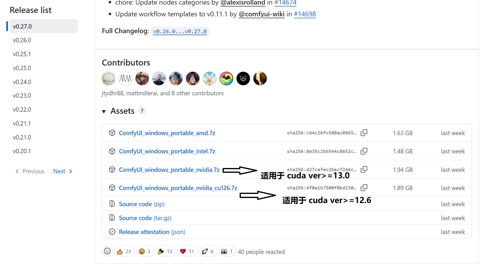
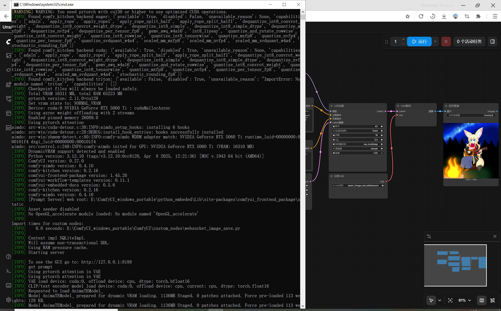

# 针对ComfyUI整合包pyorch升级方案讲解（适用于其他整合包）

事情的起因是笔者要在RTX50xx的gpu上运行windows comfyui，为了安装方便没有自建虚拟环境用pip等包管理器安装，而是从GitHub的release里面直接下载了整合包解压，我们直接进入comfyui的仓库主页：[Comfy-Org/ComfyUI](https://github.com/Comfy-Org/ComfyUI)，在右侧找到 Releases 板块（通常在About区域下方）。



如果没看到，把页面网址后面直接加上 /releases 也行，Release list选择最新版本（v0.27.0），点击进入你想下载的Release页面，找到Assets（资源）部分，这里会列出该版本的所有文件，可以看到ComfyUI_windows_portable_nvidia.7z和ComfyUI_windows_portable_nvidia_cu126.7z的文件，这里就需要根据自己驱动支持的cuda的版本进行选择。

1. ` ComfyUI_windows_portable_nvidia.7z` 整合包内置的是更新的cu130，适合驱动较新的显卡（例如RTX40xx/50xx/h200/b200...）
2. `ComfyUI_windows_portable_nvidia_cu126.7z` 合包内置的是较旧的cu126，适合更旧的系统（例如v100/RTX20/30...）

先运行 `nvidia-smi`，得到如下信息：
```
PS C:\Windows\system32> nvidia-smi
Fri Jul 10 14:35:17 2026
+-----------------------------------------------------------------------------------------+
| NVIDIA-SMI 576.80                 Driver Version: 576.80         CUDA Version: 12.9     |
|-----------------------------------------+------------------------+----------------------+
| GPU  Name                  Driver-Model | Bus-Id          Disp.A | Volatile Uncorr. ECC |
| Fan  Temp   Perf          Pwr:Usage/Cap |           Memory-Usage | GPU-Util  Compute M. |
|                                         |                        |               MIG M. |
|=========================================+========================+======================|
|   0  NVIDIA GeForce RTX 5060 Ti   WDDM  |   00000000:C1:00.0 Off |                  N/A |
|  0%   52C    P8              9W /  180W |   13421MiB /  16311MiB |      4%      Default |
|                                         |                        |                  N/A |
+-----------------------------------------+------------------------+----------------------+

+-----------------------------------------------------------------------------------------+
| Processes:                                                                              |
|  GPU   GI   CI              PID   Type   Process name                        GPU Memory |
|        ID   ID                                                               Usage      |
|=========================================================================================|
```

可以看到当前驱动支持的最高cuda version是cu129，由于cuda version是向下兼容的，很显然我们需要安装`ComfyUI_windows_portable_nvidia_cu126.7z`，到这里一切都很顺利。

> 关于驱动与cuda兼容性说明：CUDA 是**向下兼容**的，但这里的“下”是指应用（PyTorch），不是驱动。规则是：**驱动版本必须 ≥ 工具包版本**。（例如cu130的驱动可以运行cu126也可以运行cu130的torch、cuda toolkit等但反之不行例如在cu126的驱动上运行cu130的torch，因为新版 cuda runtime 里的 GPU 指令（kernel image）在旧驱动上无法识别，必然会报错）

---

解压完成后运行 `run_nvidia_gpu.bat`，可以发现以下warn：

```
[WARNING] WARNING: You need pytorch with cu130 or higher to use optimized CUDA operations.
[INFO] Found comfy_kitchen backend eager: {'available': True, 'disabled': False, 'unavailable_reason': None, 'capabilities': ['adaln', 'apply_rope', 'apply_rope1', 'apply_rope_split_half', 'apply_rope_split_half1', 'dequantize_int8_convrot_weight', 'dequantize_int8_convrot_weight_dtype', 'dequantize_int8_simple', 'dequantize_int8_simple_dtype', 'dequantize_mxfp8', 'dequantize_nvfp4', 'dequantize_per_tensor_fp8', 'gemv_awq_w4a16', 'int8_linear', 'quantize_and_rotate_rowwise', 'quantize_int8_convrot_weight', 'quantize_int8_rowwise', 'quantize_int8_tensorwise', 'quantize_mxfp8', 'quantize_nvfp4', 'quantize_per_tensor_fp8', 'quantize_svdquant_w4a4', 'scaled_mm_mxfp8', 'scaled_mm_nvfp4', 'scaled_mm_svdquant_w4a4', 'stochastic_rounding_fp8']}
[INFO] Found comfy_kitchen backend cuda: {'available': True, 'disabled': True, 'unavailable_reason': None, 'capabilities': ['adaln', 'apply_rope', 'apply_rope1', 'apply_rope_split_half', 'apply_rope_split_half1', 'dequantize_int8_convrot_weight', 'dequantize_int8_convrot_weight_dtype', 'dequantize_int8_simple', 'dequantize_int8_simple_dtype', 'dequantize_nvfp4', 'dequantize_per_tensor_fp8', 'gemv_awq_w4a16', 'quantize_and_rotate_rowwise', 'quantize_int8_convrot_weight', 'quantize_int8_rowwise', 'quantize_int8_tensorwise', 'quantize_mxfp8', 'quantize_nvfp4', 'quantize_per_tensor_fp8', 'quantize_svdquant_w4a4', 'scaled_mm_svdquant_w4a4', 'stochastic_rounding_fp8']}
[INFO] Found comfy_kitchen backend triton: {'available': False, 'disabled': True, 'unavailable_reason': "ImportError: No module named 'triton'", 'capabilities': []}
[INFO] Checkpoint files will always be loaded safely.
E:\ComfyUI_windows_portable\python_embeded\Lib\site-packages\torch\cuda\__init__.py:384: UserWarning: Found GPU0 NVIDIA GeForce RTX 5060 Ti which is of compute capability (CC) 12.0.
The following list shows the CCs this version of PyTorch was built for and the hardware CCs it supports:
- 5.0 which supports hardware CC >=5.0,<6.0 except {5.3}
- 6.0 which supports hardware CC >=6.0,<7.0 except {6.2}
- 6.1 which supports hardware CC >=6.1,<7.0 except {6.2}
- 7.0 which supports hardware CC >=7.0,<8.0 except {7.2}
- 7.5 which supports hardware CC >=7.5,<8.0
- 8.0 which supports hardware CC >=8.0,<9.0 except {8.7}
- 8.6 which supports hardware CC >=8.6,<9.0 except {8.7}
- 9.0 which supports hardware CC >=9.0,<10.0
Please follow the instructions at https://pytorch.org/get-started/locally/ to install a PyTorch release that supports one of these CUDA versions: 13.0, 13.2
  _warn_unsupported_code(d, device_cc, code_ccs)
E:\ComfyUI_windows_portable\python_embeded\Lib\site-packages\torch\cuda\__init__.py:502: UserWarning:
NVIDIA GeForce RTX 5060 Ti with CUDA capability sm_120 is not compatible with the current PyTorch installation.
The current PyTorch install supports CUDA capabilities sm_50 sm_60 sm_61 sm_70 sm_75 sm_80 sm_86 sm_90.
If you want to use the NVIDIA GeForce RTX 5060 Ti GPU with PyTorch, please check the instructions at https://pytorch.org/get-started/locally/

  queued_call()
[INFO] Total VRAM 16311 MB, total RAM 65223 MB
[INFO] pytorch version: 2.12.0+cu126
[INFO] Set vram state to: NORMAL_VRAM
[INFO] Device: cuda:0 NVIDIA GeForce RTX 5060 Ti : cudaMallocAsync
[INFO] Using async weight offloading with 2 streams
[INFO] Enabled pinned memory 26089.0
[INFO] Using pytorch attention
aimdo: src-win/cuda-detour.c:38:INFO:aimdo_setup_hooks: installing 6 hooks
aimdo: src-win/cuda-detour.c:28:DEBUG:install_hook_entries: hooks successfully installed
aimdo: src-win/shmem-detect.c:80:INFO:comfy-aimdo WDDM adapter match: NVIDIA GeForce RTX 5060 Ti runtime_luid=00000000:000101f4 dxgi_luid=00000000:000101f4
aimdo: src/control.c:248:INFO:comfy-aimdo inited for GPU: NVIDIA GeForce RTX 5060 Ti (VRAM: 16310 MB)
[INFO] DynamicVRAM support detected and enabled
[INFO] Python version: 3.12.10 (tags/v3.12.10:0cc8128, Apr  8 2025, 12:21:36) [MSC v.1943 64 bit (AMD64)]
[INFO] ComfyUI version: 0.27.0
[INFO] comfy-aimdo version: 0.4.10
[INFO] comfy-kitchen version: 0.2.16
...
```

即使运行workflow也会卡在KSampler报错：

```
torch.AcceleratorError: CUDA error: no kernel image is available for execution on the device
Search for `cudaErrorNoKernelImageForDevice' in https://docs.nvidia.com/cuda/cuda-runtime-api/group__CUDART__TYPES.html for more information.
CUDA kernel errors might be asynchronously reported at some other API call, so the stacktrace below might be incorrect.
For debugging consider passing CUDA_LAUNCH_BLOCKING=1
Compile with `TORCH_USE_CUDA_DSA` to enable device-side assertions.
```

那么结论就显而易见了：GPU 驱动版本（CUDA Driver）太旧，无法支持 PyTorch 编译时所用的 CUDA 工具包版本。也就是说整合包内置的cu12.6 torch最高只能支持到**sm_90**的cuda compatibility，sm_100/103/120最低支持的cuda版本为12.8，而我们驱动支持cu12.9，因此我们有两个解决方案：

1. **升级驱动（推荐，如果想用最新功能）**：去 NVIDIA 官网下载安装 **≥ 580.88** 系列版本的驱动，作为首发版本支持CUDA 13.0。安装后重启，再用 `nvidia-smi` 确认右上角版本是否 ≥ 13.0。
2. **降级 PyTorch（更简单稳定）**：降级 PyTorch，直接安装和你驱动兼容的 PyTorch 版本。例如驱动是 12.8，则安装 cu128的torch，考虑到comfyui频繁更新应尽量使用最新版本。

---

由于笔者的系统环境比较复杂，因此选择方案二。
需要注意的是，由于python_embeded为了隔离无法像系统级 Python / 虚拟环境（venv）那样直接运行pip（没有自动加入 PATH + 没有激活机制），因此需要借助 `.\python_embeded\python.exe -s -m pip install 包名` 这种方式来管理包。

win+r启动powershell，运行以下命令：

```
# 1. 先用cd进入comfyui安装的根目录
cd E:\ComfyUI_windows_portable

# 2. 卸载所有cu12.6的torch组件（torch torchvision torchaudio），按y确认
.\python_embeded\python.exe -s -m pip uninstall torch torchvision torchaudio

# 3. 安装Latest Stable版本的cu12.8 torch组件（requires Python 3.10 or later）
.\python_embeded\python.exe -s -m pip install torch torchvision torchaudio --index-url https://download.pytorch.org/whl/cu128

# 4. 退出
exit
```

日志显示如下即操作成功：

```
PS D:\Software\ComfyUI_windows_portable> .\python_embeded\python.exe -s -m pip uninstall torch torchvision torchaudio
Found existing installation: torch 2.12.0+cu126
Uninstalling torch-2.12.0+cu126:
  Would remove:
    d:\software\comfyui_windows_portable\python_embeded\lib\site-packages\functorch\*
    d:\software\comfyui_windows_portable\python_embeded\lib\site-packages\torch-2.12.0+cu126.dist-info\*
    d:\software\comfyui_windows_portable\python_embeded\lib\site-packages\torch\*
    d:\software\comfyui_windows_portable\python_embeded\lib\site-packages\torchgen\*
    d:\software\comfyui_windows_portable\python_embeded\scripts\torchfrtrace.exe
    d:\software\comfyui_windows_portable\python_embeded\scripts\torchrun.exe
Proceed (Y/n)? y
  Successfully uninstalled torch-2.12.0+cu126
Found existing installation: torchvision 0.27.0+cu126
Uninstalling torchvision-0.27.0+cu126:
  Would remove:
    d:\software\comfyui_windows_portable\python_embeded\lib\site-packages\torchvision-0.27.0+cu126.dist-info\*
    d:\software\comfyui_windows_portable\python_embeded\lib\site-packages\torchvision\*
Proceed (Y/n)? y
  Successfully uninstalled torchvision-0.27.0+cu126
Found existing installation: torchaudio 2.11.0+cu126
Uninstalling torchaudio-2.11.0+cu126:
  Would remove:
    d:\software\comfyui_windows_portable\python_embeded\lib\site-packages\torchaudio-2.11.0+cu126.dist-info\*
    d:\software\comfyui_windows_portable\python_embeded\lib\site-packages\torchaudio\*
Proceed (Y/n)? y
  Successfully uninstalled torchaudio-2.11.0+cu126
PS D:\Software\ComfyUI_windows_portable> .\python_embeded\python.exe -s -m pip install torch torchvision torchaudio --index-url https://download.pytorch.org/whl/cu128
Looking in indexes: https://download.pytorch.org/whl/cu128
Collecting torch
  Downloading torch-2.11.0%2Bcu128-cp312-cp312-win_amd64.whl.metadata (29 kB)
Collecting torchvision
  Downloading torchvision-0.26.0%2Bcu128-cp312-cp312-win_amd64.whl.metadata (5.6 kB)
Collecting torchaudio
  Downloading torchaudio-2.11.0%2Bcu128-cp312-cp312-win_amd64.whl.metadata (7.0 kB)
Requirement already satisfied: filelock in .\python_embeded\Lib\site-packages (from torch) (3.29.0)
Requirement already satisfied: typing-extensions>=4.10.0 in .\python_embeded\Lib\site-packages (from torch) (4.15.0)
Requirement already satisfied: setuptools<82 in .\python_embeded\Lib\site-packages (from torch) (81.0.0)
Requirement already satisfied: sympy>=1.13.3 in .\python_embeded\Lib\site-packages (from torch) (1.14.0)
Requirement already satisfied: networkx>=2.5.1 in .\python_embeded\Lib\site-packages (from torch) (3.6.1)
Requirement already satisfied: jinja2 in .\python_embeded\Lib\site-packages (from torch) (3.1.6)
Requirement already satisfied: fsspec>=0.8.5 in .\python_embeded\Lib\site-packages (from torch) (2026.4.0)
Requirement already satisfied: numpy in .\python_embeded\Lib\site-packages (from torchvision) (2.4.6)
Requirement already satisfied: pillow!=8.3.*,>=5.3.0 in .\python_embeded\Lib\site-packages (from torchvision) (12.2.0)
Requirement already satisfied: mpmath<1.4,>=1.1.0 in .\python_embeded\Lib\site-packages (from sympy>=1.13.3->torch) (1.3.0)
Requirement already satisfied: MarkupSafe>=2.0 in .\python_embeded\Lib\site-packages (from jinja2->torch) (3.0.3)
Downloading torch-2.11.0%2Bcu128-cp312-cp312-win_amd64.whl (2753.2 MB)
   ------- -------------------------------- 0.5/2.8 GB 24.4 MB/s eta 0:01:32
WARNING: Connection timed out while downloading.
WARNING: Attempting to resume incomplete download (531.9 MB/2753.2 MB, attempt 1)
WARNING: Retrying (Retry(total=4, connect=None, read=None, redirect=None, status=None)) after connection broken by 'SSLEOFError(8, '[SSL: UNEXPECTED_EOF_WHILE_READING] EOF occurred in violation of protocol (_ssl.c:1010)')': /whl/cu128/torch-2.11.0%2Bcu128-cp312-cp312-win_amd64.whl
Resuming download torch-2.11.0%2Bcu128-cp312-cp312-win_amd64.whl (531.9 MB/2753.2 MB)
   ---------------------------------------- 2.8/2.8 GB 29.2 MB/s  0:01:21
Downloading torchvision-0.26.0%2Bcu128-cp312-cp312-win_amd64.whl (9.6 MB)
   ---------------------------------------- 9.6/9.6 MB 37.3 MB/s  0:00:00
Downloading torchaudio-2.11.0%2Bcu128-cp312-cp312-win_amd64.whl (1.7 MB)
   ---------------------------------------- 1.7/1.7 MB 15.0 MB/s  0:00:00
Installing collected packages: torchaudio, torch, torchvision
   ------------- -------------------------- 1/3 [torch]  WARNING: The scripts torchfrtrace.exe and torchrun.exe are installed in 'D:\Software\ComfyUI_windows_portable\python_embeded\Scripts' which is not on PATH.
  Consider adding this directory to PATH or, if you prefer to suppress this warning, use --no-warn-script-location.
Successfully installed torch-2.11.0+cu128 torchaudio-2.11.0+cu128 torchvision-0.26.0+cu128
```

再次运行bat启动comfyui运行workflow，以上警告全部消失，KSampler正常运行，问题解决


