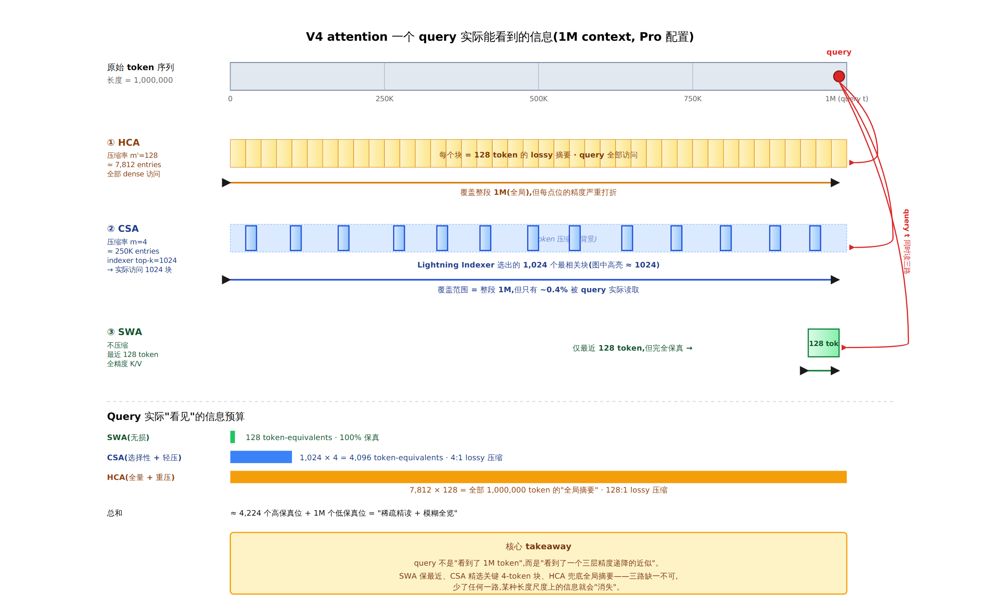
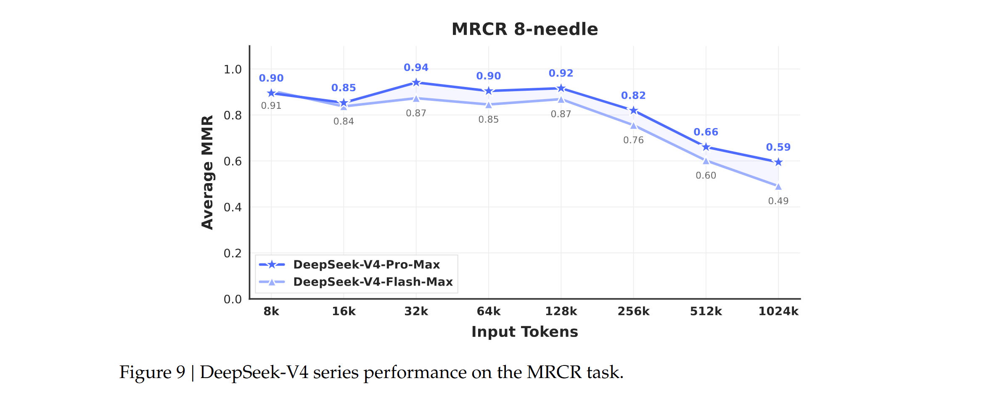

# 【DeepSeek V4 Paper读后感-01】1M Context ≠ 无损长记忆

## 从 DeepSeek-V4 看长上下文模型的工程折中

> 技术博客 · 长上下文架构拆解 · 2026 年 4 月

DeepSeek-V4 把 1M context 做到了"日常可服务",代价不是更便宜的算力,而是把 attention 这个原本"无损"的操作,系统性地改造成一套**有损压缩 + 稀疏检索 + 局部窗口保真**的复合体系。本文按"每个 query 实际能精确看到多少信息"这个口径,把 V4 的 CSA、HCA、Sliding Window、Attention Sink、Partial RoPE 拆开来看,顺便指出官方 paper 包装中被淡化的那部分质量代价。

---

## 1. 引子:1M 数字背后的两种叙事

开源社区现在普遍把"context length"当成一个独立的 spec 项,就像 RAM 大小一样。Llama 4 1M、Qwen3 256K、GLM 5.1 1M、DeepSeek-V4 1M——表格上看是个数字,默认值是"模型在这个长度内能像短序列一样工作"。

这是一个误读。Anthropic、Google 这类闭源 frontier lab 没有公开他们的长上下文架构,但当 Claude Opus 4.6 在 1M MRCR 8-needle 上拿到 92.9 分、Gemini 3.1 Pro 拿到 92.4 分的时候,你大致可以推断他们用的是某种**接近 dense** 的方案——以工程代价换 retrieval ceiling。DeepSeek-V4 走的是另一条路:**承认 attention 在 1M 上必须有损,然后把"损失"分配到模型最不敏感的位置。**

这条路线走完之后,Pro 在 1M MRCR 8-needle 拿到 83.5,Flash 拿到 49.4,而 V3.2 在同一长度根本部署不动。V4 的"1M"不是"无损 1M",是"在可接受的质量代价下把 1M 变成可服务的 1M"。

把这个判断当成全文的 anchor。下面我们顺着 V4 的架构图一层一层看,这个判断会越来越实。

---

## 2. 数字钩子:27% / 10% 与 10% / 7% 的真实含义

论文摘要的核心 pitch 是这两组百分比:

- **V4-Pro vs V3.2 @ 1M context**: single-token inference FLOPs 降到 27%,KV cache 降到 10%
- **V4-Flash vs V3.2 @ 1M context**: single-token inference FLOPs 降到 10%,KV cache 降到 7%
- **VS BF16 GQA8 baseline @ 1M**:V4 系列的 KV cache ≈ baseline 的 2%

这些数字是诚实的——V3.2 本身已经引入了 DSA(DeepSeek Sparse Attention),所以这是已经优化过的基线上的增量。但这里有几个容易被读者忽略的脚注:

> **脚注 1 · 比较基准是 V3.2,不是 vanilla attention。** 拿 V3.2 vs Llama 风格 dense attention 比,本身就有 3–5x 的差距。所以"V4 比 V3.2 节省 10x"绝不等价于"V4 比 dense attention 节省 30x";它更接近"在已经稀疏化的基线上,我们再压一个数量级"。

> **脚注 2 · FP4 × FP8 的"1/3 加速"是未来硬件期权,不是现成收益。** 在 H100 / H200 / B200 上,FP4 × FP8 的峰值 FLOPs 和 FP8 × FP8 相同。V4 论文写"theoretically can be 1/3 more efficient on future hardware",这是给 B300 / NVFP4 这类未来硬件预留的伏笔,**今天部署拿不到**。

> **脚注 3 · "2% KV cache vs BF16 GQA8" 是四层压缩的乘积,不是单层魔法。**
>
> - 序列维度压缩 (CSA m=4 / HCA m'=128)
> - K 与 V 共享(MLA 思路,省一半)
> - BF16 → FP8(非 RoPE 维度,再省 ~50%)
> - Indexer KV 用 FP4(再降一档)
> 
> 四层叠起来,才有 2%。每一层都要付出对应的信息损失——这是后面章节会反复强调的核心代价。

把这些数字当成"事实",但同时记住它们是**在 retrieval 质量降低的前提下**取得的。Figure 9 里 MRCR 8-needle 从 8K 上下文的 0.94 一路降到 1M 上下文的 0.59 / 0.49,这才是质量代价的曲线。

---

## 3. 架构总览:V4 attention 是一个三路并行的检索系统

在拆 CSA / HCA 各自的细节之前,先把全局图建立起来。V4 的每个 attention 层(除最前面 2 层外)其实是一个**三路并行**的结构,query 在每一层同时访问三条信息通道:

*图 1 · DeepSeek-V4 attention 一个 query 在 1M context 下实际访问的信息预算(Pro 配置:m=4, top-k=1024, m'=128, n_win=128)。CSA 提供"稀疏精度",HCA 提供"模糊全览",SWA 提供"局部保真"。三路覆盖范围与精度互补。*

---

这张图是后面所有讨论的 anchor。**注意:三条 lane 都不能单独成立**——SWA 只看 128 token,CSA 漏掉的全局信息永远拿不回来,HCA 的 128:1 压缩在精确检索任务上信息密度严重不足。这就是为什么 V4 必须三路并行,而不是选其一。

---

## 4. CSA:压缩 + 稀疏选择,精读式检索

### 4.1 两步走的设计

CSA (Compressed Sparse Attention) 的设计是**分两步把信息变薄**:

1. **第一步压缩**:每 m=4 个连续 token 的 hidden state,用一组学到的 softmax 权重压成 1 个 KV entry。1M token → 250K entries。
2. **第二步稀疏选择**:用一个独立的 Lightning Indexer 给所有 250K entries 打分,query 只 attend 排名前 top-k=1024 的那些。

这就是"压缩 + 稀疏"的双层节省。每个 query 实际访问的是 `1024 × 4 = 4096` 个原始 token 的等效信息——但**这 4096 个 token 是 indexer 帮你挑出来的"它觉得最相关的"**,不是你真正需要的。如果 indexer 选错了,你就丢失了 query 真正需要的那些块。

### 4.2 Lightning Indexer:廉价的"top-k 决定者"

Lightning Indexer 是 V3.2 引入的设计,V4 直接继承。它本质上是**一个非常瘦的、独立的 attention 子网络**,只用于评分,不参与最终输出:

- 独立的 indexer KV(每 4 token 压一个,head dim 只有 128)
- 用 FP4 精度做点积——比主 attention 的 FP8 还便宜
- ReLU 激活后取 top-k

这是工程上一个很漂亮的 decoupling:**"决定看哪里"和"看什么"被切开**。但它也带来一个根本风险:**indexer 的 ranking 质量决定了主 attention 的上限**。如果 indexer 把真正相关的 entry 排在第 1100 名,top-k=1024 的 query 就完全看不到它。

论文没有给 indexer 准确率的 ablation。在 MRCR 1M 任务上,V4 的 top-k 实际上是 `1024 / 250000 ≈ 0.41%` 覆盖率——这意味着 indexer 必须把 8 个 needle 各自所在的压缩块都排进 top-1024。任何一个掉出去,8-needle 任务就少一个。

### 4.3 Overlap 压缩:V4 在 CSA 上的小创新

CSA 相对 V3.2 DSA 的真正新东西,是 overlap compression:同时生成两组 KV(`C^a`, `C^b`),它们覆盖的 4-token 块是错开的,然后在更宽的窗口上做跨块 softmax。

这个设计的好处是**缓解了"块边界处的信息断裂"**——naive 压缩里,如果一个 needle 正好跨在两个 4-token 块之间,它的语义就被劈开了。Overlap 压缩相当于一个 50% stride 的卷积视角。

代价同样具体:**压缩前的 KV 内存需求翻倍**(两组 K、V 而不是一组),CSA 层的参数量也翻倍。这个代价被 §3.5.3 的 contextual parallelism 吸收掉,但训练时的 activation memory 压力是真实的。

---

## 5. HCA:重压缩 + 全量 dense,大粒度的全局摘要

### 5.1 一个反直觉的设计选择

HCA (Heavily Compressed Attention) 的设计哲学和 CSA 完全相反:

| 维度 | CSA | HCA |
|---|---:|---:|
| 压缩率 | m = 4 | m' = 128 |
| 压缩方式 | Overlap(两组 KV) | Non-overlap(单组 KV) |
| 是否稀疏选择 | 是(top-k=1024) | 否,全量 dense |
| 是否需要 indexer | 是(Lightning Indexer) | 否 |
| 每个 entry 浓缩多少 token | 4 | 128 |

有意思的问题来了:**HCA 为什么敢"压完就直接 dense attend",不需要稀疏选择?**

答案在数字里。1M token 经过 m'=128 压缩后,只剩 `1,000,000 / 128 ≈ 7,812` 个 entry。**7,812 个 KV 已经是一个 dense attention 完全可以负担的规模**——这相当于在 8K context 上做 dense attention,在 H100 上大约是 4 GFLOPs 量级,完全 ok。

所以 HCA 的核心交易是:**"用极端压缩换掉了稀疏选择的复杂度"**。CSA 是"轻压 + 选择",HCA 是"重压 + 全看"。两条路都是把 attention 从 $O(N^2)$ 拉到可服务区间,但通过完全不同的机制。

### 5.2 信息密度的极限

HCA 的 m'=128 意味着**每一个 compressed entry 要在一个 c=512 维向量里,塞下 128 个原始 token 的语义**。考虑到原始 hidden state 也是 d=4096~7168 维,128 token × 7168 dim = ~917K 维信息,被压到 512 维——压缩比是 **1800 : 1**。

这是 V4 整套架构里损失**最大的一环**。HCA 的 entry 注定是"全局氛围"而不是"具体事实"。它能告诉 query"1M context 的某个区域整体在讲什么",但很难精确告诉它"在第 543,217 个 token 的位置,某个变量的具体名字是什么"。

这个观察直接对应到 Figure 9 的 MRCR 曲线:精确检索任务上 V4 在 ≥256K 之后的下滑,几乎可以理解为"HCA 的语义粒度跟不上 needle 的精度需求"。

---

## 6. Sliding Window:压缩失败时的"局部保险"

### 6.1 一个被打补丁的设计

如果只看 CSA + HCA,有一个非常严重的问题:**causality 要求 query 不能 attend 到自己所在的压缩块**(否则会泄露未来 token 信息)。

这意味着:query 自己所在的最近一段 token,在 CSA / HCA 视角里是看不见的——CSA 看不到自己所在的 4-token 块,HCA 看不到自己所在的 128-token 块。

但语言建模里,**最近的几个 token 恰恰是 next-token prediction 最关键的信息源**。这个矛盾必须解决,所以 V4 加了第三路:Sliding Window Attention(SWA),每个 query 额外 attend 最近 `n_win = 128` 个未压缩 token 的 K / V。

### 6.2 一个不是巧合的相等

注意一个设计细节:`n_win = m' = 128`。这两个数字相等不是巧合——SWA 的窗口大小恰好等于 HCA 的压缩率,也就是说 SWA 刚好覆盖了 HCA 因为 causality 看不到的"当前 HCA 块"那段。

所以三路在工程上是**互补严格分工**的:

- SWA:覆盖最近的 128 token(当前 HCA 块的范围)
- HCA:覆盖此前所有压缩好的 HCA 块(最早 → ~current - 128)
- CSA:在所有 4-token 压缩块里挑 top-k=1024 个,不限位置

这个分工说明一件事:**纯压缩 attention 在工程上不可行,必须有一个未压缩的局部窗口做保底**。SWA 是"优雅的补丁",但它仍然是补丁——它的存在本身就承认了"压缩有边界"。

---

## 7. Attention Sink:让"什么都不看"成为合法选项

这个 trick 来自 StreamingLLM(Xiao et al. 2024),GPT-OSS 也用过。V4 的实现细节是:每个 attention head 有一个 learnable 标量 `z'_h`,加到 softmax 的分母里。

结果是:**attention 的总和不再被强制等于 1**,可以是 0.7、0.3、甚至接近 0。

这个 trick 在**稀疏 attention 下特别重要**。CSA 的 top-k 选出来的 1024 个 entry,有时候根本没有一个真正相关——比如 query 是"这个变量的值是?"而 indexer 把所有相关块都漏选了。没有 sink 的话,softmax 强制把 attention 平摊到这 1024 个不相关 entry 上,产生大量噪声。有 sink 之后,模型可以学会"这 1024 个我都不在乎,attention 全流向 sink",输出几乎不被这一层干扰。

> **Sink 的真实意义**:它让 attention layer 有了"放弃当前层"的合法选项。没有它,稀疏 attention 的失败模式是悄悄输出错误信号;有了它,失败模式变成输出近似 0 的信号,等下一层补救。前者是 silent corruption,后者是 graceful degradation。

---

## 8. Partial RoPE:位置编码的精打细算

V4 在 CSA / HCA 上用的是 partial RoPE——只对 query 和 KV 向量的**最后 64 维**应用 RoPE,前面的维度保持位置无关。这是 V2 MLA 时代就有的设计,V4 继承。

但 V4 多了一个有意思的小细节:**output 端的反向 RoPE**。

问题是这样:CSA / HCA 的 KV 是 K=V 共享的(MQA-style),attention 输出是 $\Sigma s_j \times V_j$ 的加权和。如果 $V_j$ 的最后 64 维带了绝对位置编码 (pos j),那么 $\Sigma s_j \times V_j$ 会把所有不同位置的 RoPE 混在一起,变成一种"位置加权和"——既不是绝对位置,也不是相对位置,几乎就是噪声。

V4 的解法:在 output 端,用 position = -i 的 RoPE 旋转 attention 输出。这样输出的"等效位置"就变成 `j - i = -dist`,即**每个 $V_j$ 对 output 的贡献按 query-key 距离重新编码**,自动转化为相对位置编码。

这个 trick 我没见有其他 paper 写过,在数学上很优雅。它解决了"K=V 共享 + 绝对 RoPE"这个组合的内在矛盾。但同样,V4 paper 没给 ablation,我们只能相信它"工作得不错"。

---

## 9. KV cache 的"五层异构"与系统侧代价

当 attention 被改造成三路并行 + 多种压缩之后,KV cache 也变成了**五种异构 KV 的混合:**

| 类型 | 每 layer 大小(1M context) | 更新规则 | 淘汰策略 |
|---|---|---|---|
| CSA main KV | ~250K × c × FP8 | append-only | 永久保留 |
| CSA indexer KV | ~250K × 128 × FP4 | append-only | 永久保留 |
| HCA KV | ~7.8K × c × FP8 | append-only | 永久保留 |
| SWA KV | 128 × c × BF16 | rolling window | 旧的覆盖 |
| Tail buffer | ≤ m' × d | 攒够就压缩,临时 | 压完释放 |

这套异构对传统的 PagedAttention(vLLM)**是直接破坏**。PagedAttention 假设每层 KV 尺寸和策略一致,V4 不再成立。

V4 的解法是把"稳态 KV"和"状态 KV"分开管理(Figure 6):

- **Classical KV cache**:存所有 append-only 的压缩 KV,块大小是 `lcm(m, m') = lcm(4, 128) = 128` 个原始 token 的整数倍
- **State cache**:存 SWA 的滚动窗口和压缩 tail buffer,固定大小 block,可以预先回收(因为可以从 checkpoint 重算)

这里有一个很 elegant 的抽象:**SWA + tail buffer 被当作一个 state-space model 的 state 来处理**——它们的值"只取决于当前位置,不积累历史",所以可以用固定 block 池子分配,丢了能从 prefill 重算。

这是一个分而治之的工程决策:与其设计一套能处理所有异构情况的复杂 cache,不如把问题切成两个各自简单的子问题。

---

## 10. 质量代价:Figure 9 的诚实曲线

把所有架构设计放下,直接看数据。Figure 9 给的是 V4 在 MRCR 8-needle 上的 retrieval 准确率随 context length 的变化:

| Context | 8K | 16K | 32K | 64K | 128K | 256K | 512K | 1024K |
|---|---:|---:|---:|---:|---:|---:|---:|---:|
| V4-Pro-Max | 0.90 | 0.85 | 0.94 | 0.90 | 0.92 | 0.82 | 0.66 | **0.59** |
| V4-Flash-Max | 0.91 | 0.84 | 0.87 | 0.85 | 0.87 | 0.76 | 0.60 | **0.49** |

对比 frontier 模型在 MRCR 1M 8-needle 上的成绩:

- **Claude Opus 4.6: 0.929**
- **Gemini 3.1 Pro: ~0.92**(论文转报数据)
- **V4-Pro-Max: 0.835**(table 7 数据)

有几个值得指出来的事实:

> **事实 1:** 在 128K 以内,V4-Pro 表现接近 frontier(0.92 vs 0.93)。**1M context 才是真正分化的地方**——在那里,V4 落后 Claude 9–10 个绝对百分点。

> **事实 2:** V4-Pro 在 1M 上的 0.59 高于 V4-Flash 的 0.49。**更大的总参数 + 更大的 top-k(1024 vs 512)对长上下文检索有直接帮助**——Pro 看到的"高保真位"是 Flash 的两倍。

> **事实 3:** Figure 9 的曲线在 32K 处出现一个 0.94 的"反弹",此后单调下降。这个反弹可能是 dense attention warmup 阶段(<1T token + 64K 长度引入 sparse 之前)留下的"sweet spot"。1M 处的 0.59 与 8K 处的 0.90 相差 **34 个百分点**——这就是"1M context 的质量代价"的具体数字。

论文的措辞值得读一遍:

> "retrieval performance remains highly stable within a 128K context window. While a performance degradation becomes visible beyond the 128K mark, the model's retrieval capabilities at 1M tokens remain remarkably strong compared to both proprietary and open-source counterparts."

"remarkably strong compared to ... counterparts" 这句是真的——和开源同档比 V4 确实领先。但被淡化的是"在 128K 之后从 0.92 降到 0.59"这件事本身。**对一篇严谨的技术 reader 来说,这条曲线就是 V4 的工程折中的最直接证据**。

---

## 11. 一个反直觉的小观察:V4 在 1M 反而比 128K 高?

注意 Table 7 的一组数据:

|  | MRCR 8-needle 128K | MRCR 8-needle 1M |
|---|---:|---:|
| V4-Pro-Max | 78.6 | **83.5** |
| V4-Pro | 78.4 | **81.0** |

**1M 的分数高于 128K?**

这和 Figure 9(同一份数据但跨更多长度)的趋势相反——Figure 9 是单调下降的。Table 7 的两个数字是"特定长度的官方 highlight 数",反而出现 1M > 128K。

论文没解释这个反常。我的两个猜测:

1. **训练分布**:V4 后期 long-context 训练阶段集中在 1M 长度,模型对这个长度"更熟悉"。128K 在训练 schedule 里只是"中转站",可能没有充分定型。
2. **HCA 的 sweet spot**:1M 序列经过 m'=128 压缩 → 7,812 个 dense entry,正好是 HCA dense attention 设计的最优点。128K 序列只压出 1,000 个 entry,反而太稀疏,HCA 的 dense 优势发挥不出来。

无论哪种解释,这个反常数据本身说明一件事:**V4 的长上下文能力是"trained for 1M",而不是"generic across lengths"**。如果你的实际任务长度是 200K~500K,你拿到的可能不是论文 highlight 的那个最优点。

---

## 12. 把所有部件拼回去:V4 attention 的真实架构定位

把前面 11 节的内容浓缩成一句话:

> V4 的 attention 不是 attention,是一套"**有损压缩 + 稀疏检索 + 局部保真 + 显式弃权**"的复合检索系统。每一层 query 同时调用三种粒度的视图(SWA 局部、CSA 精读、HCA 全览),依靠 indexer 的排序质量、attention sink 的"放弃"机制和 partial RoPE 的位置耦合,把 1M token 的"看上去不可能"工程化成"日常能服务"。

这个设计的**真正定位**不是"创新",而是**把一系列现成的、各自验证过的 component 工程化地组装在一起**:

- Lightning Indexer + top-k:V3.2 DSA
- Latent query / 低秩 K=V:V2 MLA
- Partial RoPE:V2 起就有
- Sliding Window:Mistral / Gemma 主流方案
- Attention Sink:StreamingLLM、GPT-OSS
- Compress + dense interleaved:Native Sparse Attention 路线

V4 的**真正贡献是工程上的组合 + 端到端 1M 的可服务性**:让这些 components 共存于一个稳定训练 32T token 的 1.6T 参数 MoE 中,并设计出与之配套的 KV cache 管理、稀疏 attention kernel、训练框架的 contextual parallelism。这是一项扎实的系统工作,但它**不是"无损 1M 的突破"**——它是"在可接受的精确检索质量损失下,把 1M context 的边际成本拉到可接受区间"的工程胜利。

---

## 13. 给读者的几条 takeaway

### 13.1 当一个开源模型宣称 1M context

- **问它 attention 是不是 dense**。如果不是,它的 1M 一定是 lossy 1M。
- **问 MRCR 1M 8-needle 的成绩**。0.85+ 是 frontier 水平,0.5–0.6 是"能跑但不该用做精确检索"。
- **问压缩比**。HCA-style 的 128:1 压缩注定让某些精度任务失败,这不是"训得好就能修复"的事。

### 13.2 当你设计长上下文应用

- **不要用 V4 做 strict needle retrieval**。这种任务用 Claude Opus 4.6 / Gemini 3.1 Pro,或者上 RAG。
- **V4 的 sweet spot 是 long-document reasoning**(如 CorpusQA 上 V4-Pro-Max 33.6 vs Gemini 35.4),即"需要全局氛围 + 局部细节,但不要求点对点精确匹配"的任务。
- 典型适用场景:大型代码库分析、多文档摘要、agent 的长 trajectory 维持。
- 典型不适用场景:法律条款检索、医学文献中特定数字 / 名词的提取、长 transcript 中精确时间点的引用。

### 13.3 当你做架构研究

- **Lossy long-context 现在是一条共识路径**。Native Sparse Attention、MLA、DSA、Linear Attention、State-Space hybrid 全在这条路径上,只是压缩 / 稀疏 / 状态化的比例不同。
- **V4 的真正经验是"分级"**:不同 layer 用不同的压缩策略(CSA / HCA 交替),不同 lane 用不同的精度(SWA 全保真 + CSA 高密 + HCA 低密)。这种 hybrid 比单一策略效果好得多。

- **三个值得继续追问的开放问题**:
  1. Indexer 的 top-k ranking 准确率如何 ablation 出来?这是 CSA 上限的瓶颈。
  2. HCA 的 m'=128 是不是"经验最优",还是 m'=64 / 256 也行?Paper 没扫这个曲线。
  3. 三路 lane 之间的 attention 权重分配是模型自己学的,有没有可能 sink 已经在某些层"把整个 HCA lane 关掉了"?这会暗示 HCA 的实际贡献被高估。

---

## 14. 结语

"1M context"作为 spec 项,是 2025–2026 年开源模型竞赛里被反复刷新的一个指标。V4 的真正贡献在于,它**第一次把"1M 是怎么做出来的"完整地写在了 paper 里**——不是"我们扩大了 attention 窗口",而是"我们用 5 种压缩 / 选择 / 窗口机制把 attention 切碎,让每种机制处理它最擅长的尺度"。

这种透明度本身就值得鼓励。但读者(尤其是工程读者)需要看到 spec 数字背后的架构成本:

- 1M 的 KV cache 之所以只占 BF16 GQA8 的 2%,是因为信息被四层压缩榨过
- 1M 的 FLOPs 之所以只有 V3.2 的 27%,是因为 attention 已经从 $O(N^2)$ 退化成"分层近似的 $O(N \cdot \log N)$"
- 1M 的 retrieval 准确率之所以从 8K 的 0.94 跌到 0.59,是因为这套近似在精确性上有 ceiling,而 ceiling 不会被训练数据治好

下次再有人说"1M context model 来了,RAG 该退休了",请把 Figure 9 那条从 0.94 跌到 0.59 的曲线发给他。

**1M context ≠ 无损长记忆**。它是一种工程折中的胜利,也是一份诚实的告知:某些任务,你仍然需要 RAG,需要 dense attention,需要其他外部记忆系统。

V4 没有解决长上下文,V4 只是把"长上下文的可服务边界"往前推了一大步。这已经足够好了。

---

参考资料:DeepSeek-AI, "DeepSeek-V4: Towards Highly Efficient Million-Token Context Intelligence" (2026); Hugging Face Blog, "DeepSeek-V4: a million-token context that agents can actually use"; NVIDIA Developer Blog, "Build with DeepSeek V4 Using NVIDIA Blackwell"; Andrew Lukyanenko, "DeepSeek-V4 Review: Why Million-Token Context Needs Efficient Attention" (Medium, Apr 2026); BigDataBoutique, "Needle in haystack? Optimizing Retrieval and RAG over Long Context Windows"; Liu et al., "Lost in the Middle: How Language Models Use Long Contexts"; Xiao et al., "Efficient Streaming Language Models with Attention Sinks" (StreamingLLM); GitHub, "CalvinXKY/InfraTech"; 以及项目内 V4 论文逐节精读笔记。