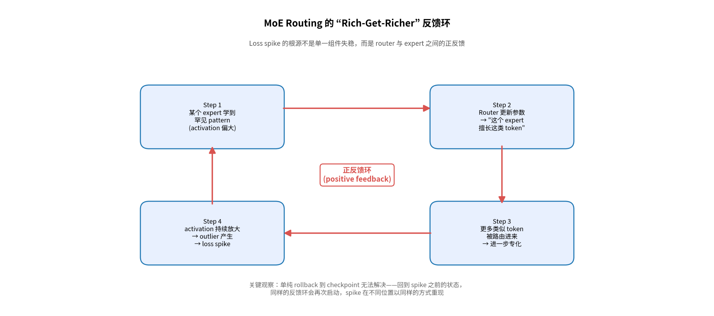
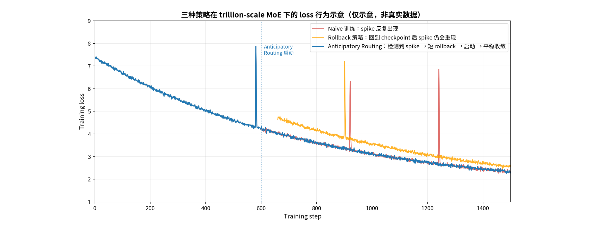
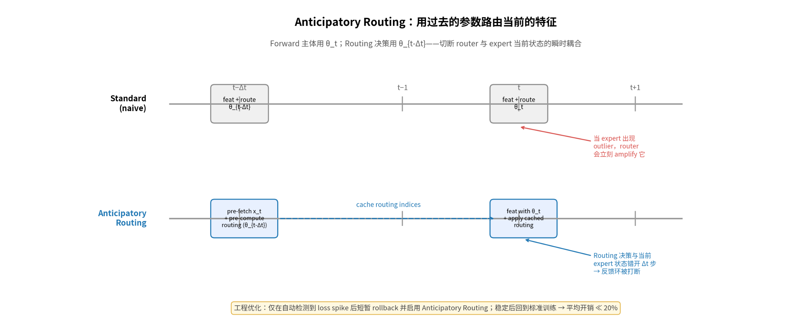
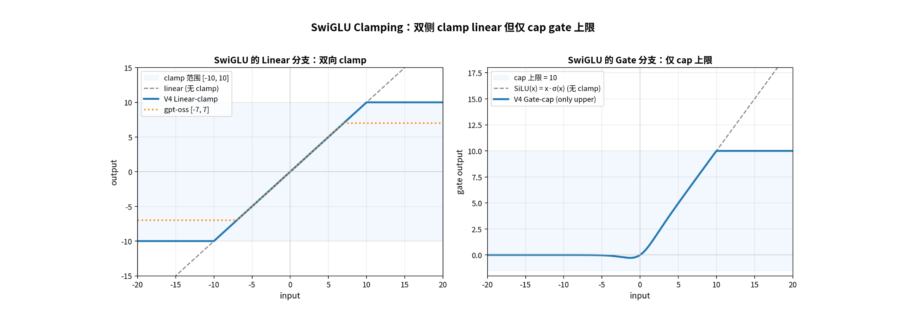
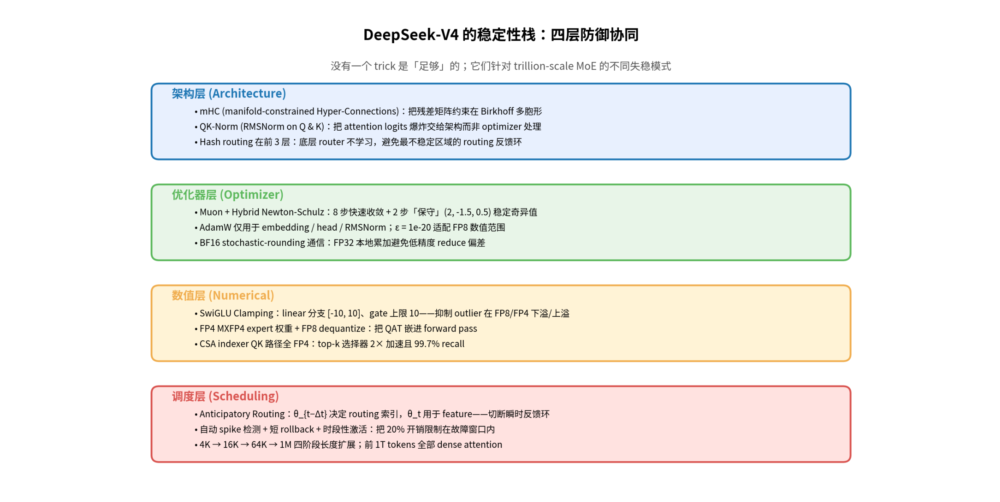
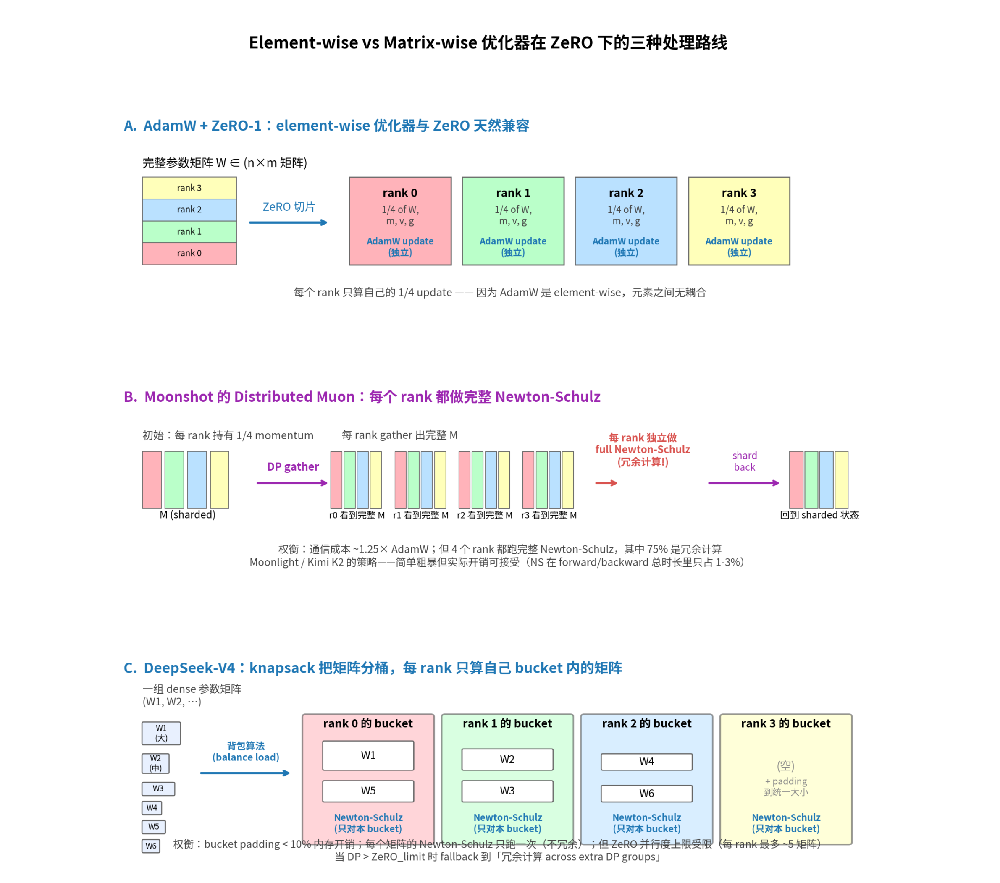
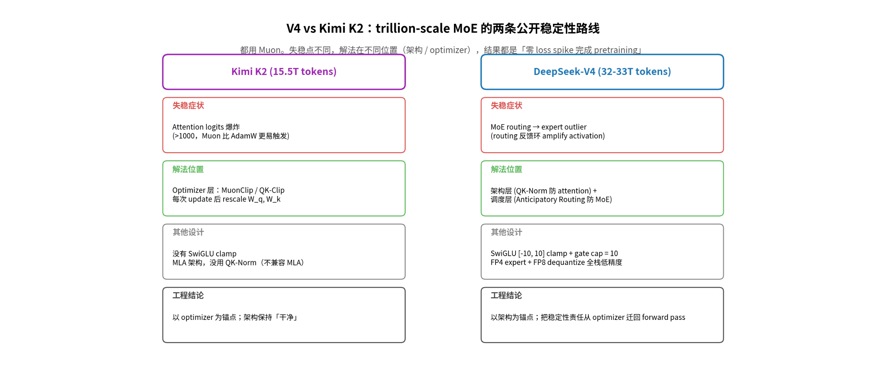

<!-- 目录 -->
- [能训出来才是第一性原理](#能训出来才是第一性原理)
    - [DeepSeek-V4 的训练稳定性工程：Anticipatory Routing、SwiGLU Clamping 与 trillion-scale MoE 的失控机制](#deepseek-v4-的训练稳定性工程anticipatory-routingswiglu-clamping-与-trillion-scale-moe-的失控机制)
  - [楔子：当一切正确时，模型仍然会炸](#楔子当一切正确时模型仍然会炸)
  - [§1 Loss spike 的解剖学：rich-get-richer 反馈环](#1-loss-spike-的解剖学rich-get-richer-反馈环)
    - [1.1 它不是 random fluctuation](#11-它不是-random-fluctuation)
    - [1.2 反馈环的具体机制](#12-反馈环的具体机制)
    - [1.3 为什么 rollback 不够](#13-为什么-rollback-不够)
  - [§2 Anticipatory Routing：用过去的参数路由当前的特征](#2-anticipatory-routing用过去的参数路由当前的特征)
    - [2.1 核心思想：时间错位](#21-核心思想时间错位)
    - [2.2 别被「decoupled update」糊弄了——它不是真的双份参数](#22-别被decoupled-update糊弄了它不是真的双份参数)
    - [2.3 动态激活：让 20% 开销只在 spike 窗口生效](#23-动态激活让-20-开销只在-spike-窗口生效)
    - [2.4 一个未明说的副作用：Anticipatory Routing 也是 router 的「正则化」](#24-一个未明说的副作用anticipatory-routing-也是-router-的正则化)
  - [§3 SwiGLU Clamping：FP8/FP4 时代的硬约束](#3-swiglu-clampingfp8fp4-时代的硬约束)
    - [3.1 不是 V4 原创](#31-不是-v4-原创)
    - [3.2 为什么 gate 只 cap 上限不限下限？](#32-为什么-gate-只-cap-上限不限下限)
    - [3.3 真正的痛点：FP8/FP4 时代 SwiGLU 是 outlier 放大器](#33-真正的痛点fp8fp4-时代-swiglu-是-outlier-放大器)
    - [3.4 V4 SwiGLU Clamping 的 hidden role：FP4 训练的 enabler](#34-v4-swiglu-clamping-的-hidden-rolefp4-训练的-enabler)
  - [§4 把所有稳定性设计串成一条线](#4-把所有稳定性设计串成一条线)
    - [4.1 一个核心观察](#41-一个核心观察)
    - [4.2 架构层：mHC + QK-Norm + Hash routing](#42-架构层mhc--qk-norm--hash-routing)
    - [4.3 优化器层：Hybrid Newton-Schulz 的「保守 2 步」](#43-优化器层hybrid-newton-schulz-的保守-2-步)
    - [4.4 数值层：SwiGLU Clamping + AdamW ε = 1e-20](#44-数值层swiglu-clamping--adamw-ε--1e-20)
    - [4.5 调度层：Anticipatory Routing + Length Schedule + Dense Warmup](#45-调度层anticipatory-routing--length-schedule--dense-warmup)
    - [4.6 协同效应：单一 trick 永远不够](#46-协同效应单一-trick-永远不够)
  - [§5 深入工程：Muon × ZeRO 的不兼容如何被解决](#5-深入工程muon--zero-的不兼容如何被解决)
    - [5.1 element-wise vs matrix-wise：为什么 ZeRO 假设崩了](#51-element-wise-vs-matrix-wise为什么-zero-假设崩了)
    - [5.2 Moonshot 的方案：gather everywhere（图 7B）](#52-moonshot-的方案gather-everywhere图-7b)
    - [5.3 V4 的方案：knapsack 分桶 + 选择性冗余（图 7C）](#53-v4-的方案knapsack-分桶--选择性冗余图-7c)
    - [5.4 V4 vs Moonshot：两种分布式 Muon 的对比](#54-v4-vs-moonshot两种分布式-muon-的对比)
    - [5.5 MoE 参数：跨层全局 flatten](#55-moe-参数跨层全局-flatten)
    - [5.6 BF16 stochastic rounding：通信优化的隐藏一笔](#56-bf16-stochastic-rounding通信优化的隐藏一笔)
    - [5.7 工程实践指南：你想用 Muon 怎么办？](#57-工程实践指南你想用-muon-怎么办)
    - [5.8 一个被论文跳过的问题](#58-一个被论文跳过的问题)
  - [§6 V4 vs Kimi K2：两条互补的稳定性路线](#6-v4-vs-kimi-k2两条互补的稳定性路线)
    - [6.1 Kimi K2 的故事：MuonClip 解决 attention 爆炸](#61-kimi-k2-的故事muonclip-解决-attention-爆炸)
    - [6.2 V4 的故事：把 attention 稳定性挪回架构](#62-v4-的故事把-attention-稳定性挪回架构)
    - [6.3 互补，不重叠](#63-互补不重叠)
  - [§7 诚实承认未解的问题](#7-诚实承认未解的问题)
  - [结语：能训出来才是第一性原理](#结语能训出来才是第一性原理)
  - [附：进一步阅读清单](#附进一步阅读清单)

<!-- 正文 -->
# 能训出来才是第一性原理
### DeepSeek-V4 的训练稳定性工程：Anticipatory Routing、SwiGLU Clamping 与 trillion-scale MoE 的失控机制

*DeepSeek-V4 技术报告读后感*
*2026 年 4 月*

---

## 楔子：当一切正确时，模型仍然会炸

DeepSeek-V4 技术报告里有一段话非常诚实：

> “Training trillion-parameter MoE models presents significant stability challenges, and DeepSeek-V4 series are no exception. We encountered notable instability challenges during training. While simple rollbacks could temporarily restore the training state, they proved inadequate as a long-term solution because they do not prevent the recurrence of loss spikes.”

把这段话翻译成训练系统工程师听得懂的话：**我们的 1.6T MoE 训不下去过。回到 checkpoint 接着训也没用——同样的 spike 会再次出现**。

放到全篇语境里看，V4 的几乎一切设计——不只是 `Anticipatory Routing` 和 `SwiGLU Clamping` 这两个被显式承认的「稳定性 hack」，还包括 `mHC`、`QK-Norm`、`Hash routing`、Hybrid Newton-Schulz 的两阶段系数、$ε = 1e-20$ 的 `AdamW`，乃至 `Hash routing` 在前 3 层的奇怪选择——背后都串着同一条线索：**让 1.6T 参数的稀疏 MoE 在 FP8 / FP4、长 context、大规模并行的条件下不炸**。

这篇文章不复述 V4 的 benchmark 表现，也不评价它和 GPT-5 谁强。我想讲的是 V4 paper 里**最被低估、也最有工程价值的一面**：trillion-scale MoE 的稳定性是一个分层、立体的问题，单一 trick 永远不够。**能训出来本身就是第一性原理**——再聪明的架构创新，如果训练过程中有 5% 的概率发散，对一个 32T token 的预训练就是定时炸弹。

> 一个有用的 mental model：过去几年，frontier MoE 训练的成本曲线，稳定性事故的代价比 hyperparameter 调优的代价高一个量级。一次 spike 触发 rollback，丢掉 6 小时的 1024 卡训练 = 6,144 GPU·hours。这个数字会决定你愿意为「不太理解但 work」的 hack 付出多少接受度。

---

## §1 Loss spike 的解剖学：rich-get-richer 反馈环

### 1.1 它不是 random fluctuation

Pretraining 时偶尔的 loss 抖动是常态——数据 batch 偏置、个别 outlier sample、optimizer 的高频震荡。但 **loss spike** 是另一类现象：loss 在几十到几百步内从平稳值跳到 2-5x，然后要么自己回落（侥幸），要么连带触发 NaN，整个训练崩溃。

V4 paper 给出的诊断是这样的：

> “Empirically, we identified that the occurrence of spikes is consistently tied to outliers in the MoE layers, and the routing mechanism itself appears to exacerbate the emergence of these outliers.”

两个关键词必须细抠：
*   **outliers in the MoE layers**：某些 expert 的 activation 或 gradient 出现异常大值
*   **routing mechanism exacerbates**：router **不在 mitigate** 这些 outlier，而在 **amplify** 它们

第二点是 V4 的核心洞察。绝大多数 MoE 工程师默认 router 是「中立」的——它只是按 affinity 分配 token；如果某个 expert 出问题，router 顶多会「错配」更多 token 给它，导致更多坏样本，但不至于直接放大 expert 的内部 activation。**V4 paper 在 trillion-scale 上推翻了这个直觉**：router 和 expert 之间存在显式的正反馈。

### 1.2 反馈环的具体机制

把这个反馈环拆开来看：

MoE routing 的 rich-get-richer 反馈环

这个机制不是 V4 独家发现。MoE 文献里至少有三条公开线索都指向同一个动力学：

1.  **第一条线索**是 ERMoE（Eigen-Reparameterized MoE，2025）。这篇 paper 直接命名了 rich-get-richer dynamics：「token-choice gates amplify a ‘rich-get-richer’ dynamic, in which a few experts attract disproportionate traffic, starving others...」。
2.  **第二条线索**是 Cameron Wolfe 等人的 MoE 训练经验总结：MoE 的不稳定性主要来自两个源头——routing collapse（router 收敛到只用同一组 expert）和 numerical instability（router 数值精度不足）。在 trillion-scale 上，这两者会**互相放大**。
3.  **第三条线索**是 R3 / Rollout Routing Replay 这类 RL 阶段的稳定性方案：在 GRPO / RLVR 的 RL 训练里，routing distribution 在 inference engine 和 training engine 之间的不一致会触发 catastrophic collapse——这是同一类反馈环换了个时间尺度（RL 里每个 rollout 都触发一次 routing 决策）。

V4 论文最有价值的不是「发现」这个机制，而是承认 trillion-scale + 33T token + Muon 优化器的组合下，**这个机制变得不可忽略**。Switch Transformer 的 auxiliary load-balancing loss 不够；DeepSeek 自己 V3 时代的 auxiliary-loss-free（用 bias 调整 routing）也不够。

### 1.3 为什么 rollback 不够

经典的训练崩溃应对方式是 rollback：

1.  保存 checkpoint
2.  监控 loss 曲线
3.  一旦 spike，回到上一个 checkpoint
4.  也许调小 LR、跳过几个 batch，再继续

这套流程在 dense 模型 + `AdamW` + `BF16` 时代基本够用——spike 是 random 的、零散的、独立事件。但在 trillion-scale MoE 下，spike 不是 random：它是 **rich-get-richer 反馈环达到临界点时的必然产物**。回到 spike 之前的 checkpoint 接着训，同样的反馈环会**在不同位置以同样的方式重现**。

如下图所示——这是基于 V4 paper 里的描述拟合的概念示意图：

三种策略在 trillion-scale MoE 下的 loss 行为示意

红线是 naive 训练（无任何 spike 处理），spike 反复出现；橙线是 rollback 策略，回到 checkpoint 后 spike 仍然在大致相似的位置重现；蓝线是 V4 的方案——一旦检测到 spike，启动 `Anticipatory Routing`，反馈环被切断，loss 回归平稳。

这就是 DeepSeek 自己说的：「rollbacks proved inadequate as a long-term solution because they do not prevent the recurrence of loss spikes」。**问题不在 spike 本身，而在产生 spike 的动力学没有被改变**。

---

## §2 Anticipatory Routing：用过去的参数路由当前的特征

### 2.1 核心思想：时间错位

V4 给出的解法第一招，是 `Anticipatory Routing`。原文的描述只有一句话，但信息密度极高：

> “at step t, we use the current network parameters $θ_t$ for feature computation, but the routing indices are computed and applied using the historical network parameters $θ_{t−Δt}$.”

翻译成训练系统的语言：
*   **Forward pass 主体**用当前参数 $θ_t$
*   **Routing decision** 用 $Δt$ 步之前的参数 $θ_{t−Δt}$

这个设计为什么能切断反馈环？回到 §1.2 那张图：反馈环之所以失控，是因为 router 用「最新的」expert 状态作 routing 决策，而 expert 的「最新状态」可能正在 outlier 边缘。Router 立刻把更多类似 token 路由进来，这个 expert 在下一步会更极端。

把 routing 决策**错开 $Δt$ 步**——router 看到的 expert 是「过去的」expert，已经稳定的 expert——就算当前 expert 正在 outlier 中，router 仍然按旧的稳定分布分配 token，给了 expert 一个**降温窗口**。

Anticipatory Routing 的时序图

### 2.2 别被「decoupled update」糊弄了——它不是真的双份参数

读这一段的时候很容易陷入一个陷阱：以为 V4 真的维护了两套权重——$θ_t$ 和 $θ_{t-Δt}$。如果是这样，**显存翻倍**，对 1.6T 模型完全不可接受。

实际的工程实现是另一个方向：
> “to circumvent the overhead of loading model parameters twice, we fetch the data for step t in advance at step t − Δt. We ‘anticipatorily’ compute and cache the routing indices to be used later at step t.”

这是一个**数据预取 + 缓存**的工程 trick：
*   在 step $t − Δt$ 时，**提前 fetch 属于 step $t$ 的数据**，用**当前**的参数（也就是 $θ_{t − Δt}$）算 routing indices，**缓存起来**
*   到 step $t$ 时，参数已经更新成 $θ_t$，但**直接用缓存的 routing indices**——这时候 routing 是「过去的参数」算出来的，feature 是「当前的参数」算出来的

这是个非常 clever 的等价转换。**没有双份参数**，只有数据 pipeline 的额外一层 buffer。

但 prefetch 不是免费的：
*   多了一次 forward pass（虽然只算 routing indices）
*   Expert Parallelism (EP) 的通信路径变长
*   数据 pipeline 需要保留 $Δt$ 步的 lookahead 数据

V4 通过 MegaMoE kernel 把额外开销压到 **20% wall-time increase**。这个 20% 的代价是关键——它决定了下一个工程问题。

### 2.3 动态激活：让 20% 开销只在 spike 窗口生效

如果 `Anticipatory Routing` 全程开着，pretraining 总成本增加 20%。33T tokens 的训练，多 20% 是天文数字。所以 V4 设计了**自动检测 + 动态激活**：

> “we introduced an automatic detection mechanism that triggers a short rollback and activates Anticipatory Routing exclusively when a loss spike occurs; after operating in this mode for a certain period, the system reverts to standard training.”

工作流是这样的：
1.  训练监控 loss 曲线
2.  检测到 spike → 短 rollback 到 spike 之前
3.  **启动 `Anticipatory Routing`**，从这一刻开始 routing 用 $θ_{t − Δt}$
4.  跑一段时间（论文没给具体步数）
5.  当训练「恢复稳定」后，**关闭 `Anticipatory Routing`**，回到标准训练

这个设计的工程精妙之处在于：**20% 开销只在 spike 修复窗口里发生**。如果一次预训练里 spike 总共发生 N 次，每次 `Anticipatory` 模式持续 K 步，总开销就是 $N × K × 0.2 × per-step cost$，对 trillion-scale 的训练总量来说几乎可以忽略。

DeepSeek 没说 N 和 K 是多少。这是 paper **最让人不满的缺口**——在 33T token 的预训练里，spike 触发了多少次？每次持续多久？没有 `Anticipatory Routing` 需要 rollback 多少次？这些数字 DeepSeek 内部一定有（因为他们的 trigger 是自动的、有 log），但 paper 里只字未提。

### 2.4 一个未明说的副作用：Anticipatory Routing 也是 router 的「正则化」

往深一层想，`Anticipatory Routing` 不仅切断了反馈环，还隐含了一种**正则化**作用：当 routing 决策来自过去的参数时，router 在「当前 batch 上做最优决策」的能力下降了。换句话说，**routing 变得更保守、更平均**。

这会让 expert specialization 的进度**降速**——但在 spike 窗口里，这正是我们想要的：暂时压制专化、给反馈环时间冷却下来。等到 router 关回标准模式，模型已经离开了 critical regime。

这一点 paper 没明说，但和 R3 (Rollout Routing Replay) 的设计哲学是一致的：**让 routing 决策来自一个「稳定的过去」而非「不稳定的当下」**，这是 trillion-scale MoE 的通用稳定性策略。

---

## §3 SwiGLU Clamping：FP8/FP4 时代的硬约束

### 3.1 不是 V4 原创

V4 给出的第二招是 `SwiGLU Clamping`：
> “we clamped the linear component of SwiGLU to the range of [−10,10], while capping the upper bound of the gate component at 10.”

这个手段并非 V4 首创。OpenAI 的 gpt-oss（开源的 MoE 模型）已经用了 `SwiGLU clamping`，限到 $[−7,7]$ ，并且有 residual connection。LMSYS 的 SGLang 团队在为 V4 提供 day-0 inference 支持时，明确把 `SwiGLU clamp` 作为 expert kernel 的一部分整合进 MegaMoE pipeline。

V4 的做法和 gpt-oss 的差异：
*   **V4**：linear 分支 $[−10,10]$ ，gate **只 cap 上限到 10**
*   **gpt-oss**：linear 分支 $[−7,7]$ 双向 clamp

SwiGLU clamping：双侧 clamp linear 但仅 cap gate 上限

### 3.2 为什么 gate 只 cap 上限不限下限？

注意上面右图：SwiGLU 的 gate 用 SiLU 形式 $g(x) = x ⋅ σ(x)$，输出在负数方向自然受限——当 $x → −∞$ 时，$σ(x) → 0$，所以 $g(x) → 0$。负方向不会爆炸，**只需要 cap 正方向**。

这种「不对称 clamp」是细节但有意义的：双向 clamp 会浪费表达能力（负数侧本来就不会出问题），单向 cap 是更精准的干预。

### 3.3 真正的痛点：FP8/FP4 时代 SwiGLU 是 outlier 放大器

为什么 V4 需要 `SwiGLU Clamping`？BF16 时代不需要这个，为什么 V4 在乎？

答案在 V4 的低精度训练设计上。V4 用了：
*   **MoE expert 权重**：FP4 (MXFP4) 量化（QAT）
*   **CSA indexer 的 QK 路径**：全 FP4
*   **Forward pass 的 GEMM**：FP8

FP8 (E4M3) 的最大可表示值约 $±240$；FP4 (E2M1) 的最大值更小（约 $±6$，但通过 block-level scale factor 可以扩展动态范围）。如果 `SwiGLU` 输出某个 token 上是 1000 这种 outlier，它会被**clip 到 inf** 或者**严重精度损失**，gradient 直接丢失。

而 `SwiGLU` 是天然的 outlier 放大器——这是 Habana / Intel 团队 2024 年那篇 Scaling FP8 training to trillion-token LLMs 揭示的现象：
> “We trace these instabilities to outlier amplification by the SwiGLU activation function. Interestingly, we show, both analytically and empirically, that this amplification happens only over prolonged training periods, and link it to a SwiGLU weight alignment process.”

具体机制是：训练后期，`SwiGLU` 的两个 weight matrix $W_1$, $W_2$（gate 和 linear 的投影）会**逐渐对齐**（$W_1 ≈ ±W_2$）。当输入 $x$ 较大时，输出从线性放大变成**二次放大**（$x ⋅ W_1x ⋅ W_2 ∼ x^2$），产生罕见但极大的 activation 尖峰。

这些尖峰在 `BF16` 训练里只是数值轻微抖动，不影响训练；但在 `FP8` 训练里会**直接超出 dynamic range** → underflow / overflow → 训练发散。

那篇论文给出的解法是 **Smooth-SwiGLU**——per-channel scaling，把动态范围归一化到 `FP8` 安全区。V4 选了一个更朴素的解法：**直接 clamp**。粗暴但简单，不需要额外的 channel-wise statistics 也不需要修改 `SwiGLU` 的数学定义。

### 3.4 V4 SwiGLU Clamping 的 hidden role：FP4 训练的 enabler

把上面这条线索串起来，可以得到一个**论文里没明说**的重要判断：
> V4 的 `SwiGLU Clamping` 不是「锦上添花的稳定性 hack」，而是 FP4 expert + FP8 forward 这一套 low-precision training 的 enabler。

如果没有 `SwiGLU Clamping`，V4 的低精度 forward pass 在 30T+ token 训练后期会几乎必然遇到 SwiGLU 二次放大的 outlier 问题。Clamp 到 $[−10,10]$ 让 `SwiGLU` 的输出始终在 FP8 dynamic range 内，让 FP4 expert weight + FP8 dequantize 的 pipeline 全程数值安全。

DeepSeek paper 没把这个因果关系写出来——它只说「empirically found... effectively eliminates outliers」。但从工程视角，这是**最重要的解读**之一。

---

## §4 把所有稳定性设计串成一条线

### 4.1 一个核心观察

读 V4 paper 的人很容易把 §2.1 (DeepSeekMoE)、§2.2 (mHC)、§2.3 (CSA + HCA)、§2.4 (Muon) 当作四个独立的架构话题来读。但如果带着「能训出来才是第一性原理」的视角再读一遍，会发现这些设计**全部围绕同一个中心问题——稳定性——展开**。

DeepSeek 的工程师面对 1.6T MoE + 32T tokens + Muon + FP8/FP4 + 1M context + 大规模 EP 这一组组合，每一项都在引入新的失稳模式。整个 V4 架构就是**一个分层的稳定性栈**：

DeepSeek-V4 的稳定性栈：四层防御协同

让我逐层拆解。

### 4.2 架构层：mHC + QK-Norm + Hash routing

**`mHC` (Manifold-Constrained Hyper-Connections)** 是 V4 对残差稳定性的工程化处理。原始的 Hyper-Connections（Zhu et al., 2025）把残差从 standard skip ($h_{l+1} = h_l + f(h_l)$) 扩展为可学习的 mixing matrix。但 unconstrained HC 在大模型上会发散——residual 矩阵的奇异值无界增长。

V4 把 residual mixing matrix 约束在 **Birkhoff polytope**（doubly stochastic 矩阵的凸包）上，通过 Sinkhorn-Knopp 迭代投影。这保证：
*   矩阵的谱范数 $≤ 1$ → 信号传播不会爆炸
*   同时保留 $n_{hc} = 4$ 维残差通道的表达力
*   投影成本可控（每层 $4×4$ 矩阵的 ~20 次 Sinkhorn 迭代）

数学动机不是 V4 原创（Xie et al., 2026），但 **V4 是 `mHC` 在 frontier scale 上的第一次部署**。Andrew Lukyanenko 的 review 提到：「unconstrained HC diverges, V4 trains cleanly with mHC」——这是 `mHC` 实战价值的直接证据。

**QK-Norm**（在 Q 和 K 上做 RMSNorm）防止 attention logits 爆炸。这一点和 Kimi K2 的对比很有意思（下面 §6 详细讲），关键是 V4 把 attention 稳定性责任**放在架构里**，而不是放在 optimizer 里。

**Hash routing 在前 3 层**是个不显眼的设计选择，但信息密度极高。Cerebras 的 Router Wars 综述里说得很清楚：
> “Hash routing maintains perfect load balancing across all layers — every expert gets the same number of tokens.” “Learned routing... suffers from router collapse in some layers... early and late layers funnel most tokens to just 1-2 experts.”

也就是说，前几层和后几层是 router collapse 的高发区——这正好是 §1 里讲的反馈环最容易启动的位置。V4 的应对是：**前 3 层完全不让 router 学习**，用确定性的 hash 函数路由。代价是这几层的 expert 不会专化（hash 是随机的），但收益是这几层的 routing 稳定性是**架构保证的**，不依赖训练动力学。

### 4.3 优化器层：Hybrid Newton-Schulz 的「保守 2 步」

V4 的 Muon 实现里有个被低估的细节：**Hybrid Newton-Schulz iteration**。原版 Muon (Jordan et al., 2024) 用一组单一系数做 N 次迭代来近似正交化。V4 改成两阶段：
*   前 8 步：$(a,b,c) = (3.4445,−4.7750,2.0315)$，激进系数，快速把奇异值拉向 1
*   后 2 步：$(a,b,c) = (2,−1.5,0.5)$，保守系数，**稳定**奇异值在 1 上

这个「保守 2 步」是关键。激进系数收敛快但有 overshoot 风险；保守系数收敛慢但稳定。两阶段策略相当于：先用 8 步把矩阵粗略正交化，再用 2 步精修——既快又稳。

类似的 hybrid 系数策略在 Polar Express 等工作里已经讨论过；V4 的贡献是把它在 1.6T MoE 上做了端到端验证。

### 4.4 数值层：SwiGLU Clamping + AdamW ε = 1e-20

`SwiGLU Clamping` 已经在 §3 讲过。这里补一个被同样低估的细节：
> “AdamW ε = $10^{-20}$” — V4 paper 实际配置

标准 `AdamW` 的 $ε$ 通常是 $1e-8$。V4 用 $1e-20$，**比标准小 12 个数量级**。

这不是笔误。在 FP8 训练下，$v̂$（梯度二阶矩）的数值精度本身就有限。如果 $ε = 1e-8$，它会**人为地减小 update**（因为 $\sqrt{v̂} + ε$ 里 $ε$ 不可忽略）；$ε = 1e-20$ 确保 $ε$ 永远不影响 update，只在真正除零时起作用。

> 一个工程经验：如果你在自己的 post-training 里把 `AdamW` 直接套用到 FP8 模型上，**$ε$ 这个细节大概率被忽略**。它不会让训练崩，但会**silently 降低梯度更新的有效幅度**。

### 4.5 调度层：Anticipatory Routing + Length Schedule + Dense Warmup

`Anticipatory Routing` 是调度层的主角，已经在 §2 讲过。还有两个相关细节：
1.  **4K → 16K → 64K → 1M 四阶段长度扩展**：每阶段 attention 层的稀疏 pattern 会重新「学习」，stage 切换是 spike 高发期。多阶段渐进让模型有充足时间适应。
2.  **前 1T tokens 全部 dense attention**，再切到 sparse：CSA 的 lightning indexer 是 learnable 的，需要 dense attention 的「监督信号」做 bootstrap。冷启 sparse attention 会 random selection，indexer 训不出来。

调度层的所有设计都在做**渐进过渡**——每个阶段引入一类新的可能不稳定的因素，但只在前一阶段稳定后才引入。这是大模型训练的「分阶段稳定性管理」思想，V4 把它做到了极致。

### 4.6 协同效应：单一 trick 永远不够

把这四层放在一起看，最深的洞察是：**没有任何一层能单独搞定 trillion-scale 稳定性**。
*   只有架构层（`mHC` + `QK-Norm` + `Hash routing`）：能防 attention 爆炸和底层 router collapse，但 MoE routing 反馈环还在
*   只有优化器层（`Muon` + `Hybrid Newton-Schulz`）：update 方向稳定，但 `SwiGLU` 的 outlier 还会触发 FP8 数值问题
*   只有数值层（`SwiGLU Clamp` + $ε$）：抑制 outlier，但 routing 反馈环没有切断
*   只有调度层（`Anticipatory Routing`）：能切断 routing 反馈环，但 attention logits 爆炸不解决就没用

**每一层都要对，每一层都不够**。这是 frontier MoE 训练的一个残酷现实——每一个不被外行注意到的细节，都对应着一类被解决的失败模式。

---

## §5 深入工程：Muon × ZeRO 的不兼容如何被解决

V4 paper 在 §3.5.1 用了**整整一节**讲 Muon 的训练框架适配——这是全篇我认为最被低估的一段。读这段之前需要先理解 Muon 和 ZeRO 之间的根本张力，否则只会觉得「DeepSeek 又写了一堆我看不懂的工程细节」；理解之后，会发现这一节是 trillion-scale Muon 训练**真正的底层工程**。

### 5.1 element-wise vs matrix-wise：为什么 ZeRO 假设崩了

ZeRO（Rajbhandari et al., 2020）的核心假设是：**优化器是 `element-wise` 的**。

`AdamW`、`SGD-momentum`、`Lion`——这些优化器的更新规则形如 $w_i ← w_i − η ⋅ f(w_i,m_i,v_i)$，**每个参数元素的 update 只依赖该元素自己的状态**。这意味着我们可以把参数矩阵切片到 N 个 rank 上，每个 rank 独立更新自己那 $1/N$，**rank 之间不需要通信**。这就是 ZeRO-1 / 2 / 3 的工作方式：把 optimizer state、gradient、参数三个东西分别切片，对 element-wise 优化器来说**完美无损**。

但 `Muon` 是 `matrix-wise` 的。它的核心步骤是 Newton-Schulz 迭代，每次迭代要算 $XX^TX$ 这种**全矩阵参与**的运算。如果你把矩阵切片到 4 个 rank 上，每个 rank 只持有 1/4 的行，**任何一个 rank 都无法独立完成 Newton-Schulz**——你需要 $XX^T$，而这要求矩阵的所有行都在同一个 rank 上。

这是 `element-wise` 和 `matrix-wise` 优化器在分布式训练里的**根本不同**。它影响所有正交化类优化器：`Muon`、`Shampoo`、`K-FAC`、`Soap`、`NorMuon`。

下图把这个对比可视化：

Element-wise vs matrix-wise 优化器在 ZeRO 下的三种处理路线

### 5.2 Moonshot 的方案：gather everywhere（图 7B）

Moonshot 在 Muon is Scalable for LLM Training (Liu et al., 2025; Moonlight 16B MoE 和 Kimi K2 1T MoE 的优化器方案) 里给出的解法非常直接：

1.  起点：每个 DP rank 持有 1/N 的 momentum（沿用 ZeRO-1 的 sharding）
2.  **DP gather**：每个 rank 通过 all-gather 拿到完整的 momentum 矩阵
3.  **每个 rank 都独立跑 Newton-Schulz**，得到完整的 update 矩阵
4.  每个 rank **只保留**自己负责的那 1/N，丢弃其余部分

注意第 3 步：**4 个 rank 都跑同一个 Newton-Schulz**，得到的是**同一个**结果——这是 75% 的冗余计算。

为什么 Moonshot 接受这种冗余？他们 paper 里的论证是：
*   **Newton-Schulz 5 步就够了**，每步 3 次矩阵乘
*   **这部分 FLOP 在整个 forward + backward 中只占 1-3%**
*   所以即使 4 个 rank 都做一遍，**绝对 wall-time 增加可忽略**
*   通信开销只有 ~1.25× `AdamW`（多了一次 BF16 momentum gather）

Moonshot 这个方案的优点是**实现简单**——不需要把 Newton-Schulz 本身分布化，每个 rank 在本地跑就行。Kimi K2 1T MoE 用这个方案训完了 15.5T tokens 零 spike，证明了它在 trillion 级别完全可行。

### 5.3 V4 的方案：knapsack 分桶 + 选择性冗余（图 7C）

DeepSeek V4 选了一条不同的路线。直接引用 paper 原文：
> “For dense parameters, we limit the maximum size of ZeRO parallelism and employ a knapsack algorithm to assign parameter matrices to these ranks, ensuring each rank manages a roughly balanced load.”

把这段拆开看：
1.  **第一步：限制 ZeRO 并行度。** V4 不让 ZeRO 切片在所有 DP rank 上展开。如果总 DP = 1024，但 ZeRO 上限设为 32，那么只有 32 个 rank 参与 optimizer state sharding，剩下 992 个 rank 是 redundant copies。
2.  **第二步：背包算法分配矩阵。** 把所有 dense 参数矩阵 $\{W_1, W_2, ..., W_K\}$ 视为一组「物品」，每个矩阵的「重量」是它的参数量。**用背包算法把它们分配到 32 个 rank 的 bucket 中**，每个 bucket 总重量大致相等。每个 rank 最多管 ~5 个矩阵。
3.  **第三步：每个 rank 只跑自己 bucket 内的 Newton-Schulz**。 **没有冗余计算**——每个 dense 矩阵的 Newton-Schulz 在整个 cluster 上**只跑一次**。
4.  **第四步：bucket padding。** 不同 rank 的 bucket 大小可能略有不同（背包算法是近似最优的）。V4 把每个 bucket pad 到「最大 bucket 的大小」，方便 reduce-scatter。padding overhead 论文给的数字是 **< 10%**。
5.  **第五步：DP > ZeRO_limit 时怎么办？**——这是这套方案最 subtle 的地方：
> “When the overall size of data parallelism exceeds the limit for ZeRO, we compute the Muon update redundantly across the extra data-parallel groups, trading computation for reduced total bucket memory.”

把 1024 个 rank 分成 32 组（每组 32 个 rank），**32 组之间是 redundant**——它们各自独立跑同一套 Muon update。**组内**用 knapsack bucket 把矩阵分散到 32 个 rank 上做 ZeRO；**组间**完全冗余。

代价是 32× 的冗余 Muon 计算。收益是**总 bucket memory 不会随 DP 一起膨胀**——bucket 总内存只取决于单组 ZeRO 的 32 个 rank，不取决于 DP 的 1024。这是 **trillion-scale 训练的关键 trade-off**：当 DP 极大时，optimizer state memory 才是稀缺资源，而不是 Muon 的额外 FLOP。

### 5.4 V4 vs Moonshot：两种分布式 Muon 的对比

| 维度 | Moonshot Distributed Muon | V4 Hybrid ZeRO |
| :--- | :--- | :--- |
| 每个矩阵 NS 跑几次 | DP 次（每 rank 都跑一次） | 1 次（仅在被分配的 rank） |
| ZeRO 切片粒度 | 矩阵内（按行/列切） | 矩阵间（整矩阵分给一个 rank） |
| 通信 | DP gather（每矩阵一次） | reduce-scatter（bucket 级别） |
| 冗余源 | NS 计算（DP × 整个矩阵） | 仅在 DP > ZeRO_limit 时（组间） |
| 实现复杂度 | 中（直接 gather → 计算 → discard） | 高（knapsack + bucket 调度） |
| 适合场景 | DP 中等，单矩阵不太大 | DP 极大（千卡），矩阵分布广 |

为什么 V4 选了更复杂的路线？我的判断有两个：
*   **理由 1：模型规模差异。** Kimi K2 是 1T 总参数 / 32B 激活；V4-Pro 是 1.6T / 49B。V4 的**单矩阵尺寸**比 K2 略大（hidden=7168 vs 7168，但层数 61 vs 61，差不多），但 **dense 部分参数总量更大**（hash routing 的 MoE 加上常规 expert 加上 shared expert）。V4 的 dense 部分超大时，knapsack 把矩阵均匀分散到 rank 上**比 gather-everywhere 更省内存**。
*   **理由 2：MoE 部分的特殊处理**（下面 §5.5）让 V4 团队有动力做精细的 bucket 工程；既然已经做了 MoE 部分，dense 部分顺手做 knapsack 是合理的工程外延。

### 5.5 MoE 参数：跨层全局 flatten

V4 paper 接下来这段我个人觉得最聪明：
> “For MoE parameters, we optimize each expert independently. We first flatten all down projection matrices in SwiGLU of all experts across all layers, followed by flattened up projection matrices and gate matrices. Then, we pad the flattened vector to ensure we can evenly distribute this vector across all ranks without splitting any logically independent matrix.”

这段在做的事情：
1.  V4-Pro 有 384 个 routed experts × 61 层 = **23,424 个 expert sub-matrix**（每个 expert 有 down/up/gate 三个矩阵）
2.  把所有层、所有 expert 的 **down projection matrix flatten 拼成一个超长 vector**
3.  接着拼 **up projection 的 vector**，再拼 **gate vector**
4.  Pad 到能被 ZeRO rank 数整除（且**不切断单个矩阵**）
5.  把这个超长 vector 在所有 rank 间均匀分布

这个设计的精妙在于：
*   每个 rank 拿到的是**一组完整的 expert 矩阵**（而不是被切碎的矩阵），所以可以独立跑 Newton-Schulz
*   expert 数量极大（数万个），所以「不切断单个矩阵」的约束几乎不损失负载均衡——padding 开销可以忽略
*   **不需要限制 ZeRO 并行度**：MoE 参数有足够多的「碎片」（每个 expert 的 sub-matrix）可以分配到任意多 rank 上
*   **跨层 flatten** 是为了 reduce-scatter 时 bucket 都是连续内存，不会因为「按层处理」而浪费带宽

把 MoE 参数当作「一大坨独立小矩阵」来处理，是 V4 利用 expert 数量这个**结构性资产**的典型例子。

### 5.6 BF16 stochastic rounding：通信优化的隐藏一笔

V4 paper §3.5.1 末尾还藏着一个细节：
> “we further quantize, in a stochastic rounding manner, the MoE gradients to be synchronized across data-parallel ranks to the BF16 precision, halving the communication volume”

MoE 的 gradient 在 DP rank 间要做 reduce-scatter，FP32 的通信量在 1.6T 模型上是巨大的。V4 把它降到 BF16，**通信量减半**。

但 `BF16` reduce 有 bias——普通的 round-to-nearest 在多轮累加后会向某个方向偏移。V4 用 **stochastic rounding**（按概率舍入到上下两个最近 BF16 值），这样**期望值无偏**，long-run 累积偏差被压制。

更进一步，V4 改成 **two-phase reduce**：
1.  **all-to-all** 把 BF16 gradients 在 rank 间交换（通信用 BF16）
2.  每个 rank 在**本地用 FP32 求和**（累加用 FP32）

把通信和累加用不同精度处理——通信侧低精度省带宽，累加侧高精度避免误差累积。这是一个标准模式，但 V4 是公开材料里**第一次明确把它和 `Muon` + `ZeRO` 一起讲清楚**的。

### 5.7 工程实践指南：你想用 Muon 怎么办？

如果你（比如做 RLHF / SFT post-training）想把 `AdamW` 换成 `Muon`，从 V4 和 K2 的工程经验里能拿到这些 actionable 的判断：
1.  **不要试图直接在 DeepSpeed ZeRO-3 / FSDP 上 drop-in `Muon`**。原生 ZeRO-3 假设 element-wise 优化器，把它套上 `Muon` 会得到 implicit 错误（要么 NS 在切片上跑、结果错，要么 silently 全 gather、内存爆）。
2.  **如果你做 SFT/DPO，DP 通常 ≤ 64**：Moonshot 的「gather-everywhere」方案最简单，直接用他们开源的 Megatron-LM Muon PR 即可。冗余计算开销可忽略。
3.  **如果你做完整 pretrain 或 RL，DP ≥ 256**：要么用 V4 的 knapsack bucket（自己实现），要么把 ZeRO 限制在 32-64 rank、剩下走 redundant computation。
4.  **MoE 模型必须按 expert 粒度处理**：不要把 expert 矩阵切片，**整个分配到 rank**。
5.  **Embedding / LM head / RMSNorm 不要 `Muon`**：用 `AdamW`。`Muon` 的正交化对这些「行独立」矩阵语义错误。
6.  **如果你用 MLA（latent attention 但 K 不全显化）**：`QK-Clip` / `QK-Norm` 都不能直接用——`QK-Norm` 需要 K 显化才能 RMSNorm，`QK-Clip` 需要能定位单个 head 的 `W_q`/`W_k`。这是 K2 选 `QK-Clip`、V4 选 `QK-Norm` 之外的**第三种处境**，需要特殊处理。
7.  **生态在快速演化**：`NorMuon` (FSDP2 兼容)、`MuonBP` (block-periodic)、`Dion` (低秩近似) 都在尝试解决 V4 / Moonshot 路线的痛点。如果你 2026 下半年才开始动手，**直接看 `NorMuon` / `Dion`**，不要从 Moonshot 旧实现起步。

### 5.8 一个被论文跳过的问题

读完 §3.5.1 我有一个疑问 paper 没回答：**V4 没给出 Muon vs AdamW 的训练曲线对比**。

整篇 paper 里 Muon 的好处是「faster convergence and improved training stability」一句话，没有 ablation。Moonshot 的 Moonlight paper 至少给了「Muon ≈ 52% AdamW FLOPs」这个有量化的承诺。V4 paper 完全没有这种数字。

我的猜测是：V4 团队**已经决定用 `Muon`**，理由可能是：(1) Moonshot 已经验证大规模可行，跟进降低风险；(2) `Muon` 的 RMS rescale 让 LR 调参更可预测（V4 的 Pro vs Flash LR 选择就是直接由 $\sqrt{\max(n,m)}$ 推出的，§4.3 算过）；(3) 同行压力——开源 frontier lab 互相看对方用什么，没人想被定位成「技术保守」。

但**没有 ablation** 意味着我们不知道：
*   `Muon` 的 wall-time 是否真的优于 `AdamW`（考虑到 ZeRO 改造、knapsack bucket 调度的复杂度成本）
*   `Muon` 的稳定性优势在配合 V4 自己的 `mHC` + `QK-Norm` + `Anticipatory Routing` 之后是否还显著
*   如果换成 `AdamW`，需要多调整多少其他东西

这是 paper 的一个**开放缺口**。Frontier lab 的工程能力允许他们「先做出来再说」，但学术界想跟进时，没有 ablation 就只能照搬整个 stack——这其实拉高了进入门槛，不是开源精神最大化的做法。

---

## §6 V4 vs Kimi K2：两条互补的稳定性路线

trillion-scale MoE + Muon 这个组合，2025 年公开的成功案例只有两个：Moonshot 的 Kimi K2 和 DeepSeek 的 V4。两者的稳定性策略**是互补而非重复**的。

V4 vs Kimi K2：两条公开稳定性路线

### 6.1 Kimi K2 的故事：MuonClip 解决 attention 爆炸

Kimi K2 (1T 总参数 / 32B 激活，15.5T tokens) 的稳定性叙事是这样的（来自 Moonshot 的技术报告）：
*   **失稳症状**：用 vanilla `Muon`，attention logits 在中规模 (9B/53B MoE) 实验里就快速超过 1000
*   **诊断**：`Muon` 的 spectral-norm-constrained update 让 $W_q$, $W_k$ 的 spectral norm 不受控增长，attention 函数的 Lipschitz constant 跟着变大 → softmax 饱和 → 训练发散
*   **解法**：`MuonClip` / `QK-Clip`。每次 `Muon` update 后，**检测**当前 batch 的 attention logits max；如果超过阈值 $τ$（K2 用 $τ = 100$），**rescale** $W_q$ 和 $W_k$：
$$
W_q ← η^α ⋅ W_q, \quad W_k ← η^{1−α} ⋅ W_k
$$
其中 $η = τ/\text{max\_logits}$，$α ≈ 0.5$。

K2 用这套方案在 15.5T tokens 上**零 spike** 完成 pretraining。

### 6.2 V4 的故事：把 attention 稳定性挪回架构

V4 paper 在 §2.4 末尾有一句话：
> “The attention architecture of DeepSeek-V4 series allows us to directly apply RMSNorm on the attention queries and KV entries, which effectively prevents attention logits from exploding. Consequently, we do not employ the QK-Clip technique in our Muon optimizer.”

这一句话把 V4 的路线和 K2 划清界限：**V4 没有用 `MuonClip` / `QK-Clip`，因为它用了 `QK-Norm`**。

`QK-Norm` 是在 forward pass 里对 Q 和 K 各加一层 RMSNorm，**把 attention logits 的稳定性变成架构属性**，而不是 optimizer 的事后补丁。

这两种路线的差异不是简单的 trade-off，而是**稳定性责任在系统中的位置**：

| 维度 | Kimi K2 (MuonClip) | DeepSeek V4 (QK-Norm + Anticipatory) |
| :--- | :--- | :--- |
| Attention 稳定性 | Optimizer 层补救 | Forward pass 架构保证 |
| MoE routing 稳定性 | 没有显式机制 | Anticipatory Routing 切断反馈环 |
| 检查点一致性 | 训练 / 推理行为略有差异 | 训练 / 推理一致 |
| 兼容性 | 和具体优化器耦合 | 和优化器解耦 |
| Forward 开销 | 0 | 多 2 次 RMSNorm |

**V4 的设计哲学**是：稳定性应该尽量在架构里解决，而不是在 optimizer 里补救。这有两个好处：
1.  **forward / backward / inference 行为一致**——`QK-Norm` 在三种场景下都生效；`QK-Clip` 只在训练里生效，推理时被「省略」，导致训练-推理不一致（虽然差距小，但累积起来对 RL 阶段有影响）
2.  **优化器解耦**——`QK-Norm` 适用于任何优化器（`Muon`、`AdamW`、`Sophia`）；`QK-Clip` 是 `Muon` 的私有补丁

但 K2 的方案也有它的优势：`QK-Clip` 是 *被动的*——只在真正爆炸时干预；`QK-Norm` 是 *主动的*——每次 forward 都做。在 attention logits 长期不爆炸的训练阶段，`QK-Norm` 的开销是「白付」的。

### 6.3 互补，不重叠

最有意思的是 V4 和 K2 的方案**互补**：
*   K2 不需要 `Anticipatory Routing` 是因为 K2 的 MoE routing 反馈环没那么严重（？或者还没遇到）
*   V4 不需要 `MuonClip` 是因为 `QK-Norm` 已经把 attention 锁死了

两者公开了 trillion-scale + Muon 训练稳定性的**两个独立维度**。如果未来你要训自己的 trillion-scale MoE，最稳健的做法是：
> **同时用 V4 的 `QK-Norm` + `Anticipatory Routing` + `SwiGLU Clamp` 和 K2 的 `MuonClip` 做 backstop**。 互不干扰，互为冗余。

---

## §7 诚实承认未解的问题

V4 paper 在最后一节有一段难得的诚实表述：
> “Although Anticipatory Routing and SwiGLU Clamping have been proven effective in mitigating training instabilities, their underlying principles remain insufficiently understood. We will actively study foundational problems on training stability and strengthen internal metric monitoring, aiming for a more principled and predictive approach to stable large-scale training.”

这段话里有几个值得特别留意的关键词：
*   **“insufficiently understood”** — DeepSeek 自己承认不知道为什么这两个 trick 有效
*   **“foundational problems on training stability”** — 把训练稳定性放在 foundational 高度
*   **“more principled and predictive”** — 当前是 empirical，未来要 predictive

这是 frontier MoE 训练的**真实状态**：我们已经能训出来 trillion-scale 模型，但很大程度上是「靠 hack 和经验堆出来的」，理论严重滞后于实践。

类似的诚实在 Kimi K2 的 paper 里也有——Moonshot 解释 `MuonClip` 时也直白地说：「Existing solutions such as logit soft-capping and query-key normalization were found inadequate」，但**没解释为什么**他们的 `QK-Clip` 就够。

工业界 paper 的这种「诚实但浅」的状态，背后反映的是：**trillion-scale 训练动力学还没有可预测的理论**。我们没有一个理论能告诉你：
*   什么 spectral norm 增长率会触发 attention logit 爆炸？
*   什么 routing entropy 衰减率会触发 expert collapse？
*   什么 `SwiGLU` 输入分布的 kurtosis 会触发 FP8 outlier？

这些都是**事后的工程经验**，不是事前的预测。V4 paper 在这点上有学者气质——它把这个状态当作**研究开放问题**来呈现，而不是粉饰太平。

这也意味着，**未来几年最值得做的研究方向之一**就是把这些 hack 背后的理论补齐。Frontier lab 已经走在前面，但他们的诚实给学术界留了门——你不需要 1000 张 H800 也能做有价值的工作，只要能在小规模实验上**预测**何时这些 hack 是必要的。

---

## 结语：能训出来才是第一性原理

回到 V4 paper 那段我开篇引的话。如果你读 paper 时只看 architecture 章节，会以为 V4 的所有创新都是为了「更好的 benchmark」。读完 §4.2.3 才会明白：**V4 的很多架构和优化器选择，根本不是为了提升 benchmark，而是为了让 1.6T MoE 在 33T token 的预训练里不崩**。

这个观点其实有更早的版本——Switch Transformer 时代 Fedus et al. 就讨论过 MoE 稳定性，但那时模型只有 1.6T params (实际激活更小)、跑数百 B token、没有 FP8、没有 1M context、没有 Muon。今天 V4 把所有维度都推到极限，稳定性成为**首要约束**而不是次要 concern。

所以这篇 paper 最值得开发者吸收的不是 `mHC` 或 `CSA` 这种具体技术（这些在不同 lab 的下一代模型里很可能被替换），而是**一个 mental model**：

**当你的训练规模超过某个阈值，所有的「优雅」设计都要让位于「能跑通」。能训出来才是第一性原理。**

DeepSeek 比绝大多数 lab 都更愿意公开这一点，这本身就是技术报告的最大价值之一。`Anticipatory Routing` 和 `SwiGLU Clamping` 不是 elegant 的解法，但它们 work——而且把 trade-off 清楚地暴露给读者。这种诚实在工业界 paper 里越来越罕见，值得珍惜。

---

## 附：进一步阅读清单

*   **V4 自身**：DeepSeek-V4 Tech Report (April 2026), §2.1, §2.2, §2.4, §4.2.3
*   **rich-get-richer 动力学**：ERMoE Eigen-Reparameterized MoE (arXiv 2511.10971); MoE Load Balancing 教程
*   **Kimi K2 / MuonClip**：Kimi K2: Open Agentic Intelligence (arXiv 2507.20534)
*   **SwiGLU outlier in FP8**：Scaling FP8 training to trillion-token LLMs (Fishman et al., arXiv 2409.12517) - 提出 Smooth-SwiGLU
*   **Hash routing 的稳定性**：Roller et al. 2021; Cerebras Router Wars MoE 综述
*   **MoE RL 的 routing 不稳定性**：Stabilizing MoE RL by Aligning Training and Inference Routers (R3) (arXiv 2510.11370)
*   **Muon optimizer 原版**：Jordan et al. 2024
*   **Distributed Muon**：Muon is Scalable for LLM Training (Liu et al. 2025, arXiv 2502.16982) - Moonlight + K2 用的 ZeRO-1 gather-everywhere 路线
*   **后续分布式 Muon 工作**：NorMuon (FSDP2 兼容, arXiv 2510.05491); MuonBP (block-periodic, OpenReview 2025); Dion (低秩近似)
*   **mHC 数学基础**：Xie et al. 2026 (Manifold-Constrained Hyper-Connections)

---
*本文整理自对 DeepSeek-V4 技术报告 §4.2.3 的逐段精读，结合 Kimi K2、Smooth-SwiGLU、ERMoE、R3 等公开工作的对照分析。所有图表为对论文文字描述的可视化重构，loss 曲线为示意性模拟而非真实训练数据。*