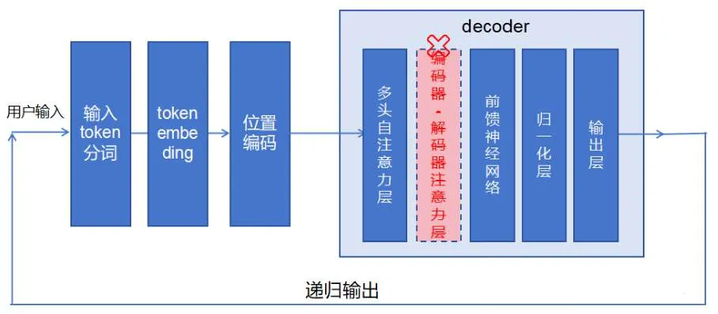
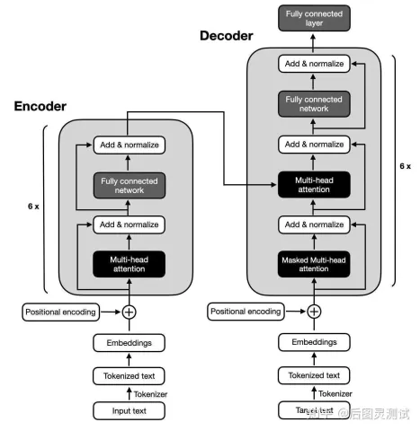
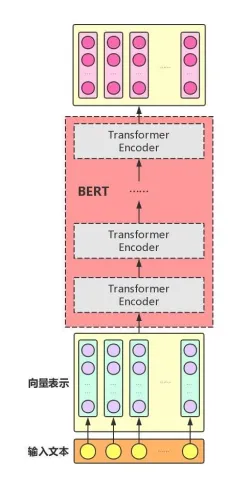
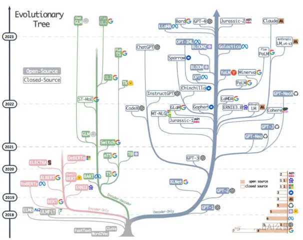
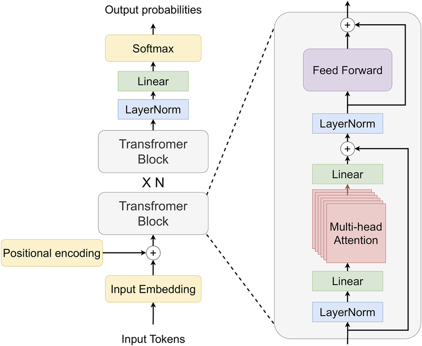
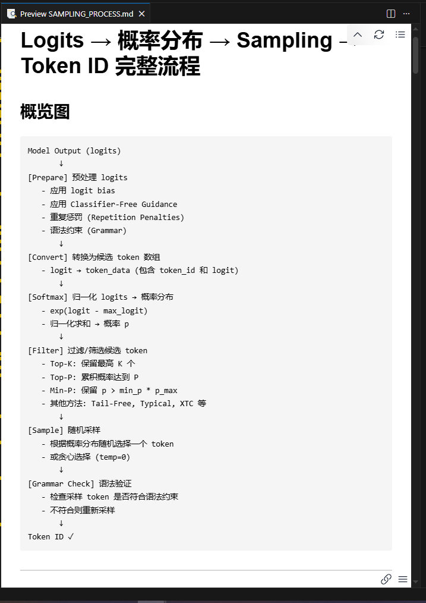

# 现代大语言模型（一）

我们常常感叹现代的大语言模型（Large Language Model, LLM）可以帮助我们完成各种complex的任务，例如writing、coding、reasoning、agent...诚然，llm可以解决很多日常生活的问题，让他看上去很“智能”，但是当我们拆开看这个模型的时候，似乎看不出任何“智能”相关的逻辑，相反，它由大量Transformer块构成，那所谓的“智能水平”又是如何涌现的？为什么说，现代大语言本质上是数据和统计学模式驱动下的产物？让我们一步步探究现代LLM的奥秘。

## 1. AI模型

### 现代AI模型的基本原理

现代ai模型，说白了就是一个巨大的带参数的函数。通过把现实中的一个个数据，转换成数字标记记录其中的特征（外观，形状，声音什么什么都行），然后丢进一些数学公式（函数）中，找出什么样的参数能拟合接近这些数据。（训练）
现实中的东西-->打上序号--->丢到一个公式中得出数据也就是一些系数---->把这些系数代入到我们的数学公式中--->然后我们就可以根据这个公式，来得到我们想要的结果

当然，ai这个函数是非常复杂的，一般的我们可称其为“（数学）模型”，而通过一些公式调整这个公式的参数的方法，就是在“训练”这个“模型”。
一般常用的，把现实中的东西用数学标记记录的方法，是用一个向量去标记它。

### 向量的数学介绍

向量，就是具有大小和方向的量，常用于表示空间中的位移或物理量。大伙应该都在数学课本里见过。

向量是什么？我们在草稿纸上随便画一条直直的线段，诶再顺着这个直线标上一个箭头表示它的方向，这就是向量，即有方向的线段。
大概长这样：→
很像一根箭矢对吧，所以它也叫作“矢量”

诶如果你在它的没有箭头的一段，也就是起点处，画一个直角坐标系，嗯好像清楚了一点。
然后再给有箭头的一段，在它箭头尖尖的那个地方，也就是终点处，画一个点，然后通过直角坐标系给这个点标上坐标，那么这个点的坐标就是这个向量的坐标。于是我们就可以记这个向量叫做a，记为$\vec{a}$（LaTex的方法）或者一个加粗的“a”（数学符号，但是我打不出来）来表示这个叫做a的向量。

```
y
↑
|    
|    
|    ● A 
|     /↗
|    / 
|   /  
|  /   
| /    
+--------------→ x
```

那么它的位置就可以记为：
(x,y)，坐标，从左往右读。

既然我们都有坐标了，那么我们发现这个点与xy坐标轴的垂线，刚好构成一个长方形，而这个长方形的对角线刚好就是这个向量，那么我们根据勾股定理，就可以很容易的计算出这个向量的长度，那么这个长度就是向量的“模”

如此类推我们就可以在直角坐标系上做出无数的向量
比如我们又可以做出a，b，c向量
$$
\vec{a} （x，y）
\vec{b} （λ，φ）
\vec{c} （α，β）
$$

这是在二维情况下的向量，当人我们也不妨推广至n维，其中n为任意的正整数，趋向于正无穷也是没问题的（如果你能一直写下去）
对于一个n维向量：$\vec{a}$
他的坐标可以表示为：
（a1，a2，a3，......，a n-1，a n）

在数学中，为了便于计算和表示，我们通常将向量的起点放在直角坐标系的原点上。这样，箭头尖端所在点的坐标，就可以唯一地代表这个向量。我们称这种表示为向量的坐标表示。这将大大化简图像，让我们方便的看图，观察并发现规律

向量是ai模型中的重要数学工具，甚至可以说离了向量，就不存在ai模型。

### 文本向量化

在了解模型前，我们先了解一个概念：“文本向量化”（建议先了解一下“向量”是什么）
文本向量化，顾名思义，是指将文字信息（如词、句子）转换为数值向量的过程。通过模型训练，语义相近的文本在向量空间中的位置也会更接近。例如，‘国王’和‘君主’的向量表示，其距离会比‘国王’和‘苹果’的向量表示更近。
我们通过计算这些向量之间的方向、距离等，来确定文本的语义，找到文本间的关系。
举个直观，虽然不准确的例子。
比如：我们用三维的空间向量将“好”“坏”“差劲”“良好”设为一个个点进行向量化。（这里只看yx平面，忽略z轴，ai作的图看个大概就行）

```
      ↑y
      |   
      |   ● D (优秀: 0.5,1,0.5)     ● A (好: 0,1,0)
      |   │                         │
      |   │ 向量 CD = (0, -2, 0)     │ 向量 AB = (0, -2, 0)
      |   │ (差劲-优秀)              │ (坏-好)
      |   ↓                         ↓
      |   ● C (差劲: 0.5,-1,0.5)    ● B (坏: 0,-1,0)
      |   
      │
      +───────────────────────────→ x
```

注意到：
向量 AB 与 向量 CD 满足：AB = (0, -2, 0), CD = (0, -2, 0)
∴ AB = CD

我们假设各点（或者说是词语的）的坐标 点A代表“好”（0，1，0） 点B代表“坏”（0，-1，0） 点C代表“差劲”（0.5，-1，0.5） 点D代表“优秀”（0.5，1，0.5），O为坐标原点
那么如何用向量表示其含义呢，比如：
OA向量和OD向量指向方向相近，于是我们可以发现“优秀”和“好”表示的意思是相似
我们计算出向量AB“好-坏”（0，2，0）和向量CD“差劲-优秀”（0，2，0）
此时我们可以注意到“AB＝4*CD”得出：两个向量平行

所以我们得出“好-坏”“差劲-优秀”代表了同一种对应的意思（即同为反义词）
当然这只是个简单的例子，实际情况会更复杂，维度也会更大（例如GPT3是12288维的向量，代表着每一个点或者向量会有12288个坐标）有兴趣可自行查阅更详细的资料。
[机器学习数学路线图 ---- 线性代数、微积分和概率论完全指南 |blog](https://thepalindrome.org/p/the-roadmap-of-mathematics-for-machine-learning)

### 常见AI模型架构

好了我们再回到我们的ai模型，现在ai模型有很多种，其中最常见的几个基本结构有：RNN循环架构模型,CNN卷积神经网络，我们最新最热的transformer模型

---

### Transformer架构类型

一般的，传统的transformer模型可大致分为两个步骤：
1. 把文本分为一个个token，进行向量化
2. 对向量进行计算输出。

当transformer输出完一个token时，会进行以上步骤再一次进行预测，直到输出一个停止符号为止（但是预测会分为很多个线路进行并行计算以提高速度，类似于把任务分给很多个人一起算一起做，这样做事效率会比一个人做快得多）

而transformer模型主要有三种的架构：
1. encoder-decoder 
2. encoder-only（一般也称为BERT架构）
3. decoder-only（现代大语言模型like llama/qwen/glm/mistral/gpt/deepseek等普遍采用的arch）

实际LLM（全称：large大型的 language语言 Model模型）的运用中，一般以decoder-only为主，所以本篇仅做decoder-only介绍。

> - **encoder（编码器）- decoder（解码器）注意力**：查询向量(Query向量)来自解码器(encoder)前一层(一般的，这个架构会有多个encoder进行计算后再输入至decoder)的输出，键向量（Key向量）和值（Value向量）来自编码器的输出。这使得解码器的每个位置可以关注输入序列的所有位置，模拟了典型的编码器-解码器注意力机制[38, 2, 9]。  
> - **encoder（编码器）自注意力**：键向量(Key向量)、值向量(Value向量)和查询向量(Query向量)均来自编码器前一层的输出。编码器的每个位置可以关注前一层的所有位置。  
> - **decoder（解码器）自注意力**：允许解码器的每个位置关注该位置及之前的所有位置。为保持自回归特性，需阻止解码器中的左向信息流。我们通过在softmax输入中屏蔽非法连接实现这一点。  
>
> 节选自 [《Attention Is All You Need》](https://arxiv.org/abs/1706.03762)

```
[四张补充图片，文本：
图一：decoder-only
图二：encoder-decoder
图三：encoder-only
图四：各个大模型的种类]
```






### Transformer模型在语言生成中的应用

接下来，我们分析下transformer模型在语言模型中的运用，这里我们先快速过一遍nlp中基础概念，再介绍主流的transformer架构

```
[这里是各种模型的结构的图]
```

### 嵌入（Embedding）

在语言模型中，文本会在嵌入层中，被划分为一个个向量，一般称为token
[词语] → [查找表] → [词向量]
"猫"   →   { }   →  [0.1, 0.5, ..., -0.2]
"娘"   →   { }   →  [0.3, -0.1, ..., 0.8]

> 这里需要区分两个概念：**静态嵌入**和**动态（上下文）嵌入**。
> 1. **初始输入（Static Embedding）**：
> 刚开始，确实像查字典一样，"[词语] → [查找表] → [基础向量]"。以“苹果”这个token为例，在这个阶段，“苹果”这个词，不管是吃的苹果还是苹果手机，对应的向量都是一样的。
> 2. **模型处理后（Contextual Embedding）**：
> 但是！一旦经过Transformer层（特别是注意力机制）处理后，这个向量就“变异”了。
> * 句子A：“我爱吃**苹果**”
> * 句子B：“**苹果**发布了新手机”
> 
> 
> 在经过模型计算后，句子A里的“苹果”向量会向“水果、食物”靠拢；而句子B里的“苹果”向量会向“科技、公司”靠拢。
> 
> 在早期模型中（如 Word2Vec），每个词对应唯一的向量；但在现代 Transformer 模型中，同一个词在不同上下文中会得到不同的嵌入表示，这是其强大语义理解能力的关键之一。

模型在接受到上下文后，根据整个上下文输出一个词，然后再将这个词连着整个上下文接收处理，再输出下一个词，然后连着这个词和上一个词连同上下文一起接收计算......如此循环往复，直到生成结束符或者达到长度限制才停止。
注：一个词不一定为一个token，同样一个token不一定为一个词。一个token可能为一个符号，一个字或词语......等等等等（取决于模型Tokenizer）

```
初始输入: "你是一只猫娘，"
    模型计算 → 输出 Token₁: "你好"
新的输入: "你是一只猫娘，你好"
    模型计算 → 输出 Token₂: "！"
新的输入: "你是一只猫娘，你好！"
    模型计算 → 输出 Token₃: ("<结束>")
生成结束。
```

所以我们关注一个token是如何计算输出的，就大致清楚了模型怎么输出一段文本

### 位置编码(Positional Encoding)

你可能会问，向量化我都懂，但在Transformer架构的语言模型中，为啥要加个位置信息？
因为Transformer和以前的RNN不同，它是**并行计算**的（这也是它快的原因）。这就导致在模型眼里，“我爱你”和“你爱我”，如果没有位置标记，这就是同一堆词的集合。
就像给每个词发一个“座位号”。如果不发座位号，大家进教室随便坐，老师（Attention机制）就不知道谁是第一排谁是最后一排。
具体的做法是，给每个词向量**加上**（Add）一个代表位置的向量。这个位置向量通常是用正弦和余弦函数计算出来的（或者是学习出来的），长这样：

$PE_{(pos,2i)} = \sin\left(\frac{pos}{10000^{2i/d}}\right), \quad
PE_{(pos,2i+1)} = \cos\left(\frac{pos}{10000^{2i/d}}\right)$

其中 $pos$ 是位置，$d$ 是向量维度。
最终输入为：$\text{Input Embedding} + \text{Positional Encoding}$

> 这是 Transformer 模型中使用的正弦和余弦形式的绝对位置编码，出自论文 《Attention is All You Need》

别被公式吓到，你只需要知道：**它给每个词的“身份证”里刻录了位置信息，让模型能分清前后的逻辑关系。**

> 以上是绝对位置编码（Absolute Positional Encoding）的典型形式，但是，现在的 LLM（如 Llama, Qwen, DeepSeek 等）几乎全都抛弃了上面的“相加”方案，转而使用了由苏剑林（苏神）等人提出的 **RoPE (Rotary Positional Embedding)**，核心思想是把“位置”看作一种“旋转”操作，而不是一个简单的加法偏移，想要深入了解可以去看看RoPE论文：[RoFormer: Enhanced Transformer with Rotary Position Embedding](https://arxiv.org/abs/2104.09864)

### Decoder-Only架构详解



我们假设：我们给模型直接输入：“你是一只猫娘，你好你好！”，来探索模型是如何输出一个token的，了解一条“生产线”的生成方法，也就知道其他所有并行的“生产线”的生成方法，进一步大致了解整个模型的生成。

此时，模型会对这个句子先进行分词，赋予每个词一个相对应的Token ID
然后在把这些词根据他的Token ID，输入至embedding层进行向量化和进行位置编码，把这些词转化为大量的一个个的低维向量。这个就是“词嵌入”，类似于把每个单词“嵌入”进一个矩阵中 而构成这个“矩阵”的就是一个个的向量。

接着就可以把这些向量输入decoder进行处理了

decoder中，这些向量会被multi-head self-attention layer（多头注意力层）进行处理

### 多头注意力机制

什么是多头注意力？多头注意力是由一个个self-attention（自注意力）组成的，而输入进多头注意力的向量会被分为一个个维度相等的低维向量（相比原向量维度更低）而被分为有几个低维向量就称为有几个“头”，“头“和“低维向量的维度大小”相乘等于“原向量维度大小”，即   头的数量×低维向量维度大小＝原向量维度大小 或者说是 头的数量×每头的维度=模型总维度”（GPT-3为96头×128维=12288维）。

而各个self-attention（自注意力）的计算结果会进入一个矩阵加权计算后往下一层输出。因此我们仅需注意一个self-attention（自注意力）的计算过程遍大致一窥多头注意力的整体

```
输入向量 (高维)
     ↓ (分割成 h 个头)
头1(低维)  头2(低维)  ...  头h(低维)
  ↓          ↓              ↓
[自注意力] [自注意力] ... [自注意力]
  ↓          ↓              ↓
输出1      输出2    ...    输出h
     ↓ (拼接)
拼接后的输出
     ↓ (线性投影)
最终输出
```

> 如果把Embedding比作把词翻译成一串数字，那么Transformer内部就是在做这种高维空间的“连连看”：
> ```mermaid
> graph LR
>     A[输入: 银行] --> B(静态向量: 包含河流和金钱双重含义)
>     B --> C{Attention层: 观察上下文}
>     D[上下文: 河边的...] --> C
>     C --> E[输出动态向量: 侧重于'河岸']
> 
> ```
> 
> 
> *(注：这是一个概念示意图)*

### 自回归解码

llm的推理阶段，可以分为 **Prefill（预填充）** 阶段和 **Decode（解码）** 阶段：
- Prefill 阶段是指模型处理用户输入的提示（prompt）的阶段。
  在这个阶段，模型一次性接收完整的输入文本（例如一个句子或一段话），并计算其对应的每个 token 的隐藏状态。
- Decode 阶段是模型逐个生成输出 token的过程，即自回归生成（auto-regressive generation）。
  在这个阶段，每次生成一个新 token，然后将其作为下一次输入的一部分，直到生成结束（遇到 EOS 或达到最大长度）。

我们重点关注Decode阶段，完整流程如下：

```
输入token
    ↓
Token嵌入 + 位置编码
    ↓
L个Transformer层（每层）:
   ↓
   多头注意力（使用KV缓存）
     ↓
   残差连接 + LayerNorm
     ↓
   前馈网络
     ↓
   残差连接 + LayerNorm
    ↓
最终LayerNorm
    ↓
输出投影 → logits
    ↓
采样策略处理
    ↓
生成下一个token（达到max_length/检测到eos_token停止）
    ↓
更新KV缓存，循环
```

#### 自注意力计算过程

自注意力的核心是计算Query和Key的点积来得到注意力分数（Attention Score）。这个分数决定了在生成下一个词的表示时，应该对输入序列中的其他词赋予多大的“关注度”。其计算公式如下：

$\text{Attention}(Q, K, V) = \text{softmax}\left(\frac{QK^T}{\sqrt{d_k}}\right) V$

现在我们来关注一个自注意力如何计算向量
一个头的向量进入自注意力后会被线性变换并投影为三个向量，分别称为：
1. Query向量(查询向量)
2. key向量(键向量)
3. Value向量(值向量)

一般统称为qkv向量，而把这些向量分类一一组合就会得到三个同名向量矩阵（如query矩阵，可记为Wq）
（投影，打个比方，三维的向量可投影到一个二维平面上形成一个低维的二维向量，也就是把高维向量投影到一个个低维的空间）
然后就可以开始对这些向量进行计算“注意力得分”，经过“softmax”归一化处理后，便可进行加权求和，准备进入一个矩阵准备和其他self-attention（自注意力）的结果进行拼接，在一个线性层进行最终的计算。
用图表示为

```
输入向量: [x1, x2, x3]
     ↓ (线性变换)
Q矩阵 ← Wq · X
K矩阵 ← Wk · X
V矩阵 ← Wv · X
     ↓ (计算注意力分数)
分数 = Softmax( (Q · Kᵀ) / √d_k )
     ↓ (加权求和)
输出 = 分数 · V
```

（归一化：指把所有实数转化概率分布，和原大小成一定比例，且所有数的和为一即100%）
一般的，decoder-only的自注意力为masked self-attention（掩码注意）因果掩码，就是对之后再生成的token的向量进行“遮盖”操作，在具体为：在计算attention score时，将未来的未生成的token为计为-∞，使其在softmax归一化后趋近于0。

```
输入序列: [Token1] [Token2] [Token3] [Token4]
注意力范围:
Token1 → [自身]
Token2 → [Token1, 自身]
Token3 → [Token1, Token2, 自身]
Token4 → [Token1, Token2, Token3, 自身]
```

以上内容仅为简化版本，有兴趣还请自行搜索“self-attention”即“自注意力”进一步了解

#### 从forward pass到token

好了，现在多头注意力的结果已经成功输入前馈神经网络（feed forward network, ffn），再进行残差连接连接下一个block（此处省略n个transformer block），经过output projection（输出投影层）得到logits，softmax变换等变化后，得到了一个token分布概率（probs），然后取其中概率最大的token得到tokenID（贪婪搜索），便能通过词表像查表格一样，映射出字符，就可以根据此输出一个词或者字符力（喜），最后更新kv cache（避免gen new token时重复计算历史token的K、V value）再重复上述过程直到达到max length或者检测到eos token。自回归生成阶段每生成一个token都会执行一次完整的前向传播（forward pass）。

完整的循环表示为：

```
提示词: "你是一只猫娘，"
     ↓ (模型生成第一个 token)
输出: "你好"
     ↓ (将生成的 token 加入输入)
新输入: "你是一只猫娘，你好"
     ↓ (模型生成下一个 token)
输出: "！"
     ↓ (循环，直到生成终止符)
最终输出: "你好喵！"
```

> **“贪婪搜索（Greedy Search）”**通常不采用，在实际聊天中，如果每次都选概率最高的词，生成的文章会非常死板、甚至陷入无限重复的怪圈。
> 现在的LLM通常使用**采样策略（Sampling）**，就像掷骰子一样，给模型一点“创造力”：
> * **Temperature（温度）**：调整概率分布的“平滑度”。
>   * 温度低（如0.1）：概率分布变得很尖锐，模型只敢选最有把握的词，适合写代码、做数学。
>   * 温度高（如1.0+）：概率分布变平，模型敢选一些冷门的词，说话更风趣、更有创意。
> 
> 
> * **Top-k**：只保留概率最高的前$k$个词（比如前50个），剩下的直接砍掉不看，防止模型胡言乱语。
> * **Top-p (Nucleus Sampling)**：累加概率直到达到$p$（比如0.9），在这个动态范围内进行选择。
> 
> 
> 所以，LLM之所以能写诗、讲笑话，很大程度上归功于这种“受控的随机性”。（关于从 logits->probs->sampling->tokenid 的过程比较复杂，感兴趣可以查阅主流推理框架源码）
>
> 
> 
> from llama.cpp

### 涌现智能：简单规则下的复杂行为

说了这么多，我们还是不理解，所谓的“智能”究竟来自哪里？

回到开头的问题：一堆冷冰冰的矩阵乘法，怎么就涌现出了“智能”？
目前学界普遍认为，这是**规模效应（Scaling Law）**带来的奇迹。
当模型参数量（神经元连接数）超过某个临界值（比如百亿级），并看过几乎全人类的文本数据后，量变引起了质变。此时会**涌现**出在小型模型上观察不到的复杂能力，例如：
* **压缩即智能**：为了准确预测下一个词，模型被迫学会了语法、逻辑、甚至世界知识。它不是在死记硬背，而是在寻找数据背后最高效的压缩规律。
* **触类旁通**：当它在代码中学到了“如果...那么...”的逻辑，这种能力会被泛化到语言推理任务中。

这也就是我们常说的：**涌现能力**，总而言之，LLM的涌现能力是模型规模、海量数据、自监督学习三者结合产生的神奇现象。

现代LLM本质上依然是统计学模型，但它统计的不是简单的词频，而是人类思维的**深层模式**。这种由海量算力和数据堆叠出来的“统计直觉”，在宏观上表现得就像我们所说的“智能”。