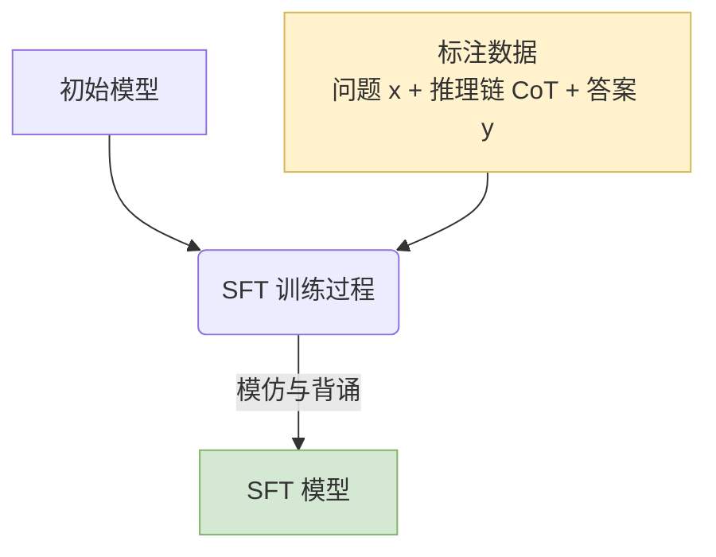
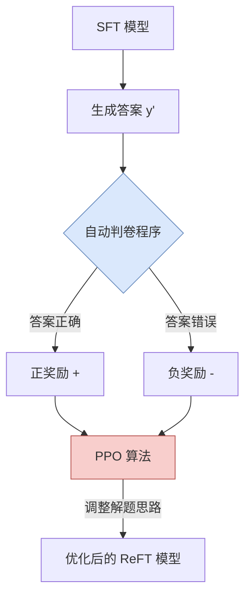
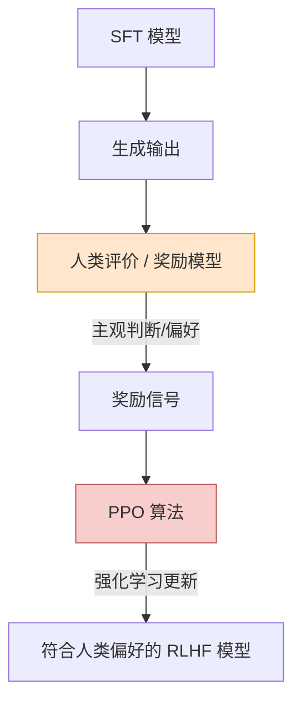
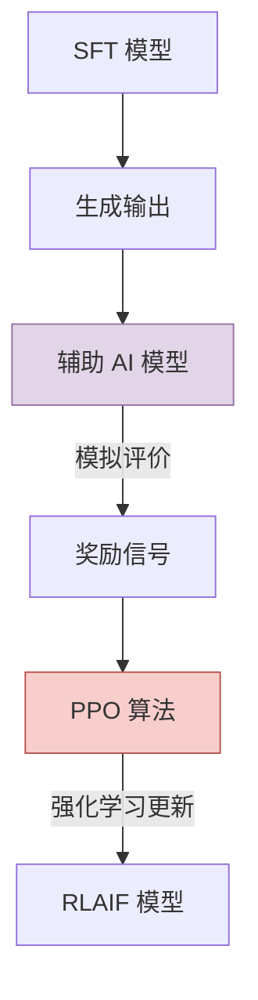

# 现代大语言模型（二）

## 2. 模型训练方法

以上就是我们常见的语言模型的原理。但光有模型架构也没用啊，我们还得对他进行训练。

训练，一般分为预训练和后训练。我们只需要简单了解一下后训练的内容即可。
后训练，大概就是对模型的生成内容进行评价，好的生成有奖励，坏的生成有惩罚，让模型的生成，慢慢贴合改进出我们想要的结果，在权重上的表现就是对“被奖励的内容”的权重更高。简单又有效，十分甚至九分的好用：

接下来，本文对比SFT、ReFT、RHLF、DPO、PPO这几种常见的技术。

---

### 监督微调（SFT）

SFT 是模型训练的基础阶段。在这个阶段，模型像学生一样，通过大量标注好的数据（包含问题、推理链和标准答案）进行训练，“一字不差地模仿和背诵”标准答案。



```
监督微调SFT（Supervised Fine-Tuning）：

模型（Model）：初始模型通过多个SFT周期（epochs）在训练数据上进行训练。训练数据包含问题（x），推理链（CoT，e）和答案（y）。
老师（标注好的数据）给出标准问题（x）和标准答案（y），甚至详细的解题步骤（推理链，CoT）。学生（模型）的任务就是一字不差地模仿和背诵。
```

### 强化微调（ReFT）

ReFT 是在 SFT 的基础上引入 PPO 算法。它的特点是评估自动化，由一个“自动判卷程序”来检查答案的对错，产生奖励或惩罚，PPO 算法根据这些分数调整模型参数。



```
强化微调RFT（Reinforced Fine-Tuning）：
模型解答一个问题，然后一个“自动判卷程序”会检查它的答案（y'）对不对。对了有奖励（正奖励），错了有惩罚（负奖励）。教练（PPO算法）根据这个分数来调整模型的“解题思路”（模型参数）。

PPO（Proximal Policy Optimization，近端策略优化）：
PPO是一种强化学习算法，用于在训练过程中稳定地更新模型的策略（即模型的行为方式）。其核心思想是限制每次策略更新的步长，避免因单次更新过大而导致模型性能崩溃。

组成： ReFT = SFT + PPO
过程：在有监督微调（SFT）的基础上，使用 PPO（近端策略优化）进行强化学习。
评估方式：通常通过 自动化程序 对模型输出进行评估，奖励信号来自程序的评价。
```

> https://github.com/xinyuwei-david/david-share.git 最近OpenAI Day2展示的demo可能把ReFT带火了。实际上这不是一个很新的概念，也不是OpenAI原创的论文。

### 基于人类反馈的强化学习（RLHF）

RLHF 同样基于 SFT 和 PPO，但其核心区别在于奖励信号的来源是“人类反馈”。人类对输出进行评价（或通过基于人类偏好训练的奖励模型），模型据此优化以符合人类的主观偏好。



```
RLHF（Reinforcement Learning from Human Feedback，基于人类反馈的强化学习）：

组成： RLHF = SFT + PPO + 人类反馈
过程在 SFT 的基础上，使用 PPO 进行强化学习，奖励信号来自 人类反馈。
评估方式：人类对模型输出进行评价，或者使用基于人类反馈训练的 奖励模型 来评估。
```

### 基于AI反馈的强化学习（RLAIF）

RLAIF 的流程与 RLHF 类似，唯一的不同在于它将“人类”替换为了“辅助 AI 模型”。由 AI 模型对主模型的输出进行评估并提供奖励信号，从而节省人工成本。



```
RLAIF（Reinforcement Learning from AI Feedback，基于 AI 反馈的强化学习）：

组成： RLAIF = SFT + PPO + AI 反馈
过程：在 SFT 的基础上，使用 PPO 进行强化学习，奖励信号来自 AI 模型的反馈。
评估方式：辅助的 AI 模型（可能是奖励模型）对模型输出进行评价，提供奖励信号。
```

### 训练方法总结

```
解释：
ReFT（强化微调）通过在监督微调后的模型上，使用PPO算法进行强化学习，奖励信号来自于自动化程序对模型输出与标准答案的比较。

RLHF（基于人类反馈的强化学习）在SFT基础上，使用PPO算法进行强化学习，奖励信号来自人类对模型输出的评价。

DPO方法（直接偏好优化）在SFT基础上，使用DPO算法直接优化模型参数以符合人类偏好，不使用PPO等传统强化学习算法。

RLAIF（基于AI反馈的强化学习）类似于RLHF，但人类反馈替换为AI模型的反馈，使用PPO算法进行强化学习。

ReFT、RLHF、DPO和RLAIF。这些方法都是在监督微调（SFT）的基础上，进一步优化模型以提高性能，但它们在优化策略和反馈来源上有所不同。

1. ReFT（Reinforced Fine-Tuning，强化微调）：这是SFT和PPO（近端策略优化）的结合。在第一阶段，模型通过SFT在有标注的数据上进行训练，建立基本的语言理解和生成能力。第二阶段，引入PPO算法，对模型进行强化学习优化。此时，模型的输出由自动化程序进行评估，程序根据预设的规则或标准对模型的输出进行评价，并生成奖励信号。模型根据这些奖励信号，使用PPO算法调整自身参数，以产生更优的输出。ReFT的特点是评估过程自动化，无需人类参与，适用于有明确客观标准的任务，例如数学问题求解。

2. RLHF（Reinforcement Learning from Human Feedback，基于人类反馈的强化学习）：在SFT的基础上，结合PPO算法，但奖励信号来自人类反馈。具体而言，人类对模型的输出进行评价，指出更优的回答，或通过偏好对比的方式提供反馈。这些人类反馈可以直接用于指导模型优化，或者用于训练一个奖励模型，后续由奖励模型对模型输出进行评估。RLHF的优势在于引入了人类的主观判断，使模型的输出更符合人类偏好，适用于需要复杂评价和主观判断的任务。

3. DPO（Direct Preference Optimization，直接偏好优化）方法：与前两种方法不同，DPO不用强化学习算法（如PPO），而是采用监督学习的方法直接优化模型。在SFT之后，利用人类偏好数据和参考模型构建损失函数，直接对模型进行微调。具体来说，收集人类对模型输出的偏好数据，如在给定的多个回答中标注出人类更喜欢的那个。然后，设计一个损失函数，使模型倾向于生成被人类偏好的输出。通过最小化这个损失函数，直接调整模型参数。DPO避免了强化学习中的试错过程，训练更稳定，效率更高，适用于有大量人类偏好数据的场景。

4. RLAIF（Reinforcement Learning from AI Feedback，基于AI反馈的强化学习）：这是SFT、PPO和AI反馈的结合。在SFT后，使用PPO进行强化学习，然而奖励信号不是来自人类，而是来自辅助的AI模型（如奖励模型）的反馈。AI模型对主模型的输出进行评估，提供奖励信号。这样的方法节省了人类评价的成本，但依赖于辅助AI模型的质量。

总结：四种方法中，ReFT、RLHF和RLAIF都使用了PPO作为强化学习算法，区别在于奖励信号的来源不同：ReFT来自自动化程序的评估，RLHF来自人类反馈，RLAIF来自AI模型的反馈。只有DPO方法使用了监督学习的方式，不采用PPO等强化学习算法，而是直接利用人类偏好数据和模型优化模型。
```

> 改编于博客园，感兴趣的可以看看原文：https://www.cnblogs.com/Microsoftdeveloper/articles/18635866

---

以上是对ai模型的一些简单介绍，感兴趣可以去看看论文或3blue1brown和吴恩达老师的课程。