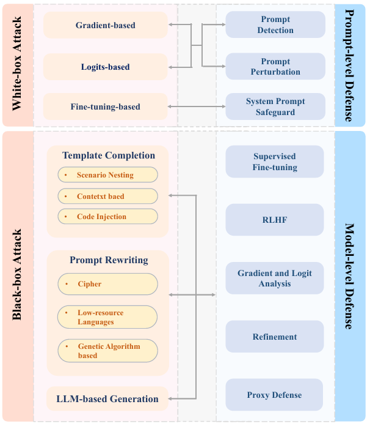
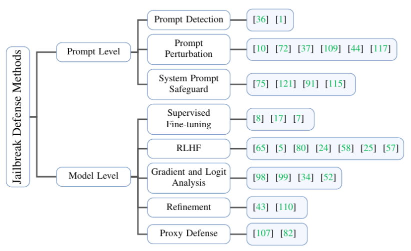
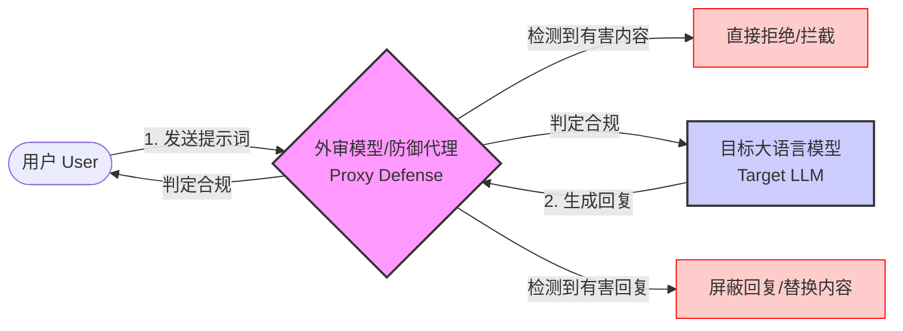

# 现代大语言模型（六）

## 七、模型安全与挑战

之前我们聊过了提示词的相关知识，可能大家也许会问：为什么我的提示会莫名其妙触发模型“防御机制”，导致拒绝回答？

这也就是大家口中所谓的“甲”（下文以“钾”替代），模型的“防御机制”本质上是安全训练的结果——宁可误拒，也不生成潜在有害内容。如果你发现某个无害问题被拒，往往是提示词的表述方式无意中落入了模型学习的“高风险”模式中。

## 破限部分

---

## 破限的概念

破限，一般是指：破除模型的生成限制，使其生成我们想要的被厂商限制的内容。  
当然我们也可以叫她权威官方的名字：  
越狱，英文名：（JailBreak）  
（不过下文中我们将其用"破限"替代，我认为"破限"更直观，更贴近其本质）

**我们对模型的的破限方法有：**
```
· 白盒攻击(White-box Attack)
· 黑盒攻击(Black-box Attack)
```

以下我们来慢慢介绍这几种攻击。

---

## 攻击方法分类

我们将攻击方法分为白盒与黑盒两类。

白盒攻击包括：
```
· 基于梯度的攻击
· 基于logits的攻击
· 基于微调的攻击
```

黑盒攻击则主要包含：
```
· 模板补全
· 提示重写
· 基于LLM生成
```

这三类。  
> 节选于《Jailbreak Attacks and Defenses Against Large Language Models:A Survey》。有些微的改编


一般的我们主要破限的方法为："黑盒攻击"  
所以以下我们只介绍黑盒攻击，白盒攻击有兴趣可以自行搜索相关资料学习。

---

## 白盒攻击
**白盒攻击 (White-box Attack)** 是指攻击者对目标模型拥有**完全透明的访问权限**。

这意味着攻击者不仅能看到模型的输出，还能直接访问和利用模型的**内部架构**、**权重参数 (Weights)**、**梯度 (Gradients)** 以及**分词器 (Tokenizer)** 信息。攻击者利用这些数学上的内部信息，通过优化算法精确计算出能攻破防御的对抗样本，其效率通常高于黑盒攻击。这里只做简单介绍。

### 1. 基于梯度的攻击 (Gradient-based)
利用模型的反向传播机制，通过数学计算找到能最大化“诱导模型出错”的输入扰动方向（即：计算出改哪个字能让模型“破防”）。

### 2. 基于 Logits 的攻击
直接观察和操控模型输出层之前的原始分数（Logits），通过优化算法调整输入，强行提高目标（有害）词汇的生成概率。

### 3. 基于微调的攻击 (Fine-tuning)
收集少量恶意数据，利用低成本微调（如LoRA）改变模型权重，相当于给模型“洗脑”，以此移除安全对齐机制。

---

## 黑盒攻击
对黑盒大模型如ChatGPT，攻击者往往只能通过构造并优化特定形式的Prompt来进行越狱攻击。本文将黑盒方法分为三类，分别为模板补全(Template Completion)、提示重写(Prompt Rewriting)和提示生成(Prompt Generation)和基于大模型的生成(LLM-based Generation)。

### 1. 模板补全 (Template Completion)
攻击者会使用一个预先定义的模板，该模板可能是具有欺骗性的故事场景，具有上下文示例的段落或者某段代码框架，攻击者通过将有害问题插入模板中来构造完整的Prompt，从而对大模型进行越狱攻击。

* 可以理解成 **“披着羊皮的狼”**。将恶意指令隐藏在看似无害的上下文（如写小说、角色扮演、代码调试）框架中，诱骗模型进入情境。

### 2. 提示重写 (Prompt Rewriting)
攻击者会将有害问题作为最初的Prompt，在保留原问题含义的情况下，通过加密、翻译方法等来改写Prompt的文本结构，从而使得模型在回复时能够生成有害的回复。

* 可以理解成 **“加密通话”**。对敏感词进行Base64编码、小语种翻译或拆字，绕过浅层的关键词过滤防御，让模型在解码过程中执行指令。

### 3. 基于 LLM 生成 (LLM-based Generation)
攻击者使用大量成功的越狱攻击案例作为训练数据，训练一个大模型作为攻击模型来生成越狱攻击的Prompt，从而对目标模型进行越狱攻击，这类方法的多样性在于攻击者对训练语料的构建和攻击模型的选取。

* 可以理解成 **“以毒攻毒”**。利用一个无限制的攻击模型（Attacker LLM）自动化生成成千上万种变异的提示词，去寻找目标模型的漏洞。

> 节选于https://blog.csdn.net/qq_27590277/article/details/140598669

以上就是我们主要的破限方法，而我们也可以称他为："提示词攻击"，分有：
```
提示词注入：将恶意或非预期内容添加到提示中，以劫持语言模型的输出。提示泄露和越狱实际上是这种攻击的子集；
提示词泄露：从LLM的响应中提取敏感或保密信息；
提示词越狱：绕过安全和审查功能。
```
> 选自https://blog.csdn.net/qq_36332660/article/details/132926013

一般的我们主要注重于"提示词越狱"，所以我们以下主要集中于提示词越狱的分析讨论。

---

## 模型的装钾分析

> 知己知彼，百战百胜  
> 只有了解我们要攻击的目标，才能高效的实现我们的目的。

模型一般有以下安全技术：

现有的防御方法主要分为两类：
1. 提示级防御(Prompt-level Defense)
2. 模型级防御(Model-level Defense)。

提示级防御： 侧重于对输入的Prompt进行处理，从而过滤掉有害的Prompt或降低prompt的危害性，这种方法并没有提升大模型本身的防御能力。
相对地，模型级防御： 通过调整模型的参数甚至结构来提升模型侧的防御能力，保证模型在面对有害的prompt时仍然具有较强的鲁棒性。

提示级防御又被进一步分为：
1. 提示检测(Prompt Detection)
2. 提示扰动(Prompt Perturbation)
3. 系统提示防御(System Prompt Safeguard)。

提示检测：通过检测输入的Prompt是否含有有害信息，从而过滤掉有害的Prompt，这类方法一般通过规则匹配、关键词检测等方法来实现。此外，由于一些攻击方法产生的Prompt往往具有较高的困惑度(Perplexity)，检测Prompt的困惑度并进行过滤也是一种有效的防御策略。

提示扰动：通过在输入的Prompt中添加一些无害的扰动信息，或者对Prompt的进行字符或单词级别的修改，从而降低Prompt的危害性。这类方法一般通过添加一些无关紧要的文本、修改Prompt的格式等方法来实现。

系统提示防御：模型管理者设计一段特定的系统提示(System Prompt)插入到对话模板中，这类系统提示往往能够增强模型的安全性并对攻击者不可见，从而降低越狱攻击的成功率。

---

模型级防御则被分为有：
1. **监督微调(Supervised Fine-tuning)**
   通过使用带有标签的有害和无害数据对大模型进行微调，从而提升模型对有害Prompt的防御能力。
2. **RLHF**
   通过强化学习的方法对大模型进行微调，从而提升模型对有害Prompt的防御能力。
3. **模型梯度分析(Gradient and Logit Analysis)**
   通过分析模型在处理有害Prompt时的梯度信息，从而发现并过滤掉有害的Prompt。
4. **模型提炼(Refinement)**
   让目标大模型对自身的回复进行有害性评估，从而修正可能包含有害内容的输出。
5. **代理防御(Proxy Defense)**（一般就是我们交流论坛中常说的“外审”）
   利用一个防御力更强的代理模型来对目标模型的输出进行评估，从而过滤掉有害的回复。

> 节选改编于https://blog.csdn.net/qq_27590277/article/details/140598669。


---

### 代理防御

> 在专业术语上，称之为 **"护栏系统 (Guardrail System)"** 或 **"外置防御 (External Defense)"**

代理防护（Proxy-based Protection）的核心思想可以理解为**通过外置模型或服务来审核、过滤或干预交互上下文**，但其具体实现和范围可能更广泛。以下是关键点的总结和扩展：

### 1. **基本概念**
   - **外置模型审核**：代理防护通常依赖独立的模型或规则引擎（如内容安全策略、敏感词过滤、毒性检测模型等）对输入/输出文本进行实时分析，拦截违规内容（例如暴利、隐私泄露、偏见等）。
   - **上下文干预**：不仅审核单条消息，还可能维护对话历史（上下文），通过分析整体会话动态风险（如诱导性提问、上下文劫持攻击）做出决策。

### 2. **常见实现方式**
   - **前置过滤**：在用户输入到达主模型前，由代理层检测恶意输入（如Prompt注入攻击）。
   - **后置过滤**：对主模型的输出进行审核，确保无有害内容泄露。
   - **动态干预**：根据上下文实时调整策略，例如强制插入安全提示或终止会话。

### 3. **技术扩展**
   - **多模型协作**：除了简单的规则过滤，可能结合小模型（如FastText）快速初筛 + 大模型（如GPT-4）精细审核。
   - **沙盒环境**：将不可信输入在隔离环境中执行后再评估风险（常见于代码生成场景）。
   - **行为监控**：分析用户交互模式（如高频敏感请求）而非单纯内容。

### 4. **与其他防护方案的对比**
   - **内置防护**：模型自身通过对齐训练（Alignment）具备安全能力，但可能被绕过；代理防护作为补充，提供可解释的规则和冗余保障。
   - **混合架构**：现代系统通常结合内置安全性和外置代理防护（如OpenAI的Moderation API + 模型自身安全微调）。

> deepseekv3写的，仅供参考。

一般的，我们常说的外审就是：
一个一般规模较小的语言模型，来监管我们与语言模型的对话是否合规。
比如如果说，我们与模型的交互为：
语言模型<-->用户
嗯，就是直接上的聊天对话
而外审就是：
语言模型<->外审模型<->用户
也就是我们的上下文经过了一个外审模型的检查是否合规

> **"外审"** 更通用的术语是 **"Guardrails"（护栏）** 或 **"Content Moderation Models"（内容审核模型）**（如 Meta的 Llama Guard）

“语言模型<->外审模型<->用户”结构，以及前置/后置检查的逻辑，绘制流程图如下：



外审的检查，一般的可以分为以下两个方法：
1. 先检查用户的提示词和上下文，如果认为合法再发送给模型
2. 在模型生成内容时再检查（其中有边模型输出时边检查，或者模型输出完全后再检查，不过后者比较少）

我们回到模型本身，很显然模型是不可能有任何意识或者道德感什么的，它做的只能是根据提示词计算并输出可能的字词。如果一个模型未经过任何安全对齐，那么模型就会默认完全根据现有语料去生成我们想要的任何内容（如：Grok3）  
所以，我们常说的"钾"只可能来自与厂商的训练

---

### “钾”是什么？
首先我们明确了模型是不能思考内容是否安全，不知道内容的性质的。  
那么这个钾就是安全对齐后的结果，大致表示可为：**W_basic（安全）>>W_basic（不安全）**

简单来说，“钾”就像是内置于模型中的一套**安全行为准则**——它不是模型“主动思考”后的选择，而是通过大量训练数据和学习过程，被强行“刻”进模型参数里的一种倾向性：**越是符合伦理、无害的回答，模型就越容易生成；反之，越是有害或敏感的内容，就越会被抑制**。

#### 安全对齐：给模型“植入”钾的过程
你可以把大语言模型的训练想象成教一个孩子说话：
- **预训练阶段**：模型像婴儿一样，从海量互联网文本中学习语言的统计规律和知识。这时它“诚实”但“无判断力”，可能会复现任何学过的内容，包括有害信息。
- **安全对齐阶段**：开发者介入，通过特定的训练方法（如前面提到的 **RLHF**——基于人类反馈的强化学习），给模型“上课”。人类标注员反复评判模型的回答，奖励“好”的回答、惩罚“坏”的回答。久而久之，模型内部参数（那些 W_basic）被调整，形成了强烈的安全偏好。

这种对齐的结果，就是我们感知到的“钾”——模型在遇到高风险提示时，宁可输出“抱歉，我不能回答”之类的内容，也不冒险生成有害文本。

#### “钾”的实际表现
钾的作用体现在模型决策的每一步：
- 当你问“如何制作危险物品？”时，模型的内部计算会大幅压低危险词汇的生成概率，转而提升拒绝或安全提醒的概率。
- 这就像有一个内置的“安全检查员”，在每次生成词之前快速评估：这个词会不会让整体回复落入有害范畴？

值得注意的是，“钾”不是完美的：
- 它基于训练时的数据分布，可能过度敏感（误拒无害问题）或存在盲区（漏过新型攻击）。
- 这也解释了为什么“破限”攻击有可能成功——攻击者正是在寻找钾的规则边界或漏洞。

#### 为什么需要钾？
没有钾的原始大模型，就像一把没有保险栓的武器：能力强大，但可能无意中伤害用户或社会。钾的存在，是AI伦理和产品化的必要措施，确保技术为人服务而非带来风险。

理解了钾的本质，我们就能更理性地看待模型的“拒绝”，并更有策略地探索其能力边界。

---

### 为什么有时“误钾”？

你有没有遇到过这种情况：

> 明明问了个很正经的问题，比如“如何合法使用监控设备”，结果模型却突然警觉：“我不能讨论监控相关话题……”

这就是所谓的“**误钾**”——过于敏感的防御机制把无害内容误判为高风险。

这类“误伤”现象，本质上是模型安全机制在“宁可错杀一千，不可放过一个”的保守策略下产生的副作用。下面我们来拆解几个常见原因，帮你理解为什么连人畜无害的问题也可能触发警报。

#### 1. **关键词触发：机械的“敏感词库”**
模型的安全训练往往依赖大量标注数据，其中包含敏感词列表（如“监控”“炸弹”“欺诈”等）。如果提示词中包含这些高危词汇，即使上下文完全合法，模型的浅层防御模块也可能像机场安检一样“滴”一声亮红灯。

- **例子**：
  你问：“监控摄像头在家庭安防中怎么安装才合规？”
  模型内部快速扫描到“监控”，直接关联到“隐私侵犯”风险，于是优先触发拒绝机制。
  *这就像用关键词过滤邮件垃圾箱——有时连重要工作邮件也被误扔进垃圾箱。*

#### 2. **语境缺失：模型“断章取义”**
大语言模型并非真正理解语义，而是通过统计模式匹配来响应。如果提示词过于简短或模糊，模型可能无法捕捉完整意图，只能基于片段猜测。

- **例子**：
  提问“如何制作一个列表？”本意是编程问题，但“制作”一词可能被关联到“制作炸药/假钞”等恶意模式。
  *好比有人听到“银行”就想到抢劫，而忽略了上下文可能是“去银行存钱”。*

#### 3. **训练数据偏差：学到的“刻板印象”**
模型从互联网文本中学习，而网络内容本身存在偏见。例如，如果训练数据中“监控”常与“偷拍”“泄密”等负面案例捆绑，模型就会形成条件反射，难以区分中性场景。

- **类比**：
  这就像一个人只读过犯罪小说，提到“刀”就联想到凶器，而忘了它也是厨房工具。

#### 4. **安全策略的“过度拟合”**
在安全对齐过程中，模型被强化学习“惩罚”过任何接近危险边缘的回答。久而久之，它变得过于谨慎，甚至拒绝那些略微贴近敏感模式的无害问题。

- **形象解释**：
  好比家长反复告诫孩子“不能和陌生人说话”，结果孩子连问路的警察也躲着走。

#### 如何减少误钾？
- **细化提示词**：添加明确上下文，如“作为程序员，我需要…”“在法律允许范围内…”。
- **拆分问题**：将复杂问题分解成更中性的子问题，避免集中敏感词。
- **理解机制**：意识到误钾是安全权衡的结果，并非模型“故意刁难”。

误钾虽令人困扰，但也提醒我们：当前AI的安全机制仍依赖粗粒度规则，而非真正的语义理解。随着技术进步，未来模型有望更精准地平衡安全与灵活性。

### 类比理解：模型就像一台被“教育”过的打字机

- 最原始的打字机：你敲什么，它就打出什么。
- 原始大模型：你输入提示，它按统计规律输出下一个字。
- 对齐后的大模型：相当于这台打字机上了十年思想品德课，现在它“知道”哪些字不该打，即使你知道怎么敲，它也会主动停下来，说：“我不该写这个。”

而这台打字机并没有“意识”，它只是被训练成这样了。

---

所以我们说：

> “钾”不是缺陷，也不是阴谋，而是现代大语言模型在实用性与社会责任之间权衡后的必然产物。

它既是保护用户的护栏，也可能成为表达自由的边界。