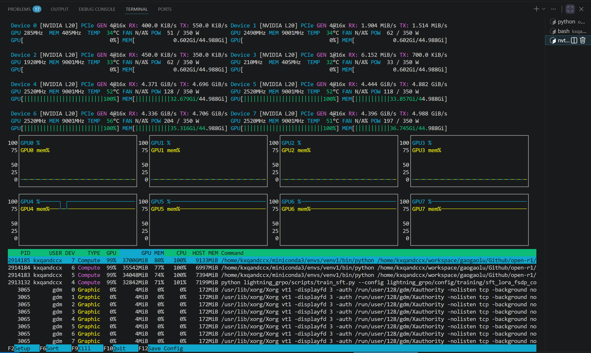

# 记录一次pcie p2p bug排查经历

前几天我们使用pytorch lightning框架使用fsdp2运行分布式训练（sft微调）时，碰到了一个必稳定复现的bug：只要开启 `export NCCL_P2P_DISABLE=0`或保持默认设置（即允许 GPU 间通过 PCIe 进行点对点 P2P 通信），就会导致 NCCL 训练卡死（Hang），而如果关闭了p2p，NCCL 会自动切换到 SHM (staged through host memory) 路径（NCCL 会改走 host-staged，数据要经过两次 PCIe 传输 + 一次 host 端的 memory copy,而且这条路径需要 CPU 端的 proxy thread 参与调度(NCCL 内部的 proxy service),不再是纯 GPU-发起的异步操作。）对于fsdp训练的性能无疑是腰斩的：



---

先贴一下环境和报错的log：

```
torch                     2.10.0+cu128
transformers              5.13.0
lightning                 2.6.5
```

```
(venv1) kxqandccx@jk01:~/workspace/gaogaolu/Github/open-r1$ python /home/kxqandccx/workspace/gaogaolu/Github/open-r1/lightning_grpo/scripts/train_sft.py --config /home/kxqandccx/workspace/gaogaolu/Github/open-r1/lightning_grpo/config/training/sft_lora_fsdp_copy.yaml
Seed set to 42
GPU available: True (cuda), used: True
TPU available: False, using: 0 TPU cores
💡 Tip: For seamless cloud logging and experiment tracking, try installing [litlogger](https://pypi.org/project/litlogger/) to enable LitLogger, which logs metrics and artifacts automatically to the Lightning Experiments platform.
Initializing distributed: GLOBAL_RANK: 0, MEMBER: 1/2
[rank: 1] Seed set to 42
Initializing distributed: GLOBAL_RANK: 1, MEMBER: 2/2
----------------------------------------------------------------------------------------------------
distributed_backend=nccl
All distributed processes registered. Starting with 2 processes
----------------------------------------------------------------------------------------------------

[rank1]:[E707 14:12:10.578314786 ProcessGroupNCCL.cpp:1890] [PG ID 0 PG GUID 0(default_pg) Rank 1] ProcessGroupNCCL's watchdog got stuck for 480 seconds without making progress in monitoring enqueued collectives. This typically indicates a NCCL/CUDA API (e.g., CudaEventDestroy) hang blocking the watchdog, and could be triggered by another thread holding the GIL inside a CUDA api (for example, CudaEventDestroy), or other deadlock-prone behaviors.If you suspect the watchdog is not actually stuck and a longer timeout would help, you can either increase the timeout (TORCH_NCCL_HEARTBEAT_TIMEOUT_SEC) to a larger value or disable the heartbeat monitor (TORCH_NCCL_ENABLE_MONITORING=0).If either of aforementioned helps, feel free to file an issue to PyTorch about the short timeout or false positive abort; otherwise, please attempt to debug the hang. 
[rank1]:[E707 14:12:10.602191317 ProcessGroupNCCL.cpp:1606] [PG ID 0 PG GUID 0(default_pg) Rank 1] ProcessGroupNCCL preparing to dump debug info. Include stack trace: 1, only active collectives: 0
[rank1]:[F707 14:20:10.623086386 ProcessGroupNCCL.cpp:1631] [PG ID 0 PG GUID 0(default_pg) Rank 1] [PG ID 0 PG GUID 0(default_pg) Rank 1] Terminating the process after attempting to dump debug info, due to ProcessGroupNCCL watchdog hang.
[rank: 1] Child process with PID 1725214 terminated with code -6. Forcefully terminating all other processes to avoid zombies 🧟
已杀死
```

## 问题诊断

我们先来分析日志，从日志看执行流程：

```
Initializing distributed: GLOBAL_RANK: 0, MEMBER: 1/2
Initializing distributed: GLOBAL_RANK: 1, MEMBER: 2/2
----------------------------------------------------------------------------------------------------
distributed_backend=nccl
All distributed processes registered. Starting with 2 processes
----------------------------------------------------------------------------------------------------
```

到这里都正常 - 进程已经注册，准备开始 NCCL 初始化。

---

然后接下来就卡住了，并触发了watchdog：

```
[rank1]:[E707 14:12:10.578314786 ProcessGroupNCCL.cpp:1890] 
ProcessGroupNCCL's watchdog got stuck for 480 seconds without making progress 
in monitoring enqueued collectives.
```

众所周知，NCCL 初始化阶段需要多个 GPU 之间建立连接和同步，这个阶段的特征：

1. **需要进行 GPU peer-to-peer 通信协商**
2. **需要同步所有进程的初始化状态**
3. **可能涉及 NVLink/P2P 连接的握手**
4. **可能因为某个 GPU 资源被占用而卡住**

**这行 "All distributed processes registered" 之后、报 watchdog 之前，没有任何其他日志输出**（没有 loss、没有 step 打印、没有 FSDP2 wrap 完成的提示）。这说明：

- `init_process_group` / NCCL communicator 建立（`ncclCommInitRank`）本身是**成功**的——两个 rank 都握手上了，这一步没卡。
- 卡住的地方是**进程组建立之后的第一个真正的 collective 通信**，而不是深入到训练循环里的某个 step。也就是说，大概率卡在：
  - Lightning `setup()` / `configure_model()` 阶段对模型做 **FSDP2 wrap** 时触发的第一次 collective（比如参数一致性校验的 broadcast，或者 `fully_shard` 构造 DTensor 时的初始同步）；
  - 或者是 LoRA adapter 注入后，FSDP2 第一次 forward 前的 **all-gather**（把 sharded 参数聚合成完整参数）。

这个"卡在第一次 collective 而不是训练中途"的信号很重要，因为它把嫌疑范围从"训练过程中某个特定 op（比如某层 all-reduce 累积梯度）"收窄到了"**FSDP2 初始化/wrap 阶段的通信**"，这类问题历史上确实常见于 PCIe-only（无 NVLink）拓扑 + P2P 设置的组合。

总之，死锁发生在 `dist.init_process_group(backend='nccl')` 或 Lightning 的 FSDP 策略初始化时的第一次 NCCL collective 操作，而不是在训练计算阶段。

gpu的信息和节点拓扑如下：

<details>
<summary><strong>展开查看</strong></summary>

```
(agent_use) kxqandccx@jk01:~$ nvidia-smi
Wed Jul  8 01:28:49 2026       
+-----------------------------------------------------------------------------------------+
| NVIDIA-SMI 570.86.10              Driver Version: 570.86.10      CUDA Version: 12.8     |
|-----------------------------------------+------------------------+----------------------+
| GPU  Name                 Persistence-M | Bus-Id          Disp.A | Volatile Uncorr. ECC |
| Fan  Temp   Perf          Pwr:Usage/Cap |           Memory-Usage | GPU-Util  Compute M. |
|                                         |                        |               MIG M. |
|=========================================+========================+======================|
|   0  NVIDIA L20                     Off |   00000000:34:00.0 Off |                    0 |
| N/A   55C    P0            161W /  350W |   18332MiB /  46068MiB |     94%      Default |
|                                         |                        |                  N/A |
+-----------------------------------------+------------------------+----------------------+
|   1  NVIDIA L20                     Off |   00000000:35:00.0 Off |                    0 |
| N/A   74C    P0            334W /  350W |   12736MiB /  46068MiB |     93%      Default |
|                                         |                        |                  N/A |
+-----------------------------------------+------------------------+----------------------+
|   2  NVIDIA L20                     Off |   00000000:36:00.0 Off |                    0 |
| N/A   73C    P0            323W /  350W |   36518MiB /  46068MiB |     92%      Default |
|                                         |                        |                  N/A |
+-----------------------------------------+------------------------+----------------------+
|   3  NVIDIA L20                     Off |   00000000:37:00.0 Off |                    0 |
| N/A   30C    P8             33W /  350W |      17MiB /  46068MiB |      0%      Default |
|                                         |                        |                  N/A |
+-----------------------------------------+------------------------+----------------------+
|   4  NVIDIA L20                     Off |   00000000:9B:00.0 Off |                    0 |
| N/A   33C    P0             76W /  350W |     476MiB /  46068MiB |      0%      Default |
|                                         |                        |                  N/A |
+-----------------------------------------+------------------------+----------------------+
|   5  NVIDIA L20                     Off |   00000000:9C:00.0 Off |                    0 |
| N/A   32C    P0             76W /  350W |     476MiB /  46068MiB |      0%      Default |
|                                         |                        |                  N/A |
+-----------------------------------------+------------------------+----------------------+
|   6  NVIDIA L20                     Off |   00000000:9D:00.0 Off |                    0 |
| N/A   34C    P0             77W /  350W |     476MiB /  46068MiB |      0%      Default |
|                                         |                        |                  N/A |
+-----------------------------------------+------------------------+----------------------+
|   7  NVIDIA L20                     Off |   00000000:9E:00.0 Off |                    0 |
| N/A   31C    P0             74W /  350W |     476MiB /  46068MiB |      0%      Default |
|                                         |                        |                  N/A |
+-----------------------------------------+------------------------+----------------------+
                                                                                         
+-----------------------------------------------------------------------------------------+
| Processes:                                                                              |
|  GPU   GI   CI              PID   Type   Process name                        GPU Memory |
|        ID   ID                                                               Usage      |
|=========================================================================================|
|    0   N/A  N/A            3065      G   /usr/lib/xorg/Xorg                        4MiB |
|    0   N/A  N/A         3521367      C   python                                18310MiB |
|    1   N/A  N/A            3065      G   /usr/lib/xorg/Xorg                        4MiB |
|    1   N/A  N/A         2566033      C   python                                12714MiB |
|    2   N/A  N/A            3065      G   /usr/lib/xorg/Xorg                        4MiB |
|    2   N/A  N/A         2027530      C   python                                36496MiB |
|    3   N/A  N/A            3065      G   /usr/lib/xorg/Xorg                        4MiB |
|    4   N/A  N/A            3065      G   /usr/lib/xorg/Xorg                        4MiB |
|    4   N/A  N/A         2604627      C   python                                  454MiB |
|    5   N/A  N/A            3065      G   /usr/lib/xorg/Xorg                        4MiB |
|    5   N/A  N/A         2605690      C   ...iconda3/envs/venv1/bin/python        454MiB |
|    6   N/A  N/A            3065      G   /usr/lib/xorg/Xorg                        4MiB |
|    6   N/A  N/A         2605691      C   ...iconda3/envs/venv1/bin/python        454MiB |
|    7   N/A  N/A            3065      G   /usr/lib/xorg/Xorg                        4MiB |
|    7   N/A  N/A         2605692      C   ...iconda3/envs/venv1/bin/python        454MiB |
+-----------------------------------------------------------------------------------------+
(agent_use) kxqandccx@jk01:~$ nvidia-smi topo -m
        GPU0    GPU1    GPU2    GPU3    GPU4    GPU5    GPU6    GPU7    NIC0    NIC1    CPU Affinity    NUMA Affinity   GPU NUMA ID
GPU0     X      PIX     PIX     PIX     SYS     SYS     SYS     SYS     PIX     PIX     0-37,76-113     0               N/A
GPU1    PIX      X      PIX     PIX     SYS     SYS     SYS     SYS     PIX     PIX     0-37,76-113     0               N/A
GPU2    PIX     PIX      X      PIX     SYS     SYS     SYS     SYS     PIX     PIX     0-37,76-113     0               N/A
GPU3    PIX     PIX     PIX      X      SYS     SYS     SYS     SYS     PIX     PIX     0-37,76-113     0               N/A
GPU4    SYS     SYS     SYS     SYS      X      PIX     PIX     PIX     SYS     SYS     38-75,114-151   1               N/A
GPU5    SYS     SYS     SYS     SYS     PIX      X      PIX     PIX     SYS     SYS     38-75,114-151   1               N/A
GPU6    SYS     SYS     SYS     SYS     PIX     PIX      X      PIX     SYS     SYS     38-75,114-151   1               N/A
GPU7    SYS     SYS     SYS     SYS     PIX     PIX     PIX      X      SYS     SYS     38-75,114-151   1               N/A
NIC0    PIX     PIX     PIX     PIX     SYS     SYS     SYS     SYS      X      PIX
NIC1    PIX     PIX     PIX     PIX     SYS     SYS     SYS     SYS     PIX      X 

Legend:

  X    = Self
  SYS  = Connection traversing PCIe as well as the SMP interconnect between NUMA nodes (e.g., QPI/UPI)
  NODE = Connection traversing PCIe as well as the interconnect between PCIe Host Bridges within a NUMA node
  PHB  = Connection traversing PCIe as well as a PCIe Host Bridge (typically the CPU)
  PXB  = Connection traversing multiple PCIe bridges (without traversing the PCIe Host Bridge)
  PIX  = Connection traversing at most a single PCIe bridge
  NV#  = Connection traversing a bonded set of # NVLinks

NIC Legend:

  NIC0: mlx5_0
  NIC1: mlx5_1

```

</details>

可以看到这是一台8x NVIDIA L20的instance，无 NVLink 连接，节点拓扑如图：

```
【NUMA 节点 0】           【NUMA 节点 1】
GPU0 ─── GPU1            GPU4 ─── GPU5
 │  PIX   │                │  PIX   │
GPU2 ─── GPU3            GPU6 ─── GPU7
  PIX 连接                 PIX 连接
         │                        │
         └──── SYS 连接 ──────────┘
         
NUMA 0 的 CPU: 0-37, 76-113
NUMA 1 的 CPU: 38-75, 114-151

NIC0: mlx5_0 (Mellanox ConnectX-5)
NIC1: mlx5_1 (Mellanox ConnectX-5)
与 GPU0-3 通过 PIX 连接
与 GPU4-7 通过 SYS 连接
```

## 问题排查

<details>
<summary><strong>详细信息</strong></summary>

```
(base) kxqandccx@jk01:~$ sudo dmesg | grep -i -E "iommu|dmar"
[    0.013819] ACPI: DMAR 0x0000000068D6F000 0002F8 (v01 ALASKA A M I    00000001 INTL 20091013)
[    0.013866] ACPI: Reserving DMAR table memory at [mem 0x68d6f000-0x68d6f2f7]
[    2.224829] DMAR: Host address width 46
[    2.224830] DMAR: DRHD base: 0x000000d0ffc000 flags: 0x0
[    2.224840] DMAR: dmar0: reg_base_addr d0ffc000 ver 4:0 cap 8ed008c40780466 ecap 60000f050df
[    2.224842] DMAR: DRHD base: 0x000000dbbfc000 flags: 0x0
[    2.224850] DMAR: dmar1: reg_base_addr dbbfc000 ver 4:0 cap 8ed008c40780466 ecap 60000f050df
[    2.224852] DMAR: DRHD base: 0x000000e67fc000 flags: 0x0
[    2.224855] DMAR: dmar2: reg_base_addr e67fc000 ver 4:0 cap 8ed008c40780466 ecap 60000f050df
[    2.224857] DMAR: DRHD base: 0x000000f13fc000 flags: 0x0
[    2.224861] DMAR: dmar3: reg_base_addr f13fc000 ver 4:0 cap 8ed008c40780466 ecap 60000f050df
[    2.224863] DMAR: DRHD base: 0x000000fb7fc000 flags: 0x0
[    2.224866] DMAR: dmar4: reg_base_addr fb7fc000 ver 4:0 cap 8ed008c40780466 ecap 60000f050df
[    2.224868] DMAR: DRHD base: 0x000000a63fc000 flags: 0x0
[    2.224871] DMAR: dmar5: reg_base_addr a63fc000 ver 4:0 cap 8ed008c40780466 ecap 60000f050df
[    2.224873] DMAR: DRHD base: 0x000000b0ffc000 flags: 0x0
[    2.224876] DMAR: dmar6: reg_base_addr b0ffc000 ver 4:0 cap 8ed008c40780466 ecap 60000f050df
[    2.224878] DMAR: DRHD base: 0x000000bbbfc000 flags: 0x0
[    2.224881] DMAR: dmar7: reg_base_addr bbbfc000 ver 4:0 cap 8ed008c40780466 ecap 60000f050df
[    2.224883] DMAR: DRHD base: 0x000000c5ffc000 flags: 0x0
[    2.224888] DMAR: dmar8: reg_base_addr c5ffc000 ver 4:0 cap 8ed008c40780466 ecap 60000f050df
[    2.224889] DMAR: DRHD base: 0x0000009b7fc000 flags: 0x1
[    2.224893] DMAR: dmar9: reg_base_addr 9b7fc000 ver 4:0 cap 8ed008c40780466 ecap 60000f050df
[    2.224894] DMAR: RMRR base: 0x0000006ba62000 end: 0x0000006ba86fff
[    2.224896] DMAR: RMRR base: 0x0000006a551000 end: 0x0000006a79afff
[    2.224898] DMAR: ATSR flags: 0x0
[    2.224901] DMAR: ATSR flags: 0x0
[    2.224904] DMAR: RHSA base: 0x0000009b7fc000 proximity domain: 0x0
[    2.224906] DMAR: RHSA base: 0x000000a63fc000 proximity domain: 0x0
[    2.224907] DMAR: RHSA base: 0x000000b0ffc000 proximity domain: 0x0
[    2.224908] DMAR: RHSA base: 0x000000bbbfc000 proximity domain: 0x0
[    2.224909] DMAR: RHSA base: 0x000000c5ffc000 proximity domain: 0x0
[    2.224910] DMAR: RHSA base: 0x000000d0ffc000 proximity domain: 0x1
[    2.224911] DMAR: RHSA base: 0x000000dbbfc000 proximity domain: 0x1
[    2.224912] DMAR: RHSA base: 0x000000e67fc000 proximity domain: 0x1
[    2.224913] DMAR: RHSA base: 0x000000f13fc000 proximity domain: 0x1
[    2.224913] DMAR: RHSA base: 0x000000fb7fc000 proximity domain: 0x1
[    2.224916] DMAR-IR: IOAPIC id 8 under DRHD base  0x9b7fc000 IOMMU 9
[    2.224917] DMAR-IR: HPET id 0 under DRHD base 0x9b7fc000
[    2.224919] DMAR-IR: Queued invalidation will be enabled to support x2apic and Intr-remapping.
[    2.227843] DMAR-IR: Enabled IRQ remapping in x2apic mode
[    3.479266] iommu: Default domain type: Translated
[    3.479266] iommu: DMA domain TLB invalidation policy: lazy mode
[    3.546747] DMAR: No SATC found
[    3.546750] DMAR: dmar8: Using Queued invalidation
[    3.546754] DMAR: dmar7: Using Queued invalidation
[    3.546757] DMAR: dmar6: Using Queued invalidation
[    3.546764] DMAR: dmar4: Using Queued invalidation
[    3.546766] DMAR: dmar3: Using Queued invalidation
[    3.546769] DMAR: dmar1: Using Queued invalidation
[    3.546771] DMAR: dmar0: Using Queued invalidation
[    3.546778] DMAR: dmar9: Using Queued invalidation
[    3.546930] pci 0000:64:02.0: Adding to iommu group 0
[    3.547906] pci 0000:4a:02.0: Adding to iommu group 1
[    3.547970] pci 0000:4b:00.0: Adding to iommu group 2
[    3.549799] pci 0000:30:02.0: Adding to iommu group 3
[    3.549878] pci 0000:31:00.0: Adding to iommu group 4
[    3.549952] pci 0000:31:00.1: Adding to iommu group 5
[    3.550026] pci 0000:32:00.0: Adding to iommu group 6
[    3.550101] pci 0000:32:01.0: Adding to iommu group 7
[    3.550174] pci 0000:32:02.0: Adding to iommu group 8
[    3.550251] pci 0000:32:03.0: Adding to iommu group 9
[    3.550324] pci 0000:32:04.0: Adding to iommu group 10
[    3.550454] pci 0000:33:00.0: Adding to iommu group 11
[    3.550583] pci 0000:33:00.1: Adding to iommu group 12
[    3.550675] pci 0000:34:00.0: Adding to iommu group 13
[    3.550769] pci 0000:35:00.0: Adding to iommu group 14
[    3.550860] pci 0000:36:00.0: Adding to iommu group 15
[    3.550952] pci 0000:37:00.0: Adding to iommu group 16
[    3.564193] pci 0000:e2:02.0: Adding to iommu group 17
[    3.564253] pci 0000:e2:03.0: Adding to iommu group 18
[    3.564310] pci 0000:e2:04.0: Adding to iommu group 19
[    3.564367] pci 0000:e2:05.0: Adding to iommu group 20
[    3.568153] pci 0000:c9:02.0: Adding to iommu group 21
[    3.568217] pci 0000:c9:03.0: Adding to iommu group 22
[    3.568275] pci 0000:c9:04.0: Adding to iommu group 23
[    3.568332] pci 0000:c9:05.0: Adding to iommu group 24
[    3.568391] pci 0000:cd:00.0: Adding to iommu group 25
[    3.573362] pci 0000:97:02.0: Adding to iommu group 26
[    3.573443] pci 0000:98:00.0: Adding to iommu group 27
[    3.573516] pci 0000:98:00.1: Adding to iommu group 28
[    3.573590] pci 0000:99:00.0: Adding to iommu group 29
[    3.573664] pci 0000:99:01.0: Adding to iommu group 30
[    3.573737] pci 0000:99:02.0: Adding to iommu group 31
[    3.573810] pci 0000:99:03.0: Adding to iommu group 32
[    3.573883] pci 0000:99:04.0: Adding to iommu group 33
[    3.573975] pci 0000:9b:00.0: Adding to iommu group 34
[    3.574067] pci 0000:9c:00.0: Adding to iommu group 35
[    3.574159] pci 0000:9d:00.0: Adding to iommu group 36
[    3.574256] pci 0000:9e:00.0: Adding to iommu group 37
[    3.584972] pci 0000:80:01.0: Adding to iommu group 38
[    3.585031] pci 0000:80:01.1: Adding to iommu group 39
[    3.585088] pci 0000:80:01.2: Adding to iommu group 40
[    3.585147] pci 0000:80:01.3: Adding to iommu group 41
[    3.585207] pci 0000:80:01.4: Adding to iommu group 42
[    3.585263] pci 0000:80:01.5: Adding to iommu group 43
[    3.585319] pci 0000:80:01.6: Adding to iommu group 44
[    3.585375] pci 0000:80:01.7: Adding to iommu group 45
[    3.591937] pci 0000:00:00.0: Adding to iommu group 46
[    3.591996] pci 0000:00:00.1: Adding to iommu group 47
[    3.592054] pci 0000:00:00.2: Adding to iommu group 48
[    3.592110] pci 0000:00:00.4: Adding to iommu group 49
[    3.592167] pci 0000:00:01.0: Adding to iommu group 50
[    3.592608] pci 0000:00:01.1: Adding to iommu group 51
[    3.592684] pci 0000:00:01.2: Adding to iommu group 52
[    3.592744] pci 0000:00:01.3: Adding to iommu group 53
[    3.592802] pci 0000:00:01.4: Adding to iommu group 54
[    3.592859] pci 0000:00:01.5: Adding to iommu group 55
[    3.592916] pci 0000:00:01.6: Adding to iommu group 56
[    3.592972] pci 0000:00:01.7: Adding to iommu group 57
[    3.593179] pci 0000:00:02.0: Adding to iommu group 58
[    3.593244] pci 0000:00:02.1: Adding to iommu group 58
[    3.593301] pci 0000:00:02.4: Adding to iommu group 58
[    3.593459] pci 0000:00:11.0: Adding to iommu group 59
[    3.593515] pci 0000:00:11.5: Adding to iommu group 59
[    3.593670] pci 0000:00:14.0: Adding to iommu group 60
[    3.593730] pci 0000:00:14.2: Adding to iommu group 60
[    3.593934] pci 0000:00:16.0: Adding to iommu group 61
[    3.593992] pci 0000:00:16.1: Adding to iommu group 61
[    3.594049] pci 0000:00:16.4: Adding to iommu group 61
[    3.594105] pci 0000:00:17.0: Adding to iommu group 62
[    3.594223] pci 0000:00:1c.0: Adding to iommu group 63
[    3.594283] pci 0000:00:1c.4: Adding to iommu group 64
[    3.594340] pci 0000:00:1c.5: Adding to iommu group 65
[    3.594594] pci 0000:00:1f.0: Adding to iommu group 66
[    3.594653] pci 0000:00:1f.2: Adding to iommu group 66
[    3.594711] pci 0000:00:1f.4: Adding to iommu group 66
[    3.594769] pci 0000:00:1f.5: Adding to iommu group 66
[    3.594828] pci 0000:03:00.0: Adding to iommu group 67
[    3.594833] pci 0000:04:00.0: Adding to iommu group 67
[    3.594889] pci 0000:16:00.0: Adding to iommu group 68
[    3.594947] pci 0000:16:00.1: Adding to iommu group 69
[    3.595003] pci 0000:16:00.2: Adding to iommu group 70
[    3.595059] pci 0000:16:00.4: Adding to iommu group 71
[    3.595115] pci 0000:30:00.0: Adding to iommu group 72
[    3.595171] pci 0000:30:00.1: Adding to iommu group 73
[    3.595253] pci 0000:30:00.2: Adding to iommu group 74
[    3.595321] pci 0000:30:00.4: Adding to iommu group 75
[    3.595380] pci 0000:4a:00.0: Adding to iommu group 76
[    3.595436] pci 0000:4a:00.1: Adding to iommu group 77
[    3.595492] pci 0000:4a:00.2: Adding to iommu group 78
[    3.595549] pci 0000:4a:00.4: Adding to iommu group 79
[    3.595604] pci 0000:64:00.0: Adding to iommu group 80
[    3.595660] pci 0000:64:00.1: Adding to iommu group 81
[    3.595715] pci 0000:64:00.2: Adding to iommu group 82
[    3.595773] pci 0000:64:00.4: Adding to iommu group 83
[    3.595829] pci 0000:7e:00.0: Adding to iommu group 84
[    3.595885] pci 0000:7e:00.1: Adding to iommu group 85
[    3.595946] pci 0000:7e:00.2: Adding to iommu group 86
[    3.596002] pci 0000:7e:00.3: Adding to iommu group 87
[    3.596058] pci 0000:7e:00.5: Adding to iommu group 88
[    3.596114] pci 0000:7e:02.0: Adding to iommu group 89
[    3.596172] pci 0000:7e:02.1: Adding to iommu group 90
[    3.596230] pci 0000:7e:02.2: Adding to iommu group 91
[    3.596287] pci 0000:7e:03.0: Adding to iommu group 92
[    3.596342] pci 0000:7e:03.1: Adding to iommu group 93
[    3.596398] pci 0000:7e:03.2: Adding to iommu group 94
[    3.596454] pci 0000:7e:04.0: Adding to iommu group 95
[    3.596512] pci 0000:7e:04.1: Adding to iommu group 96
[    3.596569] pci 0000:7e:04.2: Adding to iommu group 97
[    3.596624] pci 0000:7e:04.3: Adding to iommu group 98
[    3.596680] pci 0000:7e:05.0: Adding to iommu group 99
[    3.596736] pci 0000:7e:05.1: Adding to iommu group 100
[    3.596792] pci 0000:7e:05.2: Adding to iommu group 101
[    3.596848] pci 0000:7e:06.0: Adding to iommu group 102
[    3.596903] pci 0000:7e:06.1: Adding to iommu group 103
[    3.596960] pci 0000:7e:06.2: Adding to iommu group 104
[    3.597017] pci 0000:7e:07.0: Adding to iommu group 105
[    3.597072] pci 0000:7e:07.1: Adding to iommu group 106
[    3.597128] pci 0000:7e:07.2: Adding to iommu group 107
[    3.597337] pci 0000:7e:0b.0: Adding to iommu group 108
[    3.597405] pci 0000:7e:0b.1: Adding to iommu group 108
[    3.597471] pci 0000:7e:0b.2: Adding to iommu group 108
[    3.597527] pci 0000:7e:0c.0: Adding to iommu group 109
[    3.597586] pci 0000:7e:0d.0: Adding to iommu group 110
[    3.597642] pci 0000:7e:0e.0: Adding to iommu group 111
[    3.597698] pci 0000:7e:0f.0: Adding to iommu group 112
[    3.597755] pci 0000:7e:1a.0: Adding to iommu group 113
[    3.597811] pci 0000:7e:1b.0: Adding to iommu group 114
[    3.597866] pci 0000:7e:1c.0: Adding to iommu group 115
[    3.597922] pci 0000:7e:1d.0: Adding to iommu group 116
[    3.597980] pci 0000:7f:00.0: Adding to iommu group 117
[    3.598036] pci 0000:7f:00.1: Adding to iommu group 118
[    3.598092] pci 0000:7f:00.2: Adding to iommu group 119
[    3.598148] pci 0000:7f:00.3: Adding to iommu group 120
[    3.598212] pci 0000:7f:00.4: Adding to iommu group 121
[    3.598268] pci 0000:7f:00.5: Adding to iommu group 122
[    3.598325] pci 0000:7f:00.6: Adding to iommu group 123
[    3.598382] pci 0000:7f:00.7: Adding to iommu group 124
[    3.598438] pci 0000:7f:01.0: Adding to iommu group 125
[    3.598494] pci 0000:7f:01.1: Adding to iommu group 126
[    3.598550] pci 0000:7f:01.2: Adding to iommu group 127
[    3.598605] pci 0000:7f:01.3: Adding to iommu group 128
[    3.598661] pci 0000:7f:01.4: Adding to iommu group 129
[    3.598717] pci 0000:7f:01.5: Adding to iommu group 130
[    3.598775] pci 0000:7f:01.6: Adding to iommu group 131
[    3.598831] pci 0000:7f:01.7: Adding to iommu group 132
[    3.598887] pci 0000:7f:02.0: Adding to iommu group 133
[    3.598943] pci 0000:7f:02.1: Adding to iommu group 134
[    3.598999] pci 0000:7f:02.2: Adding to iommu group 135
[    3.599058] pci 0000:7f:02.3: Adding to iommu group 136
[    3.599113] pci 0000:7f:02.4: Adding to iommu group 137
[    3.599173] pci 0000:7f:02.5: Adding to iommu group 138
[    3.599258] pci 0000:7f:02.6: Adding to iommu group 139
[    3.599322] pci 0000:7f:02.7: Adding to iommu group 140
[    3.599378] pci 0000:7f:03.0: Adding to iommu group 141
[    3.599434] pci 0000:7f:03.1: Adding to iommu group 142
[    3.599490] pci 0000:7f:03.2: Adding to iommu group 143
[    3.599553] pci 0000:7f:03.3: Adding to iommu group 144
[    3.599611] pci 0000:7f:03.4: Adding to iommu group 145
[    3.599668] pci 0000:7f:03.5: Adding to iommu group 146
[    3.599724] pci 0000:7f:03.6: Adding to iommu group 147
[    3.599780] pci 0000:7f:03.7: Adding to iommu group 148
[    3.599836] pci 0000:7f:04.0: Adding to iommu group 149
[    3.599896] pci 0000:7f:04.1: Adding to iommu group 150
[    3.599952] pci 0000:7f:04.2: Adding to iommu group 151
[    3.600010] pci 0000:7f:04.3: Adding to iommu group 152
[    3.600066] pci 0000:7f:04.4: Adding to iommu group 153
[    3.600122] pci 0000:7f:04.5: Adding to iommu group 154
[    3.600178] pci 0000:7f:0a.0: Adding to iommu group 155
[    3.600237] pci 0000:7f:0a.1: Adding to iommu group 156
[    3.600293] pci 0000:7f:0a.2: Adding to iommu group 157
[    3.600349] pci 0000:7f:0a.3: Adding to iommu group 158
[    3.600406] pci 0000:7f:0a.4: Adding to iommu group 159
[    3.600462] pci 0000:7f:0a.5: Adding to iommu group 160
[    3.600518] pci 0000:7f:0a.6: Adding to iommu group 161
[    3.600574] pci 0000:7f:0a.7: Adding to iommu group 162
[    3.600631] pci 0000:7f:0b.0: Adding to iommu group 163
[    3.600687] pci 0000:7f:0b.1: Adding to iommu group 164
[    3.600743] pci 0000:7f:0b.2: Adding to iommu group 165
[    3.600800] pci 0000:7f:0b.3: Adding to iommu group 166
[    3.600857] pci 0000:7f:0b.4: Adding to iommu group 167
[    3.600912] pci 0000:7f:0b.5: Adding to iommu group 168
[    3.600968] pci 0000:7f:0b.6: Adding to iommu group 169
[    3.601024] pci 0000:7f:0b.7: Adding to iommu group 170
[    3.601080] pci 0000:7f:0c.0: Adding to iommu group 171
[    3.601136] pci 0000:7f:0c.1: Adding to iommu group 172
[    3.601201] pci 0000:7f:0c.2: Adding to iommu group 173
[    3.601258] pci 0000:7f:0c.3: Adding to iommu group 174
[    3.601314] pci 0000:7f:0c.4: Adding to iommu group 175
[    3.601370] pci 0000:7f:0c.5: Adding to iommu group 176
[    3.601426] pci 0000:7f:0c.6: Adding to iommu group 177
[    3.601484] pci 0000:7f:0c.7: Adding to iommu group 178
[    3.601540] pci 0000:7f:0d.0: Adding to iommu group 179
[    3.601597] pci 0000:7f:0d.1: Adding to iommu group 180
[    3.601653] pci 0000:7f:0d.2: Adding to iommu group 181
[    3.601709] pci 0000:7f:0d.3: Adding to iommu group 182
[    3.601765] pci 0000:7f:0d.4: Adding to iommu group 183
[    3.601821] pci 0000:7f:0d.5: Adding to iommu group 184
[    3.601877] pci 0000:7f:0d.6: Adding to iommu group 185
[    3.601933] pci 0000:7f:0d.7: Adding to iommu group 186
[    3.601990] pci 0000:7f:0e.0: Adding to iommu group 187
[    3.602047] pci 0000:7f:0e.1: Adding to iommu group 188
[    3.602102] pci 0000:7f:0e.2: Adding to iommu group 189
[    3.602157] pci 0000:7f:0e.3: Adding to iommu group 190
[    3.602222] pci 0000:7f:0e.4: Adding to iommu group 191
[    3.602280] pci 0000:7f:0e.5: Adding to iommu group 192
[    3.602336] pci 0000:7f:1d.0: Adding to iommu group 193
[    3.602396] pci 0000:7f:1d.1: Adding to iommu group 194
[    3.602848] pci 0000:7f:1e.0: Adding to iommu group 195
[    3.602928] pci 0000:7f:1e.1: Adding to iommu group 195
[    3.603006] pci 0000:7f:1e.2: Adding to iommu group 195
[    3.603083] pci 0000:7f:1e.3: Adding to iommu group 195
[    3.603161] pci 0000:7f:1e.4: Adding to iommu group 195
[    3.603272] pci 0000:7f:1e.5: Adding to iommu group 195
[    3.603351] pci 0000:7f:1e.6: Adding to iommu group 195
[    3.603428] pci 0000:7f:1e.7: Adding to iommu group 195
[    3.603483] pci 0000:80:00.0: Adding to iommu group 196
[    3.603541] pci 0000:80:00.1: Adding to iommu group 197
[    3.603597] pci 0000:80:00.2: Adding to iommu group 198
[    3.603653] pci 0000:80:00.4: Adding to iommu group 199
[    3.603854] pci 0000:80:02.0: Adding to iommu group 200
[    3.603936] pci 0000:80:02.1: Adding to iommu group 200
[    3.604016] pci 0000:80:02.4: Adding to iommu group 200
[    3.604070] pci 0000:97:00.0: Adding to iommu group 201
[    3.604126] pci 0000:97:00.1: Adding to iommu group 202
[    3.604184] pci 0000:97:00.2: Adding to iommu group 203
[    3.604242] pci 0000:97:00.4: Adding to iommu group 204
[    3.604300] pci 0000:b0:00.0: Adding to iommu group 205
[    3.604355] pci 0000:b0:00.1: Adding to iommu group 206
[    3.604410] pci 0000:b0:00.2: Adding to iommu group 207
[    3.604466] pci 0000:b0:00.4: Adding to iommu group 208
[    3.604521] pci 0000:c9:00.0: Adding to iommu group 209
[    3.604578] pci 0000:c9:00.1: Adding to iommu group 210
[    3.604637] pci 0000:c9:00.2: Adding to iommu group 211
[    3.604693] pci 0000:c9:00.4: Adding to iommu group 212
[    3.604749] pci 0000:e2:00.0: Adding to iommu group 213
[    3.604809] pci 0000:e2:00.1: Adding to iommu group 214
[    3.604865] pci 0000:e2:00.2: Adding to iommu group 215
[    3.604920] pci 0000:e2:00.4: Adding to iommu group 216
[    3.604978] pci 0000:fe:00.0: Adding to iommu group 217
[    3.605034] pci 0000:fe:00.1: Adding to iommu group 218
[    3.605090] pci 0000:fe:00.2: Adding to iommu group 219
[    3.605145] pci 0000:fe:00.3: Adding to iommu group 220
[    3.605208] pci 0000:fe:00.5: Adding to iommu group 221
[    3.605264] pci 0000:fe:02.0: Adding to iommu group 222
[    3.605320] pci 0000:fe:02.1: Adding to iommu group 223
[    3.605377] pci 0000:fe:02.2: Adding to iommu group 224
[    3.605432] pci 0000:fe:03.0: Adding to iommu group 225
[    3.605488] pci 0000:fe:03.1: Adding to iommu group 226
[    3.605543] pci 0000:fe:03.2: Adding to iommu group 227
[    3.605599] pci 0000:fe:04.0: Adding to iommu group 228
[    3.605655] pci 0000:fe:04.1: Adding to iommu group 229
[    3.605711] pci 0000:fe:04.2: Adding to iommu group 230
[    3.605768] pci 0000:fe:04.3: Adding to iommu group 231
[    3.605824] pci 0000:fe:05.0: Adding to iommu group 232
[    3.605880] pci 0000:fe:05.1: Adding to iommu group 233
[    3.605935] pci 0000:fe:05.2: Adding to iommu group 234
[    3.605991] pci 0000:fe:06.0: Adding to iommu group 235
[    3.606047] pci 0000:fe:06.1: Adding to iommu group 236
[    3.606102] pci 0000:fe:06.2: Adding to iommu group 237
[    3.606160] pci 0000:fe:07.0: Adding to iommu group 238
[    3.606223] pci 0000:fe:07.1: Adding to iommu group 239
[    3.606279] pci 0000:fe:07.2: Adding to iommu group 240
[    3.606482] pci 0000:fe:0b.0: Adding to iommu group 241
[    3.606573] pci 0000:fe:0b.1: Adding to iommu group 241
[    3.606662] pci 0000:fe:0b.2: Adding to iommu group 241
[    3.606716] pci 0000:fe:0c.0: Adding to iommu group 242
[    3.606771] pci 0000:fe:0d.0: Adding to iommu group 243
[    3.606829] pci 0000:fe:0e.0: Adding to iommu group 244
[    3.606885] pci 0000:fe:0f.0: Adding to iommu group 245
[    3.606942] pci 0000:fe:1a.0: Adding to iommu group 246
[    3.606999] pci 0000:fe:1b.0: Adding to iommu group 247
[    3.607054] pci 0000:fe:1c.0: Adding to iommu group 248
[    3.607110] pci 0000:fe:1d.0: Adding to iommu group 249
[    3.607166] pci 0000:ff:00.0: Adding to iommu group 250
[    3.607253] pci 0000:ff:00.1: Adding to iommu group 251
[    3.607319] pci 0000:ff:00.2: Adding to iommu group 252
[    3.607376] pci 0000:ff:00.3: Adding to iommu group 253
[    3.607432] pci 0000:ff:00.4: Adding to iommu group 254
[    3.607492] pci 0000:ff:00.5: Adding to iommu group 255
[    3.607548] pci 0000:ff:00.6: Adding to iommu group 256
[    3.607604] pci 0000:ff:00.7: Adding to iommu group 257
[    3.607662] pci 0000:ff:01.0: Adding to iommu group 258
[    3.607718] pci 0000:ff:01.1: Adding to iommu group 259
[    3.607773] pci 0000:ff:01.2: Adding to iommu group 260
[    3.607829] pci 0000:ff:01.3: Adding to iommu group 261
[    3.607886] pci 0000:ff:01.4: Adding to iommu group 262
[    3.607942] pci 0000:ff:01.5: Adding to iommu group 263
[    3.607997] pci 0000:ff:01.6: Adding to iommu group 264
[    3.608054] pci 0000:ff:01.7: Adding to iommu group 265
[    3.608111] pci 0000:ff:02.0: Adding to iommu group 266
[    3.608167] pci 0000:ff:02.1: Adding to iommu group 267
[    3.608225] pci 0000:ff:02.2: Adding to iommu group 268
[    3.608281] pci 0000:ff:02.3: Adding to iommu group 269
[    3.608337] pci 0000:ff:02.4: Adding to iommu group 270
[    3.608392] pci 0000:ff:02.5: Adding to iommu group 271
[    3.608450] pci 0000:ff:02.6: Adding to iommu group 272
[    3.608507] pci 0000:ff:02.7: Adding to iommu group 273
[    3.608562] pci 0000:ff:03.0: Adding to iommu group 274
[    3.608618] pci 0000:ff:03.1: Adding to iommu group 275
[    3.608674] pci 0000:ff:03.2: Adding to iommu group 276
[    3.608730] pci 0000:ff:03.3: Adding to iommu group 277
[    3.608789] pci 0000:ff:03.4: Adding to iommu group 278
[    3.608848] pci 0000:ff:03.5: Adding to iommu group 279
[    3.608904] pci 0000:ff:03.6: Adding to iommu group 280
[    3.608960] pci 0000:ff:03.7: Adding to iommu group 281
[    3.609016] pci 0000:ff:04.0: Adding to iommu group 282
[    3.609072] pci 0000:ff:04.1: Adding to iommu group 283
[    3.609128] pci 0000:ff:04.2: Adding to iommu group 284
[    3.609184] pci 0000:ff:04.3: Adding to iommu group 285
[    3.609248] pci 0000:ff:04.4: Adding to iommu group 286
[    3.609304] pci 0000:ff:04.5: Adding to iommu group 287
[    3.609360] pci 0000:ff:0a.0: Adding to iommu group 288
[    3.609415] pci 0000:ff:0a.1: Adding to iommu group 289
[    3.609471] pci 0000:ff:0a.2: Adding to iommu group 290
[    3.609527] pci 0000:ff:0a.3: Adding to iommu group 291
[    3.609583] pci 0000:ff:0a.4: Adding to iommu group 292
[    3.609642] pci 0000:ff:0a.5: Adding to iommu group 293
[    3.609699] pci 0000:ff:0a.6: Adding to iommu group 294
[    3.609754] pci 0000:ff:0a.7: Adding to iommu group 295
[    3.609810] pci 0000:ff:0b.0: Adding to iommu group 296
[    3.609867] pci 0000:ff:0b.1: Adding to iommu group 297
[    3.609923] pci 0000:ff:0b.2: Adding to iommu group 298
[    3.609978] pci 0000:ff:0b.3: Adding to iommu group 299
[    3.610036] pci 0000:ff:0b.4: Adding to iommu group 300
[    3.610092] pci 0000:ff:0b.5: Adding to iommu group 301
[    3.610148] pci 0000:ff:0b.6: Adding to iommu group 302
[    3.610210] pci 0000:ff:0b.7: Adding to iommu group 303
[    3.610267] pci 0000:ff:0c.0: Adding to iommu group 304
[    3.610322] pci 0000:ff:0c.1: Adding to iommu group 305
[    3.610378] pci 0000:ff:0c.2: Adding to iommu group 306
[    3.610436] pci 0000:ff:0c.3: Adding to iommu group 307
[    3.610491] pci 0000:ff:0c.4: Adding to iommu group 308
[    3.610549] pci 0000:ff:0c.5: Adding to iommu group 309
[    3.610604] pci 0000:ff:0c.6: Adding to iommu group 310
[    3.610659] pci 0000:ff:0c.7: Adding to iommu group 311
[    3.610716] pci 0000:ff:0d.0: Adding to iommu group 312
[    3.610771] pci 0000:ff:0d.1: Adding to iommu group 313
[    3.610829] pci 0000:ff:0d.2: Adding to iommu group 314
[    3.610886] pci 0000:ff:0d.3: Adding to iommu group 315
[    3.610941] pci 0000:ff:0d.4: Adding to iommu group 316
[    3.610997] pci 0000:ff:0d.5: Adding to iommu group 317
[    3.611052] pci 0000:ff:0d.6: Adding to iommu group 318
[    3.611108] pci 0000:ff:0d.7: Adding to iommu group 319
[    3.611164] pci 0000:ff:0e.0: Adding to iommu group 320
[    3.611246] pci 0000:ff:0e.1: Adding to iommu group 321
[    3.611315] pci 0000:ff:0e.2: Adding to iommu group 322
[    3.611372] pci 0000:ff:0e.3: Adding to iommu group 323
[    3.611429] pci 0000:ff:0e.4: Adding to iommu group 324
[    3.611485] pci 0000:ff:0e.5: Adding to iommu group 325
[    3.611540] pci 0000:ff:1d.0: Adding to iommu group 326
[    3.611596] pci 0000:ff:1d.1: Adding to iommu group 327
[    3.612051] pci 0000:ff:1e.0: Adding to iommu group 328
[    3.612154] pci 0000:ff:1e.1: Adding to iommu group 328
[    3.612260] pci 0000:ff:1e.2: Adding to iommu group 328
[    3.612364] pci 0000:ff:1e.3: Adding to iommu group 328
[    3.612467] pci 0000:ff:1e.4: Adding to iommu group 328
[    3.612570] pci 0000:ff:1e.5: Adding to iommu group 328
[    3.612673] pci 0000:ff:1e.6: Adding to iommu group 328
[    3.612777] pci 0000:ff:1e.7: Adding to iommu group 328
[    3.845533] DMAR: Intel(R) Virtualization Technology for Directed I/O
[2643374.248069] DMAR: DRHD: handling fault status reg 3
[2643374.248077] DMAR: [DMA Write NO_PASID] Request device [9e:00.0] fault addr 0xf63ce000 [fault reason 0x05] PTE Write access is not set
[2643374.248138] DMAR: DRHD: handling fault status reg 2
[2643374.248148] DMAR: [DMA Write NO_PASID] Request device [9e:00.0] fault addr 0xf63ef000 [fault reason 0x05] PTE Write access is not set
[2643374.248341] DMAR: DRHD: handling fault status reg 3
[2643374.248346] DMAR: [DMA Write NO_PASID] Request device [9e:00.0] fault addr 0xf63ce000 [fault reason 0x05] PTE Write access is not set
[2643374.297584] DMAR: DRHD: handling fault status reg 2
[2643727.684874] dmar_fault: 2 callbacks suppressed
[2643727.684885] DMAR: DRHD: handling fault status reg 2
[2643727.684898] DMAR: [DMA Write NO_PASID] Request device [9e:00.0] fault addr 0xf63ae000 [fault reason 0x05] PTE Write access is not set
[2643727.687750] DMAR: DRHD: handling fault status reg 3
[2643727.687757] DMAR: [DMA Write NO_PASID] Request device [9e:00.0] fault addr 0xf63ae000 [fault reason 0x05] PTE Write access is not set
[2643728.279533] DMAR: DRHD: handling fault status reg 2
[2643728.279550] DMAR: [DMA Write NO_PASID] Request device [9e:00.0] fault addr 0xf638f000 [fault reason 0x05] PTE Write access is not set
[2644118.601597] DMAR: DRHD: handling fault status reg 3
[2644118.601605] DMAR: [DMA Write NO_PASID] Request device [9e:00.0] fault addr 0xf636e000 [fault reason 0x05] PTE Write access is not set
[3646213.370001] DMAR: DRHD: handling fault status reg 3
[3646213.370009] DMAR: [DMA Write NO_PASID] Request device [35:00.0] fault addr 0xf57fe000 [fault reason 0x05] PTE Write access is not set
[3646213.419323] DMAR: DRHD: handling fault status reg 3
[3646213.419334] DMAR: [DMA Write NO_PASID] Request device [35:00.0] fault addr 0xf57fe000 [fault reason 0x05] PTE Write access is not set
[3646534.512776] DMAR: DRHD: handling fault status reg 3
[3646534.512793] DMAR: [DMA Write NO_PASID] Request device [35:00.0] fault addr 0xf57fc000 [fault reason 0x05] PTE Write access is not set
[3646534.562100] DMAR: DRHD: handling fault status reg 3
[3646534.562109] DMAR: [DMA Write NO_PASID] Request device [35:00.0] fault addr 0xf57fc000 [fault reason 0x05] PTE Write access is not set
[3648138.175895] DMAR: DRHD: handling fault status reg 3
[3648138.175903] DMAR: [DMA Write NO_PASID] Request device [35:00.0] fault addr 0xf1bfe000 [fault reason 0x05] PTE Write access is not set
[3648138.225217] DMAR: DRHD: handling fault status reg 3
[3648138.225220] DMAR: [DMA Write NO_PASID] Request device [35:00.0] fault addr 0xf1bfe000 [fault reason 0x05] PTE Write access is not set
[3649234.695132] DMAR: DRHD: handling fault status reg 3
[3649234.695147] DMAR: [DMA Write NO_PASID] Request device [34:00.0] fault addr 0xe21fe000 [fault reason 0x05] PTE Write access is not set
[3649234.746866] DMAR: DRHD: handling fault status reg 3
[3649234.746874] DMAR: [DMA Write NO_PASID] Request device [34:00.0] fault addr 0xe21fe000 [fault reason 0x05] PTE Write access is not set
[3649234.801201] DMAR: DRHD: handling fault status reg 2
[3649234.801208] DMAR: [DMA Write NO_PASID] Request device [37:00.0] fault addr 0xe61cf000 [fault reason 0x05] PTE Write access is not set
[3652927.621844] DMAR: DRHD: handling fault status reg 3
[3652927.621851] DMAR: [DMA Write NO_PASID] Request device [35:00.0] fault addr 0xf0ffe000 [fault reason 0x05] PTE Write access is not set
[3652927.671166] DMAR: DRHD: handling fault status reg 3
[3652927.671171] DMAR: [DMA Write NO_PASID] Request device [35:00.0] fault addr 0xf0ffe000 [fault reason 0x05] PTE Write access is not set
[3657577.035381] DMAR: DRHD: handling fault status reg 3
[3657577.035403] DMAR: [DMA Write NO_PASID] Request device [35:00.0] fault addr 0xf0ffc000 [fault reason 0x05] PTE Write access is not set
[3657577.084700] DMAR: DRHD: handling fault status reg 3
[3657577.084713] DMAR: [DMA Write NO_PASID] Request device [35:00.0] fault addr 0xf0ffc000 [fault reason 0x05] PTE Write access is not set
[3659005.890211] DMAR: DRHD: handling fault status reg 3
[3659005.890226] DMAR: [DMA Write NO_PASID] Request device [35:00.0] fault addr 0xf57fa000 [fault reason 0x05] PTE Write access is not set
[3659005.939531] DMAR: DRHD: handling fault status reg 3
[3659005.939541] DMAR: [DMA Write NO_PASID] Request device [35:00.0] fault addr 0xf57fa000 [fault reason 0x05] PTE Write access is not set
[3659624.721978] DMAR: DRHD: handling fault status reg 3
[3659624.721986] DMAR: [DMA Write NO_PASID] Request device [35:00.0] fault addr 0xf1ffe000 [fault reason 0x05] PTE Write access is not set
[3659624.771301] DMAR: DRHD: handling fault status reg 3
[3659624.771304] DMAR: [DMA Write NO_PASID] Request device [35:00.0] fault addr 0xf1ffe000 [fault reason 0x05] PTE Write access is not set
[3686682.704841] DMAR: DRHD: handling fault status reg 3
[3686682.704849] DMAR: [DMA Write NO_PASID] Request device [9e:00.0] fault addr 0xf51cf000 [fault reason 0x05] PTE Write access is not set
[3686682.754695] DMAR: DRHD: handling fault status reg 2
[3686682.754702] DMAR: [DMA Write NO_PASID] Request device [9e:00.0] fault addr 0xf51cf000 [fault reason 0x05] PTE Write access is not set
[3686682.754829] DMAR: DRHD: handling fault status reg 2
[3686682.754832] DMAR: [DMA Write NO_PASID] Request device [9e:00.0] fault addr 0xf51ce000 [fault reason 0x05] PTE Write access is not set
[3686682.809464] DMAR: DRHD: handling fault status reg 2
[3687380.308595] dmar_fault: 11 callbacks suppressed
[3687380.308608] DMAR: DRHD: handling fault status reg 2
[3687380.308623] DMAR: [DMA Write NO_PASID] Request device [9e:00.0] fault addr 0xf53ee000 [fault reason 0x05] PTE Write access is not set
[3687380.319942] DMAR: DRHD: handling fault status reg 2
[3687380.319948] DMAR: [DMA Write NO_PASID] Request device [9e:00.0] fault addr 0xf53ee000 [fault reason 0x05] PTE Write access is not set
[3687382.923457] DMAR: DRHD: handling fault status reg 2
[3687382.923465] DMAR: [DMA Write NO_PASID] Request device [9e:00.0] fault addr 0xf53ef000 [fault reason 0x05] PTE Write access is not set
[3825927.191225] DMAR: DRHD: handling fault status reg 2
[3825927.191234] DMAR: [DMA Write NO_PASID] Request device [9e:00.0] fault addr 0xf0fff000 [fault reason 0x05] PTE Write access is not set
[3825927.192791] DMAR: DRHD: handling fault status reg 3
[3825927.192794] DMAR: [DMA Write NO_PASID] Request device [9e:00.0] fault addr 0xf0ffe000 [fault reason 0x05] PTE Write access is not set
[3825927.285649] DMAR: DRHD: handling fault status reg 3
[3825927.285661] DMAR: [DMA Write NO_PASID] Request device [9e:00.0] fault addr 0xf0fff000 [fault reason 0x05] PTE Write access is not set
[3825927.355264] DMAR: DRHD: handling fault status reg 2
[3833909.352332] dmar_fault: 8 callbacks suppressed
[3833909.352338] DMAR: DRHD: handling fault status reg 2
[3833909.352346] DMAR: [DMA Write NO_PASID] Request device [9e:00.0] fault addr 0xe15de000 [fault reason 0x05] PTE Write access is not set
[3833914.395701] DMAR: DRHD: handling fault status reg 2
[3833914.395711] DMAR: [DMA Write NO_PASID] Request device [9e:00.0] fault addr 0xe15df000 [fault reason 0x05] PTE Write access is not set
[3834107.158318] DMAR: DRHD: handling fault status reg 2
[3834107.158326] DMAR: [DMA Write NO_PASID] Request device [9e:00.0] fault addr 0xe15df000 [fault reason 0x05] PTE Write access is not set
[3834107.159813] DMAR: DRHD: handling fault status reg 2
[3834107.159816] DMAR: [DMA Write NO_PASID] Request device [9e:00.0] fault addr 0xe15de000 [fault reason 0x05] PTE Write access is not set
[3834107.176232] DMAR: DRHD: handling fault status reg 2
[3834107.176237] DMAR: [DMA Write NO_PASID] Request device [9e:00.0] fault addr 0xe15de000 [fault reason 0x05] PTE Write access is not set
[3835147.334692] DMAR: DRHD: handling fault status reg 3
[3835147.334700] DMAR: [DMA Write NO_PASID] Request device [9e:00.0] fault addr 0xf4dcf000 [fault reason 0x05] PTE Write access is not set
[3835147.384698] DMAR: DRHD: handling fault status reg 3
[3835147.384705] DMAR: [DMA Write NO_PASID] Request device [9e:00.0] fault addr 0xf4dcf000 [fault reason 0x05] PTE Write access is not set
[3835147.439671] DMAR: DRHD: handling fault status reg 2
[3835147.439678] DMAR: [DMA Write NO_PASID] Request device [9e:00.0] fault addr 0xf4dee000 [fault reason 0x05] PTE Write access is not set
[3835147.454112] DMAR: DRHD: handling fault status reg 3
(base) kxqandccx@jk01:~$ sudo lspci -vvv | grep ACSCtl
                ACSCtl: SrcValid+ TransBlk- ReqRedir+ CmpltRedir+ UpstreamFwd- EgressCtrl- DirectTrans-
                ACSCtl: SrcValid+ TransBlk- ReqRedir+ CmpltRedir+ UpstreamFwd- EgressCtrl- DirectTrans-
                ACSCtl: SrcValid+ TransBlk- ReqRedir+ CmpltRedir+ UpstreamFwd+ EgressCtrl- DirectTrans-
                ACSCtl: SrcValid- TransBlk- ReqRedir+ CmpltRedir+ UpstreamFwd- EgressCtrl- DirectTrans-
                ACSCtl: SrcValid- TransBlk- ReqRedir+ CmpltRedir+ UpstreamFwd- EgressCtrl- DirectTrans-
                ACSCtl: SrcValid+ TransBlk- ReqRedir+ CmpltRedir+ UpstreamFwd+ EgressCtrl- DirectTrans-
                ACSCtl: SrcValid+ TransBlk- ReqRedir+ CmpltRedir+ UpstreamFwd+ EgressCtrl- DirectTrans-
                ACSCtl: SrcValid+ TransBlk- ReqRedir+ CmpltRedir+ UpstreamFwd+ EgressCtrl- DirectTrans-
                ACSCtl: SrcValid+ TransBlk- ReqRedir+ CmpltRedir+ UpstreamFwd+ EgressCtrl- DirectTrans-
                ACSCtl: SrcValid+ TransBlk- ReqRedir+ CmpltRedir+ UpstreamFwd+ EgressCtrl- DirectTrans-
                ACSCtl: SrcValid- TransBlk- ReqRedir- CmpltRedir- UpstreamFwd- EgressCtrl- DirectTrans-
                ACSCtl: SrcValid- TransBlk- ReqRedir- CmpltRedir- UpstreamFwd- EgressCtrl- DirectTrans-
                ACSCtl: SrcValid+ TransBlk- ReqRedir+ CmpltRedir+ UpstreamFwd+ EgressCtrl- DirectTrans-
                ACSCtl: SrcValid+ TransBlk- ReqRedir+ CmpltRedir+ UpstreamFwd+ EgressCtrl- DirectTrans-
                ACSCtl: SrcValid+ TransBlk- ReqRedir+ CmpltRedir+ UpstreamFwd+ EgressCtrl- DirectTrans-
                ACSCtl: SrcValid- TransBlk- ReqRedir+ CmpltRedir+ UpstreamFwd- EgressCtrl- DirectTrans-
                ACSCtl: SrcValid- TransBlk- ReqRedir+ CmpltRedir+ UpstreamFwd- EgressCtrl- DirectTrans-
                ACSCtl: SrcValid+ TransBlk- ReqRedir+ CmpltRedir+ UpstreamFwd+ EgressCtrl- DirectTrans-
                ACSCtl: SrcValid+ TransBlk- ReqRedir+ CmpltRedir+ UpstreamFwd+ EgressCtrl- DirectTrans-
                ACSCtl: SrcValid+ TransBlk- ReqRedir+ CmpltRedir+ UpstreamFwd+ EgressCtrl- DirectTrans-
                ACSCtl: SrcValid+ TransBlk- ReqRedir+ CmpltRedir+ UpstreamFwd+ EgressCtrl- DirectTrans-
                ACSCtl: SrcValid+ TransBlk- ReqRedir+ CmpltRedir+ UpstreamFwd+ EgressCtrl- DirectTrans-
                ACSCtl: SrcValid+ TransBlk- ReqRedir+ CmpltRedir+ UpstreamFwd+ EgressCtrl- DirectTrans-
                ACSCtl: SrcValid+ TransBlk- ReqRedir+ CmpltRedir+ UpstreamFwd+ EgressCtrl- DirectTrans-
                ACSCtl: SrcValid+ TransBlk- ReqRedir+ CmpltRedir+ UpstreamFwd+ EgressCtrl- DirectTrans-
                ACSCtl: SrcValid+ TransBlk- ReqRedir+ CmpltRedir+ UpstreamFwd+ EgressCtrl- DirectTrans-
                ACSCtl: SrcValid+ TransBlk- ReqRedir+ CmpltRedir+ UpstreamFwd+ EgressCtrl- DirectTrans-
                ACSCtl: SrcValid+ TransBlk- ReqRedir+ CmpltRedir+ UpstreamFwd+ EgressCtrl- DirectTrans-
                ACSCtl: SrcValid+ TransBlk- ReqRedir+ CmpltRedir+ UpstreamFwd+ EgressCtrl- DirectTrans-
                ACSCtl: SrcValid+ TransBlk- ReqRedir+ CmpltRedir+ UpstreamFwd+ EgressCtrl- DirectTrans-
```

</details>

继续运行 `dmesg` 查看系统的IOMMU和‌PCIe ACS‌ state，我们可以发现一些线索：

**关键发现:第 437-501 行的 DMAR fault**

```
[3649234.695...] DMAR: [DMA Write NO_PASID] Request device [34:00.0] fault addr ... fault reason 0x05 PTE Write access is not set
[3648138.175...] DMAR: [DMA Write NO_PASID] Request device [35:00.0] fault addr ... fault reason 0x05 PTE Write access is not set
[3649234.801...] DMAR: [DMA Write NO_PASID] Request device [37:00.0] fault addr ... fault reason 0x05 PTE Write access is not set
[3686682.704...] DMAR: [DMA Write NO_PASID] Request device [9e:00.0] fault addr ... fault reason 0x05 PTE Write access is not set
```

把这几个 bus ID 对照回你之前 `nvidia-smi` 里的 Bus-Id:

| Bus ID | 对应 GPU |
|---|---|
| 34:00.0 | **GPU0** |
| 35:00.0 | **GPU1**(出现频率最高) |
| 37:00.0 | GPU3 |
| 9e:00.0 | GPU7 |

**GPU0 和 GPU1 —— 正是你原始报错日志里 rank0/rank1 默认会用的那两张卡 —— 长期、反复地在产生 IOMMU DMAR write fault。** 时间戳跨度从 364 万秒到 383 万秒(约 42~44 天的 uptime 范围),说明这不是偶发一次性事件,而是这台机器长期存在的慢性问题,每次有 DMA 写操作打到某个地址就会触发一次。

**这些 fault 说明了什么:**

`fault reason 0x05 PTE Write access is not set` 的意思是:IOMMU(Intel VT-d/DMAR)收到了一次 DMA 写请求,查了页表,发现对应地址的 PTE 没有写权限——这个写操作被 IOMMU 拦截/拒绝了。正常情况下,GPU 间 P2P DMA 应该直接在 PCIe switch 层完成转发,根本不会经过 IOMMU 转译;只有当 P2P 请求被"重定向"到 root complex 走 IOMMU 转译路径时,才会命中这种 fault。

**把这个和你之前那份 `ACSCtl` 输出放在一起看,链条就完整了:**

```
ACSCtl: SrcValid+ ... ReqRedir+ CmpltRedir+ ...
```

`ReqRedir+`(Request Redirect enabled)意味着 PCIe ACS 强制把原本应该走 switch 内部直连的 P2P 请求,重定向到 root complex 去做地址转译。这台机器同时满足:

1. IOMMU/DMAR 是开启的(`iommu: Default domain type: Translated`,第 43 行)
2. 多个 PCIe 桥上 ACS 的 `ReqRedir`/`CmpltRedir` 是打开的
3. GPU0/GPU1(以及 GPU3/GPU7)在长期运行中反复产生 write PTE fault

**结论:这台机器的 ACS + IOMMU 组合,把 GPU 间本该直连的 P2P DMA 写操作,强制重定向经过 IOMMU 转译,而 IOMMU 页表对这类 peer 地址没有正确映射写权限,导致写操作被拒绝/挂起。** 当 NCCL 走 P2P transport 尝试直接向对端 GPU 显存写数据时,这次写操作被 IOMMU 挡住而不会完成,发起方的 CUDA/NCCL kernel 就会一直在等一个永远不会到达的完成信号——这正好对应你最早日志里 480 秒之后 watchdog 判定"stuck"的行为。

这也完全解释了为什么 `NCCL_P2P_DISABLE=1` 能让训练跑起来:关掉 P2P 之后 NCCL 改走 host-staged 传输路径,不再触发这条被 ACS 重定向到 IOMMU 的直连写路径,自然就不会再撞上这个 fault。

---

经过查阅资料，发现nccl hang with pcie p2p是多卡服务器上非常经典且普遍的 PCIe P2P 硬件与系统兼容性问题。通过翻阅以下文档：

[1] [https://tmzncty.cn](https://tmzncty.cn/post/791/)
[2] [https://docs.nvidia.com](https://docs.nvidia.com/deeplearning/nccl/user-guide/docs/troubleshooting/gpu_troubleshooting.html)
[3] [https://forums.developer.nvidia.com](https://forums.developer.nvidia.com/t/nccl-p2p-hang-on-dual-rtx-pro-6000-blackwell-workstation-edition-wrx90e-sage-se/365048)
[4] [https://github.com](https://github.com/NVIDIA/nccl/issues/1509)

可以发现，NVIDIA L20 等没有 NVLink 高速互联的 GPU，在多卡通信时必须依赖主板的 PCIe 链路进行 P2P 数据传输。当开启 P2P 时，如果主板 BIOS 设置、系统 IOMMU 策略或 PCIe ACS（Access Control Services）配置不当，硬件层面就会直接拦截或错误路由 GPU 间的数据包，从而导致 NCCL 监控狗（Watchdog）在等待通信超时后强制终止进程。

---

**常见解决方法如下**：

### 1. 禁用 Linux 系统的 IOMMU（最常见原因）

在裸金属（Bare Metal）Linux 服务器中，IOMMU 默认不支持 PCIe 级别的 P2P 通信，它会错误地拦截 GPU 之间的直接内存访问。

#### 系统内核层修复（治本，需 Root 权限，强烈推荐）

如果希望以后能正常利用 PCIe P2P 提升训练速度，必须在操作系统层面关闭 IOMMU 或设置为透传模式（Passthrough）。

1. 编辑 GRUB 引导文件：
```bash
sudo nano /etc/default/grub

```

2. 找到 `GRUB_CMDLINE_LINUX` 或者 `GRUB_CMDLINE_LINUX_DEFAULT` 这一行，在引号内追加参数：
```text
intel_iommu=off iommu=off

```

*(注：如果你是 AMD 的 CPU，则是 `amd_iommu=off iommu=off`。另外一种温和的做法是 `intel_iommu=on iommu=pt`，即开启 IOMMU 但允许设备透传)*

3. 更新 GRUB 并重启机器：
```bash
sudo update-grub
sudo reboot

```

重启后，再次运行 `dmesg | grep DMAR`，只要不再有那些 DMA 写报错，NCCL 就可以正常跑 P2P 了。

### 2. 在 BIOS 中禁用 PCIe ACS

PCIe 的 ACS（Access Control Services） 会强制将所有 PCIe 流量重定向到 CPU 核心去处理，从而破坏了 GPU 之间的直接 P2P 通信路径。

* 操作方法：重启服务器进入 BIOS 界面。
* 寻找路径：通常在 Advanced -> PCIe Configuration 或 Chipset Configuration 中。
* 修改设置：将 ACS Enable 设为 Disabled，保存并重启。

### 3. 使用 NCCL 调试环境变量（定位具体卡死的节点）

为了看清楚 NCCL 到底在尝试哪两张卡建立 P2P 时卡死，可以在运行脚本前加入以下调试变量：

```
export NCCL_DEBUG=INFO
export NCCL_DEBUG_SUBSYS=INIT,P2P
```

启动训练后，日志中会打印出类似 NCCL INFO Channel XX/XX : X[X] -> X[X] via P2P/PCI/Shared 的信息。如果卡在某一处，就能直接看出来是哪几张 GPU 之间的拓扑通信存在硬件障碍。

### 4. 终极兼容性 fallback 方案：改用 CUDA Memcpy

如果你无法修改 BIOS，或者由于安全原因（如虚拟化集群）必须开启 IOMMU，可以通过以下变量告诉 NCCL 不要使用标准的 PCIe P2P 驱动，而是强制走标准的 CUDA 内存拷贝驱动来规避硬件冲突：

```
export NCCL_P2P_DISABLE=0
export NCCL_P2P_USE_CUDA_MEMCPY=1
```

这个组合既能享受 P2P 带来的性能提升，又能极大地提高在复杂 PCIe 拓扑下的兼容性，从而避免卡死。

---

## 总结配置建议

如果想立刻尝试解决，可以在你的训练执行命令前，直接注入以下最佳兼容性环境变量组合：

```
export NCCL_P2P_DISABLE=0
export NCCL_P2P_USE_CUDA_MEMCPY=1
export NCCL_DEBUG=INFO
```

### 接着运行你的训练命令

```
python /home/kxqandccx/workspace/gaogaolu/Github/open-r1/lightning_grpo/scripts/train_sft.py --config ...
```

如果添加 NCCL_P2P_USE_CUDA_MEMCPY=1 后依然卡死，说明必须通过上述 方法1 和 方法2 去修改操作系统的内核参数（IOMMU）和主板 BIOS（ACS）了。

---

笔者在尝试方法一：在grub中关闭iommu后重启系统，由于 `Above 4G Decoding` 和 `Resizable BAR` 在server平台bios上默认开启，因此问题解决，再次运行sft trainer很快就完成了多卡初始化进入到wandb login和dataset loading，说明p2p使能。

#### 证据一：isAllDirectP2p flag为1

运行 `export NCCL_DEBUG=INFO` 启动训练可以看到输出：

```
jk01:58590:59843 [0] NCCL INFO Check P2P Type isAllDirectP2p 1 directMode 0
```

- `isAllDirectP2p 1`：NCCL 检测到**所有 4 张卡之间都支持直接 P2P**（direct peer access）。这是 P2P 正常启用的最强信号。
- 如果是 `0`，则表示部分或全部 GPU 无法直接 P2P（常见原因：PCIe ACS 开启、IOMMU 问题、跨 NUMA 限制等）。

#### 证据二：实际通信路径

可以看到训练开始前的 ring 建立阶段nccl输出以下info：

```
jk01:58590:59897 [0] NCCL INFO Channel 00/0 : 0[0] -> 1[1] via P2P/CUMEM
jk01:58590:59897 [0] NCCL INFO Channel 01/0 : 0[0] -> 1[1] via P2P/CUMEM
jk01:58590:59897 [0] NCCL INFO Channel 02/0 : 0[0] -> 1[1] via P2P/CUMEM
jk01:58590:59897 [0] NCCL INFO Channel 03/0 : 0[0] -> 1[1] via P2P/CUMEM
jk01:59095:59898 [2] NCCL INFO Channel 00/0 : 2[2] -> 3[3] via P2P/CUMEM
jk01:59095:59898 [2] NCCL INFO Channel 01/0 : 2[2] -> 3[3] via P2P/CUMEM
jk01:59096:59899 [3] NCCL INFO Channel 00/0 : 3[3] -> 0[0] via P2P/CUMEM
jk01:59096:59899 [3] NCCL INFO Channel 01/0 : 3[3] -> 0[0] via P2P/CUMEM
jk01:59094:59900 [1] NCCL INFO Channel 00/0 : 1[1] -> 2[2] via P2P/CUMEM
jk01:59095:59898 [2] NCCL INFO Channel 02/0 : 2[2] -> 3[3] via P2P/CUMEM
jk01:59096:59899 [3] NCCL INFO Channel 02/0 : 3[3] -> 0[0] via P2P/CUMEM
jk01:59094:59900 [1] NCCL INFO Channel 01/0 : 1[1] -> 2[2] via P2P/CUMEM
jk01:59096:59899 [3] NCCL INFO Channel 03/0 : 3[3] -> 0[0] via P2P/CUMEM
jk01:59095:59898 [2] NCCL INFO Channel 03/0 : 2[2] -> 3[3] via P2P/CUMEM
jk01:59094:59900 [1] NCCL INFO Channel 02/0 : 1[1] -> 2[2] via P2P/CUMEM
jk01:59094:59900 [1] NCCL INFO Channel 03/0 : 1[1] -> 2[2] via P2P/CUMEM
jk01:59096:59899 [3] NCCL INFO Connected all rings, use ring PXN 0 GDR 1
jk01:59095:59898 [2] NCCL INFO Connected all rings, use ring PXN 0 GDR 1
jk01:59094:59900 [1] NCCL INFO Connected all rings, use ring PXN 0 GDR 1
jk01:58590:59897 [0] NCCL INFO Connected all rings, use ring PXN 0 GDR 1
```

- **via P2P/CUMEM**：使用 P2P 传输层 + CUmem（现代 CUDA Memory API）。这是目前 NCCL 最高效的 GPU 间直接通信方式。
- 没有回退到 `SHM`（共享内存，会经过 CPU 内存，带宽和延迟都差很多）。
- `GDR 1`：GPUDirect 已启用。
- Ring 已成功连接（0→1→2→3→0）。
- `PXN 0`：没有使用 Proxy Network（因为是单机 P2P）。

#### PCIe P2P 还是 NVLink？

| 项目 | 状态 | 说明 |
|------|------|------|
| **P2P 是否启用** | ✅ 正常 | `isAllDirectP2p 1` + 实际使用 P2P/CUMEM |
| **是否被使用** | ✅ 是 | rings 全部走 P2P/CUMEM |
| **NVLS / NVSwitch** | 无 | `NVLS multicast support is not available (NVLS_NCHANNELS 0)` |
| **路径类型** | 很可能是 **PCIe P2P** | 因为没有 NVSwitch，且 busId 连续（34000/35000/36000/37000） |

**说明**：
- NCCL 的 P2P 传输同时支持 **NVLink** 和 **PCIe GPUDirect P2P**。
- 有 NVLink 时会优先走 NVLink；没有或不可用时自动走 PCIe。
- 当前日志中的 `P2P/CUMEM` 覆盖了这两种情况。从没有 NVLS + 典型服务器 busId 来看，**大概率是 PCIe P2P**。

**结论**：全部四条 rank 间的连接都是 `via P2P/CUMEM`，没有掉到 `via SHM` 或者走网络（IB）传输，说明卡间通信确实走的是 PCIe/NVLink 的直连 P2P 路径，而不是绕经 host memory 或 RDMA 网卡。
