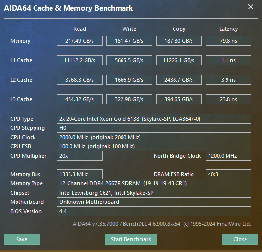
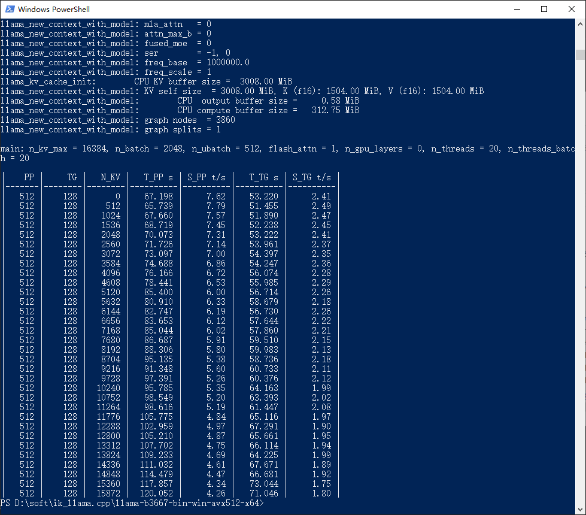
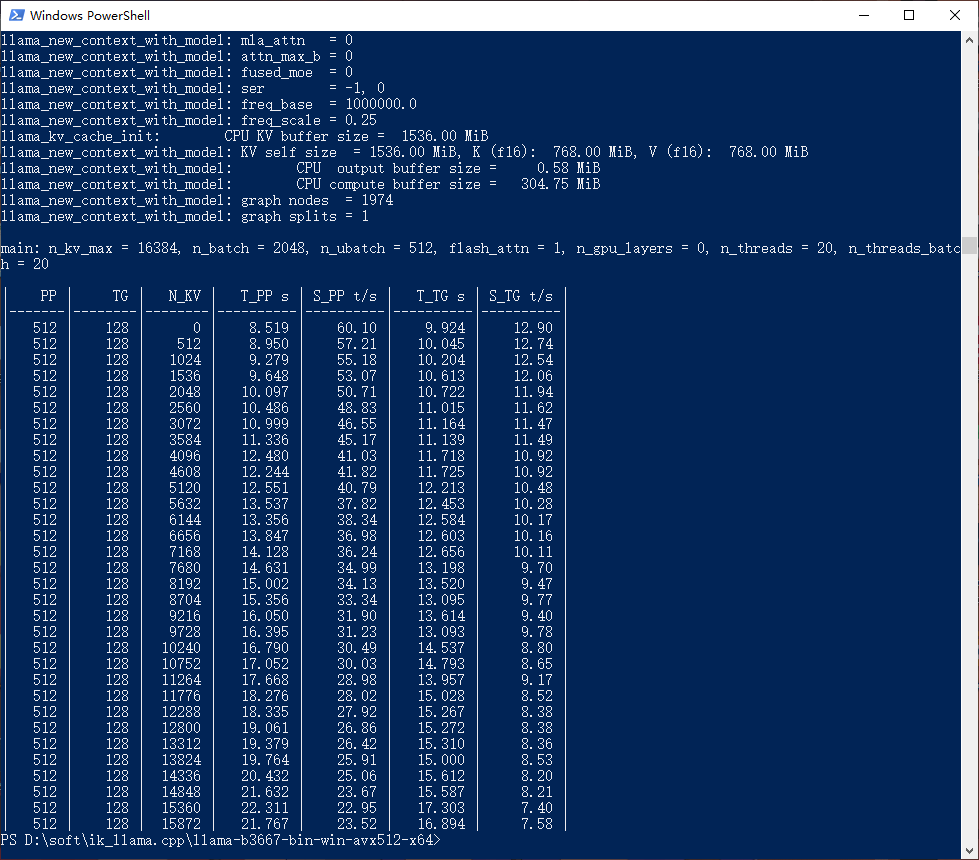
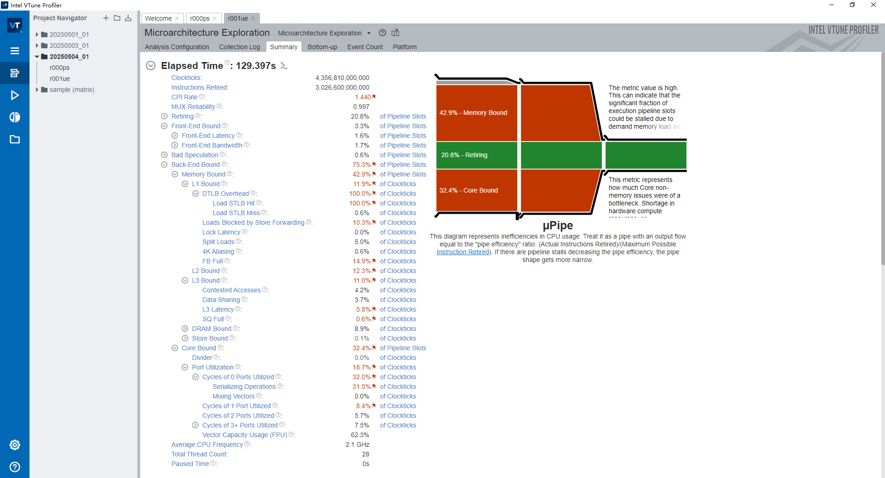
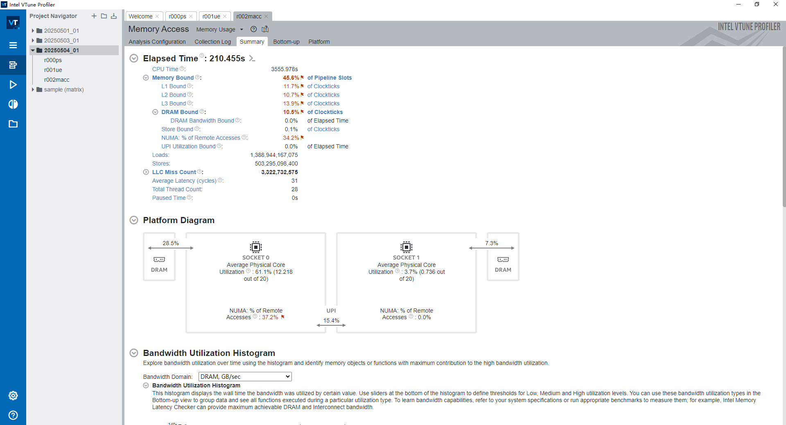
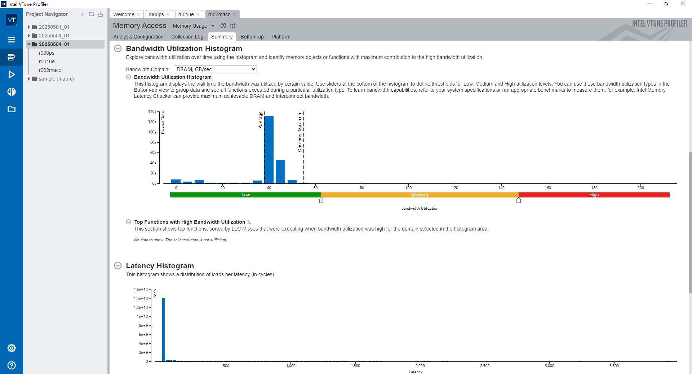

# Qwen3 235B performance on Intel Xeon Scalable processor

## Introduction

The Qwen3 models were officially released on 29th, April, 2025. This is a mixture-of-experts (MoE) models which 235B in total and 22B activated, here are the following features.

- Type: Causal Language Models
- Training Stage: Pretraining & Post-training
- Number of Parameters: 235B in total and 22B activated
- Number of Paramaters (Non-Embedding): 234B
- Number of Layers: 94
- Number of Attention Heads (GQA): 64 for Q and 4 for KV
- Number of Experts: 128
- Number of Activated Experts: 8
- Context Length: 32,768 natively and 131,072 tokens with YaRN.

The qwen3moe had supported in in PR #355, I tried to run the biggest model [Qwen3-235B-A22B-128K-GGUF](https://hf-mirror.com/unsloth/Qwen3-235B-A22B-128K-GGUF) with ik_llama.cpp on my Workstation, I need better generation quality, an my system has sufficient memory(Total 512G RAM), so I chose the relatively higher quality quantization `Q8_0`.

## System Info

Here are my SystemInfo(include hardware and software)

- Hardware
  - CPU: Intel(R) Xeon(R) Gold 6138 CPU @ 2.00GHz(20c, 40t) x2
  - RAM: RDIMM DDR4 2666 2Rx4 32G x16(12 Channels total)
  - Motherboard: Supermicro X11DPi-N
  - SSD: ZHITAI TiPlus7100 1TB
- Software
  - OS: Microsoft Windows 10 Pro
  - BIOS: Hyper-Threading-Enable, SNC-Disable
  - Model: Qwen3-235B-A22B-128K-Q8_0(unsloth/Qwen3-235B-A22B-128K-GGUF)
  - ik_llama.cpp:
  ```text
  INFO [                    main] build info | tid="61372" timestamp=1746525421 build=3667 commit="e3fec173"
  INFO [                    main] system info | tid="61372" timestamp=1746525421 n_threads=16 n_threads_batch=-1 total_threads=40 system_info="AVX = 1 | AVX_VNNI = 0 | AVX2 = 1 | AVX512 = 1 | AVX512_VBMI = 0 | AVX512_VNNI = 0 | AVX512_BF16 = 0 | FMA = 1 | NEON = 0 | SVE = 0 | ARM_FMA = 0 | F16C = 1 | FP16_VA = 0 | WASM_SIMD = 0 | BLAS = 0 | SSE3 = 1 | SSSE3 = 1 | VSX = 0 | MATMUL_INT8 = 0 | LLAMAFILE = 1 | "
  ```

## Memory Performance



## CPU-backend performance

The command line for is `ik_llama.cpp`

llama-sweep-bench:

```text
./llama-sweep-bench -m "%MODEL_PATH%" -c 16384 -t 20 -ngl 0 -fa
```

### ik_llama.cpp CPU-only performance data(Qwen3-235B-A22B-128K-Q8_0)

main: n_kv_max = 16384, n_batch = 2048, n_ubatch = 512, flash_attn = 1, n_gpu_layers = 0, n_threads = 20, n_threads_batch = 20

|    PP |     TG |   N_KV |   T_PP s | S_PP t/s |   T_TG s | S_TG t/s |
|-------|--------|--------|----------|----------|----------|----------|
|   512 |    128 |      0 |   67.198 |     7.62 |   53.220 |     2.41 |
|   512 |    128 |    512 |   65.739 |     7.79 |   51.455 |     2.49 |
|   512 |    128 |   1024 |   67.660 |     7.57 |   51.890 |     2.47 |
|   512 |    128 |   1536 |   68.719 |     7.45 |   52.238 |     2.45 |
|   512 |    128 |   2048 |   70.073 |     7.31 |   53.222 |     2.41 |
|   512 |    128 |   2560 |   71.726 |     7.14 |   53.961 |     2.37 |
|   512 |    128 |   3072 |   73.097 |     7.00 |   54.397 |     2.35 |
|   512 |    128 |   3584 |   74.688 |     6.86 |   54.247 |     2.36 |
|   512 |    128 |   4096 |   76.166 |     6.72 |   56.074 |     2.28 |
|   512 |    128 |   4608 |   78.441 |     6.53 |   55.985 |     2.29 |
|   512 |    128 |   5120 |   85.400 |     6.00 |   56.714 |     2.26 |
|   512 |    128 |   5632 |   80.910 |     6.33 |   58.679 |     2.18 |
|   512 |    128 |   6144 |   82.747 |     6.19 |   56.730 |     2.26 |
|   512 |    128 |   6656 |   83.653 |     6.12 |   57.644 |     2.22 |
|   512 |    128 |   7168 |   85.044 |     6.02 |   57.860 |     2.21 |
|   512 |    128 |   7680 |   86.687 |     5.91 |   59.510 |     2.15 |
|   512 |    128 |   8192 |   88.306 |     5.80 |   59.983 |     2.13 |
|   512 |    128 |   8704 |   95.135 |     5.38 |   58.736 |     2.18 |
|   512 |    128 |   9216 |   91.348 |     5.60 |   60.733 |     2.11 |
|   512 |    128 |   9728 |   97.391 |     5.26 |   60.376 |     2.12 |
|   512 |    128 |  10240 |   95.785 |     5.35 |   64.163 |     1.99 |
|   512 |    128 |  10752 |   98.549 |     5.20 |   63.393 |     2.02 |
|   512 |    128 |  11264 |   98.616 |     5.19 |   61.447 |     2.08 |
|   512 |    128 |  11776 |  105.775 |     4.84 |   65.116 |     1.97 |
|   512 |    128 |  12288 |  102.959 |     4.97 |   67.291 |     1.90 |
|   512 |    128 |  12800 |  105.210 |     4.87 |   65.661 |     1.95 |
|   512 |    128 |  13312 |  107.702 |     4.75 |   66.114 |     1.94 |
|   512 |    128 |  13824 |  109.233 |     4.69 |   64.225 |     1.99 |
|   512 |    128 |  14336 |  111.032 |     4.61 |   67.671 |     1.89 |
|   512 |    128 |  14848 |  114.479 |     4.47 |   66.681 |     1.92 |
|   512 |    128 |  15360 |  117.857 |     4.34 |   73.044 |     1.75 |
|   512 |    128 |  15872 |  120.052 |     4.26 |   71.046 |     1.80 |

---



## ik_llama.cpp CPU-only performance data(Qwen3-30B-A3B-128K-GGUF)

I also experimented with `Qwen3-30B-A3B-128K-Q8_0(unsloth/Qwen3-235B-A22B-128K-GGUF)`, Here are the results, well, the performance is much better than I though.

main: n_kv_max = 16384, n_batch = 2048, n_ubatch = 512, flash_attn = 1, n_gpu_layers = 0, n_threads = 20, n_threads_batch = 20

|    PP |     TG |   N_KV |   T_PP s | S_PP t/s |   T_TG s | S_TG t/s |
|-------|--------|--------|----------|----------|----------|----------|
|   512 |    128 |      0 |    8.519 |    60.10 |    9.924 |    12.90 |
|   512 |    128 |    512 |    8.950 |    57.21 |   10.045 |    12.74 |
|   512 |    128 |   1024 |    9.279 |    55.18 |   10.204 |    12.54 |
|   512 |    128 |   1536 |    9.648 |    53.07 |   10.613 |    12.06 |
|   512 |    128 |   2048 |   10.097 |    50.71 |   10.722 |    11.94 |
|   512 |    128 |   2560 |   10.486 |    48.83 |   11.015 |    11.62 |
|   512 |    128 |   3072 |   10.999 |    46.55 |   11.164 |    11.47 |
|   512 |    128 |   3584 |   11.336 |    45.17 |   11.139 |    11.49 |
|   512 |    128 |   4096 |   12.480 |    41.03 |   11.718 |    10.92 |
|   512 |    128 |   4608 |   12.244 |    41.82 |   11.725 |    10.92 |
|   512 |    128 |   5120 |   12.551 |    40.79 |   12.213 |    10.48 |
|   512 |    128 |   5632 |   13.537 |    37.82 |   12.453 |    10.28 |
|   512 |    128 |   6144 |   13.356 |    38.34 |   12.584 |    10.17 |
|   512 |    128 |   6656 |   13.847 |    36.98 |   12.603 |    10.16 |
|   512 |    128 |   7168 |   14.128 |    36.24 |   12.656 |    10.11 |
|   512 |    128 |   7680 |   14.631 |    34.99 |   13.198 |     9.70 |
|   512 |    128 |   8192 |   15.002 |    34.13 |   13.520 |     9.47 |
|   512 |    128 |   8704 |   15.356 |    33.34 |   13.095 |     9.77 |
|   512 |    128 |   9216 |   16.050 |    31.90 |   13.614 |     9.40 |
|   512 |    128 |   9728 |   16.395 |    31.23 |   13.093 |     9.78 |
|   512 |    128 |  10240 |   16.790 |    30.49 |   14.537 |     8.80 |
|   512 |    128 |  10752 |   17.052 |    30.03 |   14.793 |     8.65 |
|   512 |    128 |  11264 |   17.668 |    28.98 |   13.957 |     9.17 |
|   512 |    128 |  11776 |   18.276 |    28.02 |   15.028 |     8.52 |
|   512 |    128 |  12288 |   18.335 |    27.92 |   15.267 |     8.38 |
|   512 |    128 |  12800 |   19.061 |    26.86 |   15.272 |     8.38 |
|   512 |    128 |  13312 |   19.379 |    26.42 |   15.310 |     8.36 |
|   512 |    128 |  13824 |   19.764 |    25.91 |   15.000 |     8.53 |
|   512 |    128 |  14336 |   20.432 |    25.06 |   15.612 |     8.20 |
|   512 |    128 |  14848 |   21.632 |    23.67 |   15.587 |     8.21 |
|   512 |    128 |  15360 |   22.311 |    22.95 |   17.303 |     7.40 |
|   512 |    128 |  15872 |   21.767 |    23.52 |   16.894 |     7.58 |

---



## Profiler Data

I also use `Intel VTune Profiler 2025.0.1` capture some interesting data when running llama-server with `Qwen3-30B-A3B-128K-Q8_0`, I will show them as well.






