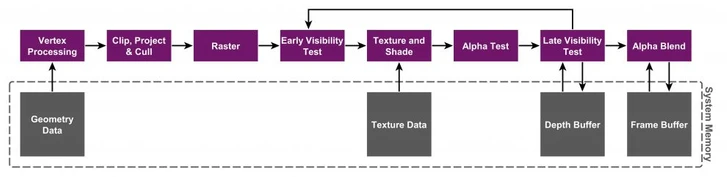
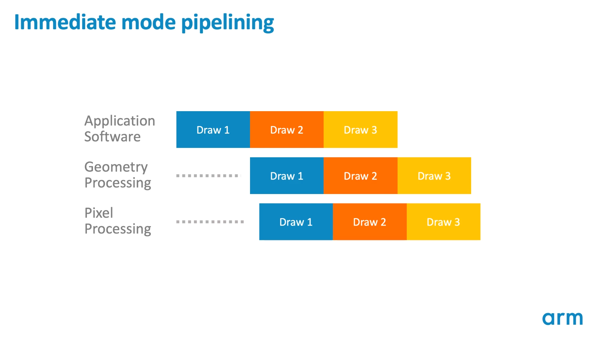
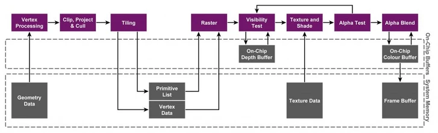
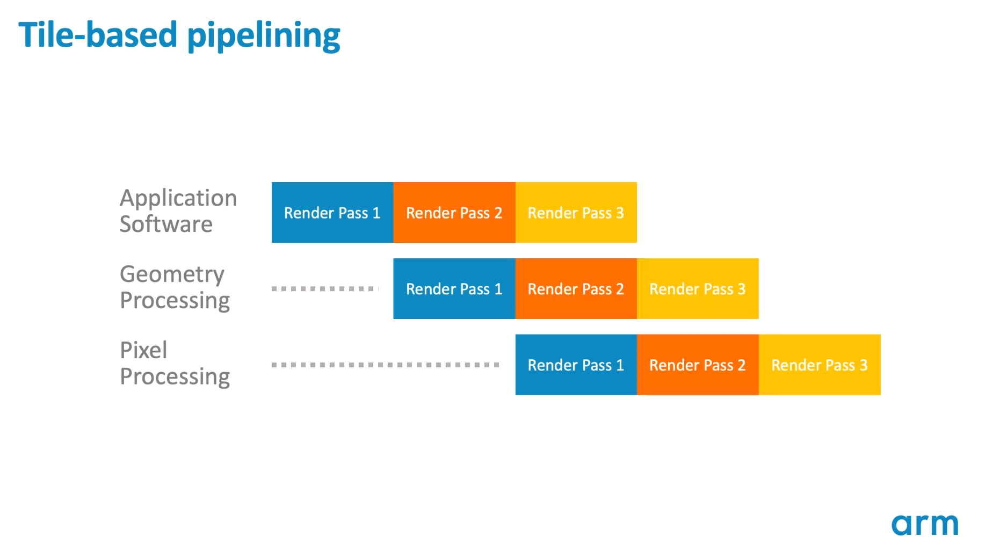
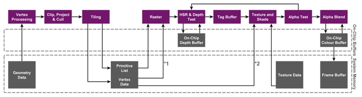
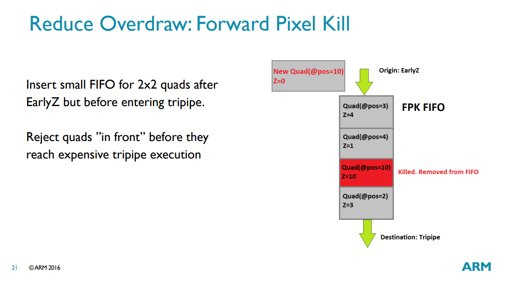
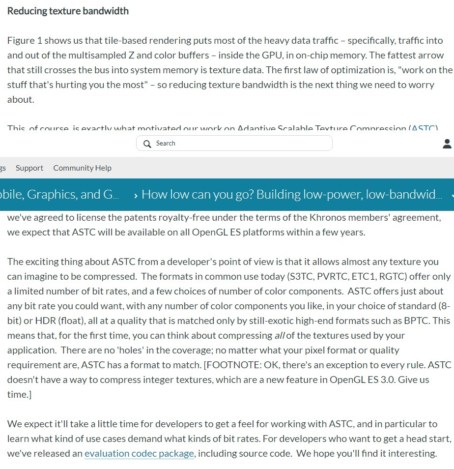
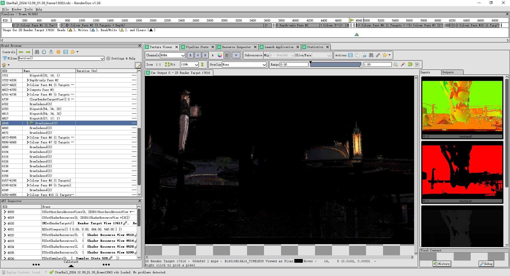
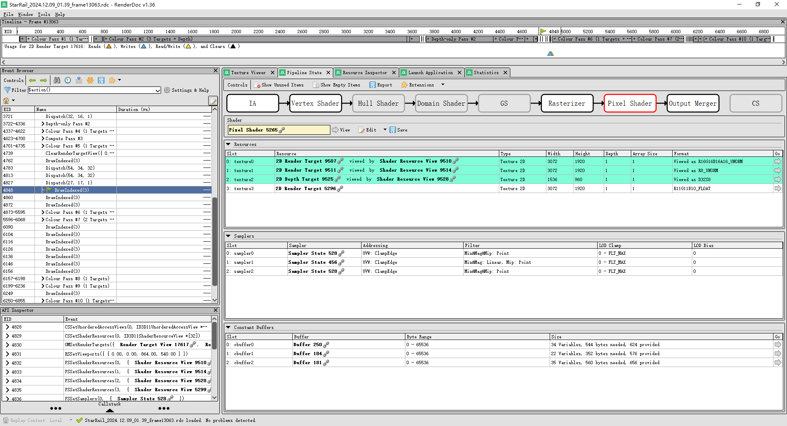

# 如何高效的在手机上渲染？浅谈移动端 TB(D)R 架构

前言：当前，手机游戏对GPU的需求在日益剧增，目前市场上的移动端GPU主要由三家公司主导，分别是ImgTec的PowerVR系列、Qualcomm（高通）的 Adreno 以及 ARM（安谋）的 Mali，以及还有华为的马良（Maleoon）和苹果的Apple Silicon系列，由于移动端的特殊性，在追求高性能的同时，手机游戏还需要考虑功耗问题。为了延长手机的续航时间，GPU需要具备更高的能效比，因此，这也让桌面端和移动端的GPU架构变得截然不同，作为一起科普向杂谈，所以我们今天来聊聊移动端的GPU在架构层面是如何在高效渲染的同时降低能耗的。

## 名词解释

- **图元（Primitive）**：可以绘制的最小单元。通常来说就是三角形，不过也可以是线段、点。
- **片元/片段（Fragment）**：每个图元光栅化以后的产物，每个片元都有可能会覆盖一些屏幕上的像素。
- **常量缓冲区（Constant Buffer，DirectX）/统一缓冲区（Uniform Buffer，Vulkan/OpenGL）**：对于整个渲染流程来说，只有一份的数据（相对于例如顶点缓冲区中有per vertex的数据而言）。通常来说，例如摄像机参数、光源的参数等等，会在常量缓冲区中。
- **着色器（Shader）**：执行在 GPU 上的程序。
  - **顶点着色器（Vertex Shader）**：执行顶点变换的着色器。通常对于三维游戏来说，其将顶点从局部坐标转换到世界坐标，再从世界坐标投影到画面上的坐标。
  - **像素着色器（Pixel Shader, DirectX）/片段着色器（Fragment Shader，Vulkan/OpenGL）**：计算出每个像素上的颜色的着色器。光照计算通常在这里发生（但不限于光照）。
- **IMR（Immediate Mode Rendering）**：立即渲染模式，是一种经典的渲染管线架构。在这种架构中，图形数据（如顶点、颜色、纹理坐标等）在每个绘制调用（draw call）中被直接提交给GPU。每次调用都会立即处理这些数据并渲染出图形。
- **TBR（Tile-Based Rendering）**：基于分块的渲染，是目前主流的移动GPU渲染架构。在这种架构中，屏幕被划分为多个小的Tile（瓦片），然后逐个Tile进行渲染。
- **RenderPass（渲染通道）**：RenderPass定义了整个渲染管线（Render Pipeline）的一次执行过程，它本质上是一份元数据或占位符，描述了完整的渲染流程以及所使用的所有资源。这些资源通常包括颜色缓冲区、深度/模板缓冲区等，被称为Attachments（附着物）。

## 桌面端与移动端GPU架构的差异

IMR 简要流程图:

这是个IMR GPU大致的执行流程。从左到右，硬件从显存中读取顶点的数据和全局的世界数据（例如摄像机数据等）输入顶点着色器，顶点着色器将顶点从三维空间中变换到屏幕空间的坐标上。然后经过一些高效的固定功能硬件的处理，这些顶点被光栅化成了一个个片元，并在此过程中剔除了一些对最终画面没有影响的片段（早期深度测试，Early-Z Test）。随后，硬件将采样纹理数据、并读取光源等数据作为输入片段着色器。最终这些颜色经过再一轮的测试（透明度测试 Alpha Test 和后期深度测试 Late-Z Test）确定其对最终画面有影响以后，执行透明混合（Alpha Blend），最终写入到帧缓冲中，显示到屏幕上。

在将这套管线迁移到移动端的过程中，发现了几个问题，先说结论：

1. 显存和GPU之间的数据传输是很慢的（相较于GPU的算力来说）。移动端通常 GPU 和 CPU 共享同一个内存池，而 DRAM 的带宽并不足以支撑图形渲染全流程的巨大带宽要求。同时，也几乎不可能将渲染中会用到的大量数据全部缓存住。移动端寸土寸金的 die area，很难将其花在缓存上。GPU 可能需要在等待显存的数据响应的时候，调度执行其他线程，来隐藏延迟。无论采取上述何种解决方式，都会对 GPU 的调度器、GPU的规模和 GPU 的显存带宽带来更高的要求。
2. 显存的动态功耗是很高的。ARM 官方给出的 rule of thumb 是 80-100mW per GB/s. 太高的功耗在移动端是不可接受的。（5W 的 power budget 下，能接受多少 GB/s 的显存流量？桌面 GPU 通常拥有 200GB/s 以上的显存带宽，甚至顶级消费级显卡可以达到或超过 1TB/s）。
3. 几何形状及其最终投影的关系是难以预测的。来自同一个 drawcall 的顶点数据，实际上极有可能在最终画面上的分布相差很远（绝区零邦布拍照任务？——即使确定的mesh，也可能会因为摄像机参数，或者其他一些原因而在屏幕空间上相差很远）。因此，很难去将屏幕空间的所有缓冲区都cache住，GPU片上的缓存会不停的被污染。

### GPU 算力增长的内存带宽需要和不平衡不充分的发展之间的矛盾

运算芯片的算力在飞速发展的同时，内存（DRAM）的发展速度却像蜗牛爬。如今，CPU 的运算吞吐量已经可以和 DRAM 速度差出数十倍甚至上百倍。CPU 况且如此，GPU 这种生来就是为了高吞吐而生的计算设备，问题就愈发严重了（DDR5 6400 双通道 - 100GB/s，也就是 25GFlops fp32 或者 50GFlops fp16，而 8gen2 GPU 可以有近 2000GFlops fp32 算力，4000GFlops fp16 算力）——不解决内存的问题，就是将许多性能白白的浪费了！

## 移动端 TBR 架构的提出

PowerVR 第一个发现了这个问题，并在 2001 年的时候提出了 TBR 架构。

TBR 简要流程图:

可以看出，TBR 架构直接把完整的渲染管线中各个阶段，拆分成了顶点阶段和着色阶段这两个相对独立的阶段。TBR架构在GPU很近的位置增加了一片高速缓存，通常被称为Tile Memory（图中也叫On-Chip Buffer）。受限于成本、耗电等原因这块缓存不会很大，大概几十k这个量级。

在TBR的渲染流程中，首先，它先将屏幕分成许多小块（叫做tiles），然后根据这些tiles和变换到屏幕空间的顶点的位置关系，将这些顶点排序，并分成很多的bin（这个过程叫binning）。这些排序后的结果存储到System Memory中，这块缓存也被称为Parameter Buffer (PB， 图中Primitive List和Vertex Data)，然后处理下一个绘制指令。当所有绘制指令的顶点数据都做好处理存进PB或是PB达到一定容量之后才开始进行管线的下一步，即显卡会以tile为单位从PB中取回相应的顶点数据，进行光栅化、fragment shader以及逐片元处理。原本在逐片元处理中需要频繁的访问System Memory变为代价极低的对Tile Memory的访问。直到这个tile的frament将数据全部更新到Tile Memory上之后，再将该Tile Memory中的数据写回System Memory，然后执行下一个tile的处理。

## TBR 更进一步——TBDR

在TBR对tile进行分组的过程中，这个阶段其实也可以做一些优化：通常 TBR GPU 都会配备叫做隐藏面消除（HSR，Hidden Surface Removal）的功能。其核心思想是：如果一个图元被其他不透明图元完全遮挡的话，这样我们就可以完全不去计算它，减少实际上对最终画面没有影响的计算（overdraw）。隐藏面消除有很多实现，例如 Mali 有两套机制：Early-Z + FPK（Forward Pixel Kill）去分别从正反两个方面去去除无效的图元。
随后，因为我们已经知道了每个bin中的图元对应在屏幕上的tile，我们只要按照顺序去一个一个光栅化和着色这些图元就可以了。

因此，TBDR的优势在于利用PB中缓存的顶点数据，提前对流入到管线剩余部分的片段进行了筛选，来解决传统渲染管线的一个老大难问题——过度绘制（over draw）。

### 题外话：TBDR 中的隐面剔除

**「隐面剔除」** 技术这一术语来自于 PowerVR 的 HSR (Hidden Surface Removal)，通常用来指代 GPU 对最终被遮挡的 Primitive/Fragment 做剔除，避免执行其 PS，以达到减少 Overdraw 的效果。

尽管类似诸如 Depth Prepass （在一个render pass中，首先渲染物体的深度信息到depth buffer中，然后再渲染物体的颜色。在渲染颜色时，使用深度测试来确保只着色那些可见的像素。）这样的技术已经实现了通过预渲染深度的方式降低fragment overdraw，HSR 算的上是基于硬件实现的discard fragment(由于binning 阶段已经有了深度信息)。

Adreno/Mali/PowerVR 三家在处理隐面剔除除的方式是不一样的。

1. PowerVR 的 HSR 原理是生成一个 visibility buffer，记录了每一个 pixel 的深度，用于对 fragment 做像素级的剔除。因为是逐像素级的剔除，因此需要放到 Rasterization 之后，也就是说每个三角形都需要做 Rasterization。根据 visibility buffer 来决定每一个像素执行哪个 fragment 的 ps。也因此，PowerVR 将自己 TBR (Tile Based Rendering) 称为 TBDR (Tile Based Deferred Rendering)。 而且特别提到了一点，如果当出现一个 fragment 的深度无法在 vs 阶段就确定，那么就会等到 fragment 的 ps 执行完，确定了深度，再来填充对应的 visibility buffer。也就是说这个 fragment 会阻塞了 visibility buffer 的生成。 这个架构来自于 PowerVR 2015年左右的文档，后续 Apple 继承了其架构，但是后面是否有做更进一步的架构优化不得而知。
 

2. Adreno 实现隐面剔除技术的流程称为 LRZ (Low Resolution Depth)，其剔除的颗粒度是 Primitive 而不是 Fragment。在 Binning pass 阶段执行 Position-Only VS 时的会生成一张 LRZ buffer （低分辨率的 z buffer），将三角形的最小深度与 z buffer 做对比，以此判断三角形的可见性。Binning pass 之后，将可见的 triangle list 存入 SYSMEM，在 render pass 中再根据 triangle list 来绘制。相比于 PowerVR 的 HSR，LRZ 由于是 binning pass 做的，可以减少 Rasterization 的开销。并且在 render pass 中，也会有 early-z stage 来做 fragment 级别的剔除。 对于那种需要在 ps 阶段才能决定深度的 fragment，就会跳过 LRZ，但是并不会阻塞管线。
 

3. Mali 实现隐面剔除的技术称为 FPK (Forward Pixel Killing)。其原理是所有经过 Early-Z 之后的 Quad，都会放入一个 FIFO 队列中，记录其位置与深度，等待执行。如果在执行完之前，队列中新进来一个 Quad A，位置与现队列中的某个 Quad B 相同，但是 A 深度更小，那么队列中的 B 就会被 kill 掉，不再执行。 Early-Z 只可以根据历史数据，剔除掉当前的 Quad。而 FPK 可以使用当前的 Quad，在一定程度上剔除掉老的 Quad。 FPK 与 HSR 类似，但是区别是 HSR 是阻塞性的，只有只有完全生成 visibility buffer 之后，才会执行 PS。但 FPK 不会阻塞，只会kill 掉还没来得及执行或者执行到一半的 PS。

## 从 TB(D)R 架构中的发现

我们来重点关注一下着色阶段，这才是 TBR 架构真正发挥威力的地方——不到最后一刻，它根本不会去碰显存！注意到 TBR 架构的 GPU 上都有一块专门的 Tile Memory （GMEM），这块空间是和 Cache 一样的 SRAM 打造的，因此有极高的带宽、极低的延迟以及并不需要耗电刷新——也就是功耗低。这块存储空间就像是草稿纸，着色阶段会直接从里面读取之前的数据，也可以往里写入数据去渲染——都是以 Cache 级的极低功耗和延迟、极高带宽来完成的。最后的最后，在所有渲染流程结束的时候，会将GMEM中的内容写入到显存中。请注意，这个箭头是单向的——TBR 架构只会在最终所有工作都完成的时候，才会将这个 tile 写入显存中）这个过程被称之为 Resolve）。随后，GMEM 中的内容可以被完全清空——也不会再需要这些内容了——省去了不少显存带宽的roundtrip、也节省了不少显存容量！

这种分块的特性，MSAA 带来的性能消耗将会变得非常小！因为多重采样都只会发生在 GMEM 中，因此不会像普通的 IMR GPU 那样带来非常大的显存的带宽消耗。

不仅如此，因为很多 render pass 的并不需要上屏，所以这些 render pass 的帧缓冲区根本不需要写到显存里——直接开始下一个 render pass，并引用已经在 GMEM 中的数据就可以了。

题外话：厂商还是觉得最后这个帧缓冲的写入带来了太多的显存带宽消耗，因此还催生出了例如 AFBC （ARM Frame Buffer Compression）这样的技术，来进一步压缩显存的流量。当然，由于纹理在渲染时也需要被 GPU 读取，因此也产生了 ASTC 这样的纹理压缩技术，其可以分块解压，非常适合 TBR 架构的 GPU （可以分块地将纹理数据存储在 GMEM 中）。

总之，TBR架构的核心思想是将整个屏幕划分为多个Tile并使用tile memory来进行渲染，减少了对于FrameBuffer频繁的读取和写入，从而大大减少带宽损耗。

 

> ASTC 纹理压缩：
> ASTC（Adaptive Scalable Texture Compression），即自适应可扩展纹理压缩，是一种高效的纹理压缩格式，由ARM公司开发。
> ASTC支持多种压缩级别和块大小，允许开发者根据具体需求灵活选择。ASTC的压缩分块从4x4到12x12不等，最终可以压缩到每个像素占用1bit以下。
> ASTC采用块压缩的思想，将纹理分为多个小块进行压缩，每个块可以有不同的压缩格式和压缩比，从而根据纹理的特性进行灵活调整。
> 
> 

## TB(D)R 架构存在的问题

尽管 TBR 有很多好处：降低了很多来自屏幕空间大小的缓冲区的内存带宽消耗，而且可以带来非常低消耗的抗锯齿实现。那么代价是什么呢？

回顾下 TBR 的渲染流程，它将屏幕分割成小块（Tile），然后分别对每个小块进行渲染。binning过程是在Vertex阶段之后，将输出的几何数据存储到显存，然后才被FragmentShader读取，几何数据过多的管线，容易在此处有性能瓶颈。在TBR架构中，GPU内部集成有很小的片上缓存（On-Chip Buffer），用于临时存储每个Tile的渲染结果。渲染时，先将一个Tile内的图像渲染到片上缓存，然后再拷贝到主显存中。

因此，场景中的mesh如果非常复杂，会直接影响 TBR GPU 的性能。TBR GPU 的这种做法，让大多数的手游都没办法使用非常高精度的模型。减面、降低顶点复杂度，是移动端图形开发至今为止都绕不开的话题。也正因如此，mesh shader 这种在桌面端初露头角的技术，在目前的移动端很难推广开去。（例如 Nanite 的假设就是，模型精度远高于屏幕分辨率精度，三角形可以大量地小于一个像素的大小。这种场景直接用 TBR GPU 渲染，就是最坏的情况：顶点的数量 ~= 或者 > 像素的数量）。

同时，这也就意味着移动端要尽可能的减少 renderpass 的切换，因为在同一个renderpass内，所有的shading操作都可以在 GPU 的片上内存（Tile Memory）完成，在一个renderpass结束后，再一次性写回System Memory的framebuffer上，并结合render pass上指定RT（render target）的Load/Store Op来进一步降低带宽开销。

最后，TBR GPU 还有一个问题。其对屏幕空间的效果（比如 SSAO 屏幕空间环境光遮蔽/SSR 屏幕空间反射等），是根本没有招架之力的。因为这些效果通常需要屏幕空间上其他区域的像素点来做运算，而如果是 TBR GPU 上，是一个一个 tile 去计算的话——这些算法很有可能会引用到根本还没有开始计算的tile上的数据，或者它要保持多个 tile 都是留存在 GMEM 中的！在这些时候，TBR GPU 有可能会推迟这个计算，或者很多时候做不到 GMEM 的留存的话，也有可能会回退到经典 IMR 的行为——不管怎么做，在这种情况下的 TBR 带来的优势都荡然无存了。在这些pass里，很多游戏会选择将中间的辅助pass降到半分辨率。这样可以在保证效果的同时，降低显存带宽。（特别是低频的信息，例如动态模糊、bloom这样的效果）（p.s. 米哈游的游戏基本上都会带这个半分辨率的优化，但snl是都没有这些考量的）。

例如，以《崩坏：星穹铁道》为例，在 SSR（屏幕空间反射）的pass中，其中深度和法线的RT都是以当前屏幕分辨率的一半进行，这样可以有效降低显存带宽的开销和ps的压力，减少显存占用，并提高L1/TEX Cache的命中率。

## 如何提高在Tiled-Based GPU上的渲染性能

实际上现在一个游戏渲染一帧，很大概率并不是只走一次上面的管线。走一遍上面的管线，现在被称作一个 render pass。而一个render pass渲染出来的帧，很有可能作为其他render pass的输入纹理。例如 shadow map，就需要一个 shadow pass 来计算场景到光源的深度图，随后再在主颜色pass中采样深度图，比较深度，决定是否产生阴影。在这个过程中，不同render pass之间，难免也会存在经过显存的写入和读取操作。

在 Vulkan/DirectX12 这样现代的 Graphics API 以前，是没有 render pass 这样的概念的，一般就是指画在同一个RT的drawcall。

当然这在业界也有解决办法——让应用程序通过 API 层面的 hint，告诉 GPU 硬件这个 render pass 要怎么处理。Vulkan 就存在 subpassLoad（input attachment） 的概念，告诉驱动，这个 render pass 的输出帧是在别的 pass 中有用到。
其实类似vulkan的这个subpass概念在其他图形 API 中也有所涉及，在metal中叫programmable blending，在更老的opengl es中也是framebuffer fetch和depth stencil fetch（或者较少人用的 PLS (pixel local storage)）。

苹果 Metal 2/A11 中推出的 Tile Shader 和 ImageBlock，实际上也是一个对 Tile Memory 的抽象。并且通过这两个设计，Metal 将 Tile Memory 的控制权完全交给了 Metal 开发者，不愧是有 IMG 血缘的架构啊。而很可惜，DirectX 12 里有 Render Pass 的概念，可以通过 D3D12_FEATURE_D3D12_OPTIONS5 中的 RenderPassesTier 来检查 GPU 驱动对这个特性的支持。但是很可惜的是，现在绝大多数桌面 GPU 都不支持这个特性。这意味者开发者都不会针对这个特性去优化。（X Elite 的 X1-85 支持这个特性，但是在这上边跑的所有 DirectX 12 游戏，应该都没有在代码层面专门调用 Render Pass 相关 API，更不用说专门为这个特性去优化渲染算法了）。

## Subpass 与 One Pass Single Deferred

通过对vulkan的subpass介绍可以看出，这样一来，我们不就可以借助subpassLoad特性来完成本来需要多个pass才能做的事情了吗？例如在现代的游戏中，延迟渲染（Deferred Shaing）被广泛的使用，通过将几何与光照两个pass进行分离，完整最终的着色。由于lighting pass对gbuffer的读写是在当前着色像素上完成的，这无疑很适合subpass设计渲染管线。

以 UE4 Mobile Renderer 为例，让我们来看看 mobile deferred shading 是如何在tiled based gpu上高效进行的

Vulkan的做法为：将Render Pass分为多个subpass，每个subpass有自己要执行的任务，将它们放在一个pass可以方便我们表达GBuffer pass和lighting pass之间的依赖关系。这个依赖关系会被GPU driver使用，将多个subpass合并成One single pass。这样我们就不需要把GBuffer store回system memory了。每个subpass都需要声明自己读写的attachment。用于获取input attachment的语法为SubpassLoad，通过它我们就可以在lighting subpass中获取当前像素GBuffer的数据。

Mobile deferred shaderer中最后会得到3个subpass：1.Gbuffer，2.Decal（写入GBuffer），3.Lighting+Transparent（写入SceneColor）。结束后，只将SceneColor写入system memory即可。

OpenGL ES的话则通过extension来实现Mobile Deferred Shading：pixel local storage（Mali和PowervR支持，Adreno不支持，且无法store回system memory），framebufferfetch（Adreno支持，Mali不完全支持，Mali只能读取color0 attachment）。所以UE需要在runtime的时候根据GPU型号改变Shader代码。UE4.27会完全支持PLS和FBFetch。

这样的好处在于，执行FragmentShader的时候，可以将Tile的Framebuffer数据存储在In-Chip Cache上面，只有当这个Tile所有的subpass都执行完了之后，才会把渲染结果写回dram，这样subpass对于framebuffer的读写带宽开销可以省略很多，有效的利用了tile-based架构节约内存带宽。特别是对于延迟渲染管线而言，将gbufferpass和lightpass以subpass的形式放在同一个renderpass中执行，可以实现one pass defer，能够让Gbuffer完全只存在于Tile Memory中，极大地节省了系统带宽。
