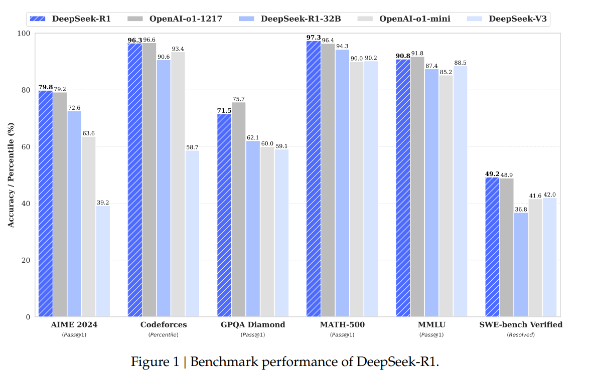
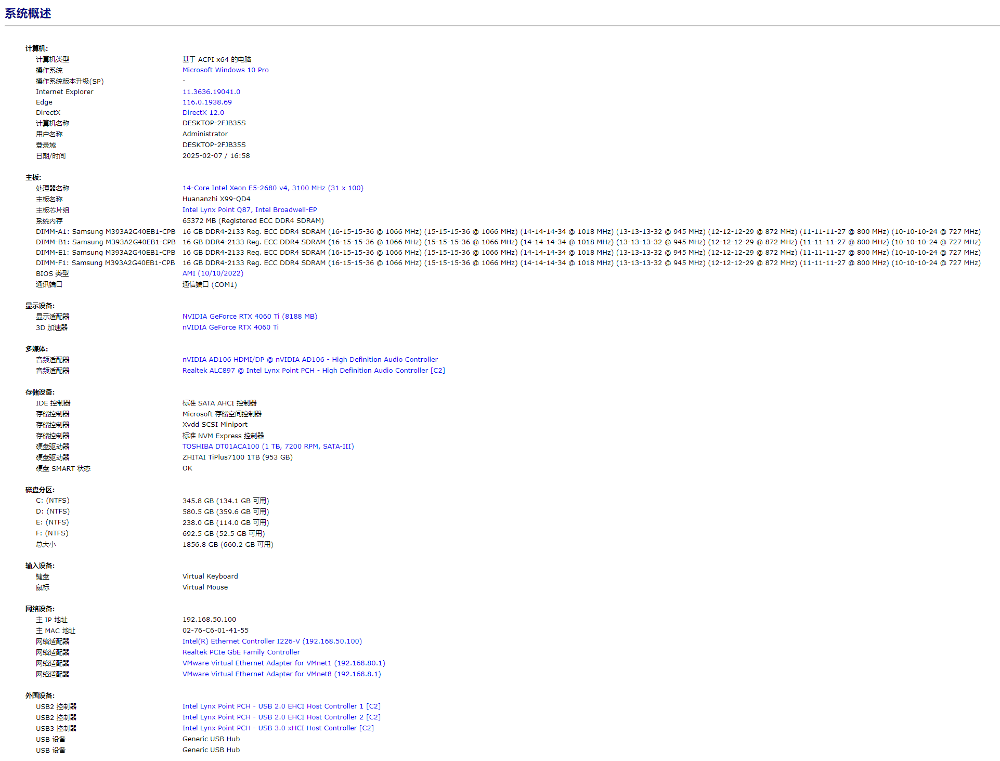
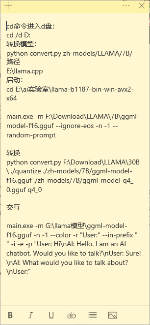
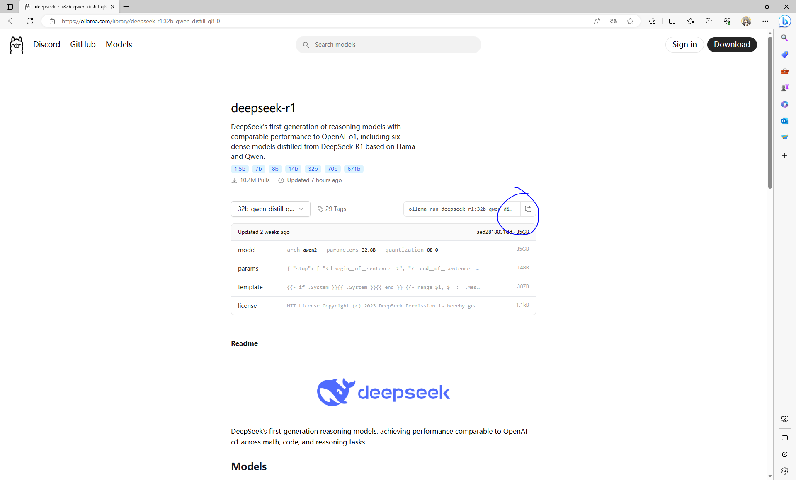
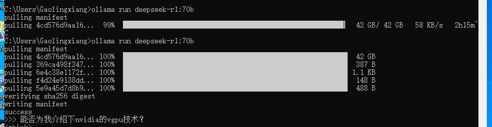
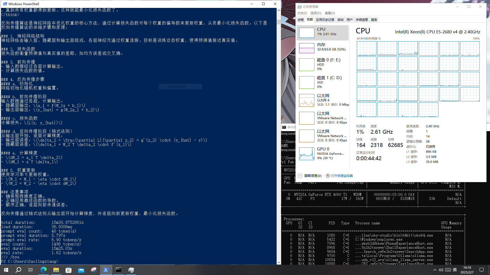
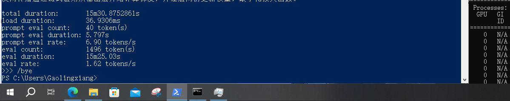
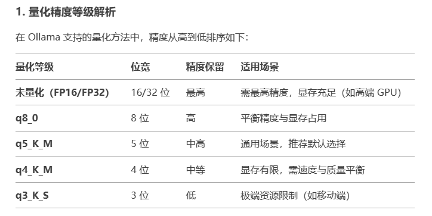
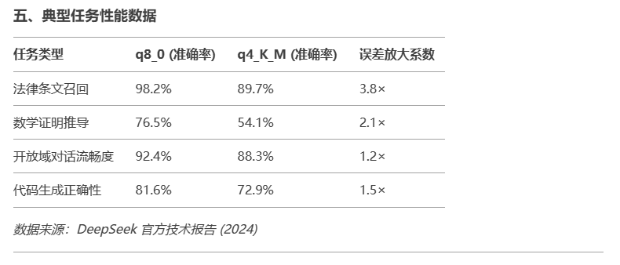

# 本地部署DeepSeek R1 32B测试报告

ChatGPT横空出世后700多天里，全球人工智能巨头不约而同走上了一条“大力出奇迹”的“暴力美学”路线，参数越“炼”越大，给算力、数据、能耗带来了极大压力。很长一段时间，参数几乎成为大模型厂商比拼的最大焦点。
而另辟蹊径的DeepSeek恰巧处于对角线的另一端：并不盲目追求参数之大，而是选择了一条通过探索更高效训练方法以实现性能提升的“小而精”路线，打破了“参数膨胀”的惯性。

最近看到 DeepSeek R1 凭借其出色的推理能力和低成本训练的优势在一众LLM中尤为突出，如果说，最关键的是其相关论文、模型、代码已经在huggingface上全部开源，让“大模型走进千家万户”不再是一句口号，以下是关于《DeepSeek-R1: Incentivizing Reasoning Capability in LLMs via Reinforcement Learning》的摘要[(链接)](https://arxiv.org/pdf/2501.12948.pdf)：

> 摘要
>
> 本文介绍了第一代推理模型DeepSeek-R1-Zero和DeepSeek-R1，旨在通过大规模强化学习（RL）提升大型语言模型（LLM）的推理能力。DeepSeek-R1-Zero是基于基础模型通过纯RL训练而无需监督微调（SFT），在推理任务上表现出色，如AIME 2024的pass@1分数从15.6%提升至71.0%，甚至通过多数投票进一步提升至86.7%。然而，该模型存在可读性和语言混合问题。为解决这些问题并进一步增强推理性能，提出了DeepSeek-R1，结合冷启动数据和多阶段训练，在多个推理基准上取得了与OpenAI-o1-1217相当的性能。 为了支持社区，作者开源了DeepSeek-R1-Zero、DeepSeek-R1以及六个不同参数量的密集模型。此外，还展示了将推理能力蒸馏到小型密集模型中，使得这些小模型在推理任务上的表现优于仅通过RL训练的小模型。例如，蒸馏后的14B模型显著超越了现有的开源QwQ-32B-Preview，而32B和70B模型在推理基准上创下了新纪录。 实验结果表明，DeepSeek-R1在数学推理、编程竞赛等多个任务上表现出色，不仅超过了其他闭源模型，而且在某些任务上接近或超越了OpenAI-o1系列模型。此外，DeepSeek-R1在知识类任务和其他广泛的任务类型中也表现出色，包括创意写作、一般问答等。
>
> Abstract:We introduce our first-generation reasoning models, DeepSeek-R1-Zero and DeepSeek-R1. DeepSeek-R1-Zero, a model trained via large-scale reinforcement learning (RL) without supervised fine-tuning (SFT) as a preliminary step, demonstrates remarkable reasoning capabilities. Through RL, DeepSeek-R1-Zero naturally emerges with numerous powerful and intriguing reasoning behaviors. However, it encounters challenges such as poor readability, and language mixing. To address these issues and further enhance reasoning performance, we introduce DeepSeek-R1, which incorporates multi-stage training and cold-start data before RL. DeepSeek-R1 achieves performance comparable to OpenAI-o1-1217 on reasoning tasks. To support the research community, we open-source DeepSeek-R1-Zero, DeepSeek-R1, and six dense models (1.5B, 7B, 8B, 14B, 32B, 70B) distilled from DeepSeek-R1 based on Qwen and Llama.

Benchmark performance of DeepSeek-R1.

由于将deepseek-r1:671b完整的部署到一台低配电脑上显然是不可能的，我这里使用deepseek-r1的蒸馏模型：deepseek-r1:32b-qwen-distill，量化精度Q8_0，在一台E5-2680v4(14 Core CPUs)，64G RAM，RTX 4060Ti(8G VRAM)的电脑上尝试用ollama进行推理。

具体配置如下：

部署过程倒是不麻烦，安装下载好ollama之后cmd输入 **ollama run deepseek-r1:32b-qwen-distill-q8_0** 等待即可，会自动帮我们完成gguf的下载和运行，像我之前用llama.cpp的时候还要手敲cmd运行模型，ollama已经自动帮我们完成这些步骤了，想部署其他模型也可以去ollama的官网查找该模型其他的tags[(链接)](https://ollama.com/library/deepseek-r1/tags)，当然了，除了从ollama官网下载，你还可以导入已有的GGUF模型或者Safetensors 模型，具体步骤可以参考github相关文档[(链接)](https://github.com/ollama/ollama/blob/main/docs/import.md)，网速快的话就很好办。
p.s:在运行模型时候可在末尾加上 --verbose 参数，显示推理性能，如 **ollama run deepseek-r1:32b-qwen-distill-q8_0 --verbose**

llama.cpp操作步骤稍微繁琐点

 

以下是ollama部署过程的截图：

测试视频如图：

最终推理性能如下：

emmm...这个性能怎么说呢，eval rate 1.62token/s，不能算很快，因为GPU显存太小，完全加载模型到GPU显然是不可能的，ollama ps 命令查看模型运行情况，PROCESSOR部分 80%/20% CPU/GPU 也能印证这一点，但是至少在最大限度保证精度的情况下，量化之后还能在这么一个洋垃圾平台跑起来了，还是很欣慰的。

我自己测试了如下几个deepseek r1蒸馏模型：

32B，q4_k_m量化: ollama run deepseek-r1:32b
32B，q8_0: ollama run deepseek-r1:32b-qwen-distill-q8_0
70B，q4_k_m量化: ollama run deepseek-r1:70b
70B，q8_0: ollama run deepseek-r1:70b-llama-distill-q8_0（内存不足）

可能有人对模型精度这块不是特别了解，按照 llama.cpp 在wiki测试集上评估，精度从高到低如下：FP16>Q8_0>Q6_K>Q5_K_M>Q5_0>Q4_K_M>Q4_0，精度越高，内存占用越大，且推理速度越慢，但对于知识密集型任务、数学/符号推理、长文本生成性能更好。

关于最多能跑多大模型？原则上是你当前的系统内存+显存必须大于模型载入时候的体积（比如一个70B参数FP16 格式的模型，完全载入需要70 × 10^9 × 2 bytes = 140 GB），除此之外，推理过程中的kv缓存（和缓存的上下文长度有关，Transformer模型的自注意力机制需要计算每个位置的键（Key）和值（Value），以便生成查询（Query）与其他位置的键进行匹配，从而得到注意力权重，再与值结合得到最终的输出。在推理过程中，尤其是生成式任务（如文本生成），模型通常会逐步生成序列，每次生成一个token。kv缓存越大，能缓存的上下文越长）和一些临时变量也会占据一定的内存，所以实际所需的内存应该是略高于模型原本体积的。

实测下来，q4_k_m量化的 deepseek-r1:70b-llama-distill 掌握的knowledge最广，我能明显感觉到70b的思考更加深入和全面，可惜GPU显存太小，CPU性能也不行，<0.5token/s几乎无法用。其次是q8_0量化的deepseek-r1:32b-qwen-distill，q4_k_m量化的deepseek-r1:32b-qwen-distill一些具体概念表述稍微模糊，复杂的推理逻辑稍微有点混乱，但总体依旧能用。

本来还想尝试下q8_0量化的deepseek-r1:70b-llama-distill，奈何内存实在不够也只能放弃，大家也可以在自己的电脑上分别测试deepseek r1各个参数大小和量化精度的模型，评论区可以分享下。后期我计划试试能不能用lora对70b的蒸馏模型进一步进行微调/强化学习。

## 扩展

说实话，我一开始也不是很了解deepseek-r1模型的蒸馏技术是什么？以及它是如何实现的，通过询问deepseek得知：

> deepseek-r1模型的蒸馏技术
> from 《DeepSeek-R1: Incentivizing Reasoning Capability in LLMs via
Reinforcement Learning》

DeepSeek-R1 的蒸馏技术旨在将大型模型（教师模型）的推理能力迁移到更小、更高效的模型（学生模型）中，具体实现方式如下：

---

### **蒸馏技术的核心思想**
通过监督微调（Supervised Fine-Tuning, SFT）直接利用教师模型（DeepSeek-R1）生成的推理数据训练小型模型，从而继承其强大的推理能力，而无需复杂的强化学习（RL）阶段。

---

### **实现步骤**
1. **生成训练数据**  
   使用 DeepSeek-R1 生成约 **80 万条样本**，包含两类数据：
   - **推理相关数据**：通过拒绝采样（Rejection Sampling）筛选出格式规范、语言一致且答案正确的推理轨迹（Chain-of-Thought, CoT），并过滤混杂语言或冗长的输出。
   - **非推理数据**：复用 DeepSeek-V3 的 SFT 数据集，涵盖写作、事实问答、角色扮演等任务。

2. **基础模型选择**  
   选择开源的小型模型作为学生模型，例如：
   - **Qwen 系列**（1.5B、7B、14B、32B）
   - **Llama 系列**（8B、70B）

3. **监督微调（SFT）**  
   对基础模型进行 **2 轮微调**，使用上述混合数据集（80 万条样本），重点关注推理能力的迁移，同时保留通用任务的表现。

4. **评估与优化**  
   蒸馏后的模型在多个推理基准（如 AIME 2024、MATH-500、LiveCodeBench）上进行测试，结果显示：
   - **DeepSeek-R1-Distill-Qwen-32B** 在 AIME 2024 上达到 72.6% Pass@1，显著优于同等规模的基线模型（如 QwQ-32B-Preview）。
   - **蒸馏模型性能接近或超越 OpenAI-o1-mini**，例如 70B 模型在 MATH-500 上达到 94.5% Pass@1。

---

### **关键优势**
- **经济高效**：避免了对小模型进行大规模强化学习的计算开销。
- **通用性**：推理能力可迁移至不同架构的模型（如 Qwen 和 Llama）。
- **可读性**：通过数据过滤确保输出格式清晰，提升用户体验。

---

### **与强化学习的对比**
论文实验表明，直接对小模型进行大规模强化学习（如 DeepSeek-R1-Zero-Qwen-32B）效果有限，而蒸馏能更高效地继承教师模型的推理模式（见表 6）。例如，蒸馏后的 32B 模型在 AIME 2024 上比 RL 训练的同类模型高 **25.6%**。

---

### **参考文献**
- **蒸馏实现细节**：论文第 2.3.3 节（Rejection Sampling and SFT）、第 2.4 节（Distillation）。
- **评估结果**：第 3.2 节（Distilled Model Evaluation）及表 5。
- **基础模型**：Qwen2.5 和 Llama3 系列（论文附录引用）。
