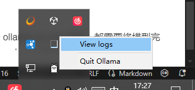

# 使用 ChatBox+Ollama 打造你的私人AI助理

前言：在上一期教程中，我们已经成功通过Ollama本地部署了基于qwen 32b蒸馏的llm模型：deepseek-r1 32b，并在powershell中通过运行 **ollama run deepseek-r1:32b-qwen-distill-q8_0** 的方式在终端中和他实现了基础的对话，完成了下载与配置模型的步骤，但是为了更方便的进行上下文管理，发挥我们模型的更多潜力，我们将继续完善ollama的环境并通过chatbox远程调用Ollama的api，实现多设备远程访问本地部署的DeepseekR1 能力。最后讲下如何在低显存设备上运行推理。

## ChatBox调用Ollama本地部署的Deepseek R1

### 1. Ollama 环境变量设置

尽管我们安装完ollama之后安装程序已经自动帮我们配置了一部分环境，但此时的环境变量依旧需要修改（因为ollama默认是只限制本地访问的），具体操作步骤如下：

1. win+x -> 系统 -> 高级系统设置 -> 环境变量
2. 在系统环境变量中，添加如下环境变量：
   - OLLAMA_HOST = 0.0.0.0:11434 （可监听来自任意ip，11434端口的请求，默认为127.0.0.1:11434，也就是只能本地访问）
   - （可选）OLLAMA_MODELS = D:\Models\OllamaModels （ollama模型默认会下载到当前用户目录下，也就是c盘，担心空间占用可以考虑挪到其他位置，但是需要修改这个环境变量手动指定路径）
   
3. 完成以上步骤之后点击 确定 即可。

### 2. Windows 防火墙策略设置

如果我们要从公网访问我们的ollama api，需要设置相应的防火墙策略，这样防火墙才会放行我们的入站请求，操作步骤如下：

1. 进去控制面板 -> 找到 **控制面板\系统和安全\Windows Defender 防火墙** -> 高级设置
2. 然后弹出的对话框，下图所示，左上角点 **入站规则**，再点右上角**新建规则**：
   
3. 然后依次点“端口 -> 下一步 -> 选择 tcp，在特定本地端口后面填入11434（此为ollama的默认端口）点 下一步 -> 选择“允许链接” -> 然后把“域、专用、公用”前面的对勾都选上，点下一步 -> 名称可输入“ollama 11434”，描述可写“ollama默认端口号”，点完成即可。这样ollama端口号就放行成功了。到此需要重启一下电脑使前面的配置生效！
   

至此，我们可以试试在浏览器中输入 http://服务器绑定的域名:11434 ，若显示 Ollama is running，说明已经可以远程链接到ollama的api，服务器这边部署基本是搞定了，至于内网穿透等方案大家也可以仔细研究，这里就不展开讨论了。


### 3. 客户端ChatBox远程连接


Chatbox是一个开源的ChatGPT API（OpenAI API）桌面客户端，它支持Windows、Mac和Linux系统，其具有的特点如下：

- **跨平台支持**：支持Windows、Mac和Linux操作系统，为用户提供便捷的跨平台应用体验。
- **快速响应**：与chatgpt Plus相同的速度，提供快速、实时的聊天交互体验。
- **本地数据存储**：所有聊天记录和prompt都存储在本地，避免数据丢失，保护用户的隐私。
- **强大的Prompt能力**：提供更自由、更强大的Prompt功能，让用户更灵活地操作AI模型。
- **多模型支持**：支持GPT-4和其他模型，可以调用其他模型提供商的api，让用户享受更多模型选择的便利。
- **自定义域名代理**：支持用户自定义域名代理，增加灵活性和安全性。
- **更多功能**：提供Markdown支持、消息引用、字数与token估算、夜间模式等更多实用功能，提升用户的使用体验。

我们可以从Chatbox的官方网站或GitHub页面根据自己设备的平台下载并安装它。


安装完成后，打开Chatbox，点击左侧的设置。在模型选项卡中，选择AI模型提供方为Ollama，API域名为 http://服务器绑定的域名:11434 （这是Ollama服务的默认端口），然后在模型下拉框中选择你刚刚下载的模型。其他设置保持默认即可，确定保存后即可开始使用Chatbox与模型进行交互了。此时在右下角处还能选择使用哪个模型（已导入的，可运行 ollama list 查看），而且ChatBox会帮我们保存对话的历史记录和上下文，很方便了，剩余的就交给大家自由探索吧。


## 低显存推理特殊优化

无论是调ollama的api也好，还是终端运行 ollama run xxx 也好，都需要将模型完全载入显存，并用一部分剩余内存作为kv cache，但是在运行多轮对话后，ollama会报错退出，查看logs我们发现如下报错信息：



```log
CUDA error: out of memory
current device: 0, in function alloc at C:\a\ollama\ollama\llm\llama.cpp\ggml-cuda.cu:532
cuMemSetAccess(pool_addr + pool_size, reserve_size, &access, 1)
GGML_ASSERT: C:\a\ollama\ollama\llm\llama.cpp\ggml-cuda.cu:193: !"CUDA error"
```

原因倒也很简单，前面我们介绍过kv缓存通常也会占据一部分显存，虽然一开始对话的时候显存可能还有点余量，但是由于进行了多轮对话积累了很长的上下文，kv cache 膨胀导致超出了cuda memory allocate能力。

这通常与ollama的GPU卸载策略有关，这是Ollama在尝试将过多的模型层卸载到GPU显存时超出了显卡的容量限制，需要降低卸载的层数。尽管在ollama run的时候会根据设备当前的gpu显存大小自动计算卸载到gpu的layers，但是在长对话和低显存gpu上依旧可能导致cuda oom。

```shell
# 控制GPU卸载层数
/set parameter num_gpu 5
```

对于这种情况，我们可以先把模型运行起来（ollama run xxx），然后在交互模式里，设置这个变量，若提示“Set parameter 'num_gpu' to '5'”则设置成功，下一次对话时会重新加载一次模型。

注：如果将 num_gpu 设置为0则表示不使用gpu加速，强制纯cpu推理。

ollama通过 parameter num_gpu 参数控制模型层数卸载到GPU。逐步减少该数值可有效降低显存占用，这个num_gpu 后面的数字，就是会缓存在 gpu 显存中的模型layer数量，不同的模型layer大小是不一样的，所以要根据自己显存和模型大小去配置。

运行结果如图：


检查日志中是否有 llama_model_loader: offloaded 5/xx layers to GPU 输出，这表明这表示5层已成功卸载到GPU，剩余的 xx-5 层在内存中。


以上是模型本身直接可运行起来的情况下，如果直接在模型加载阶段就cuda oom了，那就得修改模型的modelfile了。
我们可以先修改原模型的modelfile，另存成一个新的modelfile，在其中加入如下参数：

```shell
# 注意这里，这里直接写原来的模型的名字即可
FROM D:\Models\OllamaModels\blobs\sha256-00f1a2d40c8ac6b4b2e39869e4d6b0c8ed3d139056cff3f61614b8cd1a2c74d6

# 限制GPU加载层数防止显存溢出
PARAMETER num_gpu 5

# ...etc
```

最后保存，然后运行 ollama create，创建我们自定义的模型，其中指定了gpu卸载的层数。

p.s. 卸载到gpu的layers越多，推理速度也越快，因为cpu推理速度是很慢的，也会拖累gpu，除非显存实在紧缺，否则能完全卸载gpu是最好的。

最后运行效果如下：


以 deepseek-r1:32b-qwen-distill-q8_0 为例，可见GPU的VRAM占用明显降低了，但是推理速度也有略微下降：1.62 token/s -> 1.48 token/s。

通过逐步调整 num_gpu_layers 并结合量化模型，可显著降低显存需求。建议从较小数值开始测试，逐步增加直到找到稳定值。

## 模型的选择和运行

模型使用的显存可以根据模型的参数量和上下文长度来估计。在BF16精度下模型的每1B参数需要占用2GB内存。在使用4bit量化时每1B参数需要0.6GB左右的内存（4bit的量化方法一般需要保护部分重要参数，实际平均每个权重的使用的内存稍多）
Deepseek-R1是`test-time-scaling`的模型，因而如非必要不建议CPU offload。总体原则是选择显存允许的4-bit级别的量化版本。
运行建议使用基于llama.cpp的LMstudio或者Ollama，它们对N卡外的其他硬件推理的支持稍好，且能够把模型offload到内存。如果对吞吐量有要求，或者需要张量并行的话建议选择vllm等部署框架，并且预留足够的kv cache。
LLM的推理在prefill阶段更多受限于算力，在decode阶段更多受限于内存带宽。所以为了尽可能的提高推理速度，要尽可能的堆足够大的显存/内存。

## 配置推荐

可能有人还是不知道自己的电脑能本地部署多大的deepseek r1模型
以下是具体的模型选择上（均以ollama默认的q4_k_m量化为例）：

1. 对于8GB显存及以下的GPU，建议DeepSeek-R1-Distill-Qwen-7B，英语任务下可以尝试Llama3.1的微调版本。
10GB-11GB显存的GPU(3080和2080Ti)可以尝试14B模型并且略微降低量化等级(Q4_K_S以下)。它在世界知识方面相比7B模型更好。
2. 对于12-16GB显存的GPU，建议DeepSeek-R1-Distill-Qwen-14B。16GB显存的GPU可以尝试DeepSeek-R1-Distill-Qwen-32B的3bit量化版本(Q3_K_S或IQ3_M)，但是上下文长度不支持多轮对话，且质量相对原始32B模型有下降
3. 24GB/32GB显存的GPU建议 DeepSeek-R1-Distill-Qwen-32B 。单卡4090部署时能提供8K左右的上下文长度，基本能满足大部分日常需要
如果有2卡3090或者更多的计算资源，可以尝试70B的蒸馏模型使用vllm张量并行进行推理。
4. 具体到GPU型号上，个人建议从V100 16GB（SXM2改PCIe），2080Ti 22GB，4060Ti 16GB（内存带宽瘸腿，但是全新）开始选择。预算到4k左右，不怕坏的话可选3080 20GB，预算6k左右可选3090 24GB。预算更高可视情况从4090 24GB，L20 48GB，A100 40GB中选择。有条件的话建议使用30系及之后的GPU，能较好的享受Flash Attention等算子对访存和运算的优化。

## 一些碎碎念

这部分基本是对前面的补充，因为写的太匆忙很多东西都没讲清楚，感兴趣的稍微看一眼就行了。

随着大语言模型（LLM）的发展，DeepSeek-AI 团队提出了 DeepSeek-V3，一个拥有 6710 亿参数的混合专家（MoE）模型，每个 token 激活 370 亿参数。DeepSeek-V3 通过高效推理和经济成本的训练方法，旨在推动开源模型能力的极限，同时在性能上与闭源模型（如 GPT-4o 和 Claude-3.5）竞争。

### 1. Deepseek开源了什么

Deepseek开源了从1.5B-671B的一系列模型。包括在Deepseek-v3基础上训练的Deepseek-R1，和只依赖RL训练的中间模型R1-zero。以及一系列基于Qwen和Llama模型，从Deepseek-R1蒸馏得到的小模型。这些模型在输出格式和输出质量上相比之前的开源模型（如Qwen团队的QwQ-32B）有显著改进。
蒸馏模型包括基于Qwen2.5-math的1.5B和7B模型，基于Qwen2.5的14B和32B模型，基于Llama3系列的8B和70B模型。基本包括了目前稠密模型除3B级别外的所有主流尺寸。
Deepseek-R1基本达到了OpenAI o1的水平，并且在部分领域领先。API成本低，并且模型权重开源。


### 2. Deepseek-R1 Distill 模型Benchmark对比

以下Benchmark来自Deepseek-R1的官方技术报告，总的来说：

- DeepSeek-R1-Distill-Qwen-1.5B：基于`Qwen2.5-math-1.5B`训练，与更大型的模型相比仍有较大差距。可以在手机等移动设备使用。
- DeepSeek-R1-Distill-Qwen-7B：基于`Qwen2.5-math-7B`训练，性能接近于先前开源SOTA模型(QwQ-32B-preview)，但在某些指标上仍与闭源模型`o1-mini`存在差距
- DeepSeek-R1-Distill-Qwen-14B：基于`Qwen2.5-14B`训练，进一步提升了模型性能，在性能上超越了先前开源SOTA模型(QwQ-32B-preview)，并且缩小了与顶级闭源模型的差距
- DeepSeek-R1-Distill-Qwen-32B：基于`Qwen2.5-32B`训练，是该系列中的高性能模型，在多个指标上超过了`o1-mini`等闭源模型。
- DeepSeek-R1-Distill-Llama-8B：基于`Llama3.1-8B`训练，展示了在不同架构下的适应性和性能，总体略逊于基于Qwen系列训练的模型，但在英文背景下可能更好。
- DeepSeek-R1-Distill-Llama-70B：基于`Llama3.3-70B-Instruct`训练，是该系列中参数量最大的模型，质量比Qwen-32B的蒸馏版本略好。


### 3. 我自己的一点想法

先来展示下我运行的几个模型吧：


研究几天，基本上个人电脑能推理的极限就是32b，假设你是4090/7900xtx 24g显存，还是要是q4量化并严格控制后台程序和屏幕分辨率（分辨率会占用一定容量显存），因为模型只要稍微超出显存占用，ollama就无法把模型完全卸载到GPU，连带CPU推理速度就会断崖式下跌，运行 ollama ps 就能看出来，理想状态下processor里面应该是 100% GPU ，这个情况下速度也是相当快的，我跑7b能到，但是14b因为爆显存急剧下降到了5.x token/s

那么这些小模型是不是没有什么意义呢？我觉得还是有的，这些小模型配合下dify、ragflow之类的rag工具当知识库用于强化搜索还是没问题的。想真的当agi现阶段显然不现实。

为啥我要用32b起推呢，我也测试过7b和14b的，对比下发现32B起步基本上才能对概念性的东西（例如：专业术语、对事物的基本认知等）有较为清晰的条理和专业的表述，在知识密集型情景下用处多大就自行体会吧，这也许就是参数上的优势，而且有展现思考过程，条理清晰，思考全面，效果很不错。至于70b llama(ollama run deepseek-r1:70b)蒸馏出来的效果当然更好，不过我电脑确实跑不动，即使是q4km的速度依旧感人，<0.5token/s 等他回答个半小时黄花菜都凉了，至于q8_0测试意义当然也已经不大了。

虽然上个epyc9755（epyc7004我感觉内存性能都不够）这种配合768g 4800mhz（24x32GB 12通道）大内存也能部署满血的ds r1 671b q5量化，但推理还是速度感人，瓶颈仍旧出现在内存带宽上。
至于说双路（numa）cpu能不能加速推理呢？我觉得提升有限，虽然说内存带宽上去了，但是可能在互联方面遇到瓶颈，而且油管有人拿四路e7去部署q4km量化的ds r1 671b，速度也很感人，才 1token/s，这倒也是在意料之内的，因为e7内存控制器本来就拉跨，还跨numa（跨节点内存访问极高延迟）...buff叠满了

那我问你，cpu堆缓存有用吗？很遗憾，其实堆大三缓也没用的，可以很肯定的说命中率非常低，这种io瓶颈产生的延迟也几乎不可能搞并行计算去掩盖，像llm那种tensor core算力那么高，你数据刚过来它瞬间就算完了，而且模型单层上百G且无法预知哪个权重会被使用，更做不了运算的隔离，说白了就是你都不知道下一句要说什么，走到的网络区域也不一样，权重全都要留在内存里面备用，反正这玩意纯粹就是吃内存带宽。

现阶段个人要玩转这个llm模型，难度还是挺大的，难度主要是来自两方面。

1. 显存容量方面的瓶颈
  一个是llm推理所需的显存占用仍旧很大，每10亿参数需要约2GB显存（FP16精度），即使采用4-bit量化仍需0.5GB/10亿参数，例如部分LLM（如175B参数的GPT-3）需要超大内存，GPU显存（如80GB A100）能直接加载模型，而CPU可能需要复杂的模型切分或内存交换，进一步降低效率。而且上下文长度扩展呈平方复杂度，4k上下文比2k显存占用增加4倍。基本上单张24g显存的显卡也就刚好够跑32b，q4_k_m量化精度的模型，更高参数的就需要多张gpu了，成本非常高。
2. 计算效率瓶颈
   既然显存跑不了更大参数的模型，那我堆大内存不就行了？很遗憾，CPU推理受限于内存带宽（DDR4 25.6GB/s vs GPU GDDR6X 912GB/s）。而且LLM的推理主要依赖矩阵乘法（GEMM）和注意力机制，这些操作在GPU上可通过并行计算高效完成，而CPU需要逐层处理，效率低下。尽管CPU的指令集（如AVX-512）虽能加速部分向量运算，但缺乏针对矩阵乘法的硬件优化，且低精度计算支持有限，相较于GPU配备了专为深度学习设计的硬件单元（如NVIDIA的Tensor Core），支持FP16/BF16/INT8等低精度计算，CPU硬算效率是相当低的。

总的来说，对于一般人而言，基本上部署llm的瓶颈都出在了IO上，鉴于现在的个人PC硬件水平，虽然说短期内要部署大模型确实是不现实的一件事，但是我们还是可以展望，如何在低算力和低内存上提升LLM推理效率，相信这些问题也是业界大佬们正在探索和研究的方向，在不久的将来，当软件+硬件双重发力的情况下，也许真的能做到人人都能拥有自己的 AI PC。
