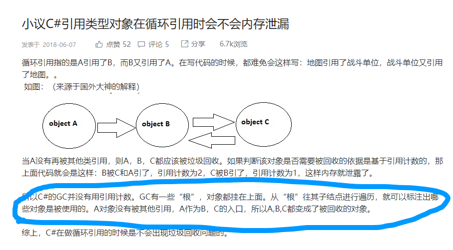

# C#中循环引用对象的垃圾回收机制

## Question 1

在c#中，内存中有A对象引用了B对象，B对象引用了A对象，当系统回收的时候，A对象会被释放吗？

## Answer 1

在 C# 中，**即使对象 A 和对象 B 互相引用，只要它们不再被任何“根对象”（Roots）引用**（例如全局变量、静态变量、活动线程的栈中的局部变量等），垃圾回收器（GC）仍然会正确识别并回收这两个对象。

---

### 核心机制：
1. **可达性（Reachability）决定存活**：
   - GC 通过从“根对象”（Roots）出发，遍历所有可达对象来标记存活对象。
   - 如果 A 和 B 仅互相引用，但没有被任何根对象直接或间接引用，则它们会被判定为不可达，进而被回收。

2. **循环引用不是问题**：
   - C# 的 GC 使用**追踪式回收算法**（Mark-and-Sweep），不依赖引用计数，因此循环引用不会导致内存泄漏。

---

### 示例代码：
```csharp
class A { public B BRef; }
class B { public A ARef; }

void Test()
{
    var a = new A();
    var b = new B();
    a.BRef = b;
    b.ARef = a;

    // 当 a 和 b 离开作用域后，它们不再被任何根对象引用
    // GC 会回收它们
}
```

---

### 关键结论：
- ✅ **会被释放**：只要 A 和 B 未被任何根对象引用，即使它们互相引用，GC 仍会回收它们。
- ⚠️ **例外情况**：如果 A 或 B 被其他根对象（如静态字段、事件处理器等）引用，则它们会保持存活。

---

### 附加说明：
- 若对象实现了 `Finalizer`，GC 会将其放入终结队列，延迟回收，但最终仍会释放内存。
- 可通过 `WeakReference` 观察对象是否被回收。

## Question 2



循环引用指的是A引用了B，而B又引用了A。在写代码的时候，都难免会这样写:地图引用了战斗单位，战斗单位又引用了地图。
我以为当A没有再被其他类引用，则A，B，C都应该被垃圾回收。如果判断该对象是否需要被回收的依据是基于引用计数的，那上面代码就会是这样:B被C和A引了，引用计数为2，C被B引了，引用计数为1，这样内存就泄露了，这是哪里理解错误？

## Answer 2

你的理解中混淆了两种不同的垃圾回收机制：**引用计数（Reference Counting）**和**追踪式垃圾回收（Tracing Garbage Collection）**。C# 使用的是后者（追踪式），而你的分析是基于引用计数的逻辑，因此导致了误解。

---

### 1. **引用计数（Reference Counting）的局限性**
引用计数是一种简单的内存管理方式，每个对象记录自己被引用的次数（引用计数）。当引用计数归零时，对象被释放。  
**问题**：循环引用会导致引用计数永远无法归零，从而内存泄漏。  
**例如**：
```
A → B (A 引用 B，B 的引用计数+1)
B → A (B 引用 A，A 的引用计数+1)
```
此时即使 A 和 B 不再被其他对象引用，它们的引用计数仍为 1，导致内存泄漏。

---

### 2. **C# 的垃圾回收机制（追踪式）**
C# 的 GC 不依赖引用计数，而是通过**可达性分析（Reachability Analysis）**判断对象是否存活。  
**核心规则**：  
- 从**根对象（Roots）**（如全局变量、静态变量、活动线程的栈中的局部变量等）出发，遍历所有可达对象。  
- **不可达的对象**会被标记为垃圾，无论它们之间是否存在循环引用。

**示例**：  
```csharp
class A { public B BRef; }
class B { public A ARef; }

void Test()
{
    var a = new A();  // 根对象（局部变量）引用 A
    var b = new B();  // 根对象（局部变量）引用 B
    a.BRef = b;       // A → B
    b.ARef = a;       // B → A（循环引用）
}

// 当 Test() 执行完毕，a 和 b 离开作用域，不再被任何根对象引用
// GC 会发现 A 和 B 不可达，回收它们
```

---

### 3. **为什么循环引用不会导致内存泄漏？**
- **关键区别**：C# 的 GC **不关心引用次数**，只关心对象是否被根对象直接或间接引用。  
- **循环引用示例**：  
  - 如果 A 和 B 仅互相引用，但没有被任何根对象引用，GC 会判定它们不可达，直接回收。  
  - 如果 A 或 B 被某个根对象引用（例如保存在静态字段中），则整个循环链都会存活。

---

### 4. **你的理解错误点**
你假设 C# 使用引用计数，因此认为：  
- B 被 C 和 A 引用 → 引用计数为 2  
- C 被 B 引用 → 引用计数为 1  
- 导致内存泄漏  

**实际在 C# 中**：  
- GC 会检查这些对象是否被根对象引用。  
- 如果 A、B、C 都不再被根对象引用，即使它们互相引用，也会被回收。

---

### 5. **如何验证？**
可以通过以下代码观察 GC 行为：
```csharp
class Program
{
    static void Main()
    {
        var a = new A();
        var b = new B();
        a.BRef = b;
        b.ARef = a;

        // 强制触发 GC
        GC.Collect();
        GC.WaitForPendingFinalizers();

        // 输出结果：A 和 B 已被回收
    }
}

class A { public B BRef; ~A() => Console.WriteLine("A 被回收"); }
class B { public A ARef; ~B() => Console.WriteLine("B 被回收"); }
```

---

### 结论
- ✅ **C# 的 GC 能正确处理循环引用**，只要对象未被根对象引用。  
- ❌ **引用计数不是 C# 的机制**，因此循环引用不会导致内存泄漏。  
- 你提到的“地图引用战斗单位，战斗单位引用地图”是安全的，只要它们未被全局或静态变量长期持有。

## Question 3

这是否意味着，循环引用  但是释放任何一个后  另外一个没被其它的对象引用 它会被释放？

## Answer 3

是的，你的理解完全正确！在 C# 中，**如果两个互相引用的对象（A 和 B）都没有被任何根对象（Root）引用**，即使它们之间存在循环引用，垃圾回收器（GC）仍然会释放它们的内存。关键在于它们的**整体可达性**，而非单个引用关系。

---

### 具体场景分析
假设以下代码：
```csharp
class A { public B BRef; }
class B { public A ARef; }

void Test()
{
    var a = new A();  // 根对象（局部变量）引用 A
    var b = new B();  // 根对象（局部变量）引用 B
    a.BRef = b;       // A → B
    b.ARef = a;       // B → A（循环引用）
}

// 当 Test() 执行完毕，a 和 b 离开作用域，不再被根对象引用
// 此时 A 和 B 均不可达，GC 会回收它们
```

---

### 关键机制解释
1. **“释放”的本质**：  
   C# 中开发者不直接释放对象，而是由 GC 自动管理。所谓“释放某个对象”，实际是**解除根对象对它的引用**（例如将变量设为 `null` 或离开作用域）。

2. **循环引用的回收逻辑**：  
   - 如果 A 和 B **同时失去所有根对象的引用**（例如 `a` 和 `b` 变量离开作用域），即使它们互相引用，GC 也会判定它们不可达，直接回收。  
   - 如果 **仅解除其中一个的根引用**（例如仅将 `a = null`），但另一个仍被根对象引用（例如 `b` 未被释放），则整个循环链仍然存活。

---

### 示例验证
```csharp
class Program
{
    static void Main()
    {
        CreateCycle();
        GC.Collect();
        GC.WaitForPendingFinalizers();
        // 输出：A 和 B 均被回收
    }

    static void CreateCycle()
    {
        var a = new A(); // 根对象（局部变量）
        var b = new B(); // 根对象（局部变量）
        a.BRef = b;
        b.ARef = a;
        // 方法结束时，a 和 b 离开作用域，根引用消失
    }
}

class A { public B BRef; ~A() => Console.WriteLine("A 被回收"); }
class B { public A ARef; ~B() => Console.WriteLine("B 被回收"); }
```

---

### 常见误解澄清
- **错误认知**：必须手动断开循环引用才能回收。  
- **正确逻辑**：只要对象整体不可达（无根对象引用），GC **无需任何手动干预**即可回收循环引用的对象。

---

### 实际应用场景
你提到的“地图引用战斗单位，战斗单位引用地图”是安全的：  
- 若地图和战斗单位仅通过局部变量创建，未被全局或静态变量长期持有，GC 会在它们离开作用域后回收整个循环链。  
- 若地图被缓存到静态变量中，则战斗单位和地图会持续存活，此时需要手动解除静态引用。

---

### 总结
- ✅ **循环引用不影响回收**：只要 A 和 B 的整个引用链不可达，GC 会一并回收。  
- ❌ **无需手动断开循环**：C# 的 GC 能自动处理循环引用，开发者只需确保对象不被根对象长期持有。