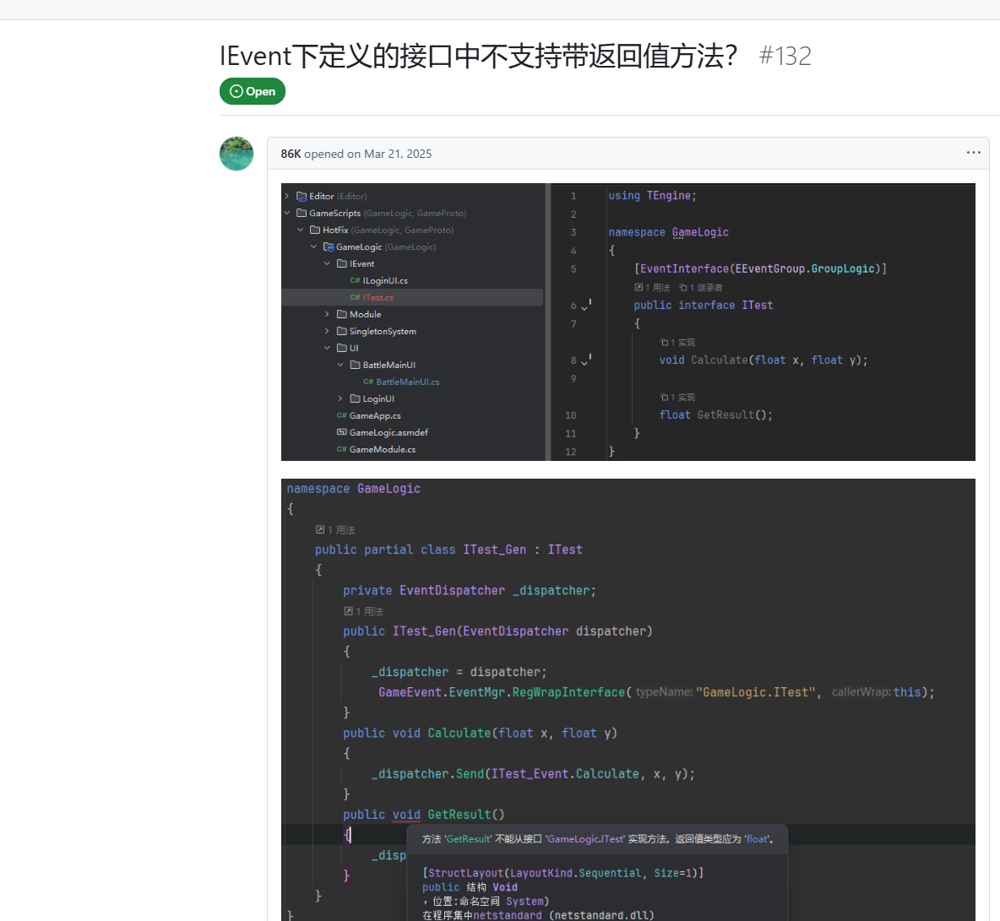

# 观察者模式——观察者方法通常不带返回值原因分析

## Question 1

在观察者模式中，为什么通常不建议让观察者的方法带有返回值？

## Answer 1

在观察者模式中，通常不建议让观察者的方法（如 `update`）带有返回值，主要原因包括以下几点：

### 1. **松耦合原则**
   - **核心目标**：观察者模式的核心是降低主题（Subject）与观察者（Observer）之间的耦合。主题仅负责通知观察者状态变化，而不关心观察者如何处理这些变化。
   - **返回值引入依赖**：若观察者方法有返回值，主题可能需要根据返回值类型或内容调整逻辑。这会导致主题依赖观察者的具体实现，破坏了松耦合的设计初衷。

### 2. **处理多个返回值的复杂性**
   - **多观察者场景**：一个主题可能关联多个观察者。若每个观察者都返回数据，主题需要收集、存储或处理这些返回值，这会增加代码复杂度。
   - **类型不一致问题**：不同观察者的返回值类型可能不一致，主题难以统一处理，可能导致类型转换错误或设计冗余。

### 3. **避免副作用与不可控行为**
   - **执行顺序依赖性**：如果主题根据某个观察者的返回值决定是否通知其他观察者（例如中断通知链），会引入不可预测的行为，且破坏观察者之间的独立性。
   - **副作用风险**：返回值可能被误用于跨观察者的通信，导致观察者之间隐式依赖，违背模式的设计意图。

### 4. **同步通知的局限性**
   - **阻塞问题**：观察者模式通常以同步方式通知所有观察者。若观察者方法需要返回值且执行耗时操作，会阻塞主题的执行流程。
   - **异步场景不适用**：若需异步处理，返回值无法直接通过同步方法传递，需改用回调或其他机制，此时返回值设计反而成为累赘。

### 5. **实践惯例与框架设计**
   - **现有实现规范**：主流编程语言（如 Java 的 `Observable`/`Observer`、C# 的事件委托）和框架中，观察者方法普遍设计为 `void` 返回类型，开发者遵循这一惯例以保持代码一致性。
   - **模式简化**：无返回值的设计更符合“通知-响应”的直观逻辑，避免引入额外复杂度。

### 例外场景的替代方案
若确实需要从观察者获取反馈，可考虑以下方式：
   - **回调机制**：主题提供回调接口供观察者主动传递数据。
   - **事件对象封装**：将数据封装在事件对象中，观察者修改事件内容，主题在通知后统一处理。
   - **中介者模式**：引入中介者协调主题与观察者之间的复杂交互，分离返回值逻辑。

### 总结
观察者模式强调单向通知机制，而非双向数据交互。避免返回值可维持模式的简洁性、松耦合性，并减少潜在的设计风险。若有返回值需求，可能意味着需要结合其他模式（如回调、中介者）来满足场景需求。

## Answer 2

在观察者模式中，通常不建议让观察者的方法带有返回值。观察者模式的核心思想是解耦，即被观察者（Subject）通知观察者（Observer）某些事件的发生，而不关心观察者如何处理这些事件。如果观察者的方法带有返回值，可能会导致以下问题：

- 耦合性增加：被观察者需要处理观察者的返回值，这会增加两者之间的耦合，违背了观察者模式的初衷。
复杂性提高：如果多个观察者返回不同的值，被观察者需要决定如何处理这些返回值，这会增加代码的复杂性。
- 异步问题：如果观察者的操作是异步的，返回值可能无法立即获取，导致逻辑混乱。
- 建议的做法：
  - 无返回值：观察者的方法通常设计为void类型，只负责处理事件，不返回任何值。
  - 事件对象：如果需要传递更多信息，可以通过事件对象（Event Object）将数据传递给观察者。
