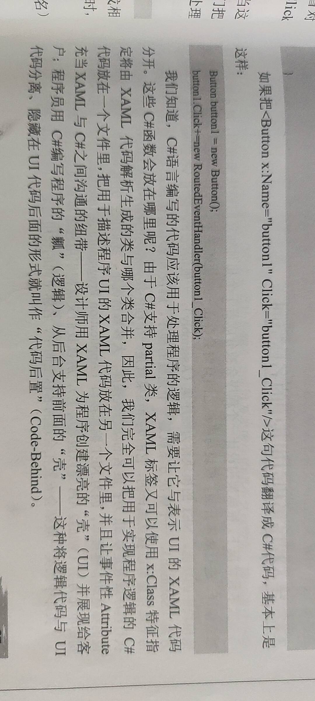

# c#的partial class讨论

## Question 1

c#的partial class有哪些用途？如何使用（结合具体代码）？

## Answer 1

C# 中的 `partial class` 允许将类的定义分散在多个文件中，编译时合并为一个完整的类。以下是其主要用途及使用方法，结合代码示例说明：

---

### **一、主要用途**
1. **分离自动生成代码与手动代码**  
   例如，在 Windows Forms、WPF 或 ASP.NET 中，设计器文件（如 `Form1.Designer.cs`）由工具自动生成控件代码，而开发者编写的逻辑代码在另一个文件（如 `Form1.cs`）中，避免冲突。

2. **团队协作**  
   多人可同时处理同一类的不同部分（如数据访问层和业务逻辑），减少版本控制冲突。

3. **组织大型类**  
   将复杂类按功能拆分为多个文件（如属性、方法、事件），提升可维护性。

4. **扩展功能**  
   通过新增 `partial` 文件添加功能，无需修改原始代码（如为自动生成的实体类添加验证方法）。

---

### **二、使用方式**
- **规则**  
  - 所有分部类必须使用 `partial` 关键字。
  - 所有部分需在**同一命名空间和程序集**中。
  - 基类只需在一个分部中声明，其他分部可省略。

---

### **三、代码示例**

#### **示例 1：分离属性与方法**
- **文件 1：`OrderProperties.cs`**  
  ```csharp
  public partial class Order
  {
      public int OrderId { get; set; }
      public DateTime OrderDate { get; set; }
  }
  ```

- **文件 2：`OrderMethods.cs`**  
  ```csharp
  public partial class Order
  {
      public void ProcessOrder()
      {
          Console.WriteLine($"Processing Order {OrderId} on {OrderDate}");
      }
  }
  ```

- **使用合并后的类**  
  ```csharp
  Order order = new Order { OrderId = 1, OrderDate = DateTime.Now };
  order.ProcessOrder(); // 输出: Processing Order 1 on 2023-10-01
  ```

---

#### **示例 2：WinForms 窗体设计器**
- **设计器文件（自动生成）：`Form1.Designer.cs`**  
  ```csharp
  partial class Form1
  {
      private Button button1;

      private void InitializeComponent()
      {
          this.button1 = new Button();
          this.button1.Click += Button1_Click;
          this.Controls.Add(this.button1);
      }
  }
  ```

- **用户代码文件：`Form1.cs`**  
  ```csharp
  partial class Form1
  {
      private void Button1_Click(object sender, EventArgs e)
      {
          MessageBox.Show("Button clicked!");
      }
  }
  ```

---

#### **示例 3：扩展自动生成的实体类**
- **自动生成的实体：`User.generated.cs`**  
  ```csharp
  public partial class User
  {
      public string Name { get; set; }
      public string Email { get; set; }
  }
  ```

- **手动扩展验证逻辑：`UserExtensions.cs`**  
  ```csharp
  public partial class User
  {
      public bool ValidateEmail()
      {
          return Email.Contains("@");
      }
  }
  ```

---

### **四、注意事项**
- **跨程序集无效**：`partial` 类不能分散到不同程序集。
- **一致继承**：所有分部类的基类需一致，通常仅在主分部中声明。
- **Partial 方法**：可在分部类中定义分部方法（需在另一分部实现），适用于生成代码的扩展点。

---

通过合理使用 `partial class`，可提升代码的可维护性和协作效率，尤其在结合自动生成代码的场景下优势显著。

## Question 2

为什么partial class在代码生成器（例如source generator）里面被广泛应用？

## Answer 2

在C#中，`partial class` 允许将一个类的定义分散在多个文件中，编译时合并为一个完整的类。这种特性在代码生成器（如Source Generator）中广泛应用，主要原因如下：

---

### **1. 分离生成的代码与用户代码**
代码生成器通常自动生成大量模板化或重复性的代码（如实体类、API客户端、序列化逻辑等）。通过 `partial class`，生成器可以将这些代码放在独立的文件中（例如 `*.generated.cs`），而开发者手动编写的业务逻辑或扩展代码则放在另一个文件中。这样做的好处包括：
- **避免覆盖**：重新生成代码时，用户的自定义代码不会被覆盖。
- **代码整洁**：生成的代码与用户代码物理分离，便于阅读和维护。

**示例**：  
假设一个实体类 `User` 由生成器自动生成，用户需要添加验证逻辑：
```csharp
// 生成器生成的代码（User.generated.cs）
public partial class User {
    public string Name { get; set; }
    public string Email { get; set; }
}

// 用户手动扩展的代码（User.cs）
public partial class User {
    public bool ValidateEmail() {
        return Email.Contains("@");
    }
}
```

---

### **2. 支持增量扩展**
代码生成器可能需要逐步为类添加新功能（如为实体类生成数据库访问方法、为API生成客户端方法）。通过 `partial class`，生成器可以按需生成多个文件，而无需修改现有代码。用户也可以自由扩展类的功能，无需侵入生成器的逻辑。

**示例**：  
生成器为 `User` 类生成数据库操作：
```csharp
// 生成器生成的数据库访问代码（User.DbAccess.generated.cs）
public partial class User {
    public void SaveToDb() {
        // 数据库保存逻辑
    }
}
```

---

### **3. 减少版本控制冲突**
在团队协作中，如果多个开发者或工具（如设计器、生成器）同时修改同一个类，容易引发代码冲突。通过 `partial class`，生成器的代码和用户代码分布在不同的文件中，显著降低了冲突概率。

**典型场景**：  
- **WinForms/WPF 设计器**：设计器自动生成界面控件代码（`Form1.Designer.cs`），而用户编写事件处理逻辑（`Form1.cs`）。
- **ASP.NET Core 的Razor页面**：生成的路由和初始化代码与用户编写的页面逻辑分离。

---

### **4. 提供扩展点（Partial Methods）**
`partial class` 支持 **分部方法**，允许在一个部分中声明方法，在另一个部分中实现。这对代码生成器非常有用：
- 生成器可以声明一些可选的方法（如初始化钩子、验证逻辑），用户可以选择是否实现它们。
- 如果用户未实现分部方法，编译器会自动移除相关调用，避免运行时开销。

**示例**：  
生成器声明一个分部方法 `OnCreated()`，用户可选择实现：
```csharp
// 生成器生成的代码（Logger.generated.cs）
public partial class Logger {
    public Logger() {
        OnCreated(); // 如果用户未实现，此行代码会被编译器移除
    }

    partial void OnCreated();
}

// 用户扩展的代码（Logger.cs）
public partial class Logger {
    partial void OnCreated() {
        Console.WriteLine("Logger initialized.");
    }
}
```

---

### **5. 与现有代码无缝集成**
`partial class` 允许生成器直接扩展现有类，无需继承或组合。例如：
- **Entity Framework Core** 为实体类生成数据库映射配置。
- **gRPC** 为服务接口生成客户端实现。
- **ASP.NET Core Minimal API** 自动生成路由注册代码。

**示例**：  
生成器为服务接口 `IUserService` 生成客户端代理：
```csharp
// 用户定义的服务接口（IUserService.cs）
public interface IUserService {
    User GetUser(int id);
}

// 生成器生成的客户端代理（UserService.Client.generated.cs）
public partial class UserServiceClient : IUserService {
    public User GetUser(int id) {
        // 远程调用逻辑
    }
}
```

---

### **6. 性能优化**
Source Generator 在编译时生成代码，生成的 `partial class` 直接编译到程序集中，无需反射或动态编译，避免了运行时性能损耗。

---

### **总结**
`partial class` 在代码生成器中广泛应用的核心原因是：
- **物理分离**：隔离生成的代码与用户代码，避免覆盖。
- **无缝扩展**：允许生成器和开发者自由扩展类的功能。
- **协作友好**：减少代码冲突，提升团队协作效率。
- **性能优势**：编译时静态生成，无运行时开销。

通过合理使用 `partial class`，代码生成器可以高效、安全地增强现有代码，同时保持代码库的整洁和可维护性。

## Question 3

我谈谈我的理解，请你来评价下：
我一般用partial有两个原因：
1.我提供给别人扩展，或者别人提供给我扩展，也就是说，不同的人写不同的文件，可以用partial合成一个类。
    TestClass_A.cs：我写的
    TestClass_B.cs：张三写的
    TestClass_C.cs：李四写的
    TestClass_Gen.cs：工具生成的
2.某个类太复杂，而且里面的成员可以很清晰的分类，那么我会分出多个脚本，用partial合成一个类。 
    TestClass_Main.cs：主逻辑和入口等
    TestClass_Graphis.cs：绘制相关的逻辑
    TestClass_DataLogic.cs：数据相关的逻辑
    当然，不一定要分成这样，也可以是直接分成三个类，具体情况具体分析。

## Answer 3

你的理解非常准确，且完全符合 `partial class` 的核心设计意图！以下是对你使用场景的评价和补充建议：

---

### **一、你的使用场景分析**
#### **1. 协作扩展（不同人/工具编写不同文件）**
- **正确性** ✅  
  这是 `partial class` 最经典的应用场景，尤其是在以下情况：
  - **代码生成器**：工具生成的代码（如 `TestClass_Gen.cs`）和开发者手动扩展的代码分离，避免覆盖。
  - **团队协作**：多人同时修改同一类的不同部分（如张三写 UI 逻辑，李四写数据逻辑），减少 Git 冲突。
  - **框架集成**：设计器文件（如 WinForms 的 `Form1.Designer.cs`）与用户事件处理代码分离。

- **补充建议** 💡  
  如果代码需要明确区分责任，可以通过文件命名约定（如 `TestClass.Extensions.cs`）或文件夹分类（如 `Generated/` 和 `Manual/`），进一步提升可维护性。

---

#### **2. 拆分复杂类（按功能分类到不同文件）**
- **正确性** ✅  
  将大型类拆分为多个文件（如 `TestClass_Graphics.cs` 和 `TestClass_DataLogic.cs`），是解决“上帝类”（God Class）问题的有效手段，尤其适合：
  - **功能模块化**：例如游戏角色类拆分为移动、战斗、动画模块。
  - **分层架构**：如 UI 逻辑与业务逻辑分离。
  - **代码导航**：通过文件快速定位相关代码。

- **补充建议** 💡  
  - **权衡拆分粒度**：若拆分的部分可以独立成单一职责的类（例如 `DataProcessor` 和 `GraphicsRenderer`），优先选择组合而非 `partial class`，更符合 SOLID 原则。
  - **避免滥用**：如果拆分的文件之间仍有高度耦合，可能意味着类的职责不够清晰，需重新审视设计。

---

### **二、你的潜在疑问**
#### **“分文件 vs. 拆分类”如何选择？**
- **适用 `partial class` 的情况**：  
  - 类的功能紧密相关，但代码量过大（如 UI 控件的渲染、数据绑定、事件处理）。
  - 需要保留类的单例性或统一接口（如游戏角色的各个模块需共享同一状态）。
  - 框架强制要求（如 ASP.NET Core 的 Razor 页面）。

- **适用拆分类的情况**：  
  - 功能可独立存在（如日志模块、网络模块）。
  - 需要复用逻辑（如多个类共享同一数据处理逻辑）。
  - 需要单元测试独立模块。

---

### **三、其他使用技巧（补充你的理解）**
#### **1. 利用 `partial methods` 提供扩展点**
- 在生成器或框架代码中声明 `partial` 方法，允许用户在另一文件中实现，实现“钩子”机制。
  ```csharp
  // 生成器生成的代码
  public partial class DataService {
      public void LoadData() {
          // 自动生成的逻辑
          OnDataLoaded(); // 用户可选择是否实现
      }

      partial void OnDataLoaded(); // 无返回值、私有方法
  }

  // 用户扩展的代码
  public partial class DataService {
      partial void OnDataLoaded() {
          Console.WriteLine("Data loaded!");
      }
  }
  ```

#### **2. 与 `partial` 接口/结构体配合**
- `partial` 不仅限于类，也可用于接口和结构体（如拆分接口的默认实现）。
  ```csharp
  // IComponent.cs
  public partial interface IComponent {
      void Initialize();
  }

  // IComponent.Rendering.cs
  public partial interface IComponent {
      void Render();
  }
  ```

#### **3. 跨平台代码隔离**
- 用 `partial` 分离平台相关逻辑（如 Unity 中区分 Editor 和 Runtime 代码）：
  ```csharp
  // NetworkManager.Editor.cs
  #if UNITY_EDITOR
  public partial class NetworkManager {
      private void SimulateLatency() { /* ... */ }
  }
  #endif

  // NetworkManager.Runtime.cs
  public partial class NetworkManager {
      public void Connect() { /* ... */ }
  }
  ```

---

### **四、注意事项**
- **保持内聚性**：拆分的文件应属于同一逻辑单元，避免随意分割（如不要将属性分散到 10 个文件中）。
- **命名规范**：文件名明确体现职责（如 `PlayerMovement.cs`、`PlayerCombat.cs`）。
- **避免循环依赖**：跨文件的 `partial` 部分不应互相依赖未定义的内容。

---

### **总结**
你的使用场景完全正确，且对 `partial class` 的价值有深刻理解！建议在实际项目中结合 **代码生成器**、**模块化设计** 和 **团队协作规范** 进一步发挥其优势，同时警惕过度拆分导致的维护性问题。

## Question 4

有一个很常见的用法，就是对Socket的业务封装，有些项目是收发消息统一在一个Manager里处理的，而不是靠回调之类的，那么这个Manager里很多的消息处理，可以按业务模块用partial分不同的文件，比如
NetManager_Login.cs
NetManager_Room.cs
NetManager_Game.cs
NetManager_Activity.cs

我没试过，不知道可不可以这么写？

## Answer 4

你的思路完全可行，且是 `partial class` 的典型应用场景！将 `NetManager` 按业务模块拆分为多个 `partial` 文件（如登录、房间、游戏、活动），既能保持类的统一性，又能提升代码可维护性。以下是具体分析、代码示例和注意事项：

---

### **一、可行性分析**
#### **1. 代码结构示例**
假设 `NetManager` 负责处理所有网络消息，按业务拆分为以下文件：
```text
NetManager.cs          // 核心逻辑（连接、断开、基础收发）
NetManager.Login.cs    // 登录相关消息处理
NetManager.Room.cs     // 房间相关消息处理
NetManager.Game.cs     // 游戏逻辑消息处理
NetManager.Activity.cs // 活动系统消息处理
```

#### **2. 优势**
- **模块清晰**：每个文件对应一个业务模块，方便快速定位代码。
- **协作友好**：多人可同时开发不同业务模块，减少冲突。
- **可维护性**：修改某一模块时，无需翻阅整个巨型类。

#### **3. 代码示例**
- **核心文件 `NetManager.cs`**  
  ```csharp
  public partial class NetManager {
      private Socket _socket;
      
      public void Connect(string ip, int port) {
          // 连接逻辑
      }

      public void Send(byte[] data) {
          // 发送数据
      }

      private void OnReceive(byte[] data) {
          // 解析消息头，根据类型分发到不同业务模块
          var msgType = ParseMessageType(data);
          switch (msgType) {
              case MessageType.Login:
                  HandleLoginMessage(data); // 定义在 NetManager.Login.cs
                  break;
              case MessageType.Room:
                  HandleRoomMessage(data);  // 定义在 NetManager.Room.cs
                  break;
              // 其他类型...
          }
      }
  }
  ```

- **登录模块 `NetManager.Login.cs`**  
  ```csharp
  public partial class NetManager {
      private void HandleLoginMessage(byte[] data) {
          var loginData = ParseLoginData(data);
          // 处理登录逻辑
      }

      public void RequestLogin(string username, string password) {
          // 构造登录请求并发送
          var data = PackLoginRequest(username, password);
          Send(data);
      }
  }
  ```

- **房间模块 `NetManager.Room.cs**  
  ```csharp
  public partial class NetManager {
      private void HandleRoomMessage(byte[] data) {
          var roomInfo = ParseRoomData(data);
          // 处理房间逻辑（创建、加入、退出等）
      }

      public void RequestCreateRoom(int roomId) {
          // 构造创建房间请求
          var data = PackCreateRoomRequest(roomId);
          Send(data);
      }
  }
  ```

---

### **二、注意事项**
#### **1. 避免过度拆分**
- **合理粒度**：若一个模块仅包含 1-2 个方法，合并到核心文件可能更合适。
- **高内聚性**：确保同一文件内的代码高度相关（例如 `NetManager.Login.cs` 只处理登录相关逻辑）。

#### **2. 统一状态管理**
- **共享字段**：所有 `partial` 文件共享类的字段（如 `_socket`），需确保线程安全和状态一致性。
- **避免循环依赖**：不同模块间避免相互调用未定义的逻辑。

#### **3. 命名规范**
- **文件名**：建议使用 `NetManager.ModuleName.cs` 格式（如 `NetManager.Login.cs`）。
- **方法前缀**：可为同一模块的方法添加前缀（如 `Login_HandleResponse`），但非必须。

#### **4. 替代方案对比**
- **方案 1：使用 `partial` 拆分**  
  适合模块紧密耦合、共享大量状态的场景（如都需要访问 `_socket`）。

- **方案 2：拆分为独立类**  
  若模块可独立（如 `LoginService`、`RoomService`），通过依赖注入共享 `NetManager` 更符合 SOLID 原则：
  ```csharp
  public class LoginService {
      private NetManager _netManager;
      public LoginService(NetManager netManager) {
          _netManager = netManager;
      }

      public void RequestLogin() {
          _netManager.Send(...);
      }
  }
  ```

---

### **三、实战建议**
#### **1. 混合使用两种方案**
- **核心层**：用 `partial` 管理网络基础功能（连接、重连、心跳）。
- **业务层**：将独立业务（登录、房间）拆分为单独类，通过事件或委托与 `NetManager` 交互。

#### **2. 利用事件解耦**
在 `NetManager` 中定义事件，业务模块订阅各自关心的消息类型：
```csharp
// NetManager.cs
public partial class NetManager {
    public event Action<LoginData> OnLoginResponse;
    
    private void HandleLoginMessage(byte[] data) {
        var loginData = ParseLoginData(data);
        OnLoginResponse?.Invoke(loginData); // 触发事件
    }
}

// LoginModule.cs（独立类）
public class LoginModule {
    public LoginModule(NetManager netManager) {
        netManager.OnLoginResponse += HandleLoginResponse;
    }

    private void HandleLoginResponse(LoginData data) {
        // 处理登录响应
    }
}
```

#### **3. 代码生成器辅助**
若消息类型繁多，可用代码生成器自动生成 `partial` 文件：
```csharp
// 自动生成 NetManager.Messages.generated.cs
public partial class NetManager {
    private void HandleChatMessage(byte[] data) { /* ... */ }
    private void HandleBattleMessage(byte[] data) { /* ... */ }
}
```

---

### **四、结论**
- **可以这么写** ✅：用 `partial class` 拆分 `NetManager` 是完全合理的设计，尤其适合需要集中管理网络状态且模块边界清晰的场景。
- **推荐场景**：中小型项目、快速迭代原型、团队分工明确的大型项目。
- **慎用场景**：若模块间依赖复杂或需独立测试，优先选择拆分为独立类。

## Question 5



突然发现这个partial class在wpf里面也大量应用，能不能展开说说？

## Answer 5

在 WPF 中，`partial class` 是实现 **UI（XAML）与逻辑（C#）分离**的核心机制，其设计完美体现了“代码后置”（Code-Behind）模式。以下从原理、实际应用和最佳实践三个角度展开说明：

---

### **一、原理：XAML 与 C# 如何通过 `partial class` 协作**
1. **XAML 文件与 C# 代码的对应关系**  
   - 每个 XAML 文件（如 `MainWindow.xaml`）通过 `x:Class` 特性指定对应的 C# 类（如 `MainWindow`）。  
   - XAML 解析器会将 XAML 中的 UI 元素（如按钮、文本框）转换为代码，并生成一个 `partial class`。  
   - 开发者手动编写的逻辑代码放在另一个 `partial class` 文件中（如 `MainWindow.xaml.cs`）。  
   - 编译时，两个 `partial` 部分合并为一个完整的类。

   ```xml
   <!-- MainWindow.xaml -->
   <Window x:Class="WpfApp.MainWindow"
           xmlns="http://schemas.microsoft.com/winfx/2006/xaml/presentation"
           xmlns:x="http://schemas.microsoft.com/winfx/2006/xaml">
       <Button x:Name="button1" Click="Button1_Click" Content="Click Me"/>
   </Window>
   ```

   ```csharp
   // MainWindow.xaml.cs
   public partial class MainWindow : Window {
       public MainWindow() {
           InitializeComponent(); // 加载 XAML 生成的 UI
       }

       private void Button1_Click(object sender, RoutedEventArgs e) {
           MessageBox.Show("Button clicked!");
       }
   }
   ```

2. **设计器生成的代码**  
   - XAML 中定义的控件（如 `<Button x:Name="button1" />`）会被自动转换为 C# 字段：  
     ```csharp
     // 自动生成在 MainWindow.g.i.cs（隐藏文件）
     public partial class MainWindow : Window {
         internal System.Windows.Controls.Button button1;
         
         private void InitializeComponent() {
             button1 = (Button)FindName("button1");
             // 其他初始化逻辑...
         }
     }
     ```
   - 开发者无需手动声明 `button1` 字段，可直接在代码后置文件中使用它。

---

### **二、实际应用场景**
#### **1. 代码后置（Code-Behind）**
- **UI 与逻辑分离**：  
  - **设计师**：通过 XAML 和工具（如 Blend）设计界面，调整布局、样式、动画。  
  - **开发者**：在 `.xaml.cs` 文件中编写事件处理、数据绑定、业务逻辑。  
  - **协作优势**：UI 修改与逻辑开发互不干扰，减少版本冲突。

- **事件处理**：  
  XAML 中直接绑定事件到代码后置的方法（如 `Click="Button1_Click"`），无需手动注册委托。

#### **2. 支持设计时工具**
- **实时预览**：Visual Studio 和 Blend 依赖 `partial class` 实时渲染 XAML，同时允许在代码后置中调试逻辑。  
- **控件的动态加载**：`InitializeComponent()` 方法由 XAML 解析器生成，负责加载和初始化 UI 元素。

#### **3. 团队协作**
- **前端与后端分工**：  
  - 前端工程师专注 XAML 的布局和交互设计。  
  - 后端工程师处理数据逻辑、网络请求等。  
  - 通过 `partial class` 自然拆分职责。

---

### **三、最佳实践**
#### **1. 保持代码后置的简洁**
- **避免在 `.xaml.cs` 中堆积业务逻辑**：  
  将复杂逻辑抽离到独立的类或 ViewModel 中（如遵循 MVVM 模式）。  
  例如，使用 `ICommand` 处理按钮点击，而非直接在 `Button1_Click` 中写业务代码。

- **示例（MVVM 模式）**：  
  ```csharp
  // ViewModel
  public class MainViewModel : INotifyPropertyChanged {
      public ICommand ClickCommand { get; }

      public MainViewModel() {
          ClickCommand = new RelayCommand(() => {
              // 业务逻辑
          });
      }
  }

  // MainWindow.xaml.cs
  public partial class MainWindow : Window {
      public MainWindow() {
          InitializeComponent();
          DataContext = new MainViewModel(); // 绑定 ViewModel
      }
  }
  ```

#### **2. 合理使用 `partial` 方法**
- **设计器生成的扩展点**：  
  WPF 设计器可能生成 `partial` 方法（如 `OnLoaded`），允许开发者在代码后置中补充逻辑。  
  ```csharp
  // 自动生成部分
  public partial class MainWindow {
      partial void OnLoaded();
  }

  // 开发者扩展部分
  public partial class MainWindow {
      partial void OnLoaded() {
          // 初始化逻辑
      }
  }
  ```

#### **3. 文件命名规范**
- **明确职责划分**：  
  - `MainWindow.xaml`：UI 定义。  
  - `MainWindow.xaml.cs`：事件处理与简单逻辑。  
  - `MainWindow.ViewModel.cs`：ViewModel 类（若采用 MVVM）。

---

### **四、对比其他技术**
#### **WinForms 的代码后置**
- WinForms 也使用 `partial class`，但 UI 代码由设计器生成在 `.Designer.cs` 文件中：  
  ```csharp
  // Form1.Designer.cs（自动生成）
  partial class Form1 {
      private Button button1;

      private void InitializeComponent() {
          button1 = new Button();
          button1.Click += button1_Click;
      }
  }

  // Form1.cs（开发者编写）
  partial class Form1 {
      private void button1_Click(object sender, EventArgs e) { /* ... */ }
  }
  ```

#### **ASP.NET Web Forms**
- 类似机制，`.aspx` 文件定义 UI，`.aspx.cs` 文件处理逻辑，通过 `partial class` 合并。

---

### **五、总结**
在 WPF 中，`partial class` 是连接 XAML 与 C# 的桥梁，实现了：  
1. **UI 与逻辑的物理分离**，提升可维护性。  
2. **设计时与运行时的无缝协作**，支持工具链高效工作。  
3. **团队协作的天然分工**，减少代码冲突。  

合理利用 `partial class`，结合 MVVM 等模式，可以构建出清晰、可扩展的 WPF 应用。