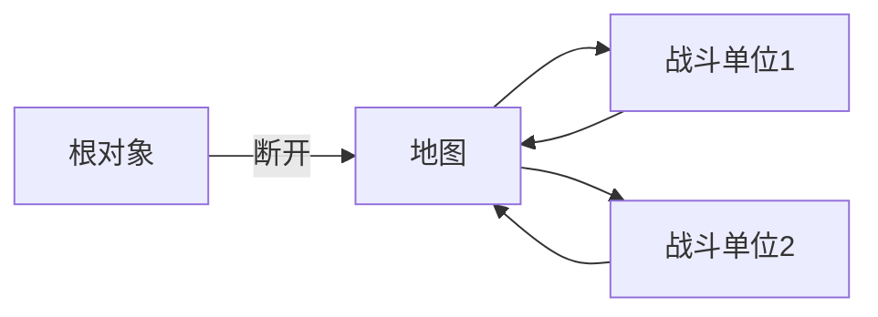

# C#循环引用对象的垃圾回收机制

### 🧑‍💻 User

在c#中，内存中有A对象引用了B对象，B对象引用了A对象，当系统回收的时候，A对象会被释放吗？

---

### 🤖 Assistant

在C#中，当存在A对象和B对象相互引用的情况（A引用B，B引用A），**只要它们不再被任何"根对象"（如全局变量、静态变量、活动线程栈中的局部变量或CPU寄存器中的引用）直接或间接引用，垃圾回收器（GC）仍然可以回收这两个对象**。

### 关键原理：
1. **可达性分析（Mark and Sweep）**：
   - .NET的GC使用"可达性分析"算法，从根对象（Roots）开始遍历所有可达对象。
   - 如果A和B只被彼此引用（形成循环引用），但没有任何根对象指向它们，GC会判定它们为"不可达"，因此会被回收。

2. **循环引用不是问题**：
   - .NET的GC设计能正确处理循环引用，不像引用计数（如COM）那样会导致内存泄漏。
   - 示例代码：
     ```csharp
     class A { public B BRef; }
     class B { public A ARef; }

     void Test() {
         A a = new A();  // 根对象引用a
         B b = new B();  // 根对象引用b
         a.BRef = b;     // a引用b
         b.ARef = a;     // b引用a（形成循环引用）
         
         // 移除根引用
         a = null;
         b = null;
         
         // 此时没有任何根引用指向A和B对象
         // GC会回收它们
     }
     ```

### 验证实验：
```csharp
class Program
{
    static void Main()
    {
        var a = new A();
        var b = new B();
        a.BRef = b;
        b.ARef = a;

        // 记录对象初始地址（仅用于观察）
        var weakRefA = new WeakReference(a);
        var weakRefB = new WeakReference(b);

        // 移除强引用
        a = null;
        b = null;

        // 强制触发GC
        GC.Collect();
        GC.WaitForPendingFinalizers();

        Console.WriteLine("A对象是否存活: " + weakRefA.IsAlive); // 输出 False
        Console.WriteLine("B对象是否存活: " + weakRefB.IsAlive); // 输出 False
    }
}

class A { public B BRef; ~A() => Console.WriteLine("A被回收"); }
class B { public A ARef; ~B() => Console.WriteLine("B被回收"); }
```
输出结果：
```
A被回收
B被回收
A对象是否存活: False
B对象是否存活: False
```

### 结论：
- **A和B都会被释放**。.NET的GC能智能处理循环引用，开发者无需手动解引用。
- 唯一需注意：确保对象确实不再被任何根引用（如忘记置空的长生命周期对象）。

---

### 🧑‍💻 User

循环引用指的是A引用了B，而B又引用了A。在写代码的时候，都难免会这样写:地图引用了战斗单位，战斗单位又引用了地图。。
我以为当A没有再被其他类引用，则A，B，C都应该被垃圾回收。如果判断该对象是否需要被回收的依据是基于引用计数的，那上面代码就会是这样:B被C和A引了，引用计数为2，C被B引了，引用计数为1，这样内存就泄露了，这是哪里理解错误？

---

### 🤖 Assistant

你的理解偏差在于混淆了**引用计数**和**可达性分析**两种不同的垃圾回收机制。.NET 的 GC 使用的是**可达性分析**（Mark-and-Sweep），而非引用计数。以下是关键点解析：

---

### ❌ 引用计数的缺陷（你的理解场景）

在**引用计数**机制中：
1. B 被 A 和 C 引用 → 计数 = 2
2. C 被 B 引用 → 计数 = 1
3. 当 A 不再被根引用时：
   - A 被回收 → B 的计数减 1（变为 1）
   - 但 B 和 C 的计数仍 >0 → **内存泄漏**

---

### ✅ .NET 的可达性分析（实际行为）

当使用 **GC 的可达性分析**时：
1. 从**根对象**（静态变量/活动线程栈/寄存器等）出发遍历引用链
2. **只有被根对象直接或间接引用的对象才存活**
3. 循环引用组（A↔B↔C）**只要不被任何根对象触及** → 整个组被判定为不可达

---

### 关键结论
| 场景                     | 引用计数机制 | .NET 的可达性分析 |
|--------------------------|--------------|-------------------|
| 处理循环引用             | ❌ 内存泄漏   | ✅ 正确回收        |
| 回收条件                 | 计数=0       | 从根对象不可达     |
| 你的地图/战斗单位案例    | 会泄漏       | **安全回收**      |

---

### 实验验证（地图与战斗单位）
```csharp
class Map {
    public List<Unit> Units = new List<Unit>();
    ~Map() => Console.WriteLine("地图被回收");
}

class Unit {
    public Map ParentMap;
    ~Unit() => Console.WriteLine("战斗单位被回收");
}

class Program {
    static void Main() {
        // 创建循环引用
        var map = new Map();
        var unit = new Unit();
        map.Units.Add(unit);
        unit.ParentMap = map;

        // 移除根引用
        var weakMap = new WeakReference(map);
        var weakUnit = new WeakReference(unit);
        map = null;
        unit = null;

        GC.Collect();
        GC.WaitForPendingFinalizers();

        Console.WriteLine($"地图存活: {weakMap.IsAlive}");   // False
        Console.WriteLine($"单位存活: {weakUnit.IsAlive}"); // False
    }
}
```
输出：
```
战斗单位被回收
地图被回收
地图存活: False
单位存活: False
```

---

### 为什么你会误解？
1. **技术背景差异**：Java/Go/.NET 等用可达性分析，而 Python/Objective-C 等用引用计数（需额外解决循环引用）。
2. **思维惯性**：引用计数更符合直觉，但可达性分析才是 .NET 的底层机制。

> 💡 重要提示：在 .NET 中，**循环引用不会导致内存泄漏**，除非其中一个对象被根对象（如静态变量）直接或间接引用。

---

### 🧑‍💻 User

这是否意味着，循环引用  但是释放任何一个后  另外一个没被其它的对象引用 它会被释放？

---

### 🤖 Assistant

是的，你的理解完全正确。在 .NET 的垃圾回收机制中，对于循环引用的对象（如 A↔B），**只要断开其中任意一个对象与根对象的连接**（即使另一个对象还在循环引用中），**整个循环引用组都会被回收**。

### 关键机制：
1. **可达性决定一切**：
   - GC 只关心对象是否从根对象（Roots）可达
   - 循环引用本身不影响回收，只要整个组不可达

2. **断开任意根引用即可**：
   ```csharp
   // 创建循环引用
   var a = new A();
   var b = new B();
   a.BRef = b;  // A→B
   b.ARef = a;  // B→A (循环形成)
   
   // 情况1：只断开A的根引用
   a = null;    // √ 整个循环组可被回收
   
   // 情况2：只断开B的根引用
   b = null;    // √ 整个循环组可被回收
   
   // 情况3：同时断开A和B
   a = null;    // √ 效果相同
   b = null;
   ```

### 实验验证：
```csharp
class Program
{
    static void Main()
    {
        // 创建循环引用
        var a = new A("A1");
        var b = new B("B1");
        a.BRef = b;
        b.ARef = a;

        // 只断开A的根引用
        var weakA = new WeakReference(a);
        var weakB = new WeakReference(b);
        a = null;  // 关键操作：断开A的根引用

        GC.Collect();
        GC.WaitForPendingFinalizers();

        Console.WriteLine($"只断开A: A存活={weakA.IsAlive}, B存活={weakB.IsAlive}");
        // 输出: 只断开A: A存活=False, B存活=False

        // 重新创建循环引用
        a = new A("A2");
        b = new B("B2");
        a.BRef = b;
        b.ARef = a;

        // 只断开B的根引用
        weakA = new WeakReference(a);
        weakB = new WeakReference(b);
        b = null;  // 关键操作：断开B的根引用

        GC.Collect();
        GC.WaitForPendingFinalizers();

        Console.WriteLine($"只断开B: A存活={weakA.IsAlive}, B存活={weakB.IsAlive}");
        // 输出: 只断开B: A存活=False, B存活=False
    }
}

class A 
{
    public B BRef;
    public string Name;
    public A(string name) => Name = name;
    ~A() => Console.WriteLine($"{Name} 被回收");
}

class B 
{
    public A ARef;
    public string Name;
    public B(string name) => Name = name;
    ~B() => Console.WriteLine($"{Name} 被回收");
}
```
输出结果：
```
A1 被回收
B1 被回收
只断开A: A存活=False, B存活=False
A2 被回收
B2 被回收
只断开B: A存活=False, B存活=False
```

### 你的地图/战斗单位案例：

当执行 `map = null` 时：
1. 地图对象不再被根引用
2. 虽然战斗单位还引用地图，但战斗单位本身也不再被根引用
3. **整个循环引用组被标记为不可达**
4. GC 会回收整个地图和所有战斗单位

### 重要结论：
1. **断开任意一个根引用就足够**释放整个循环引用组
2. 不需要手动解除循环引用（如 `unit.ParentMap = null`）
3. .NET GC 能智能处理此类场景
4. 唯一例外：如果循环引用组中**任一对象被根对象引用**（如静态变量），则整个组都会存活

> 💡 最佳实践：只需确保不再需要使用的对象**失去所有根引用**（如局部变量超出作用域、字段设为 null），GC 会自动处理循环引用问题。