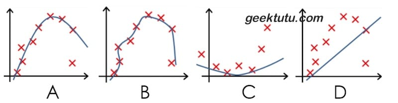

# 哪个模型过拟合

### 🧑‍💻 User

---

### 🤖 Assistant

根据图片中的四个图表，模型 **B** 发生了过拟合（Overfit）。

**原因分析：**

*   **图 A（良好拟合）：** 曲线平滑地捕捉到了数据的整体分布规律和趋势，没有去强行适应个别的离群点（噪声），这种模型在面对新数据时会有较好的泛化能力。
*   **图 B（过拟合）：** 曲线过于曲折，试图穿过或极度靠近几乎每一个训练数据点。模型虽然在训练数据上表现极好（误差很小），但它把噪声也当成了特征学习进去，导致模型过于复杂。这种模型在面对未知的新数据时，预测效果通常会很差。
*   **图 C 和 D（欠拟合）：** 这两个图中的模型（尤其是 D 中的直线）过于简单，未能捕捉到数据潜在的真实分布规律，在训练集上的误差就很大。