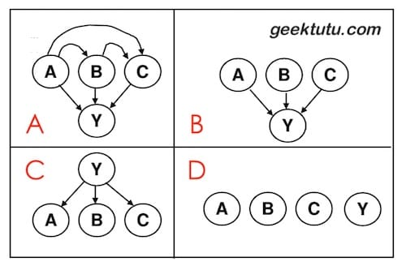

# 图C表示朴素贝叶斯假设

### 🧑‍💻 User

输入属性是 A, B, C，输出属性是 Y。若使用朴素贝叶斯分类(Naive Bayes Classifier)，下面哪张图能表示朴素贝叶斯分类的假设。

---

### 🤖 Assistant

正确答案是 **图 C**。

**详细解释：**

朴素贝叶斯分类器（Naive Bayes Classifier）的核心在于其**“朴素”的假设**：**给定目标类别（Y）的情况下，所有的输入属性（A, B, C）之间是相互条件独立的。**

在贝叶斯网络（图模型）中：
*   **节点**代表随机变量。
*   **有向边（箭头）**代表条件依赖关系。从父节点指向子节点，表示子节点的概率分布依赖于父节点。

根据朴素贝叶斯的原理，我们是通过建立联合概率分布 $P(A, B, C, Y)$ 来进行分类的，它可以被分解为：
$$P(A, B, C, Y) = P(Y) \cdot P(A|Y) \cdot P(B|Y) \cdot P(C|Y)$$

这个公式对应到图模型上就是：
1.  **类别 $Y$ 是父节点**：箭头必须从 $Y$ 指向各个属性 $A, B, C$，因为我们要计算的是在给定类别 $Y$ 的条件下，各个属性出现的概率 $P(X_i|Y)$。
2.  **属性之间无连接**：因为假设在给定 $Y$ 时属性之间是条件独立的，所以 $A, B, C$ 节点之间不能有相互指向的边。

**对其他选项的分析：**
*   **图 A**：特征之间有互相指向的箭头，这表示特征之间存在依赖关系，打破了“朴素”（条件独立）的假设。这属于更一般的贝叶斯网络（Bayesian Network）。
*   **图 B**：箭头从特征指向类别。这通常用来表示判别模型（如逻辑回归），它直接对条件概率 $P(Y|A,B,C)$ 建模，而不是像朴素贝叶斯那样的生成模型。
*   **图 D**：所有节点之间都没有连接，表示所有变量完全相互独立，类别 $Y$ 与属性 $A, B, C$ 毫无关系，这无法用于分类。