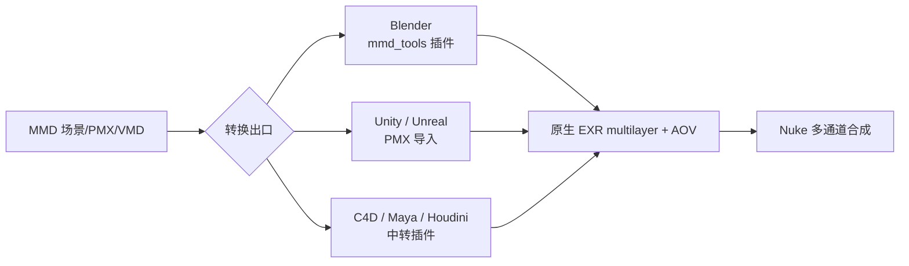

# MMDNuke流程

## 🧑‍💻 User

nuke在mmd流程里边有什么作用

---
## 🤖 Assistant

I'll first check what tools are available to help research this.

Let me check if I can look this up to make sure I interpret "MMD流程" correctly.

## 先明确语境

你说的 **MMD** 大概率指 **MikuMikuDance 的动画制作流程**（建模/找模 → 绑定/动作 VMD → 摄像机 → 材质渲染/MME → 出图出视频）。在这个流程里，**Nuke 不是"主体制作工具"，而是接在后面的"后期合成/渲染整合"环节**——它负责把 MMD（或其渲染器）吐出来的分层素材重新拼成最终画面，并做质量的"最后一公里"。

> ⚠️ 如果你说的 MMD 是某个公司/项目内部的流程代号（不是 MikuMikuDance），告诉我一下具体定义，我再针对性回答。下面按 MMD = MikuMikuDance 的通用流程来讲。

---

## 一、Nuke 在 MMD 流程中的定位

MMD 流程大致是：

```
建模/找模 → 骨骼+VMD动作 → 摄像机运镜 → 表情/口型 → 材质与渲染(MME/ray-mmd) 
        → 分层/多通道输出 → 【Nuke 合成】 → 输出成片
```

Nuke 处于**倒数第二步**。它的核心价值是把"渲染出来的半成品"变成"完成品"。

---

## 二、Nuke 具体做什么

### 1. 多图层 / 多通道合层（最核心）

| 图层 | 常见来源 | Nuke 处理 |
|------|---------|-----------|
| 角色层 | MMD 主体 | 抠像、边缘修复、调色 |
| 背景/场景层 | 单独渲染或图片 | 与角色合成、氛围统一 |
| 特效层 | AutoLuminous、粒子、光效 | 屏幕/叠加混合、发光增强 |
| 前景遮挡层 | 道具、头发、手 | 空间排序、穿模修补 |

用的是 `Merge`、`Shuffle`、`Copy`、`Constant` 等节点，把 MMD 的多通道 EXR（AOV）拆开后再按需重组。

### 2. 重打光与通道重构（Re-lighting）

MMD 直出往往"平"。Nuke 可以把渲染中的 **Diffuse / Specular / AO / Shadow / Emission / Reflection** 等通道分离，单独增减，实现**等效于重新打光**的效果——这是 AE 很难做、也是专业流程用 Nuke 的主因。

### 3. 特效增强与镜头语言

- 发光/泛光：`Glow`、`Flare`（刀光、魔法阵、霓虹）
- 景深：`ZDefocus` / `Defocus`（基于 **Z-depth 通道**，比 MMD 内置 DOF 更可控）
- 运动模糊：`VectorBlur` / `MotionBlur`（基于 **motion vector**）
- 体积光、镜头畸变、色差、暗角、胶片颗粒、噪点

### 4. 颜色管理与调色

- **线性/ACES 工作流**（Nuke 原生 OCIO），避免 MMD 直出 sRGB 导致的色彩断层
- `Grade`、`ColorCorrect` 做整体调色、色调分离、风格化
- 保证多镜头之间色调统一

### 5. Roto / Paint 修复

`Roto`、`RotoPaint`、`GridWarp`、`SplineWarp`：
- 修穿模、骨骼穿插、穿帮
- 补被遮挡的背景
- 擦除不需要的元素

### 6. 与实拍/其他素材合成

如果 MMD 作品要接实拍背景或 3D 场景，Nuke 可用 `CameraTracker`、`ScanlineRender`、`Project3D` 做**摄像机反求 + 3D 合成**。

### 7. 剪辑与输出

用 **Nuke Studio / Hiero** 的时间线做多镜头拼接、批量输出，或对接 `Deadline` 做分布式渲染。

---

<details>
<summary><b>三、为什么 MMD 后期常用 Nuke 而不是 AE？（点开对比）</b></summary>

| 维度 | Nuke | AE |
|------|------|----|
| 色彩空间 | 原生线性/ACES + OCIO | 以 sRGB 为主，需插件 |
| 多通道 EXR | 原生、逐通道处理 | 支持较弱、易丢通道 |
| 节点式流程 | 纯节点、可复用模板(Gizmo) | 图层式为主 |
| 序列帧/大分辨率 | 强，适合长片 | 相对吃资源 |
| 深度合成(Deep) | 原生 Deep 工作流 | 不支持 |
| 自动化 | Python 脚本生态强 | ExtendScript/JSX |

简单说：**个人向、短平快 → AE 够用；长片、多通道、要求高 → 换 Nuke。**

</details>

<details>
<summary><b>四、典型 MMD + Nuke 工作流示例（点开）</b></summary>

1. MMD 中用 ray-mmd / MME 渲染，输出**多通道 EXR 序列**（角色 + 背景 + 特效分离）。
2. Nuke 中 `Read` 导入 EXR，用 `Shuffle` 拆出各 AOV。
3. 分别 `Grade` 调色 → `Merge` 合层。
4. `ZDefocus` 加景深、`VectorBlur` 加运动模糊。
5. `Glow` / `Flare` 增强特效层。
6. `RotoPaint` 修穿模与穿帮。
7. `Write` 输出最终序列 → 交给剪辑/压制。

</details>

---

## 五、一句话总结

> 在 MMD 流程里，**Nuke 是"渲染之后、成片之前"的合成与整合中枢**：它不参与建模、绑定、动作、模拟（那是 MMD/Blender 的活），而是负责 **多通道合层、重打光、颜色管理、特效增强、穿模修复与输出**，把 MMD 的半成品提纯成有电影质感的成片。

需要的话，我可以给你一份 **MMD→Nuke 的节点模板结构**（含通道拆分与合成节点链），或者针对你的具体渲染器（ray-mmd / MME / Blender 中转）给更贴合的方案。

---
## 🧑‍💻 User

mmd原生不支持exr multilayer+aov output吗

---
## 🤖 Assistant

## 结论先给：**不支持。**

你这个问题问得很关键——上一轮我讲"MMD → Nuke 多通道 EXR"时说得太顺了，容易让人误以为 MMD 自己能吐多层 EXR。**实际上 MMD 原生完全没有 EXR、没有 multilayer、没有 AOV/渲染通道的概念**。上一轮那条链的准确写法应该是：**MMD →（转换到 DCC）→ EXR/AOV → Nuke**，或者靠"分P渲染"凑。

---

## 一、MMD 原生输出到底能给什么

| 项目 | MMD 原生能力 |
|------|-------------|
| 视频 | AVI（走系统 DirectShow/VFW 编解码器，如无损 UT Video、Lagarith） |
| 图片序列 | PNG / BMP / JPG |
| 位深 | **8-bit / 通道（LDR）** |
| 色彩 | sRGB，**非线性的、无 OCIO、无 ACES** |
| 通道 | RGB + 可能的 **Alpha**（透明背景时可存） |
| 渲染通道 | **无**（没有 Diffuse/Spec/Shadow/AO/Z/Vector 分离输出） |
| 多层文件 | **无**（EXR / PSD 多层一律不支持） |
| 深度/速度 | **无** Z-depth、**无** motion vector 出口 |

也就是说，MMD 输出的是**一张已经合成好的、8-bit 的"最终画面"**，本质上和截屏是一个等级。

<details>
<summary><b>二、根因：MMD 的引擎架构决定了它做不到（点开）</b></summary>

- MMD 基于 **DirectX 9**，渲染到 8-bit LDR 后备缓冲后直接出图，没有 render pass / G-buffer 的对外接口。
- 它没有"渲染层(Layer) / 渲染元素(Render Element) / AOV"这类概念，渲染管线里**不存在**把材质属性单独导出的环节。
- 没有色彩管理，天然 sRGB，进不了线性工作流。
- 所以不是"没打开某个选项"，而是**从设计上就没有这条路**。

</details>

---

## 三、那 MME / ray-mmd 能补上吗？

很多人会问"用了 MME 是不是就有了"。答案是：**有限度地能'凑'，但凑不出真正的 AOV。**

| 方案 | 能做到 | 做不到 |
|------|--------|--------|
| **MME**（MikuMikuEffect） | 后处理效果链；内部可开 HDR 渲染目标(16F)做计算；有"オフスクリーン"离屏渲染 | 最终输出仍是 8-bit 单层；**无法导出 EXR/多层**；无 AOV 出口 |
| **ray-mmd** | 延迟渲染，内部**有 G-buffer**（albedo/normal/depth 等） | G-buffer 只在效果内部用，**不对外输出**；出图还是最终合成图 |
| 各类 DOF / 阴影 / 发光 MME | 例如自阴影、发光可**单独关掉其他元素重渲一遍** | 这是"人肉分P"，不是引擎级通道 |

**关键点**：MME 里的 HDR 是"内部临时"，到成片那一步全部塌成 8-bit。想要真 AOV，必须在引擎层面把通道 dump 出来——MMD 不给这个口子。

---

## 四、想要真 EXR multilayer + AOV，现实路线只有这几条



- **Blender + `mmd_tools`**（最常用、最省事）：可直接导入 `.pmx` / `.vmd` / 相机，Blender 原生支持 **EXR Multi-Layer、Cryptomatte、AOV、Z、Vector**，一步到位。
- **Unity / UE**：走游戏引擎管线，可控性高，但导出 AOV 要另配。
- **C4D / Maya / Houdini / 3ds Max**：靠社区 PMX 导入器，然后走 Arnold/Redshift 等，AOV 齐全。

> 换句话说：**真正的"MMD + Nuke"专业流程，中间一定夹着一个 DCC**（多半是 Blender），Nuke 吃的其实是那个 DCC 出的 EXR。直连 MMD→Nuke 是拿不到多通道的。

---

## 五、没有 AOV 时，MMD 圈里怎么"人肉分P"

在只有 MMD 的情况下，大家用"多次渲染 + 隐藏元素"来伪造通道：

- 背景隐藏 → 导出透明底 PNG 得到**角色层 + Alpha**
- 关掉角色/特效 → 单独出**背景层**
- 只留发光特效（AutoLuminous）→ 出**特效层**
- 关掉自阴影、单独出**阴影层**
- 切不同材质 → 近似得到**部分材质层**

然后在 Nuke / AE 里手动 `Merge` 回去。缺点很明显：

- 每层都是 **8-bit sRGB**，重打光、加减曝光会**断层/溢出**
- **没有 Z**，做不了基于深度的 `ZDefocus`
- **没有 Vector**，做不了 `VectorBlur`
- 层与层之间**对不齐、边缘重复抗锯齿**，抠像边缘难处理

---

## 六、修正后的完整结论

> **MMD 原生：不支持 EXR、不支持 multilayer、不支持 AOV。** 它只输出 8-bit LDR 的单层成片（AVI / PNG 序列）。
>
> - 想在 Nuke 里做**多通道重打光、深度景深、运动模糊**这类专业合成 → **必须先转 Blender/UE 等 DCC，拿到真 EXR/AOV**。
> - 硬要在 MMD 阶段解决 → 只能"**分P渲染**"，效果和色彩余量都大打折扣。
> - 所以靠谱的链路是：**MMD 制作 → Blender(mmd_tools) 导入 → 渲染 EXR 多通道/AOV → Nuke 合成**。

---

需要的话，我可以给你一份 **Blender `mmd_tools` 导入 + 设置实用 AOV（Cryptomatte / Z / Vector / Light Group）+ 导出 multilayer EXR** 的具体步骤清单，这样你进 Nuke 就能直接按通道拆合成。
